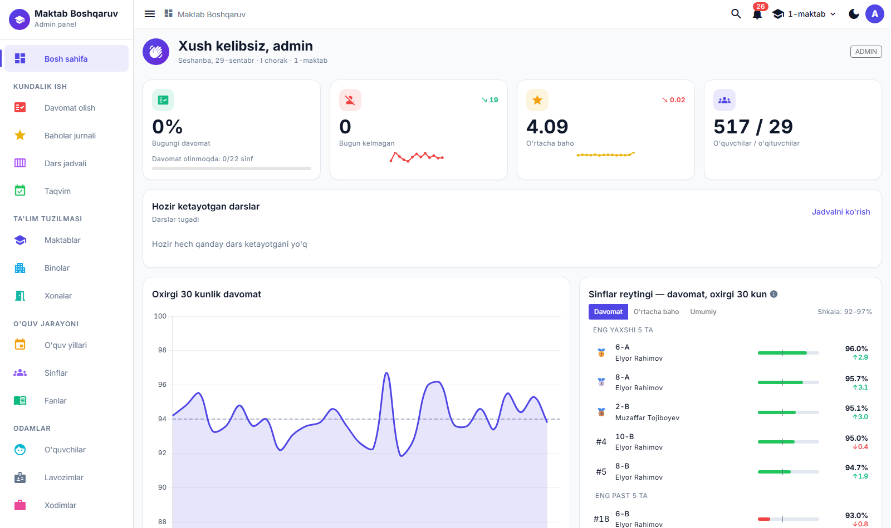
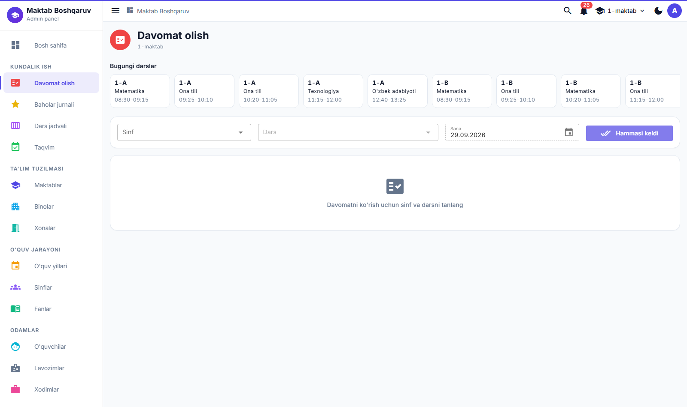
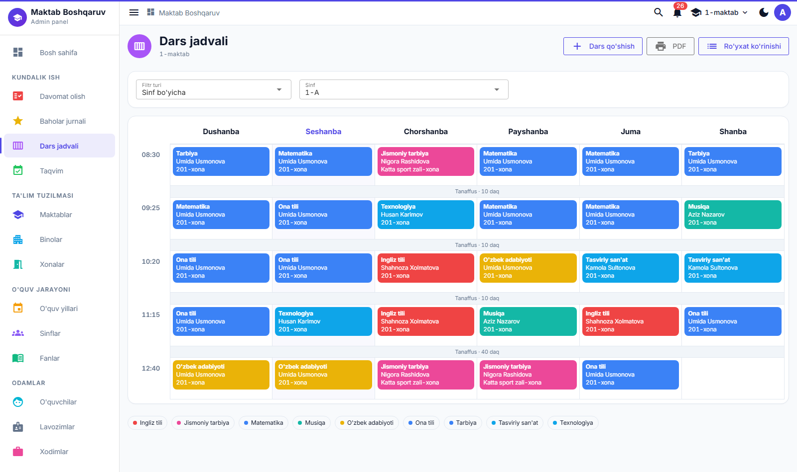
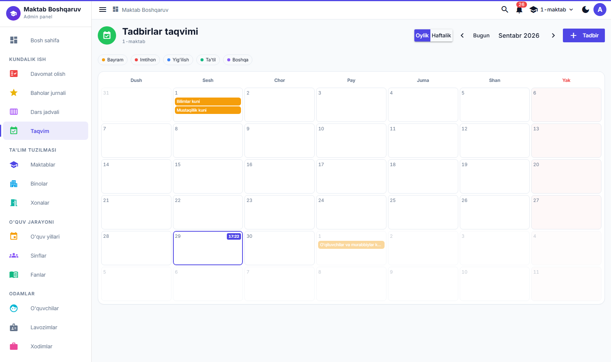
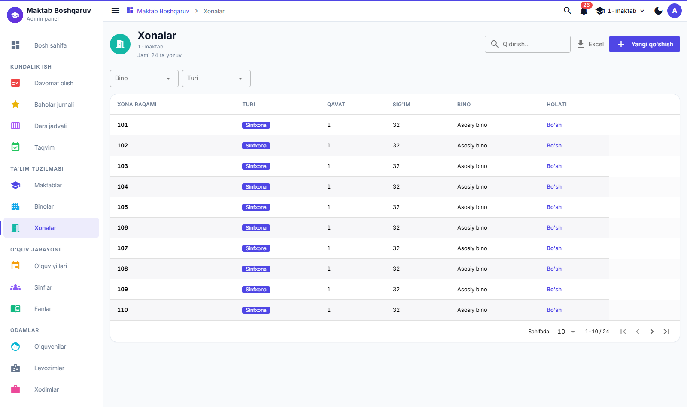
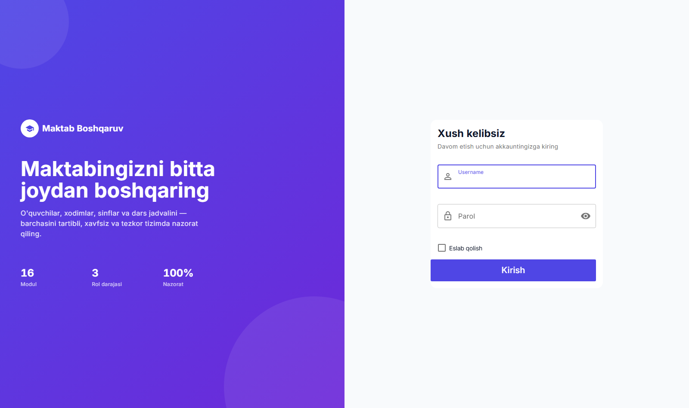
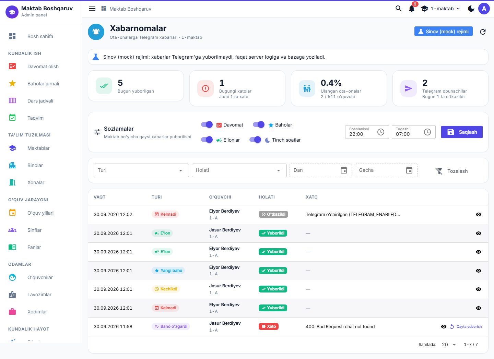
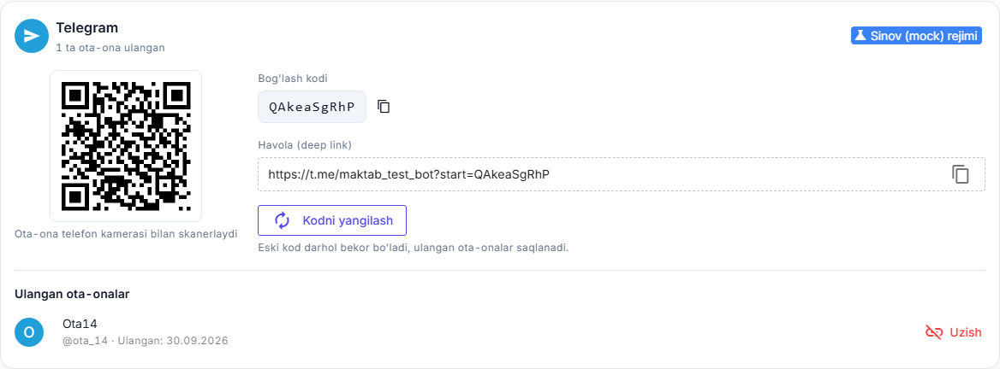

# Maktab Boshqaruv

Maktab (yoki bir nechta maktab) uchun kundalik boshqaruv tizimi: sinflar va o'quvchilar, dars jadvali, davomat, baholar jurnali, xulq-atvor yozuvlari, e'lonlar va tadbirlar taqvimi — bitta admin panelda. Backend — Java 21 + Spring Boot 4.1 (REST API + PostgreSQL), frontend — Vue 3 + Quasar (SPA).

## Asosiy imkoniyatlar

- **Ko'p maktabli** — bitta tizim bir nechta maktabga xizmat qiladi, har biri o'z binolari/sinflari/xodimlari bilan mustaqil.
- **Rol-based** kirish: `ADMIN` / `EDITOR` / `VIEWER`, JWT autentifikatsiya.
- **Dashboard** — real vaqtdagi KPI kartalar, 30 kunlik davomat grafigi, sinflar reytingi (davomat/baho/umumiy ball — uch tabli, dinamik shkala), "e'tibor talab qiladi" avtomatik ro'yxati.
- **Davomat olish** — sinf/dars tanlab bir zumda belgilash, o'qituvchi uchun "faqat mening darslarim" filtri.
- **Baholar jurnali** — sinf+fan+davr bo'yicha jadval ko'rinishida baho kiritish.
- **Dars jadvali** — xona/o'qituvchi/sinf to'qnashuvini avtomatik tekshiruvchi tuzuvchi, jonli vaqt chizig'i, PDF chop etish.
- **Taqvim** — bayram/imtihon/ota-onalar yig'ilishi kabi tadbirlar, oylik/haftalik ko'rinish.
- **Ota-onalar uchun Telegram bot**:
  - farzand darsga kelmasa yoki kechiksa, yangi baho qo'yilsa va maktab/sinf e'loni chiqsa, ota-onaga avtomatik xabar boradi;
  - ota-ona QR kod yoki telefon raqami orqali ulanadi;
  - «Xabarnomalar» sahifasida jurnal, statistika va sozlamalar (tinch soatlar ham) bor.
- **14 ta CRUD modul** (Maktablar, Binolar, Xonalar, O'quv yillari, Sinflar, O'quvchilar, Fanlar, Lavozimlar, Xodimlar, E'lonlar, Tadbirlar, Xulq yozuvlari, Foydalanuvchilar) — barchasi **bitta universal komponent** orqali, alohida sahifa kodi yozmasdan.
- **Dark/light** tema, to'liq responsiv (mobil qurilmada ham ishlaydi).

## Skrinshotlar

| Bosh sahifa | Davomat olish |
|---|---|
|  |  |

| Dars jadvali | Taqvim |
|---|---|
|  |  |

| Xonalar (CRUD modul) | Kirish sahifasi |
|---|---|
|  |  |

| Telegram xabarnomalari | O'quvchi profilidagi Telegram bloki |
|---|---|
|  |  |

## Tezkor ishga tushirish

Talab: JDK 21, PostgreSQL, Node.js (`>= 22.12`). To'liq qo'llanma: [docs/10-ornatish-va-ishga-tushirish.md](docs/10-ornatish-va-ishga-tushirish.md).

```bash
# 1) Baza
createdb maktab_db   # yoki: psql -c "CREATE DATABASE maktab_db;"

# 2) Lokal maxfiy sozlamalar (DB paroli, JWT secret) — fayl .gitignore'da
cp src/main/resources/application-local.properties.example src/main/resources/application-local.properties
#    so'ng ichidagi "o'zgartiring" yozuvlarini to'ldiring (JWT secret: openssl rand -base64 64)

# 3) Backend + frontend'ni birga ishga tushirish ("local" profil bilan)
./start.sh            # Git Bash / macOS / Linux
start.bat              # Windows
```

Backend `http://localhost:8080`, frontend `http://localhost:9000` da ko'tariladi. Birinchi marta ishga tushirilganda dastlabki ADMIN akkaunt avtomatik yaratiladi: **`admin` / `admin123`** (boshqa test akkauntlar: [10-ornatish-va-ishga-tushirish.md — Test foydalanuvchilar](docs/10-ornatish-va-ishga-tushirish.md#test-foydalanuvchilar)).

DB paroli va JWT secret kodda saqlanmaydi: lokalda `application-local.properties`dan (`local` profil), serverda `DB_PASSWORD`/`JWT_SECRET` environment variable'laridan olinadi — ular berilmasa backend ishga tushmaydi. Faqat backend'ni sinab ko'rmoqchi bo'lsangiz: `SPRING_PROFILES_ACTIVE=local ./gradlew bootRun` yoki IntelliJ'da `MaktabBoshqaruvApplication (local)`. Batafsil: [10 — 3-qadam](docs/10-ornatish-va-ishga-tushirish.md#3-qadam-sozlamalar-maxfiy-qiymatlar-va-environment-variablelar).

**Telegram bot (ixtiyoriy).** Standart holatda bot o'chiq (`TELEGRAM_ENABLED=false`): ilova to'liq ishlaydi, xabarnomalar esa `SKIPPED` bo'lib jurnalga yoziladi. Yoqish uchun @BotFather'da bot yarating va tokenni **faqat** `application-local.properties`ga yozing:

```properties
telegram.enabled=true
telegram.bot-token=<BotFather bergan token>
telegram.bot-username=<bot_username>
```

Tokensiz sinash uchun `telegram.mock=true` ishlating — xabarlar faqat logga va bazaga yoziladi. Qadam-baqadam yo'riqnoma: [docs/15-telegram-bot.md — Administrator uchun yo'riqnoma](docs/15-telegram-bot.md#administrator-uchun-yoriqnoma).

## Hujjatlar

To'liq, batafsil hujjatlashtirish `docs/` papkasida (yoki hammasi birlashtirilgan holda: [docs/TOLIQ-DOKUMENTATSIYA.md](docs/TOLIQ-DOKUMENTATSIYA.md)):

| # | Hujjat | Nima haqida |
|---|---|---|
| 01 | [Umumiy ko'rinish](docs/01-umumiy-korinish.md) | Loyiha maqsadi, foydalanuvchi rollari, barcha modullar |
| 02 | [Arxitektura](docs/02-arxitektura.md) | Qatlamlar, to'liq so'rov yo'li, ko'p maktablilik |
| 03 | [Texnologiyalar](docs/03-texnologiyalar.md) | Har bir kutubxona: nima/nega/qanday ishlatilgan |
| 04 | [Papkalar tuzilishi](docs/04-papkalar-tuzilishi.md) | Backend va frontend papka daraxti |
| 05 | [Ma'lumotlar bazasi](docs/05-malumotlar-bazasi.md) | ER diagramma, jadvallar, migratsiya, seed, JPA→SQL |
| 06 | [Backend](docs/06-backend.md) | Sozlamalar, xavfsizlik, xato boshqaruv, JWT oqimi |
| 07 | [API](docs/07-api.md) | Barcha endpoint'lar jadvali, curl misollari |
| 08 | [Frontend](docs/08-frontend.md) | Vue/Quasar tuzilishi, router, store, CrudPage |
| 09 | [Asosiy jarayonlar](docs/09-asosiy-jarayonlar.md) | Login, davomat, baho, jadval, dashboard formulalari |
| 10 | [O'rnatish va ishga tushirish](docs/10-ornatish-va-ishga-tushirish.md) | Noldan to'liq sozlash qo'llanmasi |
| 11 | [Muammolar va yechimlar](docs/11-muammolar-va-yechimlar.md) | Tez-tez uchraydigan xatolar |
| 12 | [Yangi modul qo'shish](docs/12-yangi-modul-qoshish.md) | Amaliy qadam-baqadam qo'llanma |
| 13 | [Lug'at](docs/13-lugat.md) | Barcha texnik atamalar, oddiy tilda |
| 14 | [Kelajak rejalari](docs/14-kelajak-rejalari.md) | Cheklovlar, bajarilgan va rejalashtirilgan takomillashtirishlar |
| 15 | [Telegram bot](docs/15-telegram-bot.md) | Ota-onalar uchun xabarnomalar: arxitektura, bog'lash, xavfsizlik, administrator yo'riqnomasi |

## Litsenziya

Ichki loyiha — litsenziya belgilanmagan.
