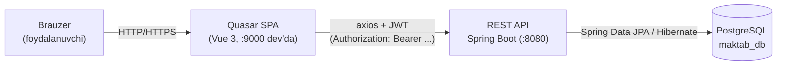
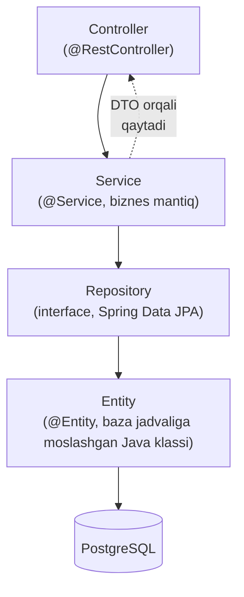

# 02 — Arxitektura

[← 01 — Umumiy ko'rinish](01-umumiy-korinish.md) · Keyingisi: [03 — Texnologiyalar →](03-texnologiyalar.md)

## Mundarija
- [Umumiy sxema](#umumiy-sxema)
- [Backend qatlamlari](#backend-qatlamlari)
- [Bitta so'rovning to'liq yo'li: "Davomatni saqlash"](#bitta-sorovning-toliq-yoli-davomatni-saqlash)
- [Ko'p maktablilik (multi-school) qanday ishlaydi](#kop-maktablilik-multi-school-qanday-ishlaydi)

## Umumiy sxema



**Brauzer → Quasar SPA**: foydalanuvchi bitta HTML sahifani (SPA — Single Page Application, "bitta sahifali ilova": qayta yuklanmasdan, JavaScript orqali ichki navigatsiya qiladigan sayt) oladi, keyingi barcha navigatsiya (masalan "Xonalar" ga o'tish) sahifa qayta yuklanmasdan, Vue Router orqali bo'ladi.

**SPA → REST API**: har bir ma'lumot kerak bo'lganda (jadval ochilganda, forma saqlanganda) frontend `axios` orqali backend'ga alohida HTTP so'rov yuboradi (REST — **Re**presentational **S**tate **T**ransfer, ya'ni har bir resurs — masalan "bitta o'quvchi" — o'z URL'iga ega, va GET/POST/PUT/DELETE HTTP metodlari orqali boshqariladi). Har bir so'rovga JWT token qo'shiladi — kim so'rov yuboryapti, backend shundan biladi.

**API → PostgreSQL**: backend Hibernate (JPA — **J**ava **P**ersistence **A**PI, Java klasslarini baza jadvaliga moslashtirish standarti — ning eng ko'p qo'llaniladigan implementatsiyasi) orqali SQL so'rovlarini avtomatik generatsiya qilib, PostgreSQL'ga yuboradi.

## Backend qatlamlari



Loyiha to'rt qatlamga bo'lingan, har birining aniq bitta vazifasi bor:

| Qatlam | Vazifasi | Loyihada |
|---|---|---|
| **Controller** | HTTP so'rovni qabul qiladi, URL/parametrlarni o'qiydi, kimga ruxsat borligini tekshiradi (`@PreAuthorize`), Service'ga uzatadi | `controller/*.java`, 20 ta fayl |
| **Service** | Biznes mantiq: qoidalarni tekshiradi ("bu xona band emasmi?"), bir nechta Repository'ni birlashtiradi, Entity ↔ DTO o'girishni bajaradi, `@Transactional` bilan bir nechta saqlashni bitta amal sifatida bajaradi | `service/*.java`, 19 ta fayl |
| **Repository** | Bazaga to'g'ridan-to'g'ri murojaat: `JpaRepository`'ni kengaytiruvchi interfeys, metod nomidan yoki `@Query`dan SQL avtomatik generatsiya qilinadi | `repository/*.java`, 16 ta fayl |
| **Entity** | Baza jadvalining bevosita Java aksi (`@Entity`, `@Table`) — bitta qator = bitta obyekt | `entity/*.java`, 17 ta klass |

**Nega qatlamlarga bo'lingan?** Har biri faqat o'z ishini biladi: Controller HTTP haqida o'ylaydi, Service — biznes qoidalar haqida, Repository — SQL haqida. Masalan, agar ertaga REST o'rniga GraphQL qo'shish kerak bo'lsa, faqat Controller qatlami o'zgaradi — Service va Repository tegilmaydi. Va aksincha: agar baza PostgreSQL'dan boshqasiga almashtirilsa, Service va Controller umuman o'zgarmaydi.

**Entity to'g'ridan-to'g'ri API'ga chiqarilmaydi** — buning o'rniga DTO (**D**ata **T**ransfer **O**bject) ishlatiladi. Sababi [06-backend.md — Entity, DTO va Mapper](06-backend.md#entity-dto-va-mapper)da tushuntirilgan.

## Bitta so'rovning to'liq yo'li: "Davomatni saqlash"

O'qituvchi Davomat sahifasida sinfni tanlab, har bir o'quvchiga status (Keldi/Kelmadi/Kechikdi/Sababli) belgilab, **"Saqlash"** tugmasini bosganda nima bo'ladi — boshidan oxirigacha:

```mermaid
sequenceDiagram
    participant U as O'qituvchi (brauzer)
    participant FE as AttendancePage.vue
    participant API as AttendanceController
    participant Svc as AttendanceService
    participant Repo as AttendanceRepository
    participant DB as PostgreSQL

    U->>FE: "Saqlash" tugmasini bosadi
    FE->>FE: saveAttendance() — roster'ni to'playdi
    FE->>API: POST /api/attendance/bulk<br/>{lessonSlotId, recordDate, entries: [...]}
    API->>Svc: bulkMark(request)
    Svc->>Repo: findById(lessonSlotId)
    Repo->>DB: SELECT ... FROM lesson_slot WHERE id = ?
    DB-->>Svc: LessonSlot topildi
    Svc->>Repo: findByLessonSlotIdAndRecordDate(...)
    Repo->>DB: SELECT ... FROM attendance WHERE ...
    DB-->>Svc: mavjud yozuvlar (bo'lsa)
    loop har bir entry uchun
        Svc->>Svc: Student sinfga tegishliligini tekshiradi
        Svc->>Repo: save(attendance)
        Repo->>DB: INSERT yoki UPDATE attendance
    end
    Svc->>Svc: activityLogService.record(...) — "faoliyat lentasi"ga yozadi
    Svc-->>API: yangilangan roster (List&lt;AttendanceRosterEntryDto&gt;)
    API-->>FE: 200 OK + JSON
    FE-->>U: "Davomat saqlandi" (yashil notify)
```

Kod bo'yicha aniq qadamlar:

1. **Frontend** — `frontend/src/pages/AttendancePage.vue:403-419`, `saveAttendance()` funksiyasi `roster` massividagi har bir o'quvchining holatini yig'ib, bitta so'rov yuboradi:
   ```js
   await api.post('/api/attendance/bulk', {
     lessonSlotId: selectedLessonId.value,
     recordDate: selectedDate.value,
     entries: roster.value.map(r => ({
       studentId: r.studentId, status: r.status, comment: r.comment || null
     }))
   })
   ```
2. **Controller** — `AttendanceController.java:48-49` so'rovni qabul qiladi, `@Valid` orqali validatsiya qiladi, to'g'ridan-to'g'ri Service'ga uzatadi.
3. **Service** — `AttendanceService.java:113-149`, `bulkMark()`: avval `LessonSlot` mavjudligini tekshiradi, o'sha kun uchun mavjud yozuvlarni xaritaga (`Map<Long, Attendance>`) yig'adi (qayta yozilmasdan yangilanishi uchun), keyin har bir o'quvchi uchun yangi yozuv yaratadi yoki mavjudini yangilaydi, `@Transactional` tufayli **hammasi birga saqlanadi yoki hech biri saqlanmaydi** (agar o'rtada xato chiqsa).
4. **Repository** — `attendanceRepository.save(attendance)` — Spring Data JPA buni avtomatik `INSERT INTO attendance (...)` yoki `UPDATE attendance SET ... WHERE id = ?`ga aylantiradi (`id` mavjudmi yo'qmi shunga qarab).
5. Saqlangandan so'ng, `ActivityLogService.record(...)` chaqiriladi — bu Dashboard'dagi "So'nggi harakatlar" lentasiga yozuv qo'shadi.
6. Service `getRoster(...)`ni qayta chaqirib, yangilangan ro'yxatni qaytaradi — frontend shu javobni ko'rsatadi.

## Ko'p maktablilik (multi-school) qanday ishlaydi

Tizim bitta baza ichida bir nechta maktabga xizmat qiladi. Buning uchun alohida "tenant" jadvali yoki sxema ishlatilmaydi — oddiyroq yechim: **har bir asosiy jadval `school_id`ga (to'g'ridan-to'g'ri yoki bog'lanish zanjiri orqali) ega**, va har bir so'rov shu bo'yicha filtrlanadi.

Ikki xil holat bor:

1. **To'g'ridan-to'g'ri bog'lanish**: `Building`, `AcademicYear`, `Subject`, `Employee`, `Announcement`, `CalendarEvent`, `ActivityLog` — bularning har birida bevosita `school_id` ustuni bor (`@ManyToOne School school`).
2. **Zanjir orqali bog'lanish**: `Room` → `Building` → `School`; `SchoolClass` → `AcademicYear` → `School`; `Student`, `LessonSlot` → `SchoolClass` → ... → `School`; `Attendance`, `Grade` → yana chuqurroq zanjir orqali.

Repository darajasida bu JPQL'da relation path (bog'lanish yo'li) sifatida yoziladi — masalan, `Attendance` uchun eng uzun zanjir:

```java
// AttendanceRepository.java
@Query("select a from Attendance a where a.lessonSlot.schoolClass.academicYear.school.id = :schoolId")
Page<Attendance> findBySchoolId(@Param("schoolId") Long schoolId, Pageable pageable);
```

Bu yerda `a.lessonSlot.schoolClass.academicYear.school.id` — Hibernate buni avtomatik SQL `JOIN`larga aylantiradi (`attendance` → `lesson_slot` → `school_class` → `academic_year` → `school`).

**Frontend tomonda**: joriy tanlangan maktab `schoolStore.activeSchoolId`da (Pinia store, `localStorage`da ham saqlanadi) turadi. `CrudPage.vue`dagi har bir so'rov (`fetchRows()`, `fetchAllForSearch()`) va forma yuborilganda (agar modul `schoolScoped: true` bo'lsa) `schoolId` parametri avtomatik qo'shiladi — modul konfiguratsiyasida buni har safar qo'lda yozish shart emas (batafsil: [08-frontend.md](08-frontend.md)).

`Position` va `Room`(turi bo'yicha filtrlar) kabi ba'zi modullar `schoolScoped: false` — chunki lavozimlar barcha maktablar uchun umumiy ro'yxat.

---
Keyingisi: [03 — Texnologiyalar →](03-texnologiyalar.md)
