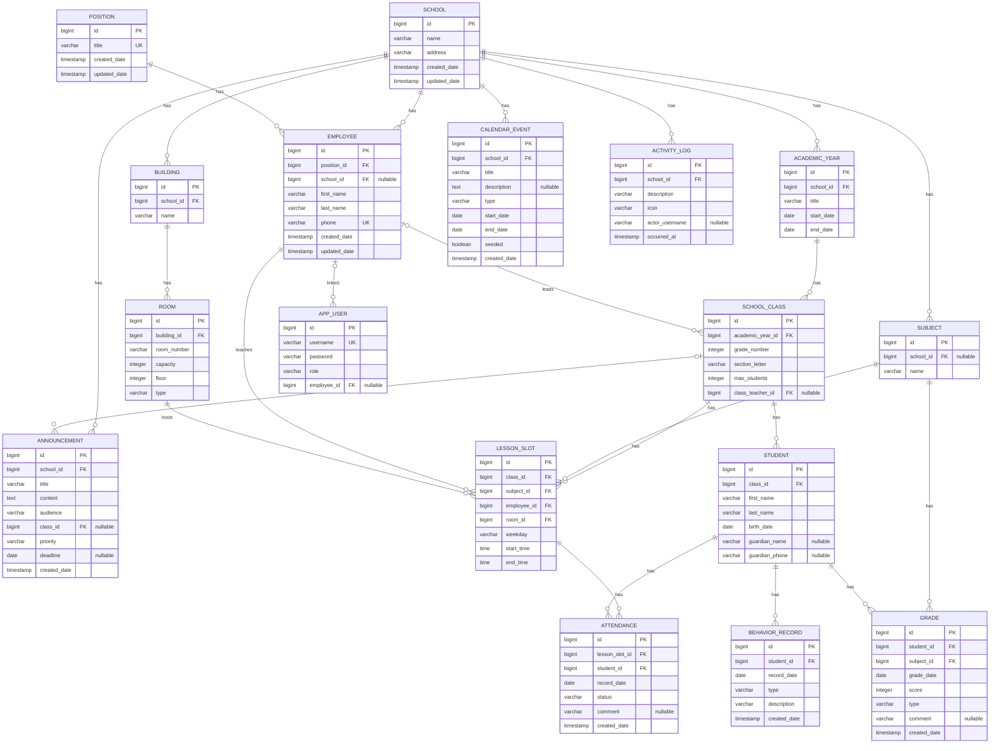
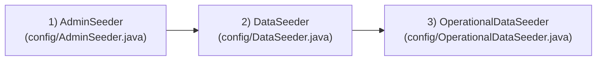

# 05 — Ma'lumotlar bazasi

[← 04 — Papkalar tuzilishi](04-papkalar-tuzilishi.md) · Keyingisi: [06 — Backend →](06-backend.md)

## Mundarija
- [ER diagramma](#er-diagramma)
- [Jadvallar batafsil](#jadvallar-batafsil)
- [Entity ↔ jadval bog'lanishi](#entity-jadval-boglanishi)
- [Migratsiyalar: bu loyihada qanday ishlaydi](#migratsiyalar-bu-loyihada-qanday-ishlaydi)
- [Seed ma'lumotlar](#seed-malumotlar)
- [JPA metodlari qanday SQL'ga aylanadi](#jpa-metodlari-qanday-sqlga-aylanadi)

## ER diagramma

*(ER — **E**ntity-**R**elationship, ya'ni "obyekt-bog'lanish" diagrammasi: jadvallar va ular orasidagi bog'lanishlarni ko'rsatadi.)*



> **Eslatma:** `EMPLOYEE ||--o{ SCHOOL_CLASS` va `EMPLOYEE ||--o{ APP_USER` bog'lanishlari amalda **ixtiyoriy** (nullable FK) — diagrammada bu `"nullable"` izohi bilan ko'rsatilgan. Mermaid'ning `erDiagram` sintaksisida ixtiyoriy ko'p-tomonlama bog'lanish uchun `|o--o{` belgisi ishlatildi.

## Jadvallar batafsil

Har bir jadval — o'zining Entity klassiga to'g'ridan-to'g'ri mos keladi (`@Table(name = "...")`). Ustun nomlari Hibernate'ning standart nomlash qoidasi bo'yicha (`camelCase` → `snake_case`) yoki `@Column(name = "...")` orqali aniq belgilangan.

### `school` — Maktablar

| Ustun | Turi | NULL? | Izoh |
|---|---|---|---|
| `id` | bigint | NOT NULL | PK, IDENTITY (auto-increment) |
| `name` | varchar | NOT NULL | Maktab nomi |
| `address` | varchar | NOT NULL | Manzil |
| `created_date` | timestamp | — | `@CreatedDate`, avtomatik to'ldiriladi |
| `updated_date` | timestamp | — | `@LastModifiedDate`, har yangilanishda avtomatik yangilanadi |

### `building` — Binolar

| Ustun | Turi | NULL? | Izoh |
|---|---|---|---|
| `id` | bigint | NOT NULL | PK |
| `school_id` | bigint | NOT NULL | FK → `school.id` |
| `name` | varchar | NOT NULL | Bino nomi |

### `room` — Xonalar

| Ustun | Turi | NULL? | Izoh |
|---|---|---|---|
| `id` | bigint | NOT NULL | PK |
| `building_id` | bigint | NOT NULL | FK → `building.id` |
| `room_number` | varchar | NOT NULL | Xona raqami |
| `capacity` | integer | NOT NULL | Sig'imi |
| `floor` | integer | NULL | Qavat (ixtiyoriy) |
| `type` | varchar | NULL | `RoomType` enum: `CLASSROOM`, `LAB`, `COMPUTER_LAB`, `GYM`, `LIBRARY`. Java tomonida standart qiymati `CLASSROOM` |

### `academic_year` — O'quv yillari

| Ustun | Turi | NULL? | Izoh |
|---|---|---|---|
| `id` | bigint | NOT NULL | PK |
| `school_id` | bigint | NOT NULL | FK → `school.id` |
| `title` | varchar | NOT NULL | Masalan "2025-2026" |
| `start_date` | date | NOT NULL | |
| `end_date` | date | NOT NULL | |

### `school_class` — Sinflar

| Ustun | Turi | NULL? | Izoh |
|---|---|---|---|
| `id` | bigint | NOT NULL | PK |
| `academic_year_id` | bigint | NOT NULL | FK → `academic_year.id` |
| `grade_number` | integer | NOT NULL | Sinf raqami (masalan 5) |
| `section_letter` | varchar | NOT NULL | Harf (masalan "A") |
| `max_students` | integer | NOT NULL | Maksimal o'quvchi soni |
| `class_teacher_id` | bigint | **NULL** | FK → `employee.id`, sinf rahbari (ixtiyoriy) |

### `subject` — Fanlar

| Ustun | Turi | NULL? | Izoh |
|---|---|---|---|
| `id` | bigint | NOT NULL | PK |
| `school_id` | bigint | **NULL** | FK → `school.id` (Entity'da `nullable=false` belgilanmagan) |
| `name` | varchar | NOT NULL | Fan nomi |

### `position` — Lavozimlar

| Ustun | Turi | NULL? | Izoh |
|---|---|---|---|
| `id` | bigint | NOT NULL | PK |
| `title` | varchar | NOT NULL, **UNIQUE** | Masalan "Fan o'qituvchisi" |
| `created_date` / `updated_date` | timestamp | — | Audit ustunlari |

### `employee` — Xodimlar

| Ustun | Turi | NULL? | Izoh |
|---|---|---|---|
| `id` | bigint | NOT NULL | PK |
| `position_id` | bigint | NOT NULL | FK → `position.id` |
| `school_id` | bigint | **NULL** | FK → `school.id` |
| `first_name` / `last_name` | varchar | NOT NULL | |
| `phone` | varchar | NOT NULL, **UNIQUE** | |
| `created_date` / `updated_date` | timestamp | — | Audit ustunlari |

### `students` — O'quvchilar

> Jadval nomi ko'plikda (`students`) — bu loyihadagi yagona shunday holat, boshqa barcha jadvallar birlikda nomlangan.

| Ustun | Turi | NULL? | Izoh |
|---|---|---|---|
| `id` | bigint | NOT NULL | PK |
| `class_id` | bigint | NOT NULL | FK → `school_class.id` |
| `first_name` / `last_name` | varchar | NOT NULL | |
| `birth_date` | date | NOT NULL | Tug'ilgan sana |
| `guardian_name` | varchar | NULL | Ota-ona F.I.Sh. (ixtiyoriy) |
| `guardian_phone` | varchar | NULL | Ota-ona telefoni (ixtiyoriy) |

### `app_user` — Foydalanuvchilar (login akkauntlari)

> Jadval nomi `app_user` (Entity klass nomi `User` — bu so'z ko'p bazalarda band/reserved bo'lgani uchun `@Table(name = "app_user")` bilan aniq belgilangan).

| Ustun | Turi | NULL? | Izoh |
|---|---|---|---|
| `id` | bigint | NOT NULL | PK |
| `username` | varchar | NOT NULL, **UNIQUE** | |
| `password` | varchar | NOT NULL | BCrypt bilan xeshlangan, hech qachon ochiq matn emas |
| `role` | varchar | NOT NULL | `Role` enum: `ADMIN`, `EDITOR`, `VIEWER` |
| `employee_id` | bigint | **NULL** | FK → `employee.id` — o'qituvchining o'z login akkaunti o'z xodim yozuviga bog'lanishi uchun (ixtiyoriy) |

### `lesson_slot` — Dars jadvali yozuvi

| Ustun | Turi | NULL? | Izoh |
|---|---|---|---|
| `id` | bigint | NOT NULL | PK |
| `class_id` | bigint | NOT NULL | FK → `school_class.id` |
| `subject_id` | bigint | NOT NULL | FK → `subject.id` |
| `employee_id` | bigint | NOT NULL | FK → `employee.id` (o'qituvchi) |
| `room_id` | bigint | NOT NULL | FK → `room.id` |
| `weekday` | varchar | NOT NULL | Matn sifatida saqlanadi: "Dushanba".."Yakshanba" (enum emas, oddiy `String`) |
| `start_time` / `end_time` | time | NOT NULL | |

### `attendance` — Davomat

| Ustun | Turi | NULL? | Izoh |
|---|---|---|---|
| `id` | bigint | NOT NULL | PK |
| `lesson_slot_id` | bigint | NOT NULL | FK → `lesson_slot.id` |
| `student_id` | bigint | NOT NULL | FK → `students.id` |
| `record_date` | date | NOT NULL | Qaysi kun uchun |
| `status` | varchar | NOT NULL | `AttendanceStatus`: `PRESENT`, `ABSENT`, `LATE`, `EXCUSED` |
| `comment` | varchar | NULL | |
| `created_date` | timestamp | — | Audit |

**Composite UNIQUE constraint**: `(lesson_slot_id, student_id, record_date)` — bitta o'quvchi, bitta dars, bitta kun uchun faqat bitta davomat yozuvi bo'lishi mumkin. Bu qoida bazaning o'zida majburlanadi (`@UniqueConstraint`), Service qatlamida ham qo'shimcha tekshiriladi (`existsByLessonSlotIdAndStudentIdAndRecordDate`).

### `grade` — Baholar

| Ustun | Turi | NULL? | Izoh |
|---|---|---|---|
| `id` | bigint | NOT NULL | PK |
| `student_id` | bigint | NOT NULL | FK → `students.id` |
| `subject_id` | bigint | NOT NULL | FK → `subject.id` |
| `grade_date` | date | NOT NULL | |
| `score` | integer | NOT NULL | 2–5 oralig'ida (`@Min`/`@Max` bilan Service darajasida tekshiriladi, bazada CHECK constraint yo'q) |
| `type` | varchar | NOT NULL | `GradeType`: `CURRENT`, `EXAM`, `QUARTERLY` |
| `comment` | varchar | NULL | |
| `created_date` | timestamp | — | Audit |

### `behavior_record` — Xulq yozuvlari

| Ustun | Turi | NULL? | Izoh |
|---|---|---|---|
| `id` | bigint | NOT NULL | PK |
| `student_id` | bigint | NOT NULL | FK → `students.id` |
| `record_date` | date | NOT NULL | |
| `type` | varchar | NOT NULL | `BehaviorType`: `REWARD`, `WARNING` |
| `description` | varchar | NOT NULL | |
| `created_date` | timestamp | — | Audit |

### `announcement` — E'lonlar

| Ustun | Turi | NULL? | Izoh |
|---|---|---|---|
| `id` | bigint | NOT NULL | PK |
| `school_id` | bigint | NOT NULL | FK → `school.id` |
| `title` | varchar | NOT NULL | |
| `content` | TEXT | NOT NULL | Uzun matn (`columnDefinition = "TEXT"`) |
| `audience` | varchar | NOT NULL | `AnnouncementAudience`: `ALL`, `TEACHERS`, `CLASS` |
| `class_id` | bigint | **NULL** | FK → `school_class.id` — faqat `audience=CLASS` bo'lganda ma'noli |
| `priority` | varchar | NOT NULL | `AnnouncementPriority`: `LOW`, `NORMAL`, `HIGH` |
| `deadline` | date | NULL | |
| `created_date` | timestamp | — | Audit |

### `calendar_event` — Tadbirlar

| Ustun | Turi | NULL? | Izoh |
|---|---|---|---|
| `id` | bigint | NOT NULL | PK |
| `school_id` | bigint | NOT NULL | FK → `school.id` |
| `title` | varchar | NOT NULL | |
| `description` | TEXT | NULL | |
| `type` | varchar | NOT NULL | `CalendarEventType`: `HOLIDAY`, `EXAM`, `PARENT_MEETING`, `VACATION`, `OTHER` |
| `start_date` / `end_date` | date | NOT NULL | |
| `seeded` | boolean | — (default `false`) | Namunaviy (seed) ma'lumot ekanini belgilaydi — qayta seed qilinganda faqat shu belgi bilan yozuvlar almashtiriladi, foydalanuvchi qo'shgan tadbirlar tegilmaydi |
| `created_date` | timestamp | — | Audit |

### `activity_log` — Faoliyat lentasi

| Ustun | Turi | NULL? | Izoh |
|---|---|---|---|
| `id` | bigint | NOT NULL | PK |
| `school_id` | bigint | NOT NULL | FK → `school.id` |
| `description` | varchar | NOT NULL | Masalan: "5-A sinfida Matematika darsidan davomat olindi" |
| `icon` | varchar | NOT NULL | Material Icons nomi (masalan `fact_check`) |
| `actor_username` | varchar | NULL | Amalni bajargan foydalanuvchi |
| `occurred_at` | timestamp | NOT NULL | Bazaviy audit maydonlaridan farqli — qo'lda `LocalDateTime.now()` bilan to'ldiriladi (`@CreatedDate` emas) |

## Entity ↔ jadval bog'lanishi

Misol — `LessonSlot` klassi to'rtta boshqa Entity bilan `@ManyToOne` orqali bog'langan:

```java
// LessonSlot.java
@Entity
@Table(name = "lesson_slot")
public class LessonSlot {
    @Id
    @GeneratedValue(strategy = GenerationType.IDENTITY)
    private Long id;

    @ManyToOne
    @JoinColumn(name = "class_id", nullable = false)
    private SchoolClass schoolClass;

    @ManyToOne
    @JoinColumn(name = "subject_id", nullable = false)
    private Subject subject;
    // ... employee, room xuddi shunday
}
```

- `@Entity` — bu klass bazadagi bitta jadvalga mos ekanini bildiradi.
- `@Table(name = "lesson_slot")` — jadval nomini aniq belgilaydi (bo'lmasa, klass nomidan avtomatik olinardi).
- `@Id` + `@GeneratedValue(strategy = GenerationType.IDENTITY)` — birlamchi kalit, qiymati bazaning o'zi tomonidan avtomatik oshiriladi (Postgres'da bu `GENERATED BY DEFAULT AS IDENTITY` yoki ketma-ketlik).
- `@ManyToOne` — "ko'p tomonidan bittaga" bog'lanish: ko'p `LessonSlot` bitta `SchoolClass`ga tegishli bo'lishi mumkin. **Diqqat**: loyihada hech qayerda `fetch = FetchType.LAZY` aniq yozilmagan — demak, barcha `@ManyToOne` bog'lanishlar Hibernate'ning standart xatti-harakati bo'yicha **EAGER** (darhol yuklanadi). Bu amaliy jihatdan `@OneToMany`ning yo'qligi (hech qaysi Entity'da teskari tomon — masalan `SchoolClass`da `List<Student> students` — e'lon qilinmagan) bilan birga N+1 muammosining oldini oladi, lekin har bir so'rovda ortiqcha JOIN degani ham (batafsil: [13-lugat.md — N+1 muammosi](13-lugat.md#n1-muammosi)).
- `@JoinColumn(name = "class_id", nullable = false)` — qaysi ustun orqali bog'lanish, va bazada NOT NULL bo'lishi.

**Muhim arxitektura qarori: `@OneToMany` umuman ishlatilmagan.** Masalan, `SchoolClass`da `List<Student>` yo'q — "shu sinfdagi o'quvchilar" kerak bo'lganda, `StudentRepository.findBySchoolClassId(...)` chaqiriladi. Bu qasddan qilingan: teskari tomonlama bog'lanishlar (`@OneToMany`) ko'pincha kutilmagan lazy-loading muammolariga olib keladi; Repository orqali aniq so'rov yozish har doim nima yuklanayotgani ustidan to'liq nazorat beradi.

## Migratsiyalar: bu loyihada qanday ishlaydi

**Bu loyihada Flyway ham, Liquibase ham ishlatilmaydi.** Buning o'rniga `application.properties`da:

```properties
spring.jpa.hibernate.ddl-auto=update
```

**Bu nima qiladi?** Har safar ilova ishga tushganda, Hibernate barcha `@Entity` klasslarini ko'rib chiqadi va bazadagi jadvallar bilan solishtiradi: yangi Entity uchun yangi jadval yaratadi, yangi maydon uchun yangi ustun qo'shadi. **Hech qachon ustun yoki jadvalni o'chirmaydi, va mavjud ma'lumotni o'zgartirmaydi.**

**Nega bu loyiha uchun yetarli, lekin production uchun tavsiya etilmaydi?** Kichik/o'rganish loyihasi uchun qulay — yangi maydon qo'shib, ilovani qayta ishga tushirsangiz bo'ldi. Lekin real (production) muhitda xavfli, chunki:
- Ustun turi o'zgarishi (masalan `varchar(255)` → `varchar(50)`) avtomatik amalga oshmaydi yoki noto'g'ri bajarilishi mumkin.
- Jamoada ishlaganda, "kim qanday o'zgartirdi" tarixi yo'q — Flyway/Liquibase'da har bir o'zgarish alohida, versiyalangan SQL fayl.
- **Muhim amaliy chegara** (bu loyihada haqiqatda uchragan): agar allaqachon ma'lumot bilan to'lgan jadvalga yangi ustun `nullable=false` bilan qo'shilsa va bazada standart (`DEFAULT`) qiymat berilmagan bo'lsa, Postgres `ALTER TABLE ... ADD COLUMN ... NOT NULL` buyrug'ini bajara olmaydi — Hibernate buni jimgina o'tkazib yuboradi, va ustun **umuman qo'shilmay qoladi**, keyinchalik "column does not exist" xatosi chiqadi. Shuning uchun bu loyihada yangi ustun har doim `nullable` (standart) qo'shiladi, va majburiylik Java tomonida (validatsiya yoki standart qiymat) ta'minlanadi.

**Yangisini qanday qo'shish kerak (bu loyihaning amaldagi jarayoni):**
1. Yangi/o'zgargan `@Entity` klassini yozing.
2. Backend'ni qayta ishga tushiring (`./gradlew bootRun`) — Hibernate jadval/ustunni o'zi yaratadi.
3. Agar ustun **majburiy** bo'lishi kerak bo'lsa-yu jadval bo'sh bo'lmasa, `nullable=false` YOZMANG — buning o'rniga Service qatlamida standart qiymat bering yoki DTO validatsiyasida majburiy qiling.

Agar kelajakda Flyway qo'shilsa, bu haqida: [14-kelajak-rejalari.md](14-kelajak-rejalari.md).

## Seed ma'lumotlar

Ilova birinchi marta (yoki bo'sh baza bilan) ishga tushirilganda, uchta `CommandLineRunner` ketma-ket ishlaydi (`@Order` bo'yicha):



1. **`AdminSeeder`** (`@Order(1)`) — agar `app_user` jadvali bo'sh bo'lsa, `ADMIN_USERNAME`/`ADMIN_PASSWORD` (standart: `admin`/`admin123`) bilan birinchi ADMIN foydalanuvchini yaratadi.
2. **`DataSeeder`** (`@Order(2)`, 738 qator) — har bir maktab uchun (agar hali sinflari yo'q bo'lsa) to'liq, o'zaro bog'liq namunaviy ma'lumot to'plamini yaratadi: binolar, xonalar, lavozimlar, xodimlar, o'quv yili, sinflar, o'quvchilar, haftalik dars jadvali. Shuningdek qo'shimcha login akkauntlar yaratadi: `direktor`/`direktor123` (`EDITOR`), `ustoz1`/`ustoz123` va `ustoz2`/`ustoz123` (dastlab `VIEWER`).
3. **`OperationalDataSeeder`** (`@Order(3)`, 587 qator) — davomat, baho, e'lon, tadbir, faoliyat lentasi kabi "operatsion" (kundalik ishlatiladigan) ma'lumotlarni to'ldiradi, va `ustoz1`/`ustoz2` akkauntlarini `EDITOR` roliga ko'tarib, ularni tegishli `Employee` yozuviga bog'laydi (shu orqali "faqat mening darslarim" filtri ishlaydi).

Har biri **xavfsiz qayta ishga tushiriladigan** (idempotent): agar ma'lumot allaqachon mavjud bo'lsa, qayta yaratmaydi — shuning uchun seederlarni doim yoqiq qoldirish mumkin, ular ishga tushirishning odatiy qismi, alohida "seed" buyrug'i yo'q.

**Qayta ishga tushirish:** oddiy `./gradlew bootRun` — agar baza bo'sh bo'lsa, hammasi yangidan yaratiladi; to'la bo'lsa, seederlar hech narsa qilmaydi (loglarda "allaqachon mavjud, o'tkazib yuborildi" deb yoziladi).

## JPA metodlari qanday SQL'ga aylanadi

SQL'ni yaxshi biladigan dasturchi uchun eng foydali qism — Spring Data JPA ikki xil usulda so'rov yaratadi:

### 1-misol: metod nomidan avtomatik SQL

```java
// AttendanceRepository.java
List<Attendance> findByLessonSlotIdAndRecordDate(Long lessonSlotId, LocalDate recordDate);
```

Spring Data metod nomini **parslaydi** (`findBy` + `LessonSlotId` + `And` + `RecordDate`) va quyidagi SQL'ga aylantiradi:

```sql
SELECT * FROM attendance
WHERE lesson_slot_id = ? AND record_date = ?
```

Hech qanday `@Query` yozish shart emas — metod imzosi (nomi) o'zi so'rov.

### 2-misol: JPQL orqali agregatsiya (`@Query`)

```java
// GradeRepository.java
@Query("select sc.id as classId, avg(g.score) as avgScore from Grade g join g.student.schoolClass sc " +
        "where sc.academicYear.school.id = :schoolId and g.gradeDate between :from and :to group by sc.id")
List<Object[]> averageScoreByClassBetween(@Param("schoolId") Long schoolId,
                                            @Param("from") LocalDate from, @Param("to") LocalDate to);
```

JPQL — SQL'ga juda o'xshash, lekin jadval/ustun nomlari o'rniga **Entity klass va maydon nomlari** ishlatiladi (`Grade g`, `g.score`, `g.student.schoolClass`). Hibernate buni haqiqiy SQL'ga aylantiradi (soddalashtirilgan):

```sql
SELECT sc.id, AVG(g.score)
FROM grade g
JOIN students s ON s.id = g.student_id
JOIN school_class sc ON sc.id = s.class_id
JOIN academic_year ay ON ay.id = sc.academic_year_id
WHERE ay.school_id = ? AND g.grade_date BETWEEN ? AND ?
GROUP BY sc.id
```

E'tibor bering: JPQL'dagi `g.student.schoolClass` — ikkita Java maydon zanjiri (`Grade.student` → `Student.schoolClass`) — SQL'da ikkita `JOIN`ga aylanadi, va Java tomonida `sc.academicYear.school.id` yozilsa, yana ikkita qo'shimcha `JOIN` (`academic_year`, `school`) hosil bo'ladi. Bu — ko'p maktablilik filtri (`school_id`) qanday ishlashining texnik asosi ([02-arxitektura.md](02-arxitektura.md#kop-maktablilik-multi-school-qanday-ishlaydi)).

### 3-misol: `Pageable` orqali sahifalash

```java
@Query("select r from Room r where r.building.school.id = :schoolId " +
        "and (:buildingId is null or r.building.id = :buildingId) " +
        "and (:type is null or r.type = :type)")
Page<Room> findFiltered(@Param("schoolId") Long schoolId, @Param("buildingId") Long buildingId,
                         @Param("type") RoomType type, Pageable pageable);
```

`Pageable` parametri (Controller'dan `?page=0&size=20&sort=name,asc` orqali avtomatik to'ldiriladi) Hibernate tomonidan SQL'ning `LIMIT`/`OFFSET`/`ORDER BY` qismlariga aylantiriladi, va natija oddiy ro'yxat emas, balki `Page<Room>` obyekti — u umumiy elementlar soni va sahifalar sonini ham o'zida saqlaydi (frontend buni sahifalash paneli uchun ishlatadi).

---
Keyingisi: [06 — Backend →](06-backend.md)
