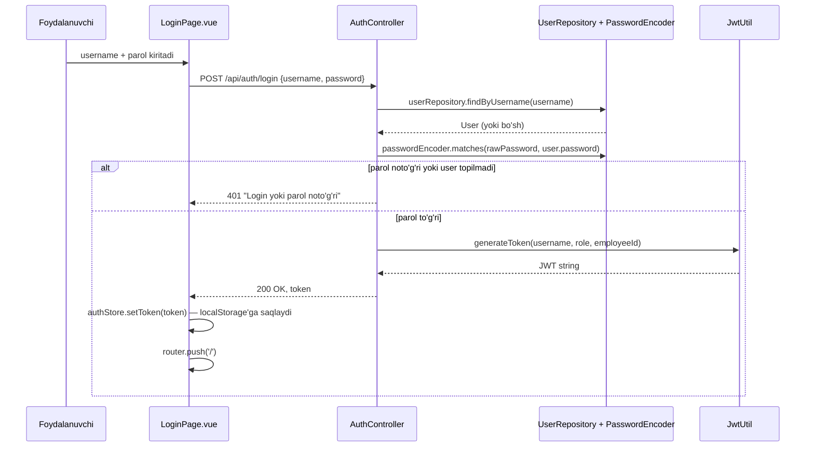

# 06 — Backend chuqur tahlili

[← 05 — Ma'lumotlar bazasi](05-malumotlar-bazasi.md) · Keyingisi: [07 — API →](07-api.md)

## Mundarija
- [application.properties](#applicationproperties)
- [Entity, DTO va Mapper](#entity-dto-va-mapper)
- [Repository](#repository)
- [Service va @Transactional](#service-va-transactional)
- [Controller](#controller)
- [Xatolarni qayta ishlash](#xatolarni-qayta-ishlash)
- [Xavfsizlik](#xavfsizlik)
- [Loglar, health-check, rejalashtirilgan vazifalar](#loglar-health-check-rejalashtirilgan-vazifalar)

## application.properties

Asosiy sozlamalar `src/main/resources/application.properties` faylida. Maxfiy bo'lmagan sozlamalar **environment variable orqali standart qiymatni bekor qilish** (`${VAR:standart}`) uslubida yozilgan; maxfiy qiymatlar (`DB_PASSWORD`, `JWT_SECRET`) esa **standartsiz** — ular albatta tashqaridan berilishi kerak, aks holda ilova ishga tushmaydi (`Could not resolve placeholder 'JWT_SECRET'`):

```properties
spring.datasource.url=${DB_URL:jdbc:postgresql://localhost:5432/maktab_db}
spring.datasource.username=${DB_USERNAME:postgres}
spring.datasource.password=${DB_PASSWORD}

spring.jpa.hibernate.ddl-auto=update
spring.jpa.show-sql=true
spring.jpa.open-in-view=false

jwt.secret=${JWT_SECRET}

admin.seed.username=${ADMIN_USERNAME:admin}
admin.seed.password=${ADMIN_PASSWORD:admin123}

cors.allowed-origins=${CORS_ALLOWED_ORIGINS:http://localhost:9000}
```

Lokal ishlab chiqishda maxfiy qiymatlar **`local` profil** orqali beriladi: `src/main/resources/application-local.properties` (`.gitignore`da, commit qilinmaydi). Shablon — `application-local.properties.example`:

```properties
spring.datasource.password=<parolingiz>
jwt.secret=<base64-jwt-secret>
```

`local` profil `start.sh`/`start.bat`, IntelliJ'dagi `MaktabBoshqaruvApplication (local)` run konfiguratsiyasi (`.run/` papkasida) va `@SpringBootTest` kontekst testida avtomatik yoqiladi. Server/production'da esa bu fayl ishlatilmaydi — `DB_PASSWORD` va `JWT_SECRET` environment variable orqali beriladi. Batafsil: [10-ornatish-va-ishga-tushirish.md — 3-qadam](10-ornatish-va-ishga-tushirish.md#3-qadam-sozlamalar-maxfiy-qiymatlar-va-environment-variablelar).

| Sozlama | Ma'nosi |
|---|---|
| `spring.datasource.url/username/password` | PostgreSQL'ga ulanish manzili. URL va foydalanuvchi nomining standart qiymati lokal ishlab chiqish uchun; parolning standarti yo'q — lokalda `application-local.properties`dan, production'da `DB_PASSWORD` environment variable'dan olinadi |
| `spring.jpa.hibernate.ddl-auto=update` | Jadval sxemasini avtomatik yaratish/yangilash rejimi — batafsil: [05-malumotlar-bazasi.md — Migratsiyalar](05-malumotlar-bazasi.md#migratsiyalar-bu-loyihada-qanday-ishlaydi) |
| `spring.jpa.show-sql=true` | Har bir generatsiya qilingan SQL so'rovi konsolga chiqariladi — o'rganish/debug qilish uchun juda foydali, production'da odatda o'chiriladi (log hajmi ko'payadi) |
| `spring.jpa.open-in-view=false` | **Muhim sozlama.** Standart holatda Spring Boot "Open Session in View" degan naqshni yoqib qo'yadi — bu HTTP so'rov tugagunga qadar baza ulanishini ochiq saqlaydi, shunday qilib Controller/JSON-serializatsiya bosqichida ham lazy-yuklangan maydonlarga kirish mumkin bo'ladi. Bu loyihada bu **o'chirilgan** — ya'ni barcha kerakli ma'lumot Service qatlamida, tranzaksiya hali ochiq paytida, DTO'ga o'tkazilishi shart. Sababi va oqibati: [13-lugat.md — LazyInitializationException](13-lugat.md#lazyinitializationexception) va [11-muammolar-va-yechimlar.md](11-muammolar-va-yechimlar.md) |
| `jwt.secret` | JWT tokenlarni imzolash uchun maxfiy kalit (kamida 32 baytning Base64 ko'rinishi). Standart qiymati yo'q — lokalda `application-local.properties`dan, production'da `JWT_SECRET`dan olinadi. Generatsiya: `openssl rand -base64 64` |
| `admin.seed.username/password` | Birinchi ADMIN foydalanuvchi yaratilganda ishlatiladigan login/parol |
| `cors.allowed-origins` | Qaysi manzillardan (frontend) so'rov qabul qilinishi (vergul bilan bir nechtasi mumkin) |

## Entity, DTO va Mapper

**Nega Entity to'g'ridan-to'g'ri qaytarilmaydi?** Uchta sabab:

1. **Xavfsizlik**: `User` Entity'sida `password` (xesh bo'lsa ham) maydoni bor — agar Entity to'g'ridan-to'g'ri JSON qilib qaytarilsa, bu maydon ham (tasodifan) chiqib ketishi mumkin.
2. **Cheksiz aylanish (infinite recursion)**: `LessonSlot` → `SchoolClass` → (agar teskari bog'lanish bo'lsa) `List<LessonSlot>` → ... — Entity'lar bir-birini JSON'ga aylantirishda cheksiz aylanib ketishi mumkin. DTO'da faqat kerakli maydonlar (masalan `schoolClassId`, `className`) tekis (flat) holda beriladi.
3. **API barqarorligi**: agar Entity o'zgarsa (masalan yangi ichki maydon qo'shilsa), tashqi API kutilmaganda o'zgarib qolmasligi kerak — DTO bu ikkisini ajratadi.

**Mapper qanday ishlaydi?** Loyihada MapStruct kabi avtomatik mapper kutubxonasi ishlatilmagan — har bir Service o'zining `toResponseDto(...)` xususiy (private) metodiga ega, va u qo'lda yozilgan:

```java
// BuildingService.java
private BuildingResponseDto toResponseDto(Building building) {
    BuildingResponseDto dto = new BuildingResponseDto();
    dto.setId(building.getId());
    dto.setName(building.getName());
    dto.setSchoolId(building.getSchool().getId());
    dto.setSchoolName(building.getSchool().getName());
    // ... qo'shimcha hisoblangan maydonlar (roomCount, occupiedPercentage)
    return dto;
}
```

Bu — ko'proq kod, lekin to'liq nazorat beradi: masalan yuqoridagi misolda `roomCount` va `occupiedPercentage` — Entity'da umuman yo'q, faqat DTO'da hisoblanadigan maydonlar (boshqa Repository'lardan qo'shimcha so'rov orqali).

## Repository

Spring Data JPA'da so'rov yozishning ikki yo'li ishlatiladi (ikkalasi ham loyihada bor):

1. **Metod nomidan avtomatik**: `findByUsername`, `existsByLessonSlotIdAndRecordDate`, `findBySchoolClassIdOrderByLastNameAscFirstNameAsc` — Spring metod nomini o'qib, o'zi SQL yaratadi.
2. **`@Query` bilan JPQL**: murakkabroq (bir nechta jadval JOIN, `GROUP BY`, agregatsiya) holatlarda.

**Pagination (`Pageable`)**: ro'yxat qaytaruvchi deyarli barcha Controller/Service metodlari `Pageable pageable` parametrini qabul qiladi va `Page<T>` qaytaradi:

```java
public Page<BuildingResponseDto> getAllBuildings(Long schoolId, Pageable pageable) {
    return buildingRepository.findBySchoolId(schoolId, pageable).map(this::toResponseDto);
}
```

`Page<T>.map(...)` — `Page<Building>`ni `Page<BuildingResponseDto>`ga, sahifalash ma'lumotini (umumiy son, joriy sahifa) saqlagan holda, aylantiradi. Batafsil misollar: [05-malumotlar-bazasi.md — JPA metodlari qanday SQL'ga aylanadi](05-malumotlar-bazasi.md#jpa-metodlari-qanday-sqlga-aylanadi).

## Service va @Transactional

Service qatlami — biznes qoidalarning uyi. Har bir **yozuvchi** (create/update/delete) metod `@Transactional` bilan belgilangan (jami 49 ta joyda), o'qish metodlari esa odatda belgilanmagan (o'qish uchun tranzaksiya shart emas, Spring standart holatda avtomatik boshqaradi).

**`@Transactional` nima qiladi va nega muhim?** Metod ichidagi barcha baza amallarini **bitta atomik blok** qiladi: yoki hammasi muvaffaqiyatli saqlanadi, yoki (istisno — exception — chiqsa) hammasi bekor qilinadi (rollback). Masalan, `AttendanceService.bulkMark()` metodida 30 ta o'quvchi uchun 30 marta `save()` chaqiriladi — agar 15-o'quvchida xato chiqsa (masalan "bu o'quvchi boshqa sinfga tegishli"), `@Transactional` tufayli oldingi 14 ta saqlash ham bekor qilinadi, baza "yarim saqlangan" holatda qolmaydi.

```java
@Transactional
public List<AttendanceRosterEntryDto> bulkMark(AttendanceBulkRequestDto request) {
    // ... 30 marta attendanceRepository.save(...)
    // agar o'rtada IllegalStateException chiqsa — barchasi rollback bo'ladi
}
```

## Controller

Har bir Controller — yupqa (thin) qatlam: faqat HTTP xabarini qabul qilib, Service'ga uzatadi va javobni qaytaradi, biznes mantiq yozmaydi.

| Annotatsiya | Vazifasi |
|---|---|
| `@RestController` | Bu klassning barcha metodlari HTTP javob tanasini (JSON) qaytarishini bildiradi (`@Controller` + `@ResponseBody`) |
| `@RequestMapping("/api/...")` | Klass darajasidagi bazaviy URL |
| `@GetMapping`/`@PostMapping`/`@PutMapping`/`@DeleteMapping` | HTTP metodga mos endpoint |
| `@RequestParam` | URL query parametri (`?schoolId=1`) |
| `@PathVariable` | URL yo'lidagi qism (`/api/rooms/{id}` dagi `id`) |
| `@RequestBody` | So'rov tanasidagi JSON'ni Java obyektiga aylantiradi |
| `@Valid` | `@RequestBody` bilan birga ishlatilganda, DTO'dagi Bean Validation qoidalarini (`@NotBlank`, `@Min` va h.k.) so'rov kelishi bilan avtomatik tekshiradi |

Standart CRUD controller shabloni (barcha oddiy modullarda takrorlanadi):

```java
// BuildingController.java
@PreAuthorize("hasAnyRole('ADMIN', 'EDITOR', 'VIEWER')")
@GetMapping
public Page<BuildingResponseDto> getAllBuildings(@RequestParam Long schoolId, Pageable pageable) { ... }

@PreAuthorize("hasAnyRole('ADMIN', 'EDITOR')")
@PostMapping
public ResponseEntity<BuildingResponseDto> createBuilding(@Valid @RequestBody BuildingRequestDto request) {
    BuildingResponseDto created = buildingService.createBuilding(request);
    return ResponseEntity.status(201).body(created);   // 201 Created
}

@PreAuthorize("hasRole('ADMIN')")
@DeleteMapping("/{id}")
public ResponseEntity<String> deleteBuilding(@PathVariable Long id) {
    buildingService.deleteBuilding(id);
    return ResponseEntity.ok("ID " + id + " bilan bino muvaffaqiyatli o'chirildi");
}
```

## Xatolarni qayta ishlash

`exception/GlobalExceptionHandler.java` — `@RestControllerAdvice` bilan belgilangan, **bitta joydan** butun ilova bo'ylab xatolarni ushlaydi (har bir Controller'da alohida try/catch yozish shart emas):

| Istisno turi | HTTP status | Qachon yuzaga keladi |
|---|---|---|
| `IllegalStateException` | **409 Conflict** | Service qatlamida "topilmadi" yoki "qoida buzildi" holatlarida qo'lda `throw` qilinadi (masalan `orElseThrow(() -> new IllegalStateException("Bunday bino topilmadi"))`) |
| `MissingServletRequestParameterException` | 400 Bad Request | Majburiy `@RequestParam` berilmagan bo'lsa |
| `MethodArgumentNotValidException` | 400 Bad Request | `@Valid` tekshiruvi muvaffaqiyatsiz bo'lsa (birinchi xato xabari qaytariladi) |
| `Exception` (qolgan hammasi) | 500 Internal Server Error | Kutilmagan xato, `log.error(...)` bilan serverga to'liq stack trace yoziladi |

**Diqqatli joy**: bu loyihada "topilmadi" holati ham `IllegalStateException` orqali ifodalanadi va **404 emas, 409** qaytaradi — bu odatiy REST konventsiyasidan (odatda "topilmadi" = 404) farq qiladi, lekin loyiha ichida izchil qo'llanilgan.

## Xavfsizlik

### Spring Security konfiguratsiyasi

`config/SecurityConfig.java`:

```java
@Bean
public SecurityFilterChain securityFilterChain(HttpSecurity http) throws Exception {
    http
            .cors(cors -> cors.configurationSource(corsConfigurationSource()))
            .csrf(csrf -> csrf.disable())
            .sessionManagement(sm -> sm.sessionCreationPolicy(SessionCreationPolicy.STATELESS))
            .authorizeHttpRequests(auth -> auth
                    .requestMatchers("/api/auth/**").permitAll()
                    .requestMatchers("/api/health").permitAll()
                    .anyRequest().authenticated()
            )
            .addFilterBefore(jwtAuthFilter, UsernamePasswordAuthenticationFilter.class);
    return http.build();
}
```

- **`csrf.disable()`** — CSRF (**C**ross-**S**ite **R**equest **F**orgery) himoyasi o'chirilgan, chunki bu himoya cookie-asoslangan sessiyalar uchun mo'ljallangan; bu loyiha stateless JWT ishlatadi (cookie emas, har bir so'rovda aniq token yuboriladi), shu sabab CSRF xavfi yo'q.
- **`sessionCreationPolicy(STATELESS)`** — server hech qanday sessiya yaratmaydi/saqlamaydi, har bir so'rov mustaqil, o'zi bilan JWT olib keladi.
- **`/api/auth/**` va `/api/health` — `permitAll()`** — token talab qilinmaydigan yagona ikki yo'l (login qilish va tirikligini tekshirish uchun token bo'lishi mumkin emas).
- **`anyRequest().authenticated()`** — qolgan barcha yo'llar uchun kamida haqiqiy token talab qilinadi (aniq rol emas — rol tekshiruvi keyingi bosqichda).
- **`addFilterBefore(jwtAuthFilter, ...)`** — `JwtAuthFilter` maxsus filter zanjiriga, standart parol-asoslangan autentifikatsiya filteridan **oldin** joylashtiriladi.

**Muhim, chalkashtiruvchi joy**: `SecurityConfig`da yana bitta bean bor:

```java
@Bean
public FilterRegistrationBean<JwtAuthFilter> jwtFilterRegistration(JwtAuthFilter filter) {
    FilterRegistrationBean<JwtAuthFilter> registration = new FilterRegistrationBean<>(filter);
    registration.setEnabled(false);
    return registration;
}
```

`JwtAuthFilter` klassi `@Component` bilan belgilangani uchun, Spring Boot uni avtomatik ham **servlet konteyneri darajasidagi** oddiy filter sifatida ro'yxatga olishga harakat qiladi (bu — Spring Security zanjiridan tashqari, ikkinchi marta ishga tushishi degani). Yuqoridagi bean shu **avtomatik, ikkilamchi** ro'yxatga olishni `setEnabled(false)` bilan o'chiradi — filter faqat `addFilterBefore(...)` orqali, Spring Security zanjiri ichida, **bir marta** ishlashi uchun.

### CORS

```java
configuration.setAllowedOrigins(Arrays.asList(allowedOrigins.split(",")));
configuration.setAllowedMethods(List.of("GET", "POST", "PUT", "DELETE", "OPTIONS"));
configuration.setAllowedHeaders(List.of("*"));
```

CORS (**C**ross-**O**rigin **R**esource **S**haring) — brauzer xavfsizlik siyosati: agar frontend (`localhost:9000`) va backend (`localhost:8080`) turli portlarda bo'lsa, brauzer standart holatda so'rovni bloklaydi, agar server aniq ruxsat bermasa. `cors.allowed-origins` sozlamasi orqali qaysi manzillarga ruxsat berilishi belgilanadi.

### JWT yaratish va tekshirish

Login oqimi:



`JwtUtil.java`:

```java
public String generateToken(String username, String role, Long employeeId) {
    var builder = Jwts.builder().subject(username).claim("role", role);
    if (employeeId != null) builder.claim("employeeId", employeeId);
    return builder
            .issuedAt(new Date())
            .expiration(new Date(System.currentTimeMillis() + expirationMs))  // 10 soat
            .signWith(key)
            .compact();
}
```

Har bir keyingi so'rovda, `JwtAuthFilter` (`config/JwtAuthFilter.java`) `Authorization: Bearer <token>` headerini o'qib, tokenni tekshiradi va Spring Security kontekstiga "bu foydalanuvchi shu rol bilan autentifikatsiyadan o'tgan" deb yozadi:

```java
if (jwtUtil.isTokenValid(token)) {
    String username = jwtUtil.extractUsername(token);
    String role = jwtUtil.extractRole(token);
    var authentication = new UsernamePasswordAuthenticationToken(
            username, null, List.of(new SimpleGrantedAuthority("ROLE_" + role)));
    SecurityContextHolder.getContext().setAuthentication(authentication);
}
```

`ROLE_` prefiksi — Spring Security'ning ichki konventsiyasi: `@PreAuthorize("hasRole('ADMIN')")` yozilganda, Spring buni avtomatik `ROLE_ADMIN` bilan solishtiradi.

### Parol xeshlash (BCrypt)

```java
@Bean
public PasswordEncoder passwordEncoder() {
    return new BCryptPasswordEncoder();
}
```

**Bu nima?** BCrypt — parolni bazada ochiq matnda emas, qaytarib bo'lmaydigan (one-way) "xesh" ko'rinishida saqlash algoritmi, va har safar "tuz" (salt — tasodifiy qo'shimcha qiymat) qo'shib ishlaydi, shu sabab bir xil parol har safar boshqacha xesh beradi. Tekshirishda `passwordEncoder.matches(kiritilganParol, saqlangan_xesh)` chaqiriladi — bu xeshni "orqaga qaytarmaydi", balki kiritilgan parolni xeshlab, ikkalasini solishtiradi.

### Rollar va ruxsatlar

`@EnableMethodSecurity` (`SecurityConfig.java`) orqali har bir Controller metodida `@PreAuthorize("hasRole('ADMIN')")` yoki `@PreAuthorize("hasAnyRole('ADMIN', 'EDITOR', 'VIEWER')")` ishlatiladi. Naqsh doim bir xil:
- **O'qish (GET)** — `ADMIN`, `EDITOR`, `VIEWER` — hammasiga ochiq.
- **Yaratish/yangilash (POST/PUT)** — `ADMIN`, `EDITOR`.
- **O'chirish (DELETE)** — faqat `ADMIN`.
- **`UserController`** — butunlay `ADMIN`ga cheklangan (klass darajasida `@PreAuthorize("hasRole('ADMIN')")`).

To'liq endpoint-rol jadvali: [07-api.md](07-api.md).

## Loglar, health-check, rejalashtirilgan vazifalar

- **Loglash**: alohida logging kutubxonasi qo'shilmagan — Spring Boot standart holatda SLF4J + Logback bilan birga keladi. `GlobalExceptionHandler` va seederlar `LoggerFactory.getLogger(...)` orqali loglaydi.
- **`/api/health`**: `HealthController.java` — autentifikatsiyasiz, `{"status": "UP"}` qaytaradi. Frontend login sahifasi backend ishlab turganini shu orqali tekshiradi.
- **Spring Boot Actuator**: loyihada **ishlatilmagan** (`build.gradle`da yo'q) — `/api/health` qo'lda yozilgan oddiy endpoint, Actuator'ning `/actuator/health`i emas.
- **`@Scheduled` (rejalashtirilgan vazifalar)**: loyihada **yo'q** — hech qanday fon vazifasi (masalan "har kuni yarim tunda eslatma yuborish") mavjud emas.

---
Keyingisi: [07 — API →](07-api.md)
