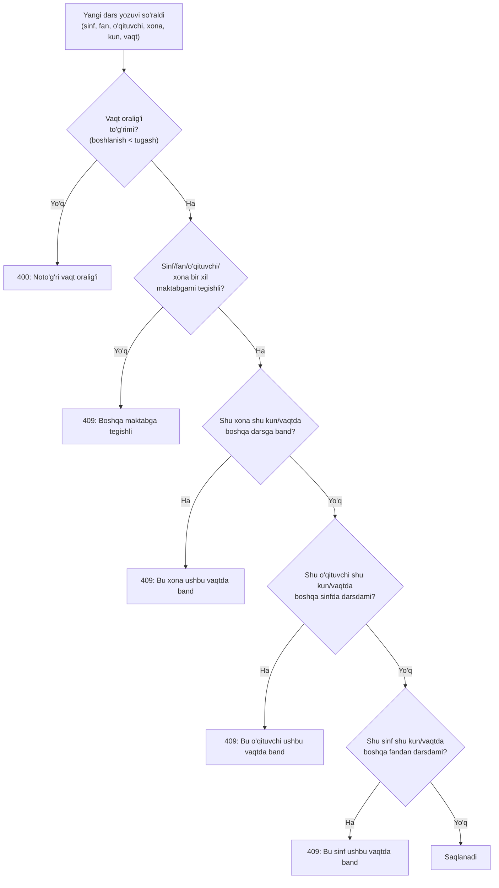

# 09 — Asosiy jarayonlar

[← 08 — Frontend](08-frontend.md) · Keyingisi: [10 — O'rnatish va ishga tushirish →](10-ornatish-va-ishga-tushirish.md)

## Mundarija
- [Tizimga kirish va maktab tanlash](#tizimga-kirish-va-maktab-tanlash)
- [Davomat olish](#davomat-olish)
- [Baho qo'yish](#baho-qoyish)
- [Dars jadvali tuzish (ziddiyat tekshiruvi)](#dars-jadvali-tuzish-ziddiyat-tekshiruvi)
- [Dashboard ko'rsatkichlari qanday hisoblanadi](#dashboard-korsatkichlari-qanday-hisoblanadi)

## Tizimga kirish va maktab tanlash

1. Foydalanuvchi `/login`ga kiradi. Sahifa ochilishi bilan `GET /api/health` chaqiriladi (4 soniyalik timeout bilan) — agar backend javob bermasa, "Server bilan bog'lanib bo'lmadi" degan ogohlantirish ko'rsatiladi, foydalanuvchi login formasini foydasiz to'ldirmaydi.
2. Username/parol kiritib, "Kirish" tugmasi bosiladi → `POST /api/auth/login`.
3. Backend parolni tekshiradi (BCrypt), JWT token yaratadi (`role` va, agar o'qituvchiga bog'langan bo'lsa, `employeeId` bilan). To'liq texnik oqim: [06-backend.md — JWT yaratish va tekshirish](06-backend.md#jwt-yaratish-va-tekshirish).
4. Frontend tokenni `authStore.setToken(token)` orqali saqlaydi, `/` (bosh sahifa)ga yo'naltiradi.
5. `MainLayout.vue` yuklanganda, `schoolStore.fetchSchools(api)` chaqiriladi — foydalanuvchi ko'ra oladigan barcha maktablar ro'yxati olinadi. Agar avval saqlangan `activeSchoolId` hali ham mavjud bo'lsa, o'sha tanlovda qoladi; aks holda ro'yxatdagi birinchi maktab avtomatik tanlanadi.
6. Shundan keyingi **har bir** so'rov (agar modul `schoolScoped`) shu tanlangan `schoolId`ni avtomatik olib boradi — foydalanuvchi bu haqda hech qachon o'ylamaydi.

## Davomat olish

Ekrandagi qadamlar: sinf tanlanadi → o'sha sinfning bugungi darslari yuklanadi (`GET /api/lesson-slots/timetable`) → dars tanlanadi → o'quvchilar ro'yxati va mavjud davomat holati yuklanadi (`GET /api/attendance/roster`) → har biriga status belgilanadi (yoki "Hammasi keldi" tugmasi bilan bir zumda) → "Saqlash".

To'liq texnik oqim (frontend tugmasidan bazaga yozilishigacha, sequence diagramma bilan): [02-arxitektura.md — Bitta so'rovning to'liq yo'li](02-arxitektura.md#bitta-sorovning-toliq-yoli-davomatni-saqlash).

**O'qituvchi uchun avtomatik filtr**: agar tizimga kirgan foydalanuvchi `Employee`ga bog'langan bo'lsa (JWT'dagi `employeeId`), "Bugungi darslar" ro'yxati standart holatda faqat o'sha o'qituvchining darslarini ko'rsatadi (`AttendancePage.vue`dagi "Mening darslarim / Barchasi" almashtirgich, `GET /api/attendance/today-lessons?employeeId=...`).

## Baho qo'yish

1. `GradebookPage.vue`da sinf va fan tanlanadi, davr (`from`/`to`) belgilanadi.
2. `GET /api/grades/gradebook?schoolClassId=...&subjectId=...&from=...&to=...` — o'quvchilar × sanalar jadvalini qaytaradi (har bir katakda, agar mavjud bo'lsa, baho).
3. O'qituvchi bo'sh katakka bosib, baho (2–5) kiritadi → `POST /api/grades`.
4. Backend (`GradeRequestDto`) `@Min(2)`/`@Max(5)` orqali diapazonni tekshiradi; `GradeService` `student`, `subject` mavjudligini tekshirib, `Grade` yozuvini saqlaydi.

## Dars jadvali tuzish (ziddiyat tekshiruvi)

Yangi dars vaqti (`LessonSlot`) qo'shilganda, tizim **uchta** turdagi to'qnashuvni tekshiradi — `LessonSlotService.java`:

```java
private void validateNoConflicts(LessonSlotRequestDto request, Long excludeId) {
    if (lessonSlotRepository.existsRoomConflict(request.getRoomId(), request.getWeekday(),
            request.getStartTime(), request.getEndTime(), excludeId)) {
        throw new IllegalStateException("Bu xona ushbu vaqtda band");
    }
    if (lessonSlotRepository.existsEmployeeConflict(request.getEmployeeId(), request.getWeekday(),
            request.getStartTime(), request.getEndTime(), excludeId)) {
        throw new IllegalStateException("Bu o'qituvchi ushbu vaqtda band");
    }
    if (lessonSlotRepository.existsSchoolClassConflict(request.getSchoolClassId(), request.getWeekday(),
            request.getStartTime(), request.getEndTime(), excludeId)) {
        throw new IllegalStateException("Bu sinf ushbu vaqtda band");
    }
}
```



Har uch tekshiruv ham `LessonSlotRepository`da vaqt oralig'i kesishishini (`startTime < :end AND endTime > :start`) JPQL orqali tekshiradigan alohida `existsXxxConflict` metodlari — `excludeId` parametri **yangilashda** dars o'zini o'ziga qarshi to'qnashuv deb hisoblamasligi uchun (o'sha yozuvning o'zi tekshiruvdan chiqarib tashlanadi).

## Dashboard ko'rsatkichlari qanday hisoblanadi

Barchasi `service/DashboardService.java`da, `Asia/Tashkent` vaqt zonasida hisoblanadi.

### Bugungi/kunlik davomat foizi

```
davomat % = (PRESENT + LATE holatidagi yozuvlar soni) / (jami yozuvlar soni) × 100
```
Metod: `attendanceRateOn(schoolId, date)` → `AttendanceRepository.countPresentBySchoolIdAndRecordDate` / `countBySchoolIdAndRecordDate`.

### Sinflar reytingi — uch ko'rsatkich (`getClassRankings`)

| Ko'rsatkich | Formula | Davr |
|---|---|---|
| **Davomat** | `(PRESENT+LATE) / jami × 100` | oxirgi 30 kun |
| **O'rtacha baho** | barcha baholarning arifmetik o'rtachasi | oxirgi 30 kun |
| **Umumiy ball** | `davomat% × 0.5 + normallashtirilgan_baho × 0.5`, bunda `normallashtirilgan_baho = (baho − 2) / (5 − 2) × 100` | oxirgi 30 kun |

Har bir ko'rsatkich uchun **oldingi** 30 kunlik davr bilan solishtirilgan o'zgarish (`Delta`) ham hisoblanadi (masalan "↑2.9"), sinf reytingi kartasida ko'rsatiladi.

### "E'tibor talab qiladi" — uchta qoida (`getAttentionItems`)

1. **`CONSECUTIVE_ABSENCE`** — oxirgi 10 kun ichida o'quvchi **ketma-ket 3 yoki undan ko'p kun** butunlay darsga kelmagan bo'lsa (har kunlik barcha darslarida `ABSENT`).
2. **`LOW_GRADE`** — o'quvchining barcha baholari o'rtachasi **3.0 dan past** bo'lsa (natija ro'yxati 30 tagacha cheklangan).
3. **`MISSING_ATTENDANCE`** — bugungi sinfning **birinchi darsi** boshlanish vaqti allaqachon o'tgan, lekin hali davomat kiritilmagan bo'lsa (30 tagacha cheklangan).

### Fanlar bo'yicha o'rtacha baho

Har bir fan uchun shu fandan qo'yilgan barcha baholarning o'rtachasi (`GradeRepository.averageScoreBySubject`), kamayish tartibida saralanadi.

---
Keyingisi: [10 — O'rnatish va ishga tushirish →](10-ornatish-va-ishga-tushirish.md)
