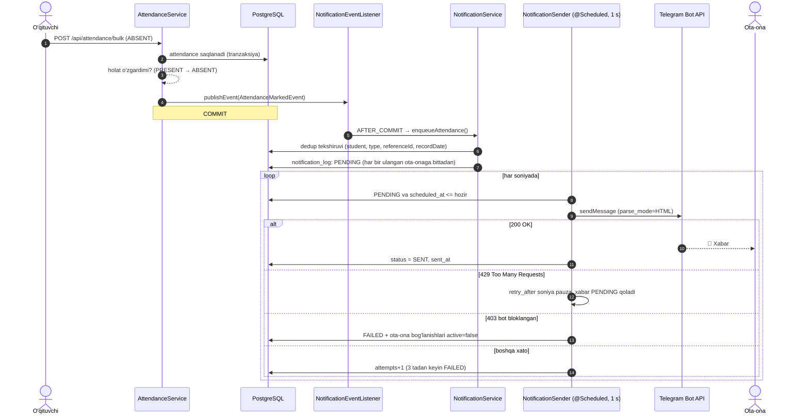

# 15 — Telegram bot (ota-onalar uchun xabarnomalar)

[← 14 — Kelajak rejalari](14-kelajak-rejalari.md) · [Hujjatlar ro'yxatiga →](../README.md)

## Mundarija
- [Nima qiladi](#nima-qiladi)
- [Arxitektura](#arxitektura)
- [Ota-onani farzandga bog'lash](#ota-onani-farzandga-boglash)
- [Bot buyruqlari](#bot-buyruqlari)
- [Sozlamalar](#sozlamalar)
- [Xabar namunalari](#xabar-namunalari)
- [Ishonchlilik: takrorlanmaslik, limitlar, qayta urinish](#ishonchlilik-takrorlanmaslik-limitlar-qayta-urinish)
- [Ma'lumotlar bazasi](#malumotlar-bazasi)
- [Admin panel](#admin-panel)
- [Xavfsizlik](#xavfsizlik)
- [Tokensiz sinash: mock rejimi](#tokensiz-sinash-mock-rejimi)
- [ADMINISTRATOR UCHUN YO'RIQNOMA](#administrator-uchun-yoriqnoma)
- [Muammolar va yechimlar](#muammolar-va-yechimlar)

## Nima qiladi

Ota-onalar farzandi haqida Telegram orqali **avtomatik** xabar oladi:

| Hodisa | Qachon yuboriladi | Xabar turi (`NotificationType`) |
|---|---|---|
| **Davomat** | O'quvchi darsga **kelmagan** (`ABSENT`) yoki **kechikkan** (`LATE`) deb belgilanganda | `ATTENDANCE_ABSENT`, `ATTENDANCE_LATE` |
| **Baho** | Yangi baho qo'yilganda yoki baho (ball/fan/tur) o'zgartirilganda | `GRADE_NEW`, `GRADE_UPDATED` |
| **E'lon** | Yangi e'lon joylanganda: `audience=ALL` — maktabning barcha ulangan ota-onalariga, `CLASS` — faqat o'sha sinf ota-onalariga, `TEACHERS` — ota-onalarga **yuborilmaydi** | `ANNOUNCEMENT` |

Bot long polling rejimida ishlaydi: server Telegram'ga o'zi murojaat qiladi. Shuning uchun serverga tashqi internetdan ochiq manzil (webhook, domen, SSL) **kerak emas**. Lokal kompyuterda ham ishlaydi.


## Arxitektura

Asosiy g'oya — **outbox** namunasi. Davomat/baho/e'lonni saqlovchi servis Telegram bilan to'g'ridan-to'g'ri gaplashmaydi. U faqat Spring event chiqaradi. Tranzaksiya muvaffaqiyatli tugagach (**AFTER_COMMIT**), listener `notification_log` jadvaliga `PENDING` yozuv qo'shadi. Alohida `@Scheduled` yuboruvchi shu jadvalni o'qib, xabarlarni Telegram limitlariga rioya qilgan holda jo'natadi.



Rollback bo'lsa (masalan, ro'yxatdagi bitta o'quvchi topilmasa), AFTER_COMMIT listener **umuman ishga tushmaydi**. Natijada xabar ham yaratilmaydi. Buni `TelegramMockFlowIntegrationTest.rolledBackSave_producesNoNotification` testi tasdiqlaydi.

### Fayllar

| Qatlam | Fayl | Vazifasi |
|---|---|---|
| Event | `event/AttendanceMarkedEvent`, `GradeSavedEvent`, `AnnouncementCreatedEvent` | Faqat id'lar tashiladi; listener ma'lumotni yangi tranzaksiyada qayta o'qiydi |
| Event | `event/NotificationEventListener` | `@TransactionalEventListener(phase = AFTER_COMMIT)`. Xatolarni yutadi, chunki foydalanuvchining saqlashi allaqachon muvaffaqiyatli bo'lgan |
| Servis | `service/NotificationService` | Outbox'ga yozish (`REQUIRES_NEW` tranzaksiyada), dedup, auditoriya tanlash, tinch soatlar |
| Servis | `service/NotificationSender` | `@Scheduled` yuboruvchi: limitlar, 429/403/retry |
| Servis | `service/TelegramBotService` | Ota-ona tomoni: `/start`, telefon, `/farzandlarim`, `/stop`, `/yordam` |
| Servis | `service/TelegramUpdatePoller` | `@Scheduled` `getUpdates` long polling, `offset` bilan |
| Servis | `service/TelegramLinkService`, `NotificationQueryService`, `NotificationSettingsService` | Admin panel uchun: kodlar, bog'lanishlar, jurnal, statistika, sozlamalar |
| Telegram | `telegram/HttpTelegramClient` | Haqiqiy klient — Spring `RestClient` (tashqi Telegram kutubxonasi yo'q) |
| Telegram | `telegram/MockTelegramClient` | `telegram.mock=true` — faqat logga yozadi |
| Telegram | `telegram/MessageFormatter`, `PhoneNormalizer`, `QuietHours`, `LinkCodeGenerator`, `TokenMasker` | Toza (sof) yordamchi klasslar, alohida unit testlangan |
| Config | `config/TelegramLinkCodeBackfill` | Mavjud o'quvchilarga ishga tushishda kod beradi |

`spring.task.scheduling.pool.size=3` — `getUpdates` so'rovi oqimni 25 soniyagacha band qiladi. Bitta oqimli scheduler'da bu vaqtda yuboruvchi ishlay olmay qolardi.

## Ota-onani farzandga bog'lash

Har bir o'quvchida **tasodifiy, taxmin qilib bo'lmaydigan** `telegram_link_code` bor. U `SecureRandom` bilan yaratilgan 10 belgidan iborat (~58 bit). Bir-biriga o'xshash `0/O`, `1/l/I` belgilari ishlatilmaydi, chunki kod qog'ozdan qo'lda terilishi mumkin. Bir o'quvchiga bir nechta ota-ona, bitta ota-onaga (chat'ga) bir nechta farzand bog'lanishi mumkin. Har bir juftlik — `parent_telegram_link` jadvalidagi alohida qator.

**1-yo'l — deep link / QR kod.** O'quvchi profilida havola ko'rinadi: `https://t.me/<bot_username>?start=<kod>`. Xuddi shu havola QR kod sifatida ham chiqadi. Ota-ona uni ochib **Start** bosadi, bot esa javob beradi:

> ✅ Farzandingiz **Alisher Karimov**, 5-A sinfiga ulandingiz.

Sinf profilidagi **«Ota-onalar uchun QR kodlar»** tugmasi butun sinf uchun A4 varaqqa chop etiladigan sahifa ochadi. Har varaqda 12 ta kesiladigan kartochka bo'ladi (ism, sinf, QR, zaxira kod). Uni ota-onalar yig'ilishida tarqatish mumkin.


**2-yo'l — telefon raqami.** Ota-ona botga kodsiz `/start` yuboradi. Bot **«📱 Raqamni ulashish»** tugmasini (`request_contact`) chiqaradi. Kelgan raqam `students.guardian_phone` bilan solishtiriladi. Ikkala tomon ham `+998XXXXXXXXX` ko'rinishiga keltiriladi (`PhoneNormalizer`), shuning uchun `+998 90 123-45-67`, `901234567`, `8 90 1234567`, `998901234567` kabi yozuvlar bir-biriga mos keladi. Shu raqam yozilgan **barcha** farzandlar bog'lanadi. Bot faqat foydalanuvchining **o'z** raqamini qabul qiladi (`contact.user_id == from.id`). Birovning kontakt kartochkasini forward qilib, boshqa bolaning ma'lumotini olib bo'lmaydi.

**Kodni yangilash.** O'quvchi profilidagi «Kodni yangilash» tugmasi yangi kod yaratadi. Eski kod va eski QR darhol ishlamay qoladi, allaqachon ulangan ota-onalar esa **uzilmaydi**. Ota-onani alohida uzish uchun ro'yxatdagi «Uzish» tugmasi bor.

## Bot buyruqlari

| Buyruq | Javob |
|---|---|
| `/start <kod>` | Farzandni ulaydi yoki «❌ Kod topilmadi» deydi |
| `/start` | Salomlashadi va «📱 Raqamni ulashish» tugmasini chiqaradi |
| (kontakt yuborish) | Raqam bo'yicha farzandlarni ulaydi |
| `/farzandlarim` | Bog'langan farzandlar ro'yxati (ism, sinf, maktab) |
| `/stop` | Shu chat'ning barcha bog'lanishlarini o'chiradi (xabarlar to'xtaydi) |
| `/yordam` va har qanday noma'lum xabar | Yordam matni |

Bot faqat **shaxsiy chat**larga javob beradi. Guruhga qo'shilsa, u yerdagi xabarlarni e'tiborsiz qoldiradi.

## Sozlamalar

### Server (`application.properties` → muhit o'zgaruvchilari)

| Sozlama | Muhit o'zgaruvchisi | Standart | Izoh |
|---|---|---|---|
| `telegram.enabled` | `TELEGRAM_ENABLED` | `false` | O'chiq bo'lsa, xabarlar `SKIPPED` holatida jurnalga yoziladi |
| `telegram.bot-token` | `TELEGRAM_BOT_TOKEN` | bo'sh | **Faqat** `application-local.properties` yoki muhit o'zgaruvchisida saqlanadi |
| `telegram.bot-username` | `TELEGRAM_BOT_USERNAME` | bo'sh | `@`siz yoziladi. Deep link va QR uchun kerak |
| `telegram.mock` | `TELEGRAM_MOCK` | `false` | Soxta klient, [pastda](#tokensiz-sinash-mock-rejimi) batafsil |
| `telegram.quiet-hours-start` / `-end` | `TELEGRAM_QUIET_START` / `_END` | `22:00` / `07:00` | Yangi maktab uchun standart tinch soatlar |
| `telegram.max-per-second` | — | `25` | Umumiy yuborish tezligi |
| `telegram.max-attempts` | — | `3` | Boshqa xatolarda urinishlar soni |

Rejimlar (`GET /api/telegram/status` → `mode`):

| `mode` | Shart | Natija |
|---|---|---|
| `LIVE` | `enabled=true` va token bor | Haqiqiy Telegram, long polling yoqilgan |
| `MOCK` | `mock=true` | Xabarlar faqat logga va bazaga yoziladi (`SENT`) |
| `DISABLED` | `enabled=false` | Ilova odatdagidek ishlaydi, xabarlar `SKIPPED` |
| `NO_TOKEN` | `enabled=true`, lekin token yo'q | Ilova odatdagidek ishlaydi, xabarlar `SKIPPED`, logda ogohlantirish |

### Maktab darajasida («Xabarnomalar» sahifasi, `notification_settings` jadvali)

- Har bir turni alohida yoqish/o'chirish mumkin: **davomat**, **baholar**, **e'lonlar**. O'chirilgan tur uchun yozuvlar `SKIPPED` bo'ladi va sababi ko'rsatiladi.
- **Tinch soatlar** (standart 22:00–07:00, Asia/Tashkent). Bu oraliqda yaratilgan xabar `scheduled_at = 07:00` bilan navbatga qo'yiladi va ertalab yuboriladi. Oraliq yarim tundan o'tishi (22:00–07:00) yoki o'tmasligi (13:00–14:00) mumkin.
- Maktab uchun hali qator yaratilmagan bo'lsa, standart qiymatlar ishlatiladi: hamma tur yoqilgan, tinch soatlar global sozlamadan olinadi.
- O'qish: ADMIN/EDITOR. O'zgartirish: faqat **ADMIN**.

## Xabar namunalari

Barcha matnlar `parse_mode=HTML` bilan yuboriladi. Bazadan kelgan har bir qiymat (ism, fan, sarlavha) `&`, `<`, `>`, `"` belgilaridan escape qilinadi. Har bir xabar oxirida maktab nomi turadi.

```text
🔴 <b>Alisher Karimov</b> (5-A) bugun 2-darsga (Matematika, 09:25) kelmadi.

🏫 <i>1-maktab</i>
```
```text
🟡 <b>Alisher Karimov</b> (5-A) bugun 1-darsga (Ona tili, 08:30) kechikib keldi.
```
```text
📘 <b>Alisher Karimov</b> Fizika fanidan <b>5</b> baho oldi (joriy baho, 30.09.2026).
```
```text
✏️ <b>Alisher Karimov</b>ning Fizika fanidan bahosi <b>4</b> ga o'zgartirildi (joriy baho, 30.09.2026).
```
```text
📢 <b>Maktab e'loni</b>: Ota-onalar yig'ilishi
Juma kuni soat 18:00 da maktab zalida umumiy yig'ilish bo'ladi.
```

- «2-darsga» — sinfning o'sha hafta kunidagi darslari orasidagi tartib raqami (`start_time` bo'yicha).
- Sana bugungi bo'lsa «bugun», kechagi bo'lsa «kecha», aks holda `DD.MM.YYYY kuni` yoziladi.
- E'lon matni 300 belgidan uzun bo'lsa, so'z chegarasida qisqartiriladi va oxiriga «…» qo'yiladi. Sinf e'loni sarlavhasi «📢 5-A sinf e'loni» ko'rinishida bo'ladi.

## Ishonchlilik: takrorlanmaslik, limitlar, qayta urinish

- **Holat o'zgarmasa, xabar yo'q.** `AttendanceService` event'ni faqat holat haqiqatan `ABSENT`/`LATE`ga **o'zgarganda** chiqaradi (`AttendanceMarkedEvent.isNotifiable`). Butun ro'yxatni qayta saqlash xabar yubormaydi. `PRESENT → ABSENT` esa yuboradi.
- **Dedup kaliti** — `(student, type, referenceId, recordDate)`. Bunday kalit bilan yozuv allaqachon mavjud bo'lsa, ikkinchisi yaratilmaydi. Bazada ham `uk_notification_dedup` noyob cheklovi bor (unga `chat_id` qo'shilgan, chunki bitta o'quvchining bir necha ota-onasi bo'lishi mumkin).
  - Davomat: `referenceId` = davomat yozuvi id'si, `recordDate` = dars sanasi.
  - Yangi baho: `referenceId` = baho id'si, `recordDate` = baho sanasi.
  - Baho o'zgarishi: `recordDate` = **o'zgartirilgan kun**. Bitta bahoni bir kunda 5 marta tuzatish ota-onaga bitta xabar beradi. Faqat izohni o'zgartirish umuman xabar yubormaydi.
  - E'lon: har bir chat'ga bitta xabar. Bitta maktabda 2 farzandi bor ota-ona e'lonni ikki marta emas, bir marta oladi.
- **Limitlar.** Umumiy tezlik sekundiga ≤25 xabar, bitta chat'ga sekundiga ≤1 xabar.
- **429** (`Too Many Requests`) — yuboruvchi `retry_after` soniya to'xtaydi. Xabar `PENDING` qoladi va bu urinish hisoblanmaydi.
- **403** (bot bloklangan) — xabar `FAILED` bo'ladi, shu chat'ning barcha bog'lanishlari `active=false` qilinadi, navbatdagi xabarlari esa `SKIPPED` bo'ladi.
- **Boshqa xatolar** (tarmoq, 400, 5xx) — 30 s, keyin 60 s kutib qayta uriniladi. 3-urinishdan keyin `FAILED`. Admin panelda «Qayta yuborish» tugmasi xabarni yana navbatga qo'yadi.
- Ota-ona `/stop` yuborsa yoki admin uni uzsa, navbatda qolgan xabarlari **yuborilmaydi** (`SKIPPED`).
- Outbox bazada bo'lgani uchun server qayta ishga tushsa ham `PENDING` xabarlar yo'qolmaydi.

## Ma'lumotlar bazasi

Yangi jadvallar (`ddl-auto=update` avtomatik yaratadi):

| Jadval | Ustunlar |
|---|---|
| `parent_telegram_link` | `id`, `student_id` → students, `chat_id`, `telegram_username`, `first_name`, `linked_at`, `active`. Noyob: `(student_id, chat_id)` |
| `notification_log` | `id`, `school_id`, `student_id`, `chat_id`, `type`, `reference_id`, `record_date`, `text`, `status` (`PENDING/SENT/FAILED/SKIPPED`), `attempts`, `last_error`, `created_at`, `scheduled_at`, `sent_at`. Noyob: `uk_notification_dedup` |
| `notification_settings` | `id`, `school_id` (noyob), `attendance_enabled`, `grade_enabled`, `announcement_enabled`, `quiet_hours_enabled`, `quiet_hours_start`, `quiet_hours_end` |

`students` jadvaliga yangi ustun qo'shildi: `telegram_link_code` (noyob, **nullable**). `ddl-auto=update` qatorlari bor jadvalga `NOT NULL` ustun qo'sha olmaydi. Shuning uchun mavjud o'quvchilarga kodni ishga tushishda `TelegramLinkCodeBackfill` beradi, yangilariga esa `@PrePersist`.

## Admin panel

- **O'quvchi profili → «Umumiy» tab → «Telegram» bloki** (ADMIN/EDITOR). Unda ulangan ota-onalar soni va ro'yxati (ism, username, ulangan sana, «Uzish»), bog'lash kodi, nusxalanadigan deep link, QR kod va «Kodni yangilash» tugmasi bor.
- **Sinf profili → «Ota-onalar uchun QR kodlar»** — A4 chop etish sahifasi (`/print/class-qr/:id`).
- **Sidebar → Boshqaruv → «Xabarnomalar»** (ADMIN/EDITOR). Sahifada quyidagilar bor:
  - bot holati; sozlanmagan bo'lsa, «Bot sozlanmagan» ogohlantirishi va sozlash yo'riqnomasi;
  - statistika: bugun yuborilgan, xatolar, ulangan ota-onalar foizi, obunachilar;
  - maktab sozlamalari;
  - tur/holat/sana bo'yicha filtrlanadigan jurnal, xabar matnini ko'rish, `FAILED` uchun «Qayta yuborish».


API: [07-api.md — Telegram va xabarnomalar](07-api.md#telegram-va-xabarnomalar-apitelegram-apinotifications).

## Xavfsizlik

- **Token hech qachon kodda, hujjatda, logda yoki git'da bo'lmaydi.**
  - U faqat `application-local.properties` (`.gitignore`da) yoki `TELEGRAM_BOT_TOKEN` muhit o'zgaruvchisidan o'qiladi.
  - `TelegramProperties.toString()` tokenni `***` bilan almashtiradi.
  - Bot API tokenni URL ichida talab qiladi, HTTP xatolari esa URL'ni ko'chirib yozishi mumkin. Shuning uchun har bir xato matni `TokenMasker`dan o'tadi. U tokenni ham, token ko'rinishidagi har qanday qiymatni ham `***:***` bilan almashtiradi.
- **Ota-ona faqat o'ziga bog'langan farzand haqida xabar oladi.** Qabul qiluvchilar faqat `parent_telegram_link` (faol) orqali tanlanadi. `/farzandlarim` faqat shu chat'ning bog'lanishlarini ko'rsatadi.
- **Kodlarni topib bo'lmaydi.**
  - ~58 bitli tasodifiy kod ishlatiladi.
  - Noto'g'ri, noto'g'ri formatdagi va bekor qilingan kodga bir xil javob beriladi: «❌ Kod topilmadi». Qaysi kodlar mavjudligi oshkor qilinmaydi.
  - Formatga mos kelmagan kod bazaga umuman yetib bormaydi.
  - Bitta chat'dan 10 daqiqada 5 ta noto'g'ri kod yuborilsa, keyingi urinishlar bloklanadi (brute-force himoyasi).
- **Faqat o'z raqami** qabul qilinadi (`contact.user_id == from.id`).
- **Rollar.**
  - Bog'lash kodi va deep link faqat ADMIN/EDITOR'ga ko'rinadi, chunki kodni bilgan odam bolaning ma'lumotiga obuna bo'la oladi.
  - `VIEWER` faqat bot holatini ko'radi.
  - Sozlamalarni faqat ADMIN o'zgartiradi.
  - `/api/telegram/mock/updates` faqat ADMIN uchun va faqat mock rejimida ishlaydi.
- Admin paneldagi xabar ko'rinishi (`v-html`) faqat `<b>`/`<i>` teglariga ruxsat beradi, qolganlari zararsizlantiriladi.

## Tokensiz sinash: mock rejimi

`telegram.mock=true` (yoki `TELEGRAM_MOCK=true`) rejimida haqiqiy Telegram o'rniga `MockTelegramClient` ishlaydi:

- xabarlar server logiga `[MOCK TELEGRAM] chat=... -> ...` ko'rinishida yoziladi;
- `notification_log` yozuvlari odatdagidek `PENDING → SENT` bo'ladi;
- ota-onaning botga yozishini `POST /api/telegram/mock/updates` bilan simulyatsiya qilish mumkin.

```bash
# 1) Backend'ni mock rejimida ishga tushirish
TELEGRAM_MOCK=true TELEGRAM_BOT_USERNAME=maktab_test_bot SPRING_PROFILES_ACTIVE=local ./gradlew bootRun

# 2) O'quvchining kodini olish (ADMIN tokeni bilan)
curl -H "Authorization: Bearer $TOKEN" http://localhost:8080/api/telegram/students/14

# 3) "Ota-ona deep link'ni ochdi" — botning javobi qaytadi
curl -X POST http://localhost:8080/api/telegram/mock/updates \
  -H "Authorization: Bearer $TOKEN" -H "Content-Type: application/json" \
  -d '{"chatId":700014,"firstName":"Ota","username":"ota_14","text":"/start <kod>"}'

# 3b) Telefon raqami orqali ulanish
curl -X POST http://localhost:8080/api/telegram/mock/updates \
  -H "Authorization: Bearer $TOKEN" -H "Content-Type: application/json" \
  -d '{"chatId":700015,"firstName":"Ona","contactPhone":"998970000014"}'

# 4) Davomat saqlang (ABSENT) — bir soniyada logda xabar paydo bo'ladi
```

Avtomatik test: `TelegramMockFlowIntegrationTest` seed ma'lumot bilan to'liq oqimni (bog'lash → davomat → `PENDING` → yuboruvchi → `SENT`, qayta saqlashda dublikat yo'q, rollback'da xabar yo'q) tekshiradi.

## ADMINISTRATOR UCHUN YO'RIQNOMA

**1. Bot yaratish.** Telegram'da [@BotFather](https://t.me/BotFather) ni oching → `/newbot` yuboring.
- Botning ko'rinadigan nomini kiriting, masalan `1-maktab xabarnomalari`.
- Keyin username kiriting. U `bot` bilan tugashi shart, masalan `maktab1_xabar_bot`.

**2. Tokenni olish.** BotFather `raqamlar:harflar` ko'rinishidagi **token** beradi. Uni hech kimga bermang, chatlarga, hujjatlarga yoki git'ga joylamang. Token oshkor bo'lib qolsa, BotFather'da `/revoke` qilib yangisini oling.

**3. Tokenni serverga yozish.** `src/main/resources/application-local.properties` faylini oching. Fayl bo'lmasa, `application-local.properties.example`dan nusxa oling (u `.gitignore`da, commit qilinmaydi). Quyidagilarni qo'shing:

```properties
telegram.enabled=true
telegram.bot-token=<BotFather bergan token>
telegram.bot-username=maktab1_xabar_bot
```

Server (production) muhitida fayl o'rniga muhit o'zgaruvchilaridan foydalaning: `TELEGRAM_ENABLED=true`, `TELEGRAM_BOT_TOKEN=...`, `TELEGRAM_BOT_USERNAME=...`.

**4. Backend'ni qayta ishga tushirish** (`start.bat` / `start.sh` yoki IntelliJ). Logda quyidagi qator chiqishi kerak (token ko'rinmaydi):

```text
Telegram bot: yoqilgan (@maktab1_xabar_bot, token: ***)
```

**5. Tekshirish.**
1. Admin panel → **Xabarnomalar**: yuqorida yashil **«Ulangan · @maktab1_xabar_bot»** belgisi chiqadi, «Bot sozlanmagan» ogohlantirishi yo'qoladi.
2. Istalgan o'quvchi profilini oching → Telegram blokidagi QR kodni **o'z telefoningiz** bilan skanerlang → **Start** bosing. Bot «✅ Farzandingiz …, …-sinfiga ulandingiz» deb javob beradi, profilda esa «1 ta ota-ona ulangan» ko'rinadi.
3. **Davomat olish** sahifasida shu o'quvchini **Kelmadi** deb belgilab saqlang. Bir necha soniyada telefoningizga 🔴 xabar keladi, **Xabarnomalar** jurnalida esa yozuv **Yuborildi** holatida ko'rinadi. (22:00–07:00 oralig'ida sinayotgan bo'lsangiz, tinch soatlarni vaqtincha o'chiring — aks holda xabar 07:00 da keladi.)
4. Botga `/stop` yuborib obunani bekor qiling yoki profildagi «Uzish» tugmasini bosing.

**6. Ota-onalarga tarqatish.** Har bir sinf profilida **«Ota-onalar uchun QR kodlar»** tugmasini bosing → **Chop etish**. Kartochkalarni kesib, ota-onalar yig'ilishida tarqating. Telefon raqami maktab bazasida to'g'ri yozilgan ota-onalar esa botga `/start` yuborib, «📱 Raqamni ulashish» tugmasi orqali o'zlari ulanishi mumkin.

## Muammolar va yechimlar

| Belgi | Sabab | Yechim |
|---|---|---|
| «Bot sozlanmagan», xabarlar `O'tkazildi (SKIPPED)` | `TELEGRAM_ENABLED=false` yoki token yo'q | [Yo'riqnoma](#administrator-uchun-yoriqnoma)ning 3–4-qadamlari |
| Xabarnomalar sahifasida «Token noto'g'ri (Telegram 401)» | Token xato ko'chirilgan yoki `/revoke` qilingan | BotFather'dan tokenni qayta oling, backend'ni qayta ishga tushiring |
| «Boshqa nusxa yoki webhook ishlayapti (409)» | Bir token bilan ikkita backend ishlayapti yoki botga webhook o'rnatilgan | Bitta nusxa qoldiring; webhook bo'lsa: `https://api.telegram.org/bot<TOKEN>/deleteWebhook` ni brauzerda oching (tokenni hech kimga ko'rsatmang) |
| QR/havola o'rniga «TELEGRAM_BOT_USERNAME sozlanmagan» | `telegram.bot-username` bo'sh | Username'ni `@`siz yozing |
| Ota-ona raqamini ulashdi, lekin «topilmadi» | `guardian_phone` bo'sh yoki boshqa raqam yozilgan | O'quvchi kartasida raqamni to'g'rilang yoki QR koddan foydalaning |
| Xabar kechqurun yuborilmadi | Tinch soatlar (22:00–07:00) | Kutilgan xatti-harakat: xabar 07:00 da yuboriladi. Jurnalda 🌙 belgisi va vaqti ko'rinadi |
| Holat `FAILED`, xato «403 …» | Ota-ona botni bloklagan | Ota-ona botni qayta ochib `/start` bossa, bog'lanish tiklanadi |
| Holat `FAILED`, boshqa xato | Tarmoq yoki Telegram vaqtincha ishlamagan | «Qayta yuborish» tugmasi |
| Bir xil davomatni qayta saqladim — xabar kelmadi | Dedup: holat o'zgarmagan | Kutilgan xatti-harakat |
| Serverda Telegram bloklangan (proksi kerak) | `api.telegram.org`ga chiqish yo'q | Serverdan `curl https://api.telegram.org` ishlashini tekshiring; kerak bo'lsa JVM proksi sozlamalari (`-Dhttps.proxyHost=... -Dhttps.proxyPort=...`) |

---
[← 14 — Kelajak rejalari](14-kelajak-rejalari.md) · [Hujjatlar ro'yxatiga →](../README.md)
