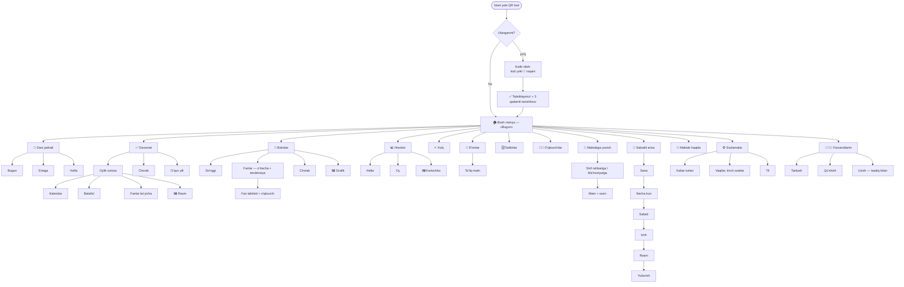
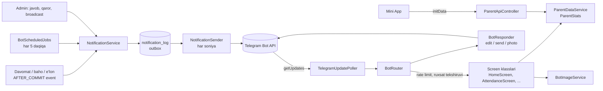
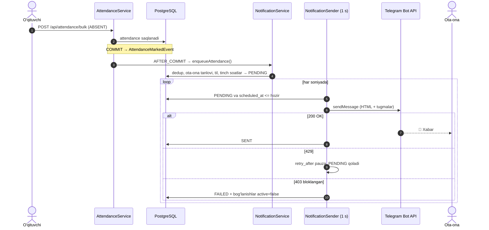

# 15 — Telegram bot (ota-onalar uchun)

[← 14 — Kelajak rejalari](14-kelajak-rejalari.md) · [Hujjatlar ro'yxatiga →](../README.md)

## Mundarija
- [Nima qiladi](#nima-qiladi)
- [Bo'limlar xaritasi](#bolimlar-xaritasi)
- [Sahifalar](#sahifalar)
- [Avtomatik xabarlar](#avtomatik-xabarlar)
- [Rasmlar (PNG)](#rasmlar-png)
- [Mini App «Farzandim kundaligi»](#mini-app-farzandim-kundaligi)
- [Arxitektura](#arxitektura)
- [Ota-onani farzandga bog'lash](#ota-onani-farzandga-boglash)
- [Sozlamalar](#sozlamalar)
- [Ishonchlilik: takrorlanmaslik, limitlar, qayta urinish](#ishonchlilik-takrorlanmaslik-limitlar-qayta-urinish)
- [Ma'lumotlar bazasi](#malumotlar-bazasi)
- [Admin panel](#admin-panel)
- [Xavfsizlik](#xavfsizlik)
- [Tokensiz sinash: mock rejimi va demo](#tokensiz-sinash-mock-rejimi-va-demo)
- [ADMINISTRATOR UCHUN YO'RIQNOMA](#administrator-uchun-yoriqnoma)
- [Muammolar va yechimlar](#muammolar-va-yechimlar)

Ota-onalar uchun bir sahifalik qo'llanma: [ota-onalar-uchun.md](ota-onalar-uchun.md). Botning har bir sahifasi qanday ko'rinishi: [bot-demo.md](bot-demo.md) (avtomatik simulyatsiya natijasi).

## Nima qiladi

Bot ota-onaga ikki xil xizmat qiladi:

1. **O'zi xabar beradi** — farzand darsga kelmasa, kechiksa, baho olsa, maktab e'lon bersa, ertangi jadval, haftalik hisobot, tadbir eslatmasi ([to'liq jadval](#avtomatik-xabarlar)).
2. **Ota-ona so'raganini ko'rsatadi** — jadval, davomat, baholar, hisobot, xulq, e'lonlar, tadbirlar, o'qituvchilar; maktabga yozish va sababli ariza yuborish ([sahifalar](#sahifalar)).

Bot 3 tilda ishlaydi: **o'zbek (lotin)**, **ўзбек (кирилл)**, **русский**. Barcha matnlar `src/main/resources/bot/i18n/messages_{uz,cy,ru}.properties` fayllarida; kirill fayli `scripts/uz-latin-to-cyrillic.py` bilan lotin faylidan yaratiladi.

Bot long polling rejimida ishlaydi: serverga tashqi ochiq manzil (webhook, domen, SSL) **kerak emas**. Faqat Mini App uchun HTTPS manzil kerak ([pastda](#mini-app-farzandim-kundaligi)).

## Bo'limlar xaritasi



## Sahifalar

### Umumiy qoidalar

- **Bitta xabar — bitta sahifa.** Tugma bosilganda bot yangi xabar yubormaydi, **o'sha xabarni tahrirlaydi** (`editMessageText`). Chat to'lib ketmaydi. Rasmli sahifadan matnli sahifaga o'tishda xabar o'chiriladi va yangisi yuboriladi.
- **Navigatsiya.** Har sahifa ostida `⬅️ Orqaga` va `🏠 Bosh menyu`; tepada yo'l ko'rsatkichi, masalan `🏠 › ✅ Davomat › Sentabr`.
- **Pastki klaviatura** (doim ko'rinadi, 2 ustun): `📅 Dars jadvali` · `✅ Davomat` · `📘 Baholar` · `📊 Hisobot` · `📢 E'lonlar` · `🗓 Tadbirlar` · `👩‍🏫 O'qituvchilar` · `💬 Maktabga yozish` · `⚙️ Sozlamalar` · `👨‍👩‍👧 Farzandlarim`. Tugma bosilsa — yangi sahifa-xabar ochiladi.
- **Tezlik.** Har bosishga darhol `answerCallbackQuery` qaytadi (soat belgisi aylanmaydi); og'ir sahifalarda `typing…` / `sending photo…` holati ko'rsatiladi.
- **Format.** HTML (`<b>`, `<i>`, `<blockquote>`), sanalar «30-sentabr, seshanba», vaqt Asia/Tashkent bo'yicha. Uzun ro'yxatlar sahifalanadi: `◀️ 1/3 ▶️`. Ma'lumot bo'lmasa — do'stona bo'sh holat («Bu oyda baho hali yo'q 🙂»).
- **Bir nechta farzand.** Tepada tanlangan farzand: `👦 Ali Valiyev · 5-A`, ostida `🔄 Farzandni almashtirish`. Tanlov eslab qolinadi (`parent_session.selected_student_id`).
- **Buyruqlar** (`setMyCommands`): `/start`, `/menu`, `/jadval`, `/davomat`, `/baholar`, `/yordam`, `/stop`. Bot faqat shaxsiy chatlarda javob beradi.

### Sahifalar ro'yxati

| Sahifa | callback | Nima ko'rsatadi |
|---|---|---|
| 🏠 **Bosh menyu — «Bugun»** | `home` | Bugungi holat (keldi/kechikdi/kelmadi), bugungi baholar, joriy dars (▶️), yangi e'lonlar soni, yaqin tadbir |
| 📅 **Dars jadvali** | `sch` (`t=today\|tomorrow\|week`) | Bugun / Ertaga / Hafta; joriy dars ▶️, tanaffuslar, o'qituvchi; bayram va ta'til kunlari «🎉 Dam olish kuni» |
| ✅ **Davomat** | `att` (`k=m\|q\|y`, `m`, `v=sum\|cal\|det\|sub\|img`) | Oylik xulosa: foiz, progress-bar `▓▓▓▓▓▓▓▓░░`, sinf o'rtachasi; ◀️ oy ▶️; kalendar; «Batafsil» — har kelmagan/kechikkan dars; fanlar bo'yicha; chorak va o'quv yili; 🖼 rasm |
| 📘 **Baholar** | `gr` (`v=recent\|subj\|det\|qtr\|chart`) | So'nggi baholar; fanlar bo'yicha o'rtacha (bar + ↑↓ tendensiya); fan tafsiloti — barcha baholar va o'qituvchi; chorak baholari; 🖼 grafik |
| 📊 **Hisobot** | `rep` (`t=week\|month`) | Davomat, o'rtacha baho, kuchli fanlar, e'tibor talab qiladigan fanlar, xulq; 🖼 hisobot kartochkasi |
| ⭐ **Xulq** | `beh` (`m`) | Avval rag'batlar, keyin ogohlantirishlar; oylar bo'yicha |
| 📢 **E'lonlar** | `ann` (`p`, `id`) | Sahifalangan ro'yxat; 🔴 muhim, 🆕 o'qilmagan; to'liq matn ochilsa o'qilgan deb belgilanadi |
| 🗓 **Tadbirlar** | `ev` | Yaqinlashayotgan tadbirlar (majlis, imtihon, bayram) |
| 👩‍🏫 **O'qituvchilar** | `tch` | Sinf rahbari va fan o'qituvchilari; telefonlar faqat «Bot sozlamalari»da ruxsat berilsa |
| 💬 **Maktabga yozish** | `msg` (`a=to`, `to=CT\|AD`) | Kimga: sinf rahbari yoki ma'muriyat → matn (+ rasm). Maktab javobi botga keladi; yozishmalar tarixi |
| 🤒 **Sababli ariza** | `abs` (`d`, `n`, `r=I\|F\|O`) | Sana → necha kun → sabab (kasallik / oilaviy / boshqa) → izoh → rasm (ixtiyoriy) → tasdiqlash. Tasdiqlansa davomat «Sababli» bo'ladi, rad etilsa sababi bilan xabar keladi |
| 🏫 **Maktab haqida** | `info` | Telefon, direktor, qabul kunlari, qo'ng'iroq jadvali |
| ⚙️ **Sozlamalar** | `set` | 7 ta xabar turini yoqish/o'chirish; ertangi jadval vaqti (18:00–21:00); tinch soatlar (maktabniki / o'chiq / 21–07 / 22–07 / 23–07); til |
| 👨‍👩‍👧 **Farzandlarim** | `ch` | Farzandni tanlash, yangi farzand qo'shish (kod bilan), uzish — tasdiqlash bilan |

`callback_data` 64 baytdan oshmaydi (`CallbackData.toString()` buni tekshiradi). Format: `bo'lim:kalit:qiymat:...`, masalan `att:k:m:m:2026-09:v:cal`.

### Kutib olish (onboarding)

1. `/start` (kodsiz) — iliq salomlashuv, nima qila olishi va ikki yo'l: kodni yuborish yoki `📱 Raqamni ulashish`.
2. Ulangandan keyin: «✅ Tabriklaymiz! Endi **Ali** haqida hamma narsa shu yerda», 3 qadamli qisqa tanishtiruv va Bosh menyu.
3. Noto'g'ri kod — «❌ Kod topilmadi» (qaysi kodlar mavjudligi oshkor qilinmaydi).

To'liq dialoglar tugmalari bilan: [bot-demo.md](bot-demo.md).

## Avtomatik xabarlar

| Xabar | Qachon | Turi (`NotificationType`) | Ota-ona o'chira oladimi |
|---|---|---|---|
| 🔴 Darsga kelmadi | Davomatda `ABSENT` belgilanganda | `ATTENDANCE_ABSENT` | ✅ «Davomat» |
| 🟡 Kechikdi | Davomatda `LATE` belgilanganda | `ATTENDANCE_LATE` | ✅ «Davomat» |
| 📘 Yangi baho / ✏️ o'zgardi | Baho qo'yilganda yoki o'zgartirilganda | `GRADE_NEW`, `GRADE_UPDATED` | ✅ «Baholar» |
| 💛 Past baho | Baho ≤ chegara (standart 2, «Bot sozlamalari»da 3 qilish mumkin) — yumshoq ohangda, «✍️ O'qituvchiga yozish» tugmasi bilan | `GRADE_LOW` | ✅ «Past baho» (o'chirilsa oddiy baho xabari keladi) |
| 📢 Maktab e'loni | E'lon joylanganda (`ALL` yoki o'sha sinf) | `ANNOUNCEMENT` | ✅ «E'lonlar» |
| 📅 Ertangi dars jadvali | Har kuni ota-ona tanlagan vaqtda (standart 19:00). Ertaga dars bo'lmasa yubormaydi; bayram bo'lsa «dam olish kuni» deydi; ertangi majlis/imtihonni eslatadi | `TOMORROW_SCHEDULE` | ✅ «Ertangi jadval» |
| 📊 Haftalik hisobot | Har hafta (standart shanba 18:00) | `WEEKLY_REPORT` | ✅ «Haftalik hisobot» |
| 🗓 Tadbir eslatmasi | Tadbirdan 1 kun oldin (standart 18:00) | `EVENT_REMINDER` | ✅ «Tadbirlar» |
| 💬 Maktab javobi | Admin «Murojaatlar»da javob yozganda | `MESSAGE_REPLY` | ❌ (javob doim keladi) |
| ✅/❌ Ariza qarori | Sababli ariza tasdiqlansa yoki rad etilsa | `ABSENCE_DECISION` | ❌ |
| 📣 Ota-onalarga umumiy xabar | Admin «Ota-onalarga xabar» sahifasidan yuborganda | `BROADCAST` | ✅ «E'lonlar» bilan birga |

- Hammasi bitta **outbox** (`notification_log`) orqali o'tadi: dedup, tinch soatlar, til va ota-onaning tanlovlari hamma turga bir xil qo'llanadi.
- Rejalashtirilgan xabarlar (`BotScheduledJobs`) har 5 daqiqada tekshiriladi. Xabar o'z vaqtidan 3 soat ichida yuboriladi — server shu vaqtda o'chiq bo'lsa ham, yonganida yetkaziladi; dedup kaliti har birini bir marta yuborishni kafolatlaydi.
- Tinch soatlarda yaratilgan xabar ertalab yuboriladi. Ota-onaning o'z tinch soatlari maktabnikidan ustun turadi.

## Rasmlar (PNG)

`bot/image/BotImageRenderer` Java2D bilan uchta rasm chizadi (tashqi servis yo'q). Shrift — ilova ichiga qo'shilgan **Inter** (OFL litsenziyasi, `src/main/resources/bot/fonts/`), shuning uchun `oʻ`, `gʻ`, `ў`, `ғ`, `қ`, `ҳ` har qanday serverda to'g'ri chiqadi. Ranglar — loyiha brendi (indigo → binafsha).

| Davomat kalendari | Fanlar grafigi | Hisobot kartochkasi |
|---|---|---|
|  |  |  |

`BotImageService` rasmni bir marta chizadi va Telegram qaytargan `file_id`ni keshlaydi: ma'lumot o'zgarmaguncha keyingi so'rovlar faylni qayta yuklamaydi.

## Mini App «Farzandim kundaligi»

Telegram ichida ochiladigan veb-sahifa (bot menyusidagi tugma). Sahifalar: **Bugun**, **Jadval**, **Davomat** (interaktiv kalendar — kun bosilsa o'sha kunning darslari), **Baholar** (grafiklar, fan bosilsa baholari), **E'lonlar**. Bir nechta farzand bo'lsa — tepada almashtirgich. Telegram mavzusiga (`themeParams`, yorug'/qorong'i) moslashadi.

| Bugun | Davomat | Baholar (qorong'i) |
|---|---|---|
|  |  |  |

**Qanday ishlaydi.**
- Frontend: `frontend/src/layouts/WebAppLayout.vue`, `frontend/src/pages/webapp/*`, `frontend/src/webapp/*`; marshrut `/#/webapp` (login talab qilinmaydi).
- Backend: `/api/parent/**` — **faqat o'qish**. Har so'rov `X-Telegram-Init-Data` sarlavhasini yuboradi.
- `TelegramInitDataValidator` imzoni tekshiradi: `secret = HMAC_SHA256("WebAppData", bot_token)`, `hash = hex(HMAC_SHA256(secret, saralangan "kalit=qiymat" qatorlari))`. Taqqoslash vaqtga bog'liq bo'lmagan usulda. `auth_date` 24 soatdan eski bo'lsa — rad etiladi (`telegram.init-data-max-age-seconds`).
- Foydalanuvchi id'si = chat id. Har so'rovda `ParentAccessService.requireLinked(chatId, studentId)` — boshqa bolaning id'si 403 qaytaradi.

**Ulash.** `TELEGRAM_WEBAPP_URL` muhit o'zgaruvchisiga Mini App manzilini yozing (faqat `https://`). Bo'sh bo'lsa — Mini App tugmasi umuman chiqmaydi, bot odatdagidek ishlaydi. Manzil o'rnatilsa, bot ishga tushganda menyu tugmasini (`setChatMenuButton`) o'zi sozlaydi.

Lokal kompyuterda sinash uchun HTTPS tunnel kerak:

```bash
# frontend (9000) va backend (8080) ishlab turganda
cloudflared tunnel --url http://localhost:9000
# yoki
ngrok http 9000
# chiqqan https manzilni yozing (oxiriga /#/webapp):
TELEGRAM_WEBAPP_URL=https://<tunnel-manzil>/#/webapp
```

Frontend backend'ga `VITE_API_URL` orqali murojaat qiladi — tunnel orqali ochilganda backend ham tashqaridan ko'rinishi kerak (ikkinchi tunnel yoki bitta domen ostida reverse proxy). Production'da Mini App oddiy veb-ilova bilan bir domenda turadi.

## Arxitektura



Asosiy g'oya — **outbox** namunasi. Davomat/baho/e'lonni saqlovchi servis Telegram bilan to'g'ridan-to'g'ri gaplashmaydi, faqat Spring event chiqaradi. Tranzaksiya muvaffaqiyatli tugagach (**AFTER_COMMIT**), listener `notification_log`ga `PENDING` yozuv qo'shadi. Alohida `@Scheduled` yuboruvchi shu jadvalni o'qib, xabarlarni Telegram limitlariga rioya qilgan holda jo'natadi. Rollback bo'lsa listener umuman ishlamaydi (`TelegramMockFlowIntegrationTest.rolledBackSave_producesNoNotification`).



### Fayllar

| Qatlam | Fayl | Vazifasi |
|---|---|---|
| Bot | `bot/BotRouter` | Markaziy router: rate limit, ruxsat tekshiruvi, callback → `Screen`, matn/buyruq/klaviatura → sahifa, kutilayotgan kiritishlar (`InputHandler`) |
| Bot | `bot/screens/*Screen` | Har bo'lim — alohida klass (`Screen.render(ctx, data) → BotView`) |
| Bot | `bot/BotResponder` | Sahifani tahrirlash / yangi xabar / rasm (keshlangan `file_id`) |
| Bot | `bot/CallbackData`, `BotContext`, `BotView`, `Keyboards`, `Onboarding`, `ChatRateLimiter`, `BotI18n`, `SubjectIcons` | Yordamchilar |
| Bot | `bot/BotProfileInitializer` | Ishga tushishda `setMyCommands`, `setMyDescription`, `setMyShortDescription` (o'zbekcha — hammaga, ruscha — Telegram'i rus tilidagilarga), menyu tugmasi |
| Bot | `bot/image/BotImageRenderer`, `BotImageService` | PNG rasmlar va kesh |
| Servis | `service/parent/ParentDataService`, `ParentStats`, `ParentAccessService` | Ota-ona ko'radigan ma'lumot (bot ham, Mini App ham shu yerdan oladi), statistika, ruxsat |
| Servis | `service/NotificationService`, `NotificationSender` | Outbox: yozish (dedup, til, tanlovlar, tinch soatlar) va yuborish |
| Servis | `service/BotScheduledJobs` | Ertangi jadval, haftalik hisobot, tadbir eslatmasi |
| Servis | `service/LinkingService`, `ParentMessageService`, `AbsenceRequestService`, `BroadcastService`, `BotSettingService`, `BotStatsService`, `BotUsageService` | Bog'lash, murojaatlar, arizalar, umumiy xabar, sozlamalar, statistika |
| Servis | `service/TelegramUpdatePoller` | `getUpdates` long polling |
| Telegram | `telegram/HttpTelegramClient`, `MockTelegramClient` | Haqiqiy va soxta klient (Spring `RestClient`, tashqi kutubxona yo'q) |
| Telegram | `telegram/TelegramInitDataValidator`, `MessageFormatter`, `PhoneNormalizer`, `QuietHours`, `TokenMasker` | Sof yordamchilar, unit testlangan |
| Controller | `ParentApiController`, `ParentMessageController`, `AbsenceRequestController`, `BroadcastController`, `BotAdminController`, `TelegramController` | API ([07-api.md](07-api.md#telegram-va-xabarnomalar-apitelegram-apinotifications)) |
| Config | `config/TelegramSchemaMigration` | Hibernate eski enum `CHECK` cheklovlarini olib tashlaydi (yangi xabar turlari uchun) |

## Ota-onani farzandga bog'lash

Har bir o'quvchida **tasodifiy, taxmin qilib bo'lmaydigan** `telegram_link_code` bor (`SecureRandom`, 10 belgi, ~58 bit; `0/O`, `1/l/I` ishlatilmaydi). Bir o'quvchiga bir nechta ota-ona, bitta ota-onaga bir nechta farzand bog'lanishi mumkin (`parent_telegram_link`).

- **QR kod / havola.** `https://t.me/<bot_username>?start=<kod>`. Sinf profilidagi **«Ota-onalar uchun QR kodlar»** — A4 chop etish varag'i (12 ta kartochka).
- **Telefon raqami.** Kodsiz `/start` → `📱 Raqamni ulashish`. Raqam `students.guardian_phone` bilan solishtiriladi (`PhoneNormalizer`); shu raqamdagi **barcha** farzandlar ulanadi. Faqat o'z raqami qabul qilinadi (`contact.user_id == from.id`).
- **Bot ichida.** «👨‍👩‍👧 Farzandlarim → ➕ Farzand qo'shish» — ikkinchi farzand kodini yuborish.
- **Kodni yangilash** — eski kod ishlamay qoladi, ulanganlar uzilmaydi.


## Sozlamalar

### Server (`application.properties` → muhit o'zgaruvchilari)

| Sozlama | Muhit o'zgaruvchisi | Standart | Izoh |
|---|---|---|---|
| `telegram.enabled` | `TELEGRAM_ENABLED` | `false` | O'chiq bo'lsa xabarlar `SKIPPED` |
| `telegram.bot-token` | `TELEGRAM_BOT_TOKEN` | bo'sh | **Faqat** `application-local.properties` yoki muhit o'zgaruvchisida |
| `telegram.bot-username` | `TELEGRAM_BOT_USERNAME` | bo'sh | `@`siz. Deep link va QR uchun |
| `telegram.mock` | `TELEGRAM_MOCK` | `false` | Soxta klient ([pastda](#tokensiz-sinash-mock-rejimi-va-demo)) |
| `telegram.webapp-url` | `TELEGRAM_WEBAPP_URL` | bo'sh | Mini App manzili (`https://`). Bo'sh — tugma yo'q |
| `telegram.quiet-hours-start` / `-end` | `TELEGRAM_QUIET_START` / `_END` | `22:00` / `07:00` | Yangi maktab uchun standart tinch soatlar |
| `telegram.max-per-second` | — | `25` | Umumiy yuborish tezligi |
| `telegram.chat-rate-per-second` | — | `2` | Bitta chatdan sekundiga nechta bosish qabul qilinadi |
| `telegram.init-data-max-age-seconds` | — | `86400` | Mini App `initData` amal qilish muddati |
| `telegram.max-attempts` | — | `3` | Xatoda urinishlar soni |

Rejimlar (`GET /api/telegram/status` → `mode`): `LIVE` (token bor), `MOCK`, `DISABLED`, `NO_TOKEN`.

### Maktab darajasida

- **«Xabarnomalar»** sahifasi (`notification_settings`): davomat / baholar / e'lonlar turlarini yoqish-o'chirish va maktab tinch soatlari.
- **«Bot sozlamalari»** sahifasi (`bot_setting`, faqat ADMIN o'zgartiradi):
  - «Maktab haqida» ma'lumotlari: telefon, direktor, qabul kunlari, qo'lda yozilgan qo'ng'iroq jadvali (bo'lsa avtomatik jadval o'rniga);
  - o'qituvchilar telefonini ko'rsatish (standart — **yo'q**);
  - ertangi jadval vaqti (19:00), haftalik hisobot kuni va vaqti (shanba 18:00), tadbir eslatmasi vaqti (18:00);
  - past baho chegarasi (≤2 yoki ≤3).

### Ota-ona darajasida (bot → ⚙️ Sozlamalar, `parent_session`)

- 7 ta tur: kelmadi/kechikdi, baholar, past baho, e'lonlar, ertangi jadval, haftalik hisobot, tadbirlar.
- Ertangi jadval vaqti: 18:00 / 19:00 / 20:00 / 21:00.
- Tinch soatlar: maktabniki / o'chiq / 21:00–07:00 / 22:00–07:00 / 23:00–07:00.
- Til: O'zbekcha / Ўзбекча / Русский. Yangi ota-onaning tili Telegram tilidan olinadi (`ru` → rus, qolgani o'zbek lotin).

## Ishonchlilik: takrorlanmaslik, limitlar, qayta urinish

- **Holat o'zgarmasa, xabar yo'q.** Butun davomat ro'yxatini qayta saqlash xabar yubormaydi; `PRESENT → ABSENT` yuboradi.
- **Dedup kaliti** — `(student, type, referenceId, recordDate, chat_id)`; bazada `uk_notification_dedup`.
  - Baho o'zgarishi: bir kunda 5 marta tuzatish — bitta xabar.
  - E'lon va umumiy xabar: 2 farzandi bor ota-ona bir marta oladi.
  - Ertangi jadval: `referenceId` = o'quvchi, `recordDate` = ertangi sana; haftalik hisobot: `recordDate` = hafta dushanbasi.
- **Limitlar.** Umumiy ≤25 xabar/s, bitta chatga ≤1 xabar/s. Kiruvchi bosishlar: bitta chatdan ≤2/s (`ChatRateLimiter`), ortig'iga «⏳ Biroz sekinroq, iltimos 🙂» deyiladi.
- **429** — `retry_after` pauza, xabar `PENDING` qoladi. **403** — `FAILED`, chatning bog'lanishlari o'chiriladi. **Boshqa xatolar** — 30 s / 60 s dan keyin qayta, 3-urinishdan keyin `FAILED`; admin «Qayta yuborish» qila oladi.
- **Polling xatoga chidamli.** Bitta update'ni qayta ishlashda xato bo'lsa, ota-onaga «😔 Nimadir xato ketdi. Iltimos, qayta urinib ko'ring.» deyiladi, xato logga yoziladi, polling to'xtamaydi.

## Ma'lumotlar bazasi

Barcha jadvallar `ddl-auto=update` bilan yaratiladi, yangi ustunlar **nullable**.

| Jadval | Ustunlar |
|---|---|
| `parent_telegram_link` | `student_id`, `chat_id`, `telegram_username`, `first_name`, `linked_at`, `active`. Noyob: `(student_id, chat_id)` |
| `notification_log` | `school_id`, `student_id`, `chat_id`, `type`, `reference_id`, `record_date`, `text`, `reply_markup` (yangi — tugmalar JSON), `status`, `attempts`, `last_error`, `created_at`, `scheduled_at`, `sent_at` |
| `notification_settings` | maktab bo'yicha turlar va tinch soatlar |
| `parent_session` (yangi) | `chat_id` (noyob), `selected_student_id`, `language`, `first_name`, `username`, `pending_action`/`pending_data` (ko'p qadamli kiritish), `read_announcements`, `notify_*` (7 ta), `schedule_time`, `quiet_hours_enabled`, `quiet_start`, `quiet_end`, `last_active_at` |
| `parent_message` (yangi) | murojaatlar: `school_id`, `student_id`, `chat_id`, `parent_name`, `parent_username`, `recipient` (`CLASS_TEACHER`/`ADMINISTRATION`), `text`, `photo_file_id`, `status` (`NEW`/`ANSWERED`), `reply_text`, `replied_by`, `replied_at` |
| `absence_request` (yangi) | `school_id`, `student_id`, `chat_id`, `parent_name`, `date_from`, `date_to`, `reason` (`ILLNESS`/`FAMILY`/`OTHER`), `comment`, `photo_file_id`, `status` (`PENDING`/`APPROVED`/`REJECTED`), `decision_note`, `decided_by`, `decided_at`, `excused_lessons` |
| `bot_setting` (yangi) | maktab bo'yicha bot sozlamalari ([yuqorida](#maktab-darajasida)) |
| `bot_usage_event` (yangi) | `chat_id`, `school_id`, `student_id`, `section`, `created_at` — statistika uchun |
| `broadcast` (yangi) | `school_id`, `audience` (`ALL`/`CLASSES`), `class_ids`, `text`, `recipient_count`, `created_by`, `created_at` |

Hibernate enum ustunlariga `CHECK` cheklovi qo'yadi va `ddl-auto=update` uni kengaytirmaydi. Yangi xabar turlari rad etilmasligi uchun `TelegramSchemaMigration` ishga tushishda `notification_log_type_check` va `notification_log_status_check`ni olib tashlaydi.

## Admin panel

Sidebar → **Boshqaruv** guruhi (yangi murojaat va ariza sonlari belgida ko'rinadi):

| Sahifa | Kim | Nima qiladi |
|---|---|---|
| **Xabarnomalar** | ADMIN/EDITOR | Bot holati, jurnal, filtrlar, «Qayta yuborish», maktab sozlamalari (v1) |
| **Murojaatlar** | ADMIN/EDITOR | Ota-onalar yozgan xabarlar (Yangi / Javob berilgan / Hammasi), rasmni ko'rish, «Javob yozish» → javob botga boradi |
| **Sababli arizalar** | ADMIN/EDITOR | Kutilayotgan arizalar, ma'lumotnoma rasmi, «Tasdiqlash» (davomat avtomatik «Sababli», bayram/ta'til kunlari bundan mustasno) yoki «Rad etish» (sabab majburiy) |
| **Ota-onalarga xabar** | faqat ADMIN | Butun maktab yoki tanlangan sinflarga; «Oldindan ko'rish» — ota-ona ko'radigan ko'rinish va qabul qiluvchilar soni; yuborilganlar tarixi va natija (yuborildi / jami) |
| **Bot statistikasi** | ADMIN/EDITOR | Ulangan ota-onalar foizi, faol (7/30 kun), 30 kunlik yuborilgan xabarlar grafigi, eng ko'p ochiladigan bo'limlar, sinflar bo'yicha qamrov va QR varaq havolasi |
| **Bot sozlamalari** | ko'rish — ADMIN/EDITOR, o'zgartirish — ADMIN | [Maktab darajasidagi sozlamalar](#maktab-darajasida) |


O'quvchi profilidagi «Telegram» bloki (kod, QR, ulangan ota-onalar) v1'dagidek qoladi:


## Xavfsizlik

- **Har bir callback va buyruqda ruxsat tekshiriladi.** Callback'dagi `s` (o'quvchi id'si) ko'r-ko'rona ishlatilmaydi: `ParentAccessService.requireLinked(chatId, studentId)` shu chat shu o'quvchiga **faol** bog'langanini tekshiradi. Bog'lanmagan bo'lsa — hech qanday ma'lumot qaytmaydi, faqat «🔒 Bu ma'lumot sizga ochiq emas» ogohlantirishi. Testlar: `BotScreensSeedIntegrationTest.foreignStudentIdInCallback_returnsNothing`, `ParentAccessServiceTest`.
- **Mini App** — `initData` HMAC imzosi va `auth_date` muddati tekshiriladi; `/api/parent/**` faqat o'qish; boshqa bolaning id'si → 403 (`TelegramInitDataValidatorTest`).
- **Token hech qachon kodda, hujjatda, logda yoki git'da bo'lmaydi.** Faqat `application-local.properties` (`.gitignore`da) yoki `TELEGRAM_BOT_TOKEN`. Har bir xato matni `TokenMasker`dan o'tadi; `TelegramProperties.toString()` tokenni yashiradi. Telegram fayllari (rasmlar) admin panelga backend orqali beriladi (`/api/telegram/files/{id}`) — token brauzerga chiqmaydi.
- **Kodlarni topib bo'lmaydi:** ~58 bit, noto'g'ri koddagi javob bir xil, 10 daqiqada 5 xato kod — blok.
- **Rate limit:** bitta chatdan sekundiga 2 tadan ortiq bosish qabul qilinmaydi.
- **Rollar:** umumiy xabarni faqat ADMIN yuboradi; bot sozlamalarini faqat ADMIN o'zgartiradi; `/api/telegram/mock/**` va `/api/bot/mock/**` faqat ADMIN va faqat mock rejimida.
- **HTML** — bazadan kelgan har bir qiymat escape qilinadi.

## Tokensiz sinash: mock rejimi va demo

`telegram.mock=true` rejimida haqiqiy Telegram o'rniga `MockTelegramClient` ishlaydi: yuborilgan, tahrirlangan, o'chirilgan xabarlar va rasmlar xotirada saqlanadi va logga yoziladi.

| Endpoint | Vazifasi |
|---|---|
| `POST /api/telegram/mock/updates` | Ota-ona harakatini simulyatsiya qilish: `text`, `contactPhone`, `photoBase64`, `callbackData` + `messageId`, `languageCode` |
| `GET /api/telegram/mock/messages?chatId=&from=` | Bot shu chatga nima yuborgani (tugmalari bilan) |
| `GET /api/telegram/mock/photos/{id}` | Bot yuborgan PNG |
| `POST /api/bot/mock/run-jobs` | Ertangi jadval / haftalik hisobot / tadbir eslatmasini hoziroq ishga tushirish |

**To'liq demo** — barcha sahifalarni ota-ona sifatida bosib chiqadi, admin harakatlarini (davomat, baho, javob, ariza qarori, umumiy xabar) API orqali bajaradi va natijani [bot-demo.md](bot-demo.md)ga yozadi:

```bash
# backend mock rejimida (masalan 8081 portda) ishlab turganda
API_URL=http://localhost:8081 node scripts/bot-demo.mjs
```

Avtomatik testlar: `BotScreensSeedIntegrationTest` (seed bilan har bir sahifa, 3 til, rasmlar, begona o'quvchi), `TelegramMockFlowIntegrationTest` (bog'lash → davomat → outbox → yuborish), `NotificationServiceTest`, `AbsenceRequestServiceTest`, `LinkingServiceTest`, `ParentStatsTest`, `CallbackDataTest`, `BotI18nTest` (3 til faylida kalitlar bir xil), `TelegramInitDataValidatorTest`.

## ADMINISTRATOR UCHUN YO'RIQNOMA

**1. Bot yaratish.** Telegram'da [@BotFather](https://t.me/BotFather) → `/newbot` → ko'rinadigan nom (masalan `1-maktab — Farzandim`) → username (`bot` bilan tugaydi, masalan `maktab1_farzandim_bot`).

**2. Tokenni olish.** BotFather `raqamlar:harflar` ko'rinishidagi token beradi. Uni hech kimga bermang, chatlarga, hujjatlarga yoki git'ga joylamang. Oshkor bo'lsa — BotFather'da `/revoke`.

**3. Tokenni serverga yozish.** `src/main/resources/application-local.properties` (bo'lmasa `.example`dan nusxa oling; fayl `.gitignore`da):

```properties
telegram.enabled=true
telegram.bot-token=<BotFather bergan token>
telegram.bot-username=maktab1_farzandim_bot
# ixtiyoriy, Mini App uchun:
telegram.webapp-url=https://kundalik.maktab.uz/#/webapp
```

Production'da: `TELEGRAM_ENABLED`, `TELEGRAM_BOT_TOKEN`, `TELEGRAM_BOT_USERNAME`, `TELEGRAM_WEBAPP_URL` muhit o'zgaruvchilari.

**4. Backend'ni qayta ishga tushiring.** Logda: `Telegram bot: yoqilgan (@maktab1_farzandim_bot, token: ***)`. Bot ishga tushganda **buyruqlar menyusi, tavsif va qisqa tavsif avtomatik o'rnatiladi** (o'zbekcha va ruscha) — BotFather'da `/setcommands`, `/setdescription`, `/setabouttext` qilish shart emas (qo'lda o'zgartirsangiz, keyingi ishga tushishda bot o'z matnlarini qayta yozadi).

**5. Bot rasmi (avatar).** BotFather → `/setuserpic` → botni tanlang → kvadrat rasm yuboring (kamida 512×512, masalan maktab logotipi brend fonida). Buni faqat qo'lda qilish mumkin — Bot API avatar o'rnatishga ruxsat bermaydi.

**6. Mini App (ixtiyoriy).**
1. Frontend'ni HTTPS manzilda joylang (yoki sinov uchun [cloudflared/ngrok](#mini-app-farzandim-kundaligi)).
2. `TELEGRAM_WEBAPP_URL=https://<manzil>/#/webapp` ni yozib backend'ni qayta ishga tushiring — bot menyu tugmasini o'zi «📱 Kundalik» qilib qo'yadi.
3. Xohlasangiz BotFather → `/newapp` orqali Mini App'ni alohida ro'yxatdan o'tkazib, `t.me/<bot>/<app>` havolasini olish mumkin (majburiy emas).

**7. Tekshirish.**
1. Admin panel → **Xabarnomalar**: «Ulangan · @bot» belgisi.
2. O'quvchi profilidagi QR kodni o'z telefoningiz bilan skanerlang → **Start** → «✅ Tabriklaymiz!» va Bosh menyu.
3. Pastki klaviaturadan bir nechta bo'limni oching.
4. **Davomat olish** sahifasida shu o'quvchini **Kelmadi** qiling → bir necha soniyada 🔴 xabar (tinch soatlarda — ertalab).
5. Botda «💬 Maktabga yozish» → xabar yozing → admin panel **Murojaatlar**da paydo bo'ladi → javob yozing → javob botga keladi.

**8. Ota-onalarga tarqatish.** Har sinf profilidagi **«Ota-onalar uchun QR kodlar»** → Chop etish → yig'ilishda tarqating. Ota-onalar uchun bir sahifalik qo'llanmani ham chop eting: [ota-onalar-uchun.md](ota-onalar-uchun.md). **Bot statistikasi** sahifasida qaysi sinflarda qamrov past ekanini kuzatib boring.

## Muammolar va yechimlar

| Belgi | Sabab | Yechim |
|---|---|---|
| «Bot sozlanmagan», xabarlar `SKIPPED` | `TELEGRAM_ENABLED=false` yoki token yo'q | [Yo'riqnoma](#administrator-uchun-yoriqnoma) 3–4-qadamlar |
| «Token noto'g'ri (Telegram 401)» | Token xato yoki `/revoke` qilingan | Tokenni qayta oling, backend'ni qayta ishga tushiring |
| «Boshqa nusxa yoki webhook ishlayapti (409)» | Bir token bilan ikkita backend ishlayapti yoki webhook o'rnatilgan | Bitta nusxa qoldiring; webhook bo'lsa `deleteWebhook` |
| Tugma bosilganda hech narsa bo'lmaydi | Juda tez bosish (rate limit) yoki eski xabardagi tugma | Biroz kuting; `/menu` yuboring |
| «🔒 Bu ma'lumot sizga ochiq emas» | Farzand uzilgan yoki boshqa chatdan eski tugma | «👨‍👩‍👧 Farzandlarim»dan qayta tanlang yoki qayta ulaning |
| Mini App tugmasi yo'q | `TELEGRAM_WEBAPP_URL` bo'sh yoki `https://` emas | To'g'ri HTTPS manzilni yozib qayta ishga tushiring |
| Mini App «Ma'lumotni yuklab bo'lmadi» | `initData` eskirgan (>24 soat), boshqa bot tokeni (401) yoki backend'ga yetib bo'lmayapti | Mini App'ni bot menyusidan qayta oching; backend shu bot tokeni bilan ishlayotganini tekshiring |
| Ertangi jadval kelmadi | Ota-ona o'chirgan, ertaga dars yo'q yoki tinch soat | Sozlamalarni tekshiring; jurnalda `TOMORROW_SCHEDULE` yozuvlari |
| Ariza tasdiqlandi, lekin ba'zi kunlar «Sababli» bo'lmadi | U kunlar bayram/ta'til (kalendarda) | Kutilgan xatti-harakat |
| Rasmlarda harflar noto'g'ri | — | Inter shrifti ilova ichida; agar `src/main/resources/bot/fonts/` o'chirilgan bo'lsa, qayta tiklang |
| Holat `FAILED`, «403» | Ota-ona botni bloklagan | Ota-ona botni qayta ochib `/start` bossa, tiklanadi |
| Serverda Telegram bloklangan | `api.telegram.org`ga chiqish yo'q | JVM proksi: `-Dhttps.proxyHost=... -Dhttps.proxyPort=...` |

---
[← 14 — Kelajak rejalari](14-kelajak-rejalari.md) · [Hujjatlar ro'yxatiga →](../README.md)
