# Maktab Boshqaruv — to'liq dokumentatsiya

> Bu fayl avtomatik yig'ilgan (`python docs/build-toliq.py`) — uni qo'lda tahrirlamang, `docs/NN-*.md` fayllarini o'zgartirib, qayta yig'ing.

## Mundarija

1. [01 — Umumiy ko'rinish](#01--umumiy-korinish)
2. [02 — Arxitektura](#02--arxitektura)
3. [03 — Texnologiyalar](#03--texnologiyalar)
4. [04 — Papkalar tuzilishi](#04--papkalar-tuzilishi)
5. [05 — Ma'lumotlar bazasi](#05--malumotlar-bazasi)
6. [06 — Backend chuqur tahlili](#06--backend-chuqur-tahlili)
7. [07 — API endpoint'lar](#07--api-endpointlar)
8. [08 — Frontend](#08--frontend)
9. [09 — Asosiy jarayonlar](#09--asosiy-jarayonlar)
10. [10 — O'rnatish va ishga tushirish](#10--ornatish-va-ishga-tushirish)
11. [11 — Muammolar va yechimlar](#11--muammolar-va-yechimlar)
12. [12 — Yangi modul qo'shish](#12--yangi-modul-qoshish)
13. [13 — Lug'at](#13--lugat)
14. [14 — Kelajak rejalari](#14--kelajak-rejalari)
15. [15 — Telegram bot (ota-onalar uchun)](#15--telegram-bot-ota-onalar-uchun)

---

# 01 — Umumiy ko'rinish

**Mundarija**
- [Loyiha nima qiladi](#loyiha-nima-qiladi)
- [Kimlar uchun](#kimlar-uchun)
- [Foydalanuvchi rollari](#foydalanuvchi-rollari)
- [Ko'p maktabli (multi-school) tizim](#kop-maktabli-multi-school-tizim)
- [Modullar ro'yxati](#modullar-royxati)

## Loyiha nima qiladi

**Maktab Boshqaruv** — maktab (yoki bir nechta maktab) uchun kundalik boshqaruv ishlarini bitta joyda yig'adigan veb-ilova: sinflar va o'quvchilar ro'yxatidan tortib, dars jadvali, kundalik davomat, baholar jurnali, xulq-atvor yozuvlari, e'lonlar va tadbirlar taqvimigacha. Tizim ikki qismdan iborat: **backend** (Spring Boot REST API + PostgreSQL baza) va **frontend** (Quasar/Vue admin panel), ular bir-biridan mustaqil ishga tushadigan alohida loyihalar sifatida saqlanadi (`/` — backend, `/frontend` — frontend).

## Kimlar uchun

Tizimdan uchta turdagi foydalanuvchi foydalanadi:
- **Maktab ma'muriyati (admin/direktor)** — barcha ma'lumotlarni boshqaradi: sinflar, xodimlar, o'quvchilar, dars jadvali tuzish, foydalanuvchi akkauntlari.
- **O'qituvchilar** — davomat oladi, baho qo'yadi. Ularning akkaunti (`EDITOR` roli) boshqa editorlar kabi **barcha** ma'lumotga kira oladi; faqat Davomat sahifasida, `User` `Employee`ga bog'langan bo'lsa, sukut bo'yicha "Mening darslarim" filtri yoqilgan bo'ladi (uni o'chirib, barcha darslarni ko'rish mumkin). Bu ruxsat cheklovi emas, faqat qulaylik filtri.
- **Kuzatuvchilar (viewer)** — faqat ko'rish huquqi bilan hisobot va statistikani kuzatadi.

## Foydalanuvchi rollari

Tizimda uchta rol bor (`Role` enum, `src/main/java/uz/azizbek/maktabboshqaruv/entity/Role.java`):

| Rol | Huquqi |
|---|---|
| `ADMIN` | Hammasi: ko'rish, yaratish, yangilash, **o'chirish**, foydalanuvchilarni boshqarish |
| `EDITOR` | Ko'rish, yaratish, yangilash (o'chira olmaydi) |
| `VIEWER` | Faqat ko'rish |

Rollar qanday tekshirilishi va har bir endpoint qaysi rolga ochiqligi haqida batafsil: [06-backend.md — Xavfsizlik](#xavfsizlik).

## Ko'p maktabli (multi-school) tizim

Bitta joylashtirilgan (deploy qilingan) tizim bir nechta maktabni bir vaqtda xizmat qila oladi — har bir `School` yozuvi o'z binolari, sinflari, xodimlari, o'quvchilari bilan mustaqil. Frontend'da yuqori panelda joriy maktab tanlanadi (`schoolStore.activeSchoolId`), va deyarli har bir so'rovga `schoolId` parametri sifatida qo'shib yuboriladi. Batafsil: [02-arxitektura.md — Ko'p maktablilik](#kop-maktablilik-multi-school-qanday-ishlaydi).

## Modullar ro'yxati

Chap menyudagi barcha modullar (guruhlar bo'yicha, `frontend/src/config/modules.js`dagi tartibda):

**Kundalik ish** (statik sahifalar, alohida Vue komponentlari):
- **Davomat olish** — sinf va dars tanlab, o'quvchilarni PRESENT/ABSENT/LATE/EXCUSED deb belgilash.
- **Baholar jurnali** — sinf va fan bo'yicha davr ichidagi baholarni jadval ko'rinishida kiritish.
- **Dars jadvali** — haftalik dars jadvali (sinf/o'qituvchi/xona bo'yicha ko'rish), jonli vaqt chizig'i, PDF chop etish.
- **Taqvim** — bayramlar, imtihonlar, ota-onalar yig'ilishi va boshqa tadbirlar oylik/haftalik ko'rinishda.

**Ta'lim tuzilmasi** (`school`, `building`, `room`):
- **Maktablar** — tizimdagi har bir maktab yozuvi (nomi, manzili).
- **Binolar** — maktabga tegishli binolar.
- **Xonalar** — binoga tegishli xonalar (turi: sinfxona/laboratoriya/kompyuter xonasi/sport zali/kutubxona), kunlik band-bo'sh jadvali bilan.

**O'quv jarayoni** (`academicYear`, `schoolClass`, `subject`, `lessonSlot`):
- **O'quv yillari** — maktabning o'quv yillari (boshlanish/tugash sanasi).
- **Sinflar** — sinf (masalan "5-A"), sinf rahbari, maksimal o'quvchi soni.
- **Fanlar** — o'qitiladigan fanlar ro'yxati.
- **Dars jadvali (ro'yxat)** — har bir individual dars vaqti yozuvi (sinf+fan+o'qituvchi+xona+kun+vaqt); menyuda yashirin (`hidden: true`), Dars jadvali sahifasi orqali boshqariladi.

**Odamlar** (`student`, `employee`, `position`):
- **O'quvchilar** — F.I.Sh., tug'ilgan sana, sinf, ota-ona ma'lumotlari.
- **Lavozimlar** — xodim lavozimlari ro'yxati (Direktor, Fan o'qituvchisi va h.k.).
- **Xodimlar** — o'qituvchi va boshqa xodimlar, lavozimga bog'langan.

**Kundalik hayot** (`announcement`, `calendarEvent`, `behaviorRecord`):
- **E'lonlar** — hammaga/o'qituvchilarga/bitta sinfga qaratilgan e'lon, muhimlik darajasi bilan.
- **Tadbirlar** — taqvimdagi voqealar (bayram, imtihon, ota-onalar yig'ilishi, ta'til, boshqa).
- **Xulq yozuvlari** — o'quvchiga nisbatan rag'batlantirish yoki ogohlantirish yozuvi.

**Boshqaruv** (`user`):
- **Foydalanuvchilar** — tizimga kirish akkauntlari, faqat `ADMIN` uchun ko'rinadi (`adminOnly: true`).

Har bir modulning aniq ustunlari, forma maydonlari va API endpoint'i uchun: [07-api.md](#07--api-endpointlar) va [08-frontend.md](#08--frontend).

---

# 02 — Arxitektura

**Mundarija**
- [Umumiy sxema](#umumiy-sxema)
- [Backend qatlamlari](#backend-qatlamlari)
- [Bitta so'rovning to'liq yo'li: "Davomatni saqlash"](#bitta-sorovning-toliq-yoli-davomatni-saqlash)
- [Ko'p maktablilik (multi-school) qanday ishlaydi](#kop-maktablilik-multi-school-qanday-ishlaydi)

## Umumiy sxema

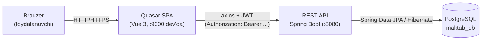
```mermaid
flowchart LR
    B["Brauzer\n(foydalanuvchi)"] -->|HTTP/HTTPS| S["Quasar SPA\n(Vue 3, :9000 dev'da)"]
    S -->|"axios + JWT\n(Authorization: Bearer ...)"| A["REST API\nSpring Boot (:8080)"]
    A -->|"Spring Data JPA / Hibernate"| DB[("PostgreSQL\nmaktab_db")]
```

**Brauzer → Quasar SPA**: foydalanuvchi bitta HTML sahifani (SPA — Single Page Application, "bitta sahifali ilova": qayta yuklanmasdan, JavaScript orqali ichki navigatsiya qiladigan sayt) oladi, keyingi barcha navigatsiya (masalan "Xonalar" ga o'tish) sahifa qayta yuklanmasdan, Vue Router orqali bo'ladi.

**SPA → REST API**: har bir ma'lumot kerak bo'lganda (jadval ochilganda, forma saqlanganda) frontend `axios` orqali backend'ga alohida HTTP so'rov yuboradi (REST — **Re**presentational **S**tate **T**ransfer, ya'ni har bir resurs — masalan "bitta o'quvchi" — o'z URL'iga ega, va GET/POST/PUT/DELETE HTTP metodlari orqali boshqariladi). Har bir so'rovga JWT token qo'shiladi — kim so'rov yuboryapti, backend shundan biladi.

**API → PostgreSQL**: backend Hibernate (JPA — **J**ava **P**ersistence **A**PI, Java klasslarini baza jadvaliga moslashtirish standarti — ning eng ko'p qo'llaniladigan implementatsiyasi) orqali SQL so'rovlarini avtomatik generatsiya qilib, PostgreSQL'ga yuboradi.

## Backend qatlamlari

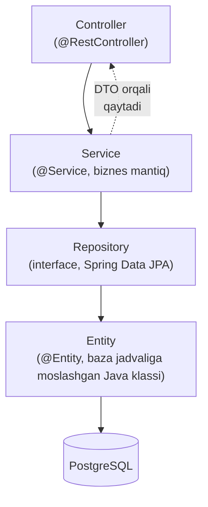
```mermaid
flowchart TD
    C["Controller\n(@RestController)"] --> Sv["Service\n(@Service, biznes mantiq)"]
    Sv --> R["Repository\n(interface, Spring Data JPA)"]
    R --> E["Entity\n(@Entity, baza jadvaliga moslashgan Java klassi)"]
    E --> DB[("PostgreSQL")]
    Sv -.->|"DTO orqali\nqaytadi"| C
```

Loyiha to'rt qatlamga bo'lingan, har birining aniq bitta vazifasi bor:

| Qatlam | Vazifasi | Loyihada |
|---|---|---|
| **Controller** | HTTP so'rovni qabul qiladi, URL/parametrlarni o'qiydi, kimga ruxsat borligini tekshiradi (`@PreAuthorize`), Service'ga uzatadi | `controller/*.java`, 20 ta fayl |
| **Service** | Biznes mantiq: qoidalarni tekshiradi ("bu xona band emasmi?"), bir nechta Repository'ni birlashtiradi, Entity ↔ DTO o'girishni bajaradi, `@Transactional` bilan bir nechta saqlashni bitta amal sifatida bajaradi | `service/*.java`, 19 ta fayl |
| **Repository** | Bazaga to'g'ridan-to'g'ri murojaat: `JpaRepository`'ni kengaytiruvchi interfeys, metod nomidan yoki `@Query`dan SQL avtomatik generatsiya qilinadi | `repository/*.java`, 16 ta fayl |
| **Entity** | Baza jadvalining bevosita Java aksi (`@Entity`, `@Table`) — bitta qator = bitta obyekt | `entity/*.java`, 17 ta klass |

**Nega qatlamlarga bo'lingan?** Har biri faqat o'z ishini biladi: Controller HTTP haqida o'ylaydi, Service — biznes qoidalar haqida, Repository — SQL haqida. Masalan, agar ertaga REST o'rniga GraphQL qo'shish kerak bo'lsa, faqat Controller qatlami o'zgaradi — Service va Repository tegilmaydi. Va aksincha: agar baza PostgreSQL'dan boshqasiga almashtirilsa, Service va Controller umuman o'zgarmaydi.

**Entity to'g'ridan-to'g'ri API'ga chiqarilmaydi** — buning o'rniga DTO (**D**ata **T**ransfer **O**bject) ishlatiladi. Sababi [06-backend.md — Entity, DTO va Mapper](#entity-dto-va-mapper)da tushuntirilgan.

## Bitta so'rovning to'liq yo'li: "Davomatni saqlash"

O'qituvchi Davomat sahifasida sinfni tanlab, har bir o'quvchiga status (Keldi/Kelmadi/Kechikdi/Sababli) belgilab, **"Saqlash"** tugmasini bosganda nima bo'ladi — boshidan oxirigacha:

```mermaid
sequenceDiagram
    participant U as O'qituvchi (brauzer)
    participant FE as AttendancePage.vue
    participant API as AttendanceController
    participant Svc as AttendanceService
    participant Repo as AttendanceRepository
    participant DB as PostgreSQL

    U->>FE: "Saqlash" tugmasini bosadi
    FE->>FE: saveAttendance() — roster'ni to'playdi
    FE->>API: POST /api/attendance/bulk<br/>{lessonSlotId, recordDate, entries: [...]}
    API->>Svc: bulkMark(request)
    Svc->>Repo: findById(lessonSlotId)
    Repo->>DB: SELECT ... FROM lesson_slot WHERE id = ?
    DB-->>Svc: LessonSlot topildi
    Svc->>Repo: findByLessonSlotIdAndRecordDate(...)
    Repo->>DB: SELECT ... FROM attendance WHERE ...
    DB-->>Svc: mavjud yozuvlar (bo'lsa)
    loop har bir entry uchun
        Svc->>Svc: Student sinfga tegishliligini tekshiradi
        Svc->>Repo: save(attendance)
        Repo->>DB: INSERT yoki UPDATE attendance
    end
    Svc->>Svc: activityLogService.record(...) — "faoliyat lentasi"ga yozadi
    Svc-->>API: yangilangan roster (List&lt;AttendanceRosterEntryDto&gt;)
    API-->>FE: 200 OK + JSON
    FE-->>U: "Davomat saqlandi" (yashil notify)
```

Kod bo'yicha aniq qadamlar:

1. **Frontend** — `frontend/src/pages/AttendancePage.vue:403-419`, `saveAttendance()` funksiyasi `roster` massividagi har bir o'quvchining holatini yig'ib, bitta so'rov yuboradi:
   ```js
   await api.post('/api/attendance/bulk', {
     lessonSlotId: selectedLessonId.value,
     recordDate: selectedDate.value,
     entries: roster.value.map(r => ({
       studentId: r.studentId, status: r.status, comment: r.comment || null
     }))
   })
   ```
2. **Controller** — `AttendanceController.java:48-49` so'rovni qabul qiladi, `@Valid` orqali validatsiya qiladi, to'g'ridan-to'g'ri Service'ga uzatadi.
3. **Service** — `AttendanceService.java:113-149`, `bulkMark()`: avval `LessonSlot` mavjudligini tekshiradi, o'sha kun uchun mavjud yozuvlarni xaritaga (`Map<Long, Attendance>`) yig'adi (qayta yozilmasdan yangilanishi uchun), keyin har bir o'quvchi uchun yangi yozuv yaratadi yoki mavjudini yangilaydi, `@Transactional` tufayli **hammasi birga saqlanadi yoki hech biri saqlanmaydi** (agar o'rtada xato chiqsa).
4. **Repository** — `attendanceRepository.save(attendance)` — Spring Data JPA buni avtomatik `INSERT INTO attendance (...)` yoki `UPDATE attendance SET ... WHERE id = ?`ga aylantiradi (`id` mavjudmi yo'qmi shunga qarab).
5. Saqlangandan so'ng, `ActivityLogService.record(...)` chaqiriladi — bu Dashboard'dagi "So'nggi harakatlar" lentasiga yozuv qo'shadi.
6. Service `getRoster(...)`ni qayta chaqirib, yangilangan ro'yxatni qaytaradi — frontend shu javobni ko'rsatadi.

## Ko'p maktablilik (multi-school) qanday ishlaydi

Tizim bitta baza ichida bir nechta maktabga xizmat qiladi. Buning uchun alohida "tenant" jadvali yoki sxema ishlatilmaydi — oddiyroq yechim: **har bir asosiy jadval `school_id`ga (to'g'ridan-to'g'ri yoki bog'lanish zanjiri orqali) ega**, va har bir so'rov shu bo'yicha filtrlanadi.

Ikki xil holat bor:

1. **To'g'ridan-to'g'ri bog'lanish**: `Building`, `AcademicYear`, `Subject`, `Employee`, `Announcement`, `CalendarEvent`, `ActivityLog` — bularning har birida bevosita `school_id` ustuni bor (`@ManyToOne School school`).
2. **Zanjir orqali bog'lanish**: `Room` → `Building` → `School`; `SchoolClass` → `AcademicYear` → `School`; `Student`, `LessonSlot` → `SchoolClass` → ... → `School`; `Attendance`, `Grade` → yana chuqurroq zanjir orqali.

Repository darajasida bu JPQL'da relation path (bog'lanish yo'li) sifatida yoziladi — masalan, `Attendance` uchun eng uzun zanjir:

```java
// AttendanceRepository.java
@Query("select a from Attendance a where a.lessonSlot.schoolClass.academicYear.school.id = :schoolId")
Page<Attendance> findBySchoolId(@Param("schoolId") Long schoolId, Pageable pageable);
```

Bu yerda `a.lessonSlot.schoolClass.academicYear.school.id` — Hibernate buni avtomatik SQL `JOIN`larga aylantiradi (`attendance` → `lesson_slot` → `school_class` → `academic_year` → `school`).

**Frontend tomonda**: joriy tanlangan maktab `schoolStore.activeSchoolId`da (Pinia store, `localStorage`da ham saqlanadi) turadi. `CrudPage.vue`dagi har bir so'rov (`fetchRows()`, `fetchAllForSearch()`) va forma yuborilganda (agar modul `schoolScoped: true` bo'lsa) `schoolId` parametri avtomatik qo'shiladi — modul konfiguratsiyasida buni har safar qo'lda yozish shart emas (batafsil: [08-frontend.md](#08--frontend)).

`Position` va `Room`(turi bo'yicha filtrlar) kabi ba'zi modullar `schoolScoped: false` — chunki lavozimlar barcha maktablar uchun umumiy ro'yxat.

---

# 03 — Texnologiyalar

**Mundarija**
- [Texnologiyalar jadvali](#texnologiyalar-jadvali)
- [Backend texnologiyalari batafsil](#backend-texnologiyalari-batafsil)
- [Frontend texnologiyalari batafsil](#frontend-texnologiyalari-batafsil)
- [Baza](#baza)
- [Dev vositalari](#dev-vositalari)

## Texnologiyalar jadvali

Versiyalar `build.gradle` va `frontend/package.json`dan olingan (aniq versiya ko'rsatilmagan joyda Spring Boot BOM — **B**ill **O**f **M**aterials, ya'ni Spring Boot o'zi mos versiyani tanlaydi — orqali boshqarilishi bildiriladi).

### Backend

| Nomi | Versiyasi | Vazifasi |
|---|---|---|
| Java | 21 | Dasturlash tili (`build.gradle`, `toolchain.languageVersion`) |
| Spring Boot | 4.1.0 | Asosiy freymvork (`build.gradle`, plugin versiyasi) |
| Spring Web (`spring-boot-starter-webmvc`) | Spring Boot bilan boshqariladi | REST API qatlami |
| Spring Data JPA | Spring Boot bilan boshqariladi | Baza bilan ishlash (Hibernate ustida) |
| Spring Security | Spring Boot bilan boshqariladi | Autentifikatsiya/avtorizatsiya |
| Spring Boot Validation | Spring Boot bilan boshqariladi | `@Valid`, Bean Validation |
| jjwt (`jjwt-api`, `jjwt-impl`, `jjwt-jackson`) | 0.12.5 | JWT token yaratish/tekshirish |
| Lombok | Spring Boot bilan boshqariladi (`compileOnly`) | Boilerplate kodni qisqartirish (loyihada minimal ishlatilgan) |
| PostgreSQL JDBC drayveri | Spring Boot BOM bilan boshqariladi (`runtimeOnly`) | Bazaga ulanish |
| Gradle | 9.5.1 (wrapper) | Build vositasi |
| JUnit 5 + Mockito | `spring-boot-starter-test` orqali | Backend testlari |
| SLF4J + Logback | Spring Boot bilan birga keladi (alohida qo'shilmagan) | Loglash |

**Loyihada YO'Q, shuning uchun tilga olinmaydi:** MapStruct, Flyway, Liquibase, springdoc/Swagger, Maven. (Bular haqida nega yo'qligi va kelajakda qo'shish mumkinligi: [14-kelajak-rejalari.md](#14--kelajak-rejalari).)

### Frontend

| Nomi | Versiyasi | Vazifasi |
|---|---|---|
| Vue | 3.5.22 | UI freymvork |
| Quasar | 2.32.3 | Komponentlar kutubxonasi + build tizimi |
| @quasar/app-vite | 3.8.4 | Quasar'ning Vite asosidagi build vositasi |
| Vue Router | 5.0.6 | Sahifalar orasida navigatsiya |
| Pinia | 4.0.3 | Global holat (state) boshqaruvi |
| axios | 1.20.0 | HTTP so'rovlar |
| chart.js + vue-chartjs | 4.5.1 / 5.3.4 | Grafiklar (chiziqli, ustunli) |
| @fontsource/inter | 5.3.0 | Inter shrifti (o'zi joylashtirilgan, tashqi CDN'ga bog'liq emas) |
| @quasar/extras | 2.1.0 | Material Icons shrift-ikonkalari |

**Loyihada YO'Q:** TypeScript, vue-i18n (bitta til — o'zbekcha — qattiq yozilgan), PWA plagini, Vuex (Pinia ishlatiladi).

### Baza

| Nomi | Vazifasi |
|---|---|
| PostgreSQL | Asosiy (va yagona) ma'lumotlar bazasi (`application.properties`dagi `spring.datasource.url`dan aniqlandi) |

### Dev vositalari

| Nomi | Versiyasi | Vazifasi |
|---|---|---|
| oxfmt | ^0.x | Frontend kod formatlash (`npm run lint`) |
| oxlint | ^1.x | Frontend statik tahlil (linter) |
| Playwright | (loyiha `package.json`ida yo'q — tashqi/global vosita) | Ishlab chiqish jarayonida UI'ni qo'lda tekshirish uchun ishlatiladi, loyihaning rasmiy test freymvorki emas |

**Muhim eslatma:** frontend'da ESLint/Prettier o'rniga **oxlint/oxfmt** ishlatiladi — bu ancha yangi, Rust'da yozilgan, tezroq muqobil vositalar. Frontend'da rasmiy avtomatlashtirilgan test fayllari (`.spec.js`/`.test.js`) mavjud emas — sifat nazorati lint + `quasar build` (Vite orqali kompilyatsiya xatolarini ushlaydi) + qo'lda/Playwright orqali tekshirish bilan ta'minlanadi.

---

## Backend texnologiyalari batafsil

### Java 21

**Bu nima?** Java — 1995-yildan buyon ishlatilib kelinayotgan, "bir marta yoz, hamma joyda ishlat" tamoyilidagi dasturlash tili. 21-versiya — 2023-yil sentyabrida chiqqan, uzoq muddat qo'llab-quvvatlanadigan (LTS — **L**ong **T**erm **S**upport) versiya.

**Nega aynan shu tanlangan?** Spring Boot 4.x'ning minimal talabi Java 17+, lekin Java 21 LTS bo'lgani va yangi til imkoniyatlarini (masalan, `record`, pattern matching) berganligi uchun tanlangan — muqobili Java 17 (oldingi LTS) bo'lardi, lekin yangi loyiha uchun eng so'nggi LTS tanlash odatiy amaliyot.

**Loyihada qayerda?** `build.gradle`:
```gradle
java {
    toolchain {
        languageVersion = JavaLanguageVersion.of(21)
    }
}
```

### Spring Boot 4.1.0

**Bu nima?** Spring Boot — Java'da veb-ilova yozishni osonlashtiruvchi "konfiguratsiyadan ko'ra konventsiya" (convention over configuration) freymvorki. Oddiy tilda: agar siz "standart" qoidalarga rioya qilsangiz (masalan, klassni `@RestController` deb belgilasangiz), Spring Boot avtomatik hamma narsani (server, routing, dependency injection) sozlab qo'yadi — sizga faqat biznes mantiqni yozish qoladi.

**Nega aynan shu tanlangan?** Java ekotizimida veb-API yozish uchun eng keng tarqalgan, eng ko'p hujjatlashtirilgan freymvork. Muqobillari: Quarkus, Micronaut (ikkalasi ham tezroq ishga tushadi, lekin Spring'ga qaraganda kichikroq community va kamroq o'quv materiali bor — o'rganayotgan dasturchi uchun Spring Boot afzalroq).

**Loyihada qayerda?** Har bir `@RestController`, `@Service`, `@Repository`, `@Entity` — bularning barchasi Spring Boot'ning "component scanning" (avtomatik topib, boshqarish) mexanizmi orqali ishlaydi. Boshlanish nuqtasi:
```java
// MaktabBoshqaruvApplication.java
@SpringBootApplication
@EnableJpaAuditing
public class MaktabBoshqaruvApplication {
    public static void main(String[] args) {
        SpringApplication.run(MaktabBoshqaruvApplication.class, args);
    }
}
```

### Spring Web (REST)

**Bu nima?** Spring'ning HTTP so'rovlarni qabul qilish/javob qaytarish qismi. `@RestController`, `@GetMapping`, `@RequestParam` kabi annotatsiyalar shu moduldan.

**Nega aynan shu?** Spring Boot ekotizimining tabiiy qismi — alohida tanlov emas, Spring Boot'ni tanlash bilan birga keladi.

**Loyihada qayerda?** Har bir `controller/*.java` fayli. Masalan:
```java
// BuildingController.java
@GetMapping("/{id}")
public ResponseEntity<BuildingResponseDto> getBuildingById(@PathVariable Long id) {
    return ResponseEntity.ok(buildingService.getBuildingById(id));
}
```

### Spring Data JPA + Hibernate

**Bu nima?** JPA — Java obyektlari va baza jadvallarini bog'lash uchun standart interfeys (spetsifikatsiya). Hibernate — shu standartning eng mashhur implementatsiyasi (haqiqiy SQL generatsiya qiluvchi kutubxona). Spring Data JPA esa Hibernate ustiga qo'shimcha qatlam: repository interfeyslarini yozsangiz bo'ldi, metod tanasini (SQL so'rovini) o'zi generatsiya qiladi.

**Hayotiy o'xshatish:** JPA — bu "tarjimon". Siz Java tilida gapirasiz ("bu Student obyektini saqla"), Hibernate buni SQL tiliga tarjima qilib bazaga yetkazadi.

**Nega aynan shu?** Spring ekotizimida bazaviy standart, katta community. Muqobili: MyBatis (SQL'ni qo'lda yozishga ko'proq erkinlik beradi, lekin ko'proq boilerplate) yoki jOOQ. SQL'ni yaxshi biladigan dasturchi uchun muhim farq: JPA/Hibernate'da siz ko'pincha SQL yozmaysiz, buning o'rniga Java metod nomlari yoki JPQL (Java Persistence Query Language — SQL'ga o'xshash, lekin jadval emas, Entity klass nomlari bilan yoziladigan so'rov tili) yozasiz.

**Loyihada qayerda?** Har bir `repository/*.java` interfeysi:
```java
// AttendanceRepository.java
public interface AttendanceRepository extends JpaRepository<Attendance, Long> {
    List<Attendance> findByLessonSlotIdAndRecordDate(Long lessonSlotId, LocalDate recordDate);
}
```
Bu bitta qator kod ortida to'liq SQL turadi — batafsil: [05-malumotlar-bazasi.md](#05--malumotlar-bazasi).

### Spring Security

**Bu nima?** Kim tizimga kira olishi (autentifikatsiya) va kirgandan keyin nima qila olishi (avtorizatsiya) ni boshqaruvchi modul.

**Nega aynan shu?** Spring ekotizimida standart tanlov, JWT bilan ham, sessiya bilan ham ishlay oladi. Bu loyihada **stateless** (holatsiz — server hech qanday sessiya saqlamaydi, har bir so'rov o'zi bilan token olib keladi) rejimda, JWT bilan ishlatilgan.

**Loyihada qayerda?** `config/SecurityConfig.java`, `config/JwtAuthFilter.java`. Batafsil: [06-backend.md — Xavfsizlik](#xavfsizlik).

### JWT (jjwt kutubxonasi)

**Bu nima?** JWT (**J**SON **W**eb **T**oken) — foydalanuvchi haqidagi ma'lumotni (kim, qaysi rol) o'z ichiga olgan, raqamli imzo bilan "muhrlangan" matn bo'lagi. Server bu tokenni har safar qayta tekshiradi, lekin uni **saqlamaydi** — shuning uchun "stateless".

**Hayotiy o'xshatish:** Bu — muhrlangan konsert chiptasiga o'xshaydi. Chipta o'zida "kim", "qaysi joy" degan ma'lumotni tashiydi, va nazoratchi faqat muhrni (imzoni) tekshiradi — qaysidir ro'yxatga qarab tekshirmaydi.

**Nega aynan shu?** Muqobili — server-side sessiya (session-based auth), lekin bu holda server har bir foydalanuvchi uchun holatni saqlashi kerak bo'ladi (ko'proq xotira, gorizontal masshtablashni qiyinlashtiradi). JWT — zamonaviy SPA + REST API arxitekturasi uchun standart yechim.

**Loyihada qayerda?** `util/JwtUtil.java` — token yaratadi va tekshiradi; `config/JwtAuthFilter.java` — har bir so'rovda `Authorization` headerini o'qiydi. Batafsil: [06-backend.md](#jwt-yaratish-va-tekshirish).

### Bean Validation (`@Valid`, `@NotBlank`, `@Min`/`@Max`)

**Bu nima?** Java klassining maydonlariga (masalan DTO'ga) "qoida" yozib qo'yish imkonini beruvchi standart (masalan `@NotBlank` — bo'sh bo'lmasin, `@Min(2)` — 2 dan kichik bo'lmasin). Controller'da `@Valid` deb belgilansa, Spring bu qoidalarni so'rov kelishi bilan avtomatik tekshiradi.

**Nega aynan shu?** Har bir Service metodida qo'lda `if (name == null) throw ...` yozishdan ko'ra, deklarativ (qoidani to'g'ridan-to'g'ri maydon ustida yozish) usul — kamroq kod, kamroq xato.

**Loyihada qayerda?** Masalan, `GradeRequestDto.java`:
```java
@Min(value = 2, message = "Baho 2 dan kam bo'lmasligi kerak")
@Max(value = 5, message = "Baho 5 dan katta bo'lmasligi kerak")
private Integer score;
```

### Lombok

**Bu nima?** Getter/setter/konstruktor kabi "takrorlanuvchi" kodni annotatsiya orqali avtomatik generatsiya qiluvchi kutubxona (kompilyatsiya vaqtida).

**Nega aynan shu?** `build.gradle`da bor, lekin loyiha kodida Entity/DTO klasslarining aksariyati getter/setter'larni **qo'lda** yozgan (Lombok'siz) — shuning uchun bu "mavjud, lekin minimal ishlatilgan" kutubxona sifatida hisoblanadi. Kelajakda yangi DTO/Entity yozganda `@Getter`/`@Setter`/`@Data` bilan kodni qisqartirish mumkin.

### Gradle

**Bu nima?** Loyihani build qilish (kompilyatsiya, testlarni ishga tushirish, jar yig'ish) va kutubxona bog'liqliklarini (dependency) boshqarish vositasi.

**Nega aynan shu?** Muqobili — Maven (XML asosida, ko'proq "boilerplate"). Gradle Groovy/Kotlin DSL asosida, qisqaroq va moslashuvchan konfiguratsiya beradi. Loyiha Gradle Wrapper (`gradlew`/`gradlew.bat`) bilan birga keladi — Gradle'ni alohida o'rnatish shart emas.

---

## Frontend texnologiyalari batafsil

### Vue 3

**Bu nima?** Vue — foydalanuvchi interfeysini "komponent"lar (mustaqil, qayta ishlatiladigan UI bo'laklari) orqali quruvchi JavaScript freymvorki. Vue 3'da `<script setup>` sintaksisi ishlatiladi — bu Composition API'ning eng qisqa yozilishi.

**Hayotiy o'xshatish:** Har bir Vue komponenti — LEGO bo'lagiga o'xshaydi: o'zining ko'rinishi (`<template>`), mantig'i (`<script>`) va stili (`<style>`) bor, va ularni birlashtirib katta sahifa yasaysiz.

**Nega aynan shu?** Muqobillari React va Angular. Vue — o'rganish egri chizig'i (learning curve) pastroq, HTML'ga yaqinroq sintaksis (React'ning JSX'iga qaraganda), va Quasar aynan Vue ustida qurilgan bo'lgani uchun tabiiy tanlov.

**Loyihada qayerda?** Har bir `.vue` fayl. Masalan, `frontend/src/pages/DashboardPage.vue`da `<script setup>`:
```vue
<script setup>
import { ref, computed, onMounted } from 'vue'
const loading = ref(true)          // reaktiv o'zgaruvchi
const summary = computed(() => ...) // hisoblanadigan qiymat
onMounted(loadAll)                  // komponent ekranga chiqqanda ishga tushadi
</script>
```
Vue asoslari (component, props, emit, ref/computed, lifecycle) — [08-frontend.md](#08--frontend)da loyihadagi haqiqiy misollar bilan tushuntirilgan.

### Quasar 2

**Bu nima?** Vue ustiga qurilgan, tayyor UI komponentlar to'plami (tugma, jadval, forma, dialog va h.k. — barchasi Material Design uslubida) + build tizimi (`@quasar/app-vite`).

**Hayotiy o'xshatish:** Agar Vue — g'isht bo'lsa, Quasar — tayyor devor bloklari to'plami: tugma, jadval, dialog kabi elementlarni noldan yasash shart emas.

**Nega aynan shu?** Muqobillari — Vuetify, PrimeVue. Quasar tanlangan sabab: bitta kod bazasidan SPA, PWA, mobil va desktop ilova yasash imkonini beradi (hozircha loyihada faqat SPA rejimi ishlatiladi), va o'zining Vite asosidagi build vositasi tez.

**Loyihada qayerda?** `quasar.config.js` — asosiy sozlama (routing rejimi `hash`, plaginlar `Notify`/`Dialog`/`LoadingBar`, ikonka to'plami `material-icons`). Har bir sahifada `q-card`, `q-table`, `q-btn`, `q-dialog` kabi komponentlar.

### Vue Router 5

**Bu nima?** URL manzil (`/attendance`, `/app/rooms`) bilan qaysi Vue komponent ko'rsatilishini bog'lovchi kutubxona.

**Nega aynan shu?** Vue ekotizimining rasmiy routerchisi — alternativasi yo'q darajada standart tanlov.

**Loyihada qayerda?** `frontend/src/router/routes.js` — barcha yo'llar ro'yxati; `frontend/src/router/index.js` — himoyalangan sahifalar uchun **global guard** (`Router.beforeEach`):
```js
Router.beforeEach(to => {
  const authStore = useAuthStore()
  if (!authStore.isAuthenticated && to.path !== '/login') {
    return '/login'   // token yo'q — login sahifasiga qaytaradi
  }
  ...
})
```
Batafsil: [08-frontend.md — Router va himoyalangan sahifalar](#router-va-himoyalangan-sahifalar).

### Pinia

**Bu nima?** Vue ilovasi uchun global holat (state) ombori — turli komponentlar orasida umumiy ma'lumotni (masalan, "kim tizimga kirgan", "qaysi maktab tanlangan") saqlash uchun.

**Hayotiy o'xshatish:** Agar har bir komponent — alohida xona bo'lsa, Pinia store — barcha xonalar kira oladigan umumiy shkaf.

**Nega aynan shu?** Vue 3'ning rasmiy tavsiya qilingan store kutubxonasi (eski Vuex'ning o'rnini bosgan) — qisqaroq sintaksis, TypeScript bilan yaxshiroq ishlaydi (bu loyihada TS ishlatilmasa ham).

**Loyihada qayerda?** `frontend/src/stores/auth.js` (token, username, role, employeeId) va `frontend/src/stores/school.js` (tanlangan maktab). Batafsil: [08-frontend.md — Store](#store-pinia).

### axios

**Bu nima?** Brauzerdan HTTP so'rov yuborish uchun kutubxona (brauzerning o'ziga xos `fetch()` funksiyasiga muqobil, lekin qulayroq API bilan).

**Nega aynan shu?** `fetch()`ga nisbatan afzalligi: so'rov/javobni avtomatik JSON qilib beradi, va **interceptor** (har bir so'rov/javobni "ushlab qolib" o'zgartirish imkoni) mexanizmi tayyor holda bor — bu loyihada token qo'shish va 401 xatoni ushlash uchun aynan shu ishlatilgan.

**Loyihada qayerda?** `frontend/src/boot/axios.js` — batafsil: [08-frontend.md — axios va interceptor'lar](#axios-sozlamalari-va-interceptorlar).

### Chart.js + vue-chartjs

**Bu nima?** Chart.js — HTML `<canvas>` ustida grafik chizuvchi JavaScript kutubxonasi; vue-chartjs — uni Vue komponenti sifatida ishlatish uchun "o'rovchi" (wrapper).

**Nega aynan shu?** Yengil, keng tarqalgan, ko'p turdagi grafiklarni (chiziqli, ustunli) qo'llab-quvvatlaydi. Dashboard'dagi "Oxirgi 30 kunlik davomat" (chiziqli) va "Fanlar bo'yicha o'rtacha baho" (gorizontal ustunli) grafiklari shu orqali chizilgan.

**Loyihada qayerda?** `frontend/src/pages/DashboardPage.vue`:
```js
import { Bar, Line } from 'vue-chartjs'
import { Chart as ChartJS, ... } from 'chart.js'
```

---

## Baza

### PostgreSQL

**Bu nima?** Ochiq manbali (open-source), relyatsion (jadval-ustun-qator asosidagi) ma'lumotlar bazasi boshqaruv tizimi.

**Nega aynan shu?** Muqobillari MySQL, MariaDB. PostgreSQL tanlangan sabab (kod/config'dan ko'rinmaydi, lekin umumiy amaliyot): kuchli JOIN va agregatsiya imkoniyatlari, standart SQL'ga yaqinroq rioya qilishi — bu loyihada ko'p qatlamli JOIN so'rovlar (masalan `attendance` → `lesson_slot` → `school_class` → `academic_year` → `school`) ko'p ishlatilgani uchun muhim.

**Loyihada qayerda?** `application.properties`:
```properties
spring.datasource.url=${DB_URL:jdbc:postgresql://localhost:5432/maktab_db}
```

---

# 04 — Papkalar tuzilishi

**Mundarija**
- [Backend papka daraxti](#backend-papka-daraxti)
- [Frontend papka daraxti](#frontend-papka-daraxti)

## Backend papka daraxti

```
src/
├── main/
│   ├── java/uz/azizbek/maktabboshqaruv/
│   │   ├── MaktabBoshqaruvApplication.java   # kirish nuqtasi (main metod)
│   │   ├── config/            (5 fayl)       # Spring konfiguratsiyasi + seed data
│   │   ├── controller/        (20 fayl)      # HTTP endpoint'lar
│   │   ├── dto/                (54 fayl)     # Request/Response obyektlari
│   │   ├── entity/             (25 fayl)     # 17 @Entity klass + 8 enum
│   │   ├── exception/           (1 fayl)     # Global xato ushlagich
│   │   ├── repository/        (17 fayl)      # Spring Data JPA interfeyslari
│   │   ├── service/            (19 fayl)     # Biznes mantiq
│   │   └── util/                (1 fayl)     # JwtUtil
│   └── resources/
│       ├── application.properties            # Asosiy sozlamalar (maxfiy qiymatlarsiz)
│       ├── application-local.properties.example  # Lokal maxfiy sozlamalar shabloni
│       └── application-local.properties      # (gitignore'da) DB paroli, JWT secret — "local" profil
└── test/
    └── java/uz/azizbek/maktabboshqaruv/
        ├── MaktabBoshqaruvApplicationTests.java  # kontekst yuklanish testi
        ├── service/            (10 fayl)         # Service-qatlam testlari (Mockito)
        └── util/                (1 fayl)         # JwtUtilTest
```

### `config/` — nega alohida papka

Odatda Spring loyihalarida xavfsizlik sozlamalari `security/` papkasida bo'ladi, lekin bu loyihada hammasi `config/`ga jamlangan — kichik loyiha uchun ortiqcha bo'linishdan qochish maqsadida:

| Fayl | Vazifasi |
|---|---|
| `SecurityConfig.java` | Spring Security filter zanjiri, CORS, parol hash algoritmi |
| `JwtAuthFilter.java` | Har bir so'rovda JWT tokenni tekshiruvchi filter |
| `AdminSeeder.java` | Birinchi ishga tushirishda ADMIN foydalanuvchi yaratadi (`@Order(1)`) |
| `DataSeeder.java` | Namunaviy maktab/bino/xona/xodim/sinf/o'quvchi/jadval ma'lumotlarini yaratadi (`@Order(2)`) |
| `OperationalDataSeeder.java` | Davomat/baho/e'lon/tadbir kabi "operatsion" namunaviy ma'lumotlarni yaratadi, `ustoz1`/`ustoz2` akkauntlarini o'qituvchiga bog'laydi (`@Order(3)`) |

### `controller/` — har biri bitta resursga mos

20 ta controller, deyarli har biri bitta Entity guruhiga mos keladi (`SchoolController`, `BuildingController`, `RoomController`, ...). Bundan tashqari maxsus vazifali controller'lar:

| Fayl | Vazifasi |
|---|---|
| `AuthController.java` | Login, parol hash olish (`/api/auth/**`) |
| `DashboardController.java` | Bosh sahifa uchun statistik/agregatsiya endpoint'lari |
| `ProfileController.java` | O'quvchi/o'qituvchi/sinf profil sahifalari uchun to'plangan ma'lumot |
| `HealthController.java` | Autentifikatsiyasiz "tirikmi" tekshiruvi |

### `dto/` — nega 54 ta fayl

Har bir Entity uchun odatda ikkita DTO bor: `XxxRequestDto` (yaratish/yangilash uchun kiruvchi ma'lumot) va `XxxResponseDto` (chiquvchi, tekis/flat qilingan ma'lumot). Bundan tashqari, Dashboard va profil sahifalari uchun maxsus, bir nechta Entity'dan yig'ilgan "agregat" DTO'lar bor (`DashboardOverviewDto`, `ClassProfileDto`, `TodayLessonDto` va h.k.). Nega Entity to'g'ridan-to'g'ri qaytarilmasligi: [06-backend.md — Entity, DTO va Mapper](#entity-dto-va-mapper).

### `entity/` — 17 klass + 8 enum

To'liq ro'yxat va bog'lanishlar uchun: [05-malumotlar-bazasi.md](#05--malumotlar-bazasi).

## Frontend papka daraxti

```
frontend/
├── src/
│   ├── App.vue                # ildiz komponent — dark mode'ni ishga tushiradi
│   ├── boot/                  # Quasar "boot fayllari" — ilova ishga tushishidan oldin bajariladi
│   │   ├── axios.js           # axios instance + interceptor'lar
│   │   ├── lang.js            # o'zbekcha tilni Quasar'ga o'rnatadi
│   │   └── pinia.js           # Pinia'ni ilovaga ulaydi
│   ├── components/            # qayta ishlatiladigan, sahifaga bog'liq bo'lmagan komponentlar
│   │   ├── ClassRankingCard.vue
│   │   ├── DateField.vue
│   │   └── PageLayout.vue
│   ├── config/
│   │   └── modules.js         # barcha CRUD modullarning markazlashgan konfiguratsiyasi
│   ├── css/
│   │   ├── app.scss           # global CSS token'lar (light/dark)
│   │   └── quasar.variables.scss  # Quasar rang palitrasi
│   ├── lang/
│   │   └── uz.js              # Quasar komponentlari uchun o'zbekcha tarjima
│   ├── layouts/
│   │   └── MainLayout.vue     # header + chap sidebar + sahifa konteyneri
│   ├── pages/                 # har bir marshrutga mos sahifa komponenti (12 ta)
│   ├── router/
│   │   ├── index.js           # Router obyekti + autentifikatsiya guard'i
│   │   └── routes.js          # barcha yo'llar ro'yxati
│   ├── stores/                # Pinia store'lar
│   │   ├── auth.js            # token, username, role, employeeId
│   │   └── school.js          # tanlangan maktab
│   └── utils/
│       ├── date.js            # sana formatlash yordamchilari
│       └── jwt.js             # JWT'ni brauzerda dekodlash (imzoni TEKSHIRMAYDI, faqat o'qiydi)
├── quasar.config.js            # Quasar/Vite build sozlamalari
├── package.json
└── .env / .env.example         # QCLI_API_BASE_URL (backend manzili)
```

### `pages/` — har bir sahifa

| Fayl | Marshrut | Vazifasi |
|---|---|---|
| `LoginPage.vue` | `/login` | Kirish shakli |
| `DashboardPage.vue` | `/` | Bosh sahifa: KPI kartalar, grafiklar, reyting, e'tibor talab qiladigan holatlar |
| `CrudPage.vue` | `/app/:moduleKey` | **Universal** CRUD sahifa — 14 ta modulning barchasi shu bitta komponent orqali ko'rsatiladi |
| `AttendancePage.vue` | `/attendance` | Kundalik davomat olish |
| `GradebookPage.vue` | `/gradebook` | Baholar jurnali |
| `TimetablePage.vue` | `/timetable` | Dars jadvali (jonli vaqt chizig'i, PDF) |
| `CalendarPage.vue` | `/calendar` | Tadbirlar taqvimi |
| `StudentProfilePage.vue` | `/profiles/student/:id` | Bitta o'quvchi profili |
| `TeacherProfilePage.vue` | `/profiles/teacher/:id` | Bitta o'qituvchi profili |
| `ClassProfilePage.vue` | `/profiles/class/:id` | Bitta sinf profili |
| `ErrorNotFound.vue` | `/:catchAll(.*)*` | 404 sahifa |

`CrudPage.vue`ning "universal" bo'lishi — bitta komponent `config/modules.js`dagi konfiguratsiyaga qarab 14 xil modulni (Maktablar, Binolar, Xonalar, ...) ko'rsata olishi — bu loyihaning eng muhim frontend arxitektura qarori. Batafsil: [08-frontend.md — CrudPage: universal komponent](#crudpage-universal-komponent) va [12-yangi-modul-qoshish.md](#12--yangi-modul-qoshish).

---

# 05 — Ma'lumotlar bazasi

**Mundarija**
- [ER diagramma](#er-diagramma)
- [Jadvallar batafsil](#jadvallar-batafsil)
- [Entity ↔ jadval bog'lanishi](#entity--jadval-boglanishi)
- [Migratsiyalar: bu loyihada qanday ishlaydi](#migratsiyalar-bu-loyihada-qanday-ishlaydi)
- [Seed ma'lumotlar](#seed-malumotlar)
- [JPA metodlari qanday SQL'ga aylanadi](#jpa-metodlari-qanday-sqlga-aylanadi)

## ER diagramma

*(ER — **E**ntity-**R**elationship, ya'ni "obyekt-bog'lanish" diagrammasi: jadvallar va ular orasidagi bog'lanishlarni ko'rsatadi.)*

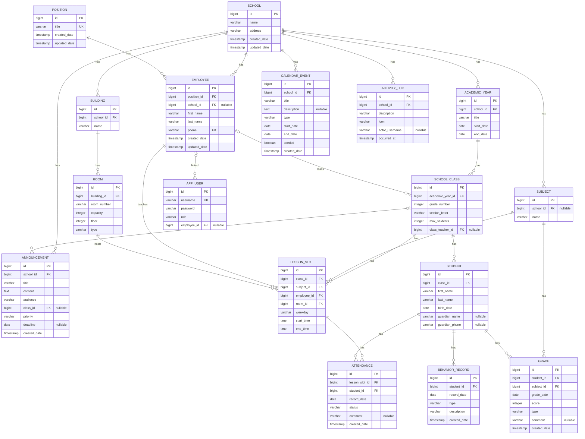
```mermaid
erDiagram
    SCHOOL ||--o{ BUILDING : has
    SCHOOL ||--o{ ACADEMIC_YEAR : has
    SCHOOL ||--o{ SUBJECT : has
    SCHOOL ||--o{ EMPLOYEE : has
    SCHOOL ||--o{ ANNOUNCEMENT : has
    SCHOOL ||--o{ CALENDAR_EVENT : has
    SCHOOL ||--o{ ACTIVITY_LOG : has
    BUILDING ||--o{ ROOM : has
    ACADEMIC_YEAR ||--o{ SCHOOL_CLASS : has
    POSITION ||--o{ EMPLOYEE : has
    EMPLOYEE |o--o{ SCHOOL_CLASS : leads
    EMPLOYEE |o--o{ APP_USER : linked
    SCHOOL_CLASS ||--o{ STUDENT : has
    SCHOOL_CLASS ||--o{ LESSON_SLOT : has
    SCHOOL_CLASS |o--o{ ANNOUNCEMENT : targets
    SUBJECT ||--o{ LESSON_SLOT : has
    SUBJECT ||--o{ GRADE : has
    EMPLOYEE ||--o{ LESSON_SLOT : teaches
    ROOM ||--o{ LESSON_SLOT : hosts
    LESSON_SLOT ||--o{ ATTENDANCE : has
    STUDENT ||--o{ ATTENDANCE : has
    STUDENT ||--o{ GRADE : has
    STUDENT ||--o{ BEHAVIOR_RECORD : has

    SCHOOL {
        bigint id PK
        varchar name
        varchar address
        timestamp created_date
        timestamp updated_date
    }
    BUILDING {
        bigint id PK
        bigint school_id FK
        varchar name
    }
    ROOM {
        bigint id PK
        bigint building_id FK
        varchar room_number
        integer capacity
        integer floor
        varchar type
    }
    ACADEMIC_YEAR {
        bigint id PK
        bigint school_id FK
        varchar title
        date start_date
        date end_date
    }
    SCHOOL_CLASS {
        bigint id PK
        bigint academic_year_id FK
        integer grade_number
        varchar section_letter
        integer max_students
        bigint class_teacher_id FK "nullable"
    }
    SUBJECT {
        bigint id PK
        bigint school_id FK "nullable"
        varchar name
    }
    POSITION {
        bigint id PK
        varchar title UK
        timestamp created_date
        timestamp updated_date
    }
    EMPLOYEE {
        bigint id PK
        bigint position_id FK
        bigint school_id FK "nullable"
        varchar first_name
        varchar last_name
        varchar phone UK
        timestamp created_date
        timestamp updated_date
    }
    STUDENT {
        bigint id PK
        bigint class_id FK
        varchar first_name
        varchar last_name
        date birth_date
        varchar guardian_name "nullable"
        varchar guardian_phone "nullable"
    }
    APP_USER {
        bigint id PK
        varchar username UK
        varchar password
        varchar role
        bigint employee_id FK "nullable"
    }
    LESSON_SLOT {
        bigint id PK
        bigint class_id FK
        bigint subject_id FK
        bigint employee_id FK
        bigint room_id FK
        varchar weekday
        time start_time
        time end_time
    }
    ATTENDANCE {
        bigint id PK
        bigint lesson_slot_id FK
        bigint student_id FK
        date record_date
        varchar status
        varchar comment "nullable"
        timestamp created_date
    }
    GRADE {
        bigint id PK
        bigint student_id FK
        bigint subject_id FK
        date grade_date
        integer score
        varchar type
        varchar comment "nullable"
        timestamp created_date
    }
    BEHAVIOR_RECORD {
        bigint id PK
        bigint student_id FK
        date record_date
        varchar type
        varchar description
        timestamp created_date
    }
    ANNOUNCEMENT {
        bigint id PK
        bigint school_id FK
        varchar title
        text content
        varchar audience
        bigint class_id FK "nullable"
        varchar priority
        date deadline "nullable"
        timestamp created_date
    }
    CALENDAR_EVENT {
        bigint id PK
        bigint school_id FK
        varchar title
        text description "nullable"
        varchar type
        date start_date
        date end_date
        boolean seeded
        timestamp created_date
    }
    ACTIVITY_LOG {
        bigint id PK
        bigint school_id FK
        varchar description
        varchar icon
        varchar actor_username "nullable"
        timestamp occurred_at
    }
```

> **Eslatma:** `EMPLOYEE ||--o{ SCHOOL_CLASS` va `EMPLOYEE ||--o{ APP_USER` bog'lanishlari amalda **ixtiyoriy** (nullable FK) — diagrammada bu `"nullable"` izohi bilan ko'rsatilgan. Mermaid'ning `erDiagram` sintaksisida ixtiyoriy ko'p-tomonlama bog'lanish uchun `|o--o{` belgisi ishlatildi.

## Jadvallar batafsil

Har bir jadval — o'zining Entity klassiga to'g'ridan-to'g'ri mos keladi (`@Table(name = "...")`). Ustun nomlari Hibernate'ning standart nomlash qoidasi bo'yicha (`camelCase` → `snake_case`) yoki `@Column(name = "...")` orqali aniq belgilangan.

### `school` — Maktablar

| Ustun | Turi | NULL? | Izoh |
|---|---|---|---|
| `id` | bigint | NOT NULL | PK, IDENTITY (auto-increment) |
| `name` | varchar | NOT NULL | Maktab nomi |
| `address` | varchar | NOT NULL | Manzil |
| `created_date` | timestamp | — | `@CreatedDate`, avtomatik to'ldiriladi |
| `updated_date` | timestamp | — | `@LastModifiedDate`, har yangilanishda avtomatik yangilanadi |

### `building` — Binolar

| Ustun | Turi | NULL? | Izoh |
|---|---|---|---|
| `id` | bigint | NOT NULL | PK |
| `school_id` | bigint | NOT NULL | FK → `school.id` |
| `name` | varchar | NOT NULL | Bino nomi |

### `room` — Xonalar

| Ustun | Turi | NULL? | Izoh |
|---|---|---|---|
| `id` | bigint | NOT NULL | PK |
| `building_id` | bigint | NOT NULL | FK → `building.id` |
| `room_number` | varchar | NOT NULL | Xona raqami |
| `capacity` | integer | NOT NULL | Sig'imi |
| `floor` | integer | NULL | Qavat (ixtiyoriy) |
| `type` | varchar | NULL | `RoomType` enum: `CLASSROOM`, `LAB`, `COMPUTER_LAB`, `GYM`, `LIBRARY`. Java tomonida standart qiymati `CLASSROOM` |

### `academic_year` — O'quv yillari

| Ustun | Turi | NULL? | Izoh |
|---|---|---|---|
| `id` | bigint | NOT NULL | PK |
| `school_id` | bigint | NOT NULL | FK → `school.id` |
| `title` | varchar | NOT NULL | Masalan "2025-2026" |
| `start_date` | date | NOT NULL | |
| `end_date` | date | NOT NULL | |

### `school_class` — Sinflar

| Ustun | Turi | NULL? | Izoh |
|---|---|---|---|
| `id` | bigint | NOT NULL | PK |
| `academic_year_id` | bigint | NOT NULL | FK → `academic_year.id` |
| `grade_number` | integer | NOT NULL | Sinf raqami (masalan 5) |
| `section_letter` | varchar | NOT NULL | Harf (masalan "A") |
| `max_students` | integer | NOT NULL | Maksimal o'quvchi soni |
| `class_teacher_id` | bigint | **NULL** | FK → `employee.id`, sinf rahbari (ixtiyoriy) |

### `subject` — Fanlar

| Ustun | Turi | NULL? | Izoh |
|---|---|---|---|
| `id` | bigint | NOT NULL | PK |
| `school_id` | bigint | **NULL** | FK → `school.id` (Entity'da `nullable=false` belgilanmagan) |
| `name` | varchar | NOT NULL | Fan nomi |

### `position` — Lavozimlar

| Ustun | Turi | NULL? | Izoh |
|---|---|---|---|
| `id` | bigint | NOT NULL | PK |
| `title` | varchar | NOT NULL, **UNIQUE** | Masalan "Fan o'qituvchisi" |
| `created_date` / `updated_date` | timestamp | — | Audit ustunlari |

### `employee` — Xodimlar

| Ustun | Turi | NULL? | Izoh |
|---|---|---|---|
| `id` | bigint | NOT NULL | PK |
| `position_id` | bigint | NOT NULL | FK → `position.id` |
| `school_id` | bigint | **NULL** | FK → `school.id` |
| `first_name` / `last_name` | varchar | NOT NULL | |
| `phone` | varchar | NOT NULL, **UNIQUE** | |
| `created_date` / `updated_date` | timestamp | — | Audit ustunlari |

### `students` — O'quvchilar

> Jadval nomi ko'plikda (`students`) — bu loyihadagi yagona shunday holat, boshqa barcha jadvallar birlikda nomlangan.

| Ustun | Turi | NULL? | Izoh |
|---|---|---|---|
| `id` | bigint | NOT NULL | PK |
| `class_id` | bigint | NOT NULL | FK → `school_class.id` |
| `first_name` / `last_name` | varchar | NOT NULL | |
| `birth_date` | date | NOT NULL | Tug'ilgan sana |
| `guardian_name` | varchar | NULL | Ota-ona F.I.Sh. (ixtiyoriy) |
| `guardian_phone` | varchar | NULL | Ota-ona telefoni (ixtiyoriy) |

### `app_user` — Foydalanuvchilar (login akkauntlari)

> Jadval nomi `app_user` (Entity klass nomi `User` — bu so'z ko'p bazalarda band/reserved bo'lgani uchun `@Table(name = "app_user")` bilan aniq belgilangan).

| Ustun | Turi | NULL? | Izoh |
|---|---|---|---|
| `id` | bigint | NOT NULL | PK |
| `username` | varchar | NOT NULL, **UNIQUE** | |
| `password` | varchar | NOT NULL | BCrypt bilan xeshlangan, hech qachon ochiq matn emas |
| `role` | varchar | NOT NULL | `Role` enum: `ADMIN`, `EDITOR`, `VIEWER` |
| `employee_id` | bigint | **NULL** | FK → `employee.id` — o'qituvchining o'z login akkaunti o'z xodim yozuviga bog'lanishi uchun (ixtiyoriy) |

### `lesson_slot` — Dars jadvali yozuvi

| Ustun | Turi | NULL? | Izoh |
|---|---|---|---|
| `id` | bigint | NOT NULL | PK |
| `class_id` | bigint | NOT NULL | FK → `school_class.id` |
| `subject_id` | bigint | NOT NULL | FK → `subject.id` |
| `employee_id` | bigint | NOT NULL | FK → `employee.id` (o'qituvchi) |
| `room_id` | bigint | NOT NULL | FK → `room.id` |
| `weekday` | varchar | NOT NULL | Matn sifatida saqlanadi: "Dushanba".."Yakshanba" (enum emas, oddiy `String`) |
| `start_time` / `end_time` | time | NOT NULL | |

### `attendance` — Davomat

| Ustun | Turi | NULL? | Izoh |
|---|---|---|---|
| `id` | bigint | NOT NULL | PK |
| `lesson_slot_id` | bigint | NOT NULL | FK → `lesson_slot.id` |
| `student_id` | bigint | NOT NULL | FK → `students.id` |
| `record_date` | date | NOT NULL | Qaysi kun uchun |
| `status` | varchar | NOT NULL | `AttendanceStatus`: `PRESENT`, `ABSENT`, `LATE`, `EXCUSED` |
| `comment` | varchar | NULL | |
| `created_date` | timestamp | — | Audit |

**Composite UNIQUE constraint**: `(lesson_slot_id, student_id, record_date)` — bitta o'quvchi, bitta dars, bitta kun uchun faqat bitta davomat yozuvi bo'lishi mumkin. Bu qoida bazaning o'zida majburlanadi (`@UniqueConstraint`), Service qatlamida ham qo'shimcha tekshiriladi (`existsByLessonSlotIdAndStudentIdAndRecordDate`).

### `grade` — Baholar

| Ustun | Turi | NULL? | Izoh |
|---|---|---|---|
| `id` | bigint | NOT NULL | PK |
| `student_id` | bigint | NOT NULL | FK → `students.id` |
| `subject_id` | bigint | NOT NULL | FK → `subject.id` |
| `grade_date` | date | NOT NULL | |
| `score` | integer | NOT NULL | 2–5 oralig'ida (`@Min`/`@Max` bilan Service darajasida tekshiriladi, bazada CHECK constraint yo'q) |
| `type` | varchar | NOT NULL | `GradeType`: `CURRENT`, `EXAM`, `QUARTERLY` |
| `comment` | varchar | NULL | |
| `created_date` | timestamp | — | Audit |

### `behavior_record` — Xulq yozuvlari

| Ustun | Turi | NULL? | Izoh |
|---|---|---|---|
| `id` | bigint | NOT NULL | PK |
| `student_id` | bigint | NOT NULL | FK → `students.id` |
| `record_date` | date | NOT NULL | |
| `type` | varchar | NOT NULL | `BehaviorType`: `REWARD`, `WARNING` |
| `description` | varchar | NOT NULL | |
| `created_date` | timestamp | — | Audit |

### `announcement` — E'lonlar

| Ustun | Turi | NULL? | Izoh |
|---|---|---|---|
| `id` | bigint | NOT NULL | PK |
| `school_id` | bigint | NOT NULL | FK → `school.id` |
| `title` | varchar | NOT NULL | |
| `content` | TEXT | NOT NULL | Uzun matn (`columnDefinition = "TEXT"`) |
| `audience` | varchar | NOT NULL | `AnnouncementAudience`: `ALL`, `TEACHERS`, `CLASS` |
| `class_id` | bigint | **NULL** | FK → `school_class.id` — faqat `audience=CLASS` bo'lganda ma'noli |
| `priority` | varchar | NOT NULL | `AnnouncementPriority`: `LOW`, `NORMAL`, `HIGH` |
| `deadline` | date | NULL | |
| `created_date` | timestamp | — | Audit |

### `calendar_event` — Tadbirlar

| Ustun | Turi | NULL? | Izoh |
|---|---|---|---|
| `id` | bigint | NOT NULL | PK |
| `school_id` | bigint | NOT NULL | FK → `school.id` |
| `title` | varchar | NOT NULL | |
| `description` | TEXT | NULL | |
| `type` | varchar | NOT NULL | `CalendarEventType`: `HOLIDAY`, `EXAM`, `PARENT_MEETING`, `VACATION`, `OTHER` |
| `start_date` / `end_date` | date | NOT NULL | |
| `seeded` | boolean | — (default `false`) | Namunaviy (seed) ma'lumot ekanini belgilaydi — qayta seed qilinganda faqat shu belgi bilan yozuvlar almashtiriladi, foydalanuvchi qo'shgan tadbirlar tegilmaydi |
| `created_date` | timestamp | — | Audit |

### `activity_log` — Faoliyat lentasi

| Ustun | Turi | NULL? | Izoh |
|---|---|---|---|
| `id` | bigint | NOT NULL | PK |
| `school_id` | bigint | NOT NULL | FK → `school.id` |
| `description` | varchar | NOT NULL | Masalan: "5-A sinfida Matematika darsidan davomat olindi" |
| `icon` | varchar | NOT NULL | Material Icons nomi (masalan `fact_check`) |
| `actor_username` | varchar | NULL | Amalni bajargan foydalanuvchi |
| `occurred_at` | timestamp | NOT NULL | Bazaviy audit maydonlaridan farqli — qo'lda `LocalDateTime.now()` bilan to'ldiriladi (`@CreatedDate` emas) |

## Entity ↔ jadval bog'lanishi

Misol — `LessonSlot` klassi to'rtta boshqa Entity bilan `@ManyToOne` orqali bog'langan:

```java
// LessonSlot.java
@Entity
@Table(name = "lesson_slot")
public class LessonSlot {
    @Id
    @GeneratedValue(strategy = GenerationType.IDENTITY)
    private Long id;

    @ManyToOne
    @JoinColumn(name = "class_id", nullable = false)
    private SchoolClass schoolClass;

    @ManyToOne
    @JoinColumn(name = "subject_id", nullable = false)
    private Subject subject;
    // ... employee, room xuddi shunday
}
```

- `@Entity` — bu klass bazadagi bitta jadvalga mos ekanini bildiradi.
- `@Table(name = "lesson_slot")` — jadval nomini aniq belgilaydi (bo'lmasa, klass nomidan avtomatik olinardi).
- `@Id` + `@GeneratedValue(strategy = GenerationType.IDENTITY)` — birlamchi kalit, qiymati bazaning o'zi tomonidan avtomatik oshiriladi (Postgres'da bu `GENERATED BY DEFAULT AS IDENTITY` yoki ketma-ketlik).
- `@ManyToOne` — "ko'p tomonidan bittaga" bog'lanish: ko'p `LessonSlot` bitta `SchoolClass`ga tegishli bo'lishi mumkin. **Diqqat**: loyihada hech qayerda `fetch = FetchType.LAZY` aniq yozilmagan — demak, barcha `@ManyToOne` bog'lanishlar Hibernate'ning standart xatti-harakati bo'yicha **EAGER** (darhol yuklanadi). Bu amaliy jihatdan `@OneToMany`ning yo'qligi (hech qaysi Entity'da teskari tomon — masalan `SchoolClass`da `List<Student> students` — e'lon qilinmagan) bilan birga N+1 muammosining oldini oladi, lekin har bir so'rovda ortiqcha JOIN degani ham (batafsil: [13-lugat.md — N+1 muammosi](#n1-muammosi)).
- `@JoinColumn(name = "class_id", nullable = false)` — qaysi ustun orqali bog'lanish, va bazada NOT NULL bo'lishi.

**Muhim arxitektura qarori: `@OneToMany` umuman ishlatilmagan.** Masalan, `SchoolClass`da `List<Student>` yo'q — "shu sinfdagi o'quvchilar" kerak bo'lganda, `StudentRepository.findBySchoolClassId(...)` chaqiriladi. Bu qasddan qilingan: teskari tomonlama bog'lanishlar (`@OneToMany`) ko'pincha kutilmagan lazy-loading muammolariga olib keladi; Repository orqali aniq so'rov yozish har doim nima yuklanayotgani ustidan to'liq nazorat beradi.

## Migratsiyalar: bu loyihada qanday ishlaydi

**Bu loyihada Flyway ham, Liquibase ham ishlatilmaydi.** Buning o'rniga `application.properties`da:

```properties
spring.jpa.hibernate.ddl-auto=update
```

**Bu nima qiladi?** Har safar ilova ishga tushganda, Hibernate barcha `@Entity` klasslarini ko'rib chiqadi va bazadagi jadvallar bilan solishtiradi: yangi Entity uchun yangi jadval yaratadi, yangi maydon uchun yangi ustun qo'shadi. **Hech qachon ustun yoki jadvalni o'chirmaydi, va mavjud ma'lumotni o'zgartirmaydi.**

**Nega bu loyiha uchun yetarli, lekin production uchun tavsiya etilmaydi?** Kichik/o'rganish loyihasi uchun qulay — yangi maydon qo'shib, ilovani qayta ishga tushirsangiz bo'ldi. Lekin real (production) muhitda xavfli, chunki:
- Ustun turi o'zgarishi (masalan `varchar(255)` → `varchar(50)`) avtomatik amalga oshmaydi yoki noto'g'ri bajarilishi mumkin.
- Jamoada ishlaganda, "kim qanday o'zgartirdi" tarixi yo'q — Flyway/Liquibase'da har bir o'zgarish alohida, versiyalangan SQL fayl.
- **Muhim amaliy chegara** (bu loyihada haqiqatda uchragan): agar allaqachon ma'lumot bilan to'lgan jadvalga yangi ustun `nullable=false` bilan qo'shilsa va bazada standart (`DEFAULT`) qiymat berilmagan bo'lsa, Postgres `ALTER TABLE ... ADD COLUMN ... NOT NULL` buyrug'ini bajara olmaydi — Hibernate buni jimgina o'tkazib yuboradi, va ustun **umuman qo'shilmay qoladi**, keyinchalik "column does not exist" xatosi chiqadi. Shuning uchun bu loyihada yangi ustun har doim `nullable` (standart) qo'shiladi, va majburiylik Java tomonida (validatsiya yoki standart qiymat) ta'minlanadi.

**Yangisini qanday qo'shish kerak (bu loyihaning amaldagi jarayoni):**
1. Yangi/o'zgargan `@Entity` klassini yozing.
2. Backend'ni qayta ishga tushiring (`./gradlew bootRun`) — Hibernate jadval/ustunni o'zi yaratadi.
3. Agar ustun **majburiy** bo'lishi kerak bo'lsa-yu jadval bo'sh bo'lmasa, `nullable=false` YOZMANG — buning o'rniga Service qatlamida standart qiymat bering yoki DTO validatsiyasida majburiy qiling.

Agar kelajakda Flyway qo'shilsa, bu haqida: [14-kelajak-rejalari.md](#14--kelajak-rejalari).

## Seed ma'lumotlar

Ilova birinchi marta (yoki bo'sh baza bilan) ishga tushirilganda, uchta `CommandLineRunner` ketma-ket ishlaydi (`@Order` bo'yicha):

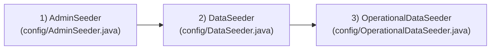
```mermaid
flowchart LR
    A["1) AdminSeeder\n(config/AdminSeeder.java)"] --> B["2) DataSeeder\n(config/DataSeeder.java)"]
    B --> C["3) OperationalDataSeeder\n(config/OperationalDataSeeder.java)"]
```

1. **`AdminSeeder`** (`@Order(1)`) — agar `app_user` jadvali bo'sh bo'lsa, `ADMIN_USERNAME`/`ADMIN_PASSWORD` (standart: `admin`/`admin123`) bilan birinchi ADMIN foydalanuvchini yaratadi.
2. **`DataSeeder`** (`@Order(2)`, 738 qator) — har bir maktab uchun (agar hali sinflari yo'q bo'lsa) to'liq, o'zaro bog'liq namunaviy ma'lumot to'plamini yaratadi: binolar, xonalar, lavozimlar, xodimlar, o'quv yili, sinflar, o'quvchilar, haftalik dars jadvali. Shuningdek qo'shimcha login akkauntlar yaratadi: `direktor`/`direktor123` (`EDITOR`), `ustoz1`/`ustoz123` va `ustoz2`/`ustoz123` (dastlab `VIEWER`).
3. **`OperationalDataSeeder`** (`@Order(3)`, 587 qator) — davomat, baho, e'lon, tadbir, faoliyat lentasi kabi "operatsion" (kundalik ishlatiladigan) ma'lumotlarni to'ldiradi, va `ustoz1`/`ustoz2` akkauntlarini `EDITOR` roliga ko'tarib, ularni tegishli `Employee` yozuviga bog'laydi (shu orqali "faqat mening darslarim" filtri ishlaydi).

Har biri **xavfsiz qayta ishga tushiriladigan** (idempotent): agar ma'lumot allaqachon mavjud bo'lsa, qayta yaratmaydi — shuning uchun seederlarni doim yoqiq qoldirish mumkin, ular ishga tushirishning odatiy qismi, alohida "seed" buyrug'i yo'q.

**Qayta ishga tushirish:** oddiy `./gradlew bootRun` — agar baza bo'sh bo'lsa, hammasi yangidan yaratiladi; to'la bo'lsa, seederlar hech narsa qilmaydi (loglarda "allaqachon mavjud, o'tkazib yuborildi" deb yoziladi).

## JPA metodlari qanday SQL'ga aylanadi

SQL'ni yaxshi biladigan dasturchi uchun eng foydali qism — Spring Data JPA ikki xil usulda so'rov yaratadi:

### 1-misol: metod nomidan avtomatik SQL

```java
// AttendanceRepository.java
List<Attendance> findByLessonSlotIdAndRecordDate(Long lessonSlotId, LocalDate recordDate);
```

Spring Data metod nomini **parslaydi** (`findBy` + `LessonSlotId` + `And` + `RecordDate`) va quyidagi SQL'ga aylantiradi:

```sql
SELECT * FROM attendance
WHERE lesson_slot_id = ? AND record_date = ?
```

Hech qanday `@Query` yozish shart emas — metod imzosi (nomi) o'zi so'rov.

### 2-misol: JPQL orqali agregatsiya (`@Query`)

```java
// GradeRepository.java
@Query("select sc.id as classId, avg(g.score) as avgScore from Grade g join g.student.schoolClass sc " +
        "where sc.academicYear.school.id = :schoolId and g.gradeDate between :from and :to group by sc.id")
List<Object[]> averageScoreByClassBetween(@Param("schoolId") Long schoolId,
                                            @Param("from") LocalDate from, @Param("to") LocalDate to);
```

JPQL — SQL'ga juda o'xshash, lekin jadval/ustun nomlari o'rniga **Entity klass va maydon nomlari** ishlatiladi (`Grade g`, `g.score`, `g.student.schoolClass`). Hibernate buni haqiqiy SQL'ga aylantiradi (soddalashtirilgan):

```sql
SELECT sc.id, AVG(g.score)
FROM grade g
JOIN students s ON s.id = g.student_id
JOIN school_class sc ON sc.id = s.class_id
JOIN academic_year ay ON ay.id = sc.academic_year_id
WHERE ay.school_id = ? AND g.grade_date BETWEEN ? AND ?
GROUP BY sc.id
```

E'tibor bering: JPQL'dagi `g.student.schoolClass` — ikkita Java maydon zanjiri (`Grade.student` → `Student.schoolClass`) — SQL'da ikkita `JOIN`ga aylanadi, va Java tomonida `sc.academicYear.school.id` yozilsa, yana ikkita qo'shimcha `JOIN` (`academic_year`, `school`) hosil bo'ladi. Bu — ko'p maktablilik filtri (`school_id`) qanday ishlashining texnik asosi ([02-arxitektura.md](#kop-maktablilik-multi-school-qanday-ishlaydi)).

### 3-misol: `Pageable` orqali sahifalash

```java
@Query("select r from Room r where r.building.school.id = :schoolId " +
        "and (:buildingId is null or r.building.id = :buildingId) " +
        "and (:type is null or r.type = :type)")
Page<Room> findFiltered(@Param("schoolId") Long schoolId, @Param("buildingId") Long buildingId,
                         @Param("type") RoomType type, Pageable pageable);
```

`Pageable` parametri (Controller'dan `?page=0&size=20&sort=name,asc` orqali avtomatik to'ldiriladi) Hibernate tomonidan SQL'ning `LIMIT`/`OFFSET`/`ORDER BY` qismlariga aylantiriladi, va natija oddiy ro'yxat emas, balki `Page<Room>` obyekti — u umumiy elementlar soni va sahifalar sonini ham o'zida saqlaydi (frontend buni sahifalash paneli uchun ishlatadi).

---

# 06 — Backend chuqur tahlili

**Mundarija**
- [application.properties](#applicationproperties)
- [Entity, DTO va Mapper](#entity-dto-va-mapper)
- [Repository](#repository)
- [Service va @Transactional](#service-va-transactional)
- [Controller](#controller)
- [Xatolarni qayta ishlash](#xatolarni-qayta-ishlash)
- [Xavfsizlik](#xavfsizlik)
- [Loglar, health-check, rejalashtirilgan vazifalar](#loglar-health-check-rejalashtirilgan-vazifalar)

## application.properties

Asosiy sozlamalar `src/main/resources/application.properties` faylida. Maxfiy bo'lmagan sozlamalar **environment variable orqali standart qiymatni bekor qilish** (`${VAR:standart}`) uslubida yozilgan; maxfiy qiymatlar (`DB_PASSWORD`, `JWT_SECRET`) esa **standartsiz** — ular albatta tashqaridan berilishi kerak, aks holda ilova ishga tushmaydi (`Could not resolve placeholder 'JWT_SECRET'`):

```properties
spring.datasource.url=${DB_URL:jdbc:postgresql://localhost:5432/maktab_db}
spring.datasource.username=${DB_USERNAME:postgres}
spring.datasource.password=${DB_PASSWORD}

spring.jpa.hibernate.ddl-auto=update
spring.jpa.show-sql=true
spring.jpa.open-in-view=false

jwt.secret=${JWT_SECRET}

admin.seed.username=${ADMIN_USERNAME:admin}
admin.seed.password=${ADMIN_PASSWORD:admin123}

cors.allowed-origins=${CORS_ALLOWED_ORIGINS:http://localhost:9000}
```

Lokal ishlab chiqishda maxfiy qiymatlar **`local` profil** orqali beriladi: `src/main/resources/application-local.properties` (`.gitignore`da, commit qilinmaydi). Shablon — `application-local.properties.example`:

```properties
spring.datasource.password=<parolingiz>
jwt.secret=<base64-jwt-secret>
```

`local` profil `start.sh`/`start.bat`, IntelliJ'dagi `MaktabBoshqaruvApplication (local)` run konfiguratsiyasi (`.run/` papkasida) va `@SpringBootTest` kontekst testida avtomatik yoqiladi. Server/production'da esa bu fayl ishlatilmaydi — `DB_PASSWORD` va `JWT_SECRET` environment variable orqali beriladi. Batafsil: [10-ornatish-va-ishga-tushirish.md — 3-qadam](#3-qadam-sozlamalar-maxfiy-qiymatlar-va-environment-variablelar).

| Sozlama | Ma'nosi |
|---|---|
| `spring.datasource.url/username/password` | PostgreSQL'ga ulanish manzili. URL va foydalanuvchi nomining standart qiymati lokal ishlab chiqish uchun; parolning standarti yo'q — lokalda `application-local.properties`dan, production'da `DB_PASSWORD` environment variable'dan olinadi |
| `spring.jpa.hibernate.ddl-auto=update` | Jadval sxemasini avtomatik yaratish/yangilash rejimi — batafsil: [05-malumotlar-bazasi.md — Migratsiyalar](#migratsiyalar-bu-loyihada-qanday-ishlaydi) |
| `spring.jpa.show-sql=true` | Har bir generatsiya qilingan SQL so'rovi konsolga chiqariladi — o'rganish/debug qilish uchun juda foydali, production'da odatda o'chiriladi (log hajmi ko'payadi) |
| `spring.jpa.open-in-view=false` | **Muhim sozlama.** Standart holatda Spring Boot "Open Session in View" degan naqshni yoqib qo'yadi — bu HTTP so'rov tugagunga qadar baza ulanishini ochiq saqlaydi, shunday qilib Controller/JSON-serializatsiya bosqichida ham lazy-yuklangan maydonlarga kirish mumkin bo'ladi. Bu loyihada bu **o'chirilgan** — ya'ni barcha kerakli ma'lumot Service qatlamida, tranzaksiya hali ochiq paytida, DTO'ga o'tkazilishi shart. Sababi va oqibati: [13-lugat.md — LazyInitializationException](#lazyinitializationexception-1) va [11-muammolar-va-yechimlar.md](#11--muammolar-va-yechimlar) |
| `jwt.secret` | JWT tokenlarni imzolash uchun maxfiy kalit (kamida 32 baytning Base64 ko'rinishi). Standart qiymati yo'q — lokalda `application-local.properties`dan, production'da `JWT_SECRET`dan olinadi. Generatsiya: `openssl rand -base64 64` |
| `admin.seed.username/password` | Birinchi ADMIN foydalanuvchi yaratilganda ishlatiladigan login/parol |
| `cors.allowed-origins` | Qaysi manzillardan (frontend) so'rov qabul qilinishi (vergul bilan bir nechtasi mumkin) |

## Entity, DTO va Mapper

**Nega Entity to'g'ridan-to'g'ri qaytarilmaydi?** Uchta sabab:

1. **Xavfsizlik**: `User` Entity'sida `password` (xesh bo'lsa ham) maydoni bor — agar Entity to'g'ridan-to'g'ri JSON qilib qaytarilsa, bu maydon ham (tasodifan) chiqib ketishi mumkin.
2. **Cheksiz aylanish (infinite recursion)**: `LessonSlot` → `SchoolClass` → (agar teskari bog'lanish bo'lsa) `List<LessonSlot>` → ... — Entity'lar bir-birini JSON'ga aylantirishda cheksiz aylanib ketishi mumkin. DTO'da faqat kerakli maydonlar (masalan `schoolClassId`, `className`) tekis (flat) holda beriladi.
3. **API barqarorligi**: agar Entity o'zgarsa (masalan yangi ichki maydon qo'shilsa), tashqi API kutilmaganda o'zgarib qolmasligi kerak — DTO bu ikkisini ajratadi.

**Mapper qanday ishlaydi?** Loyihada MapStruct kabi avtomatik mapper kutubxonasi ishlatilmagan — har bir Service o'zining `toResponseDto(...)` xususiy (private) metodiga ega, va u qo'lda yozilgan:

```java
// BuildingService.java
private BuildingResponseDto toResponseDto(Building building) {
    BuildingResponseDto dto = new BuildingResponseDto();
    dto.setId(building.getId());
    dto.setName(building.getName());
    dto.setSchoolId(building.getSchool().getId());
    dto.setSchoolName(building.getSchool().getName());
    // ... qo'shimcha hisoblangan maydonlar (roomCount, occupiedPercentage)
    return dto;
}
```

Bu — ko'proq kod, lekin to'liq nazorat beradi: masalan yuqoridagi misolda `roomCount` va `occupiedPercentage` — Entity'da umuman yo'q, faqat DTO'da hisoblanadigan maydonlar (boshqa Repository'lardan qo'shimcha so'rov orqali).

## Repository

Spring Data JPA'da so'rov yozishning ikki yo'li ishlatiladi (ikkalasi ham loyihada bor):

1. **Metod nomidan avtomatik**: `findByUsername`, `existsByLessonSlotIdAndRecordDate`, `findBySchoolClassIdOrderByLastNameAscFirstNameAsc` — Spring metod nomini o'qib, o'zi SQL yaratadi.
2. **`@Query` bilan JPQL**: murakkabroq (bir nechta jadval JOIN, `GROUP BY`, agregatsiya) holatlarda.

**Pagination (`Pageable`)**: ro'yxat qaytaruvchi deyarli barcha Controller/Service metodlari `Pageable pageable` parametrini qabul qiladi va `Page<T>` qaytaradi:

```java
public Page<BuildingResponseDto> getAllBuildings(Long schoolId, Pageable pageable) {
    return buildingRepository.findBySchoolId(schoolId, pageable).map(this::toResponseDto);
}
```

`Page<T>.map(...)` — `Page<Building>`ni `Page<BuildingResponseDto>`ga, sahifalash ma'lumotini (umumiy son, joriy sahifa) saqlagan holda, aylantiradi. Batafsil misollar: [05-malumotlar-bazasi.md — JPA metodlari qanday SQL'ga aylanadi](#jpa-metodlari-qanday-sqlga-aylanadi).

## Service va @Transactional

Service qatlami — biznes qoidalarning uyi. Har bir **yozuvchi** (create/update/delete) metod `@Transactional` bilan belgilangan (jami 49 ta joyda), o'qish metodlari esa odatda belgilanmagan (o'qish uchun tranzaksiya shart emas, Spring standart holatda avtomatik boshqaradi).

**`@Transactional` nima qiladi va nega muhim?** Metod ichidagi barcha baza amallarini **bitta atomik blok** qiladi: yoki hammasi muvaffaqiyatli saqlanadi, yoki (istisno — exception — chiqsa) hammasi bekor qilinadi (rollback). Masalan, `AttendanceService.bulkMark()` metodida 30 ta o'quvchi uchun 30 marta `save()` chaqiriladi — agar 15-o'quvchida xato chiqsa (masalan "bu o'quvchi boshqa sinfga tegishli"), `@Transactional` tufayli oldingi 14 ta saqlash ham bekor qilinadi, baza "yarim saqlangan" holatda qolmaydi.

```java
@Transactional
public List<AttendanceRosterEntryDto> bulkMark(AttendanceBulkRequestDto request) {
    // ... 30 marta attendanceRepository.save(...)
    // agar o'rtada IllegalStateException chiqsa — barchasi rollback bo'ladi
}
```

## Controller

Har bir Controller — yupqa (thin) qatlam: faqat HTTP xabarini qabul qilib, Service'ga uzatadi va javobni qaytaradi, biznes mantiq yozmaydi.

| Annotatsiya | Vazifasi |
|---|---|
| `@RestController` | Bu klassning barcha metodlari HTTP javob tanasini (JSON) qaytarishini bildiradi (`@Controller` + `@ResponseBody`) |
| `@RequestMapping("/api/...")` | Klass darajasidagi bazaviy URL |
| `@GetMapping`/`@PostMapping`/`@PutMapping`/`@DeleteMapping` | HTTP metodga mos endpoint |
| `@RequestParam` | URL query parametri (`?schoolId=1`) |
| `@PathVariable` | URL yo'lidagi qism (`/api/rooms/{id}` dagi `id`) |
| `@RequestBody` | So'rov tanasidagi JSON'ni Java obyektiga aylantiradi |
| `@Valid` | `@RequestBody` bilan birga ishlatilganda, DTO'dagi Bean Validation qoidalarini (`@NotBlank`, `@Min` va h.k.) so'rov kelishi bilan avtomatik tekshiradi |

Standart CRUD controller shabloni (barcha oddiy modullarda takrorlanadi):

```java
// BuildingController.java
@PreAuthorize("hasAnyRole('ADMIN', 'EDITOR', 'VIEWER')")
@GetMapping
public Page<BuildingResponseDto> getAllBuildings(@RequestParam Long schoolId, Pageable pageable) { ... }

@PreAuthorize("hasAnyRole('ADMIN', 'EDITOR')")
@PostMapping
public ResponseEntity<BuildingResponseDto> createBuilding(@Valid @RequestBody BuildingRequestDto request) {
    BuildingResponseDto created = buildingService.createBuilding(request);
    return ResponseEntity.status(201).body(created);   // 201 Created
}

@PreAuthorize("hasRole('ADMIN')")
@DeleteMapping("/{id}")
public ResponseEntity<String> deleteBuilding(@PathVariable Long id) {
    buildingService.deleteBuilding(id);
    return ResponseEntity.ok("ID " + id + " bilan bino muvaffaqiyatli o'chirildi");
}
```

## Xatolarni qayta ishlash

`exception/GlobalExceptionHandler.java` — `@RestControllerAdvice` bilan belgilangan, **bitta joydan** butun ilova bo'ylab xatolarni ushlaydi (har bir Controller'da alohida try/catch yozish shart emas):

| Istisno turi | HTTP status | Qachon yuzaga keladi |
|---|---|---|
| `IllegalStateException` | **409 Conflict** | Service qatlamida "topilmadi" yoki "qoida buzildi" holatlarida qo'lda `throw` qilinadi (masalan `orElseThrow(() -> new IllegalStateException("Bunday bino topilmadi"))`) |
| `MissingServletRequestParameterException` | 400 Bad Request | Majburiy `@RequestParam` berilmagan bo'lsa |
| `MethodArgumentNotValidException` | 400 Bad Request | `@Valid` tekshiruvi muvaffaqiyatsiz bo'lsa (birinchi xato xabari qaytariladi) |
| `Exception` (qolgan hammasi) | 500 Internal Server Error | Kutilmagan xato, `log.error(...)` bilan serverga to'liq stack trace yoziladi |

**Diqqatli joy**: bu loyihada "topilmadi" holati ham `IllegalStateException` orqali ifodalanadi va **404 emas, 409** qaytaradi — bu odatiy REST konventsiyasidan (odatda "topilmadi" = 404) farq qiladi, lekin loyiha ichida izchil qo'llanilgan.

## Xavfsizlik

### Spring Security konfiguratsiyasi

`config/SecurityConfig.java`:

```java
@Bean
public SecurityFilterChain securityFilterChain(HttpSecurity http) throws Exception {
    http
            .cors(cors -> cors.configurationSource(corsConfigurationSource()))
            .csrf(csrf -> csrf.disable())
            .sessionManagement(sm -> sm.sessionCreationPolicy(SessionCreationPolicy.STATELESS))
            .authorizeHttpRequests(auth -> auth
                    .requestMatchers("/api/auth/**").permitAll()
                    .requestMatchers("/api/health").permitAll()
                    .anyRequest().authenticated()
            )
            .addFilterBefore(jwtAuthFilter, UsernamePasswordAuthenticationFilter.class);
    return http.build();
}
```

- **`csrf.disable()`** — CSRF (**C**ross-**S**ite **R**equest **F**orgery) himoyasi o'chirilgan, chunki bu himoya cookie-asoslangan sessiyalar uchun mo'ljallangan; bu loyiha stateless JWT ishlatadi (cookie emas, har bir so'rovda aniq token yuboriladi), shu sabab CSRF xavfi yo'q.
- **`sessionCreationPolicy(STATELESS)`** — server hech qanday sessiya yaratmaydi/saqlamaydi, har bir so'rov mustaqil, o'zi bilan JWT olib keladi.
- **`/api/auth/**` va `/api/health` — `permitAll()`** — token talab qilinmaydigan yagona ikki yo'l (login qilish va tirikligini tekshirish uchun token bo'lishi mumkin emas).
- **`anyRequest().authenticated()`** — qolgan barcha yo'llar uchun kamida haqiqiy token talab qilinadi (aniq rol emas — rol tekshiruvi keyingi bosqichda).
- **`addFilterBefore(jwtAuthFilter, ...)`** — `JwtAuthFilter` maxsus filter zanjiriga, standart parol-asoslangan autentifikatsiya filteridan **oldin** joylashtiriladi.

**Muhim, chalkashtiruvchi joy**: `SecurityConfig`da yana bitta bean bor:

```java
@Bean
public FilterRegistrationBean<JwtAuthFilter> jwtFilterRegistration(JwtAuthFilter filter) {
    FilterRegistrationBean<JwtAuthFilter> registration = new FilterRegistrationBean<>(filter);
    registration.setEnabled(false);
    return registration;
}
```

`JwtAuthFilter` klassi `@Component` bilan belgilangani uchun, Spring Boot uni avtomatik ham **servlet konteyneri darajasidagi** oddiy filter sifatida ro'yxatga olishga harakat qiladi (bu — Spring Security zanjiridan tashqari, ikkinchi marta ishga tushishi degani). Yuqoridagi bean shu **avtomatik, ikkilamchi** ro'yxatga olishni `setEnabled(false)` bilan o'chiradi — filter faqat `addFilterBefore(...)` orqali, Spring Security zanjiri ichida, **bir marta** ishlashi uchun.

### CORS

```java
configuration.setAllowedOrigins(Arrays.asList(allowedOrigins.split(",")));
configuration.setAllowedMethods(List.of("GET", "POST", "PUT", "DELETE", "OPTIONS"));
configuration.setAllowedHeaders(List.of("*"));
```

CORS (**C**ross-**O**rigin **R**esource **S**haring) — brauzer xavfsizlik siyosati: agar frontend (`localhost:9000`) va backend (`localhost:8080`) turli portlarda bo'lsa, brauzer standart holatda so'rovni bloklaydi, agar server aniq ruxsat bermasa. `cors.allowed-origins` sozlamasi orqali qaysi manzillarga ruxsat berilishi belgilanadi.

### JWT yaratish va tekshirish

Login oqimi:

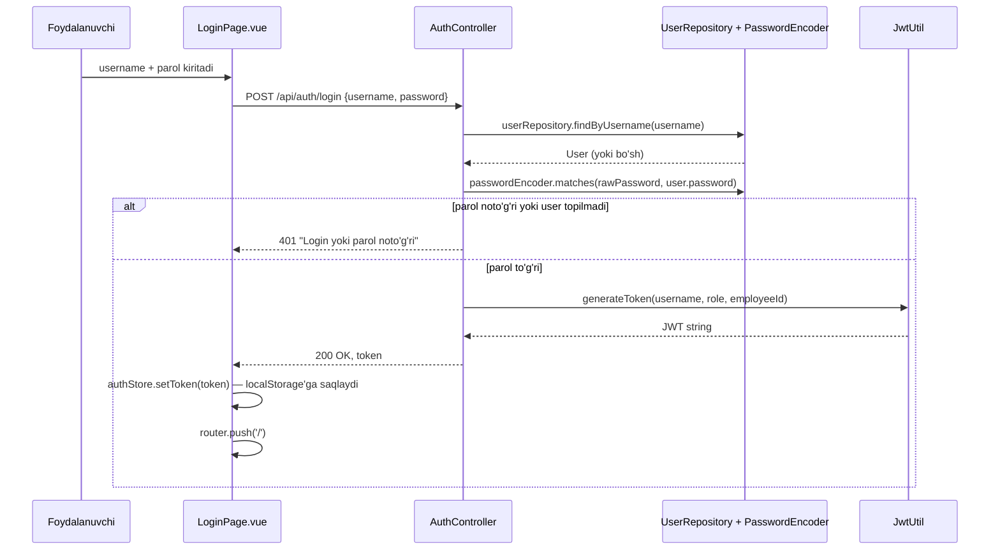
```mermaid
sequenceDiagram
    participant U as Foydalanuvchi
    participant FE as LoginPage.vue
    participant API as AuthController
    participant Svc as UserRepository + PasswordEncoder
    participant J as JwtUtil

    U->>FE: username + parol kiritadi
    FE->>API: POST /api/auth/login {username, password}
    API->>Svc: userRepository.findByUsername(username)
    Svc-->>API: User (yoki bo'sh)
    API->>Svc: passwordEncoder.matches(rawPassword, user.password)
    alt parol noto'g'ri yoki user topilmadi
        API-->>FE: 401 "Login yoki parol noto'g'ri"
    else parol to'g'ri
        API->>J: generateToken(username, role, employeeId)
        J-->>API: JWT string
        API-->>FE: 200 OK, token
        FE->>FE: authStore.setToken(token) — localStorage'ga saqlaydi
        FE->>FE: router.push('/')
    end
```

`JwtUtil.java`:

```java
public String generateToken(String username, String role, Long employeeId) {
    var builder = Jwts.builder().subject(username).claim("role", role);
    if (employeeId != null) builder.claim("employeeId", employeeId);
    return builder
            .issuedAt(new Date())
            .expiration(new Date(System.currentTimeMillis() + expirationMs))  // 10 soat
            .signWith(key)
            .compact();
}
```

Har bir keyingi so'rovda, `JwtAuthFilter` (`config/JwtAuthFilter.java`) `Authorization: Bearer <token>` headerini o'qib, tokenni tekshiradi va Spring Security kontekstiga "bu foydalanuvchi shu rol bilan autentifikatsiyadan o'tgan" deb yozadi:

```java
if (jwtUtil.isTokenValid(token)) {
    String username = jwtUtil.extractUsername(token);
    String role = jwtUtil.extractRole(token);
    var authentication = new UsernamePasswordAuthenticationToken(
            username, null, List.of(new SimpleGrantedAuthority("ROLE_" + role)));
    SecurityContextHolder.getContext().setAuthentication(authentication);
}
```

`ROLE_` prefiksi — Spring Security'ning ichki konventsiyasi: `@PreAuthorize("hasRole('ADMIN')")` yozilganda, Spring buni avtomatik `ROLE_ADMIN` bilan solishtiradi.

### Parol xeshlash (BCrypt)

```java
@Bean
public PasswordEncoder passwordEncoder() {
    return new BCryptPasswordEncoder();
}
```

**Bu nima?** BCrypt — parolni bazada ochiq matnda emas, qaytarib bo'lmaydigan (one-way) "xesh" ko'rinishida saqlash algoritmi, va har safar "tuz" (salt — tasodifiy qo'shimcha qiymat) qo'shib ishlaydi, shu sabab bir xil parol har safar boshqacha xesh beradi. Tekshirishda `passwordEncoder.matches(kiritilganParol, saqlangan_xesh)` chaqiriladi — bu xeshni "orqaga qaytarmaydi", balki kiritilgan parolni xeshlab, ikkalasini solishtiradi.

### Rollar va ruxsatlar

`@EnableMethodSecurity` (`SecurityConfig.java`) orqali har bir Controller metodida `@PreAuthorize("hasRole('ADMIN')")` yoki `@PreAuthorize("hasAnyRole('ADMIN', 'EDITOR', 'VIEWER')")` ishlatiladi. Naqsh doim bir xil:
- **O'qish (GET)** — `ADMIN`, `EDITOR`, `VIEWER` — hammasiga ochiq.
- **Yaratish/yangilash (POST/PUT)** — `ADMIN`, `EDITOR`.
- **O'chirish (DELETE)** — faqat `ADMIN`.
- **`UserController`** — butunlay `ADMIN`ga cheklangan (klass darajasida `@PreAuthorize("hasRole('ADMIN')")`).

To'liq endpoint-rol jadvali: [07-api.md](#07--api-endpointlar).

## Loglar, health-check, rejalashtirilgan vazifalar

- **Loglash**: alohida logging kutubxonasi qo'shilmagan — Spring Boot standart holatda SLF4J + Logback bilan birga keladi. `GlobalExceptionHandler` va seederlar `LoggerFactory.getLogger(...)` orqali loglaydi.
- **`/api/health`**: `HealthController.java` — autentifikatsiyasiz, `{"status": "UP"}` qaytaradi. Frontend login sahifasi backend ishlab turganini shu orqali tekshiradi.
- **Spring Boot Actuator**: loyihada **ishlatilmagan** (`build.gradle`da yo'q) — `/api/health` qo'lda yozilgan oddiy endpoint, Actuator'ning `/actuator/health`i emas.
- **`@Scheduled` (rejalashtirilgan vazifalar)**: loyihada **yo'q** — hech qanday fon vazifasi (masalan "har kuni yarim tunda eslatma yuborish") mavjud emas.

---

# 07 — API endpoint'lar

**Mundarija**
- [Umumiy qoidalar](#umumiy-qoidalar)
- [Auth](#auth--apiauth)
- [Dashboard](#dashboard--apidashboard)
- [Profillar](#profillar--apiprofiles)
- [Ta'lim tuzilmasi: Schools / Buildings / Rooms](#talim-tuzilmasi-schools--buildings--rooms)
- [O'quv jarayoni: Academic Years / School Classes / Subjects / Lesson Slots](#oquv-jarayoni-academic-years--school-classes--subjects--lesson-slots)
- [Davomat](#davomat--apiattendance)
- [Baholar](#baholar--apigrades)
- [Odamlar: Students / Positions / Employees](#odamlar-students--positions--employees)
- [Kundalik hayot: Announcements / Calendar Events / Behavior Records](#kundalik-hayot-announcements--calendar-events--behavior-records)
- [Telegram va xabarnomalar](#telegram-va-xabarnomalar--apitelegram-apinotifications)
- [Foydalanuvchilar](#foydalanuvchilar--apiusers)
- [Health](#health--apihealth)
- [Swagger/OpenAPI](#swaggeropenapi)

## Umumiy qoidalar

- **Bazaviy manzil**: lokal ishga tushirishda `http://localhost:8080`.
- **Autentifikatsiya**: `/api/auth/**` va `/api/health` dan tashqari, **barcha** endpoint `Authorization: Bearer <token>` headerini talab qiladi.
- **Ro'yxat endpoint'lari** (`GET`, ko'plik) deyarli barchasi sahifalashni (`Pageable`) qo'llab-quvvatlaydi: `?page=0&size=20&sort=name,asc`. Javob shakli:
  ```json
  { "content": [...], "totalElements": 42, "totalPages": 3, "number": 0, "size": 20 }
  ```
- **Ko'p maktabli modullar** (`schoolScoped`) — `schoolId` query-parametri **majburiy**.
- **Xatolar**: barcha xato javoblari oddiy matn (`Content-Type: text/plain`) tanasi bilan qaytadi, JSON emas (`GlobalExceptionHandler`, batafsil: [06-backend.md — Xatolarni qayta ishlash](#xatolarni-qayta-ishlash)).
- **Rol ustunidagi qisqartmalar**: A = `ADMIN`, E = `EDITOR`, V = `VIEWER`.

## Auth — `/api/auth`

| Metod | URL | Vazifa | Rol |
|---|---|---|---|
| POST | `/api/auth/login` | Login, JWT token qaytaradi | ochiq |
| GET | `/api/auth/hash/{raw}` | Berilgan matnni BCrypt bilan xeshlaydi (qo'lda foydalanuvchi yaratish uchun yordamchi) | A |

```bash
curl -X POST http://localhost:8080/api/auth/login \
  -H "Content-Type: application/json" \
  -d '{"username":"admin","password":"admin123"}'
# Javob: "eyJhbGciOiJIUzI1NiJ9...." (JWT string)
```

## Dashboard — `/api/dashboard`

Barchasi `@RequestParam Long schoolId` talab qiladi, hammasi `ADMIN`/`EDITOR`/`VIEWER`ga ochiq.

| Metod | URL | Vazifa | Qo'shimcha parametrlar |
|---|---|---|---|
| GET | `/api/dashboard/overview` | Bosh sahifaning **barcha** bloklarini bitta so'rovda qaytaradi (summary, jonli darslar, davomat trendi, sinflar reytingi, fanlar o'rtachasi, e'tibor, faoliyat) | `trendDays` (standart 30), `activityLimit` (standart 8) |
| GET | `/api/dashboard/summary` | Faqat KPI kartalar uchun ma'lumot | — |
| GET | `/api/dashboard/live-lessons` | Hozir/keyingi/o'tgan darslar ro'yxati | — |
| GET | `/api/dashboard/live-lessons-summary` | Joriy davr haqida qisqa matn | — |
| GET | `/api/dashboard/attendance-trend` | Kunlik davomat foizi tarixi | `days` (standart 30) |
| GET | `/api/dashboard/class-rankings` | Sinflar reytingi (davomat/baho/umumiy ball, 30 kunlik) | — |
| GET | `/api/dashboard/subject-averages` | Fan bo'yicha o'rtacha baho | — |
| GET | `/api/dashboard/absentees-today` | Bugun kelmagan o'quvchilar ro'yxati | — |
| GET | `/api/dashboard/attention` | "E'tibor talab qiladi" ro'yxati | — |
| GET | `/api/dashboard/activity` | So'nggi faoliyat lentasi | `limit` (standart 8) |

```bash
curl http://localhost:8080/api/dashboard/overview?schoolId=1 \
  -H "Authorization: Bearer $TOKEN"
```

Ko'rsatkichlar qanday hisoblanishi (formulalari bilan): [09-asosiy-jarayonlar.md](#09--asosiy-jarayonlar).

## Profillar — `/api/profiles`

Klass darajasida `ADMIN`/`EDITOR`/`VIEWER`ga ochiq.

| Metod | URL | Vazifa |
|---|---|---|
| GET | `/api/profiles/students/{id}` | Bitta o'quvchining to'liq profili (davomat, baholar, xulq yozuvlari birga) |
| GET | `/api/profiles/teachers/{id}` | Bitta o'qituvchining profili (dars jadvali, bog'liq sinflar) |
| GET | `/api/profiles/classes/{id}` | Bitta sinfning profili (o'quvchilar ro'yxati, dars jadvali) |

## Ta'lim tuzilmasi: Schools / Buildings / Rooms

### `/api/schools` (`schoolScoped: false`)

| Metod | URL | Vazifa | Rol |
|---|---|---|---|
| GET | `/api/schools` | Ro'yxat (pagination) | A/E/V |
| GET | `/api/schools/{id}` | Bitta maktab | A/E/V |
| POST | `/api/schools` | Yaratish | A/E |
| PUT | `/api/schools/{id}` | Yangilash | A/E |
| DELETE | `/api/schools/{id}` | O'chirish | A |

### `/api/buildings` (`schoolId` majburiy)

Xuddi shu 5 ta endpoint (GET ro'yxat, GET id, POST, PUT, DELETE), xuddi shu rol taqsimoti (A/E/V — A/E/V — A/E — A/E — A).

### `/api/rooms` (`schoolId` majburiy)

| Metod | URL | Vazifa | Rol | Qo'shimcha parametrlar |
|---|---|---|---|---|
| GET | `/api/rooms` | Ro'yxat, filtrlar bilan | A/E/V | `buildingId` (ixtiyoriy), `type` (ixtiyoriy, `RoomType` qiymati) |
| GET | `/api/rooms/{id}` | Bitta xona | A/E/V | — |
| GET | `/api/rooms/{id}/occupancy` | Shu xonaning **bugungi to'liq kunlik band-bo'sh jadvali** | A/E/V | — |
| POST | `/api/rooms` | Yaratish | A/E | — |
| PUT | `/api/rooms/{id}` | Yangilash | A/E | — |
| DELETE | `/api/rooms/{id}` | O'chirish | A | — |

```bash
curl "http://localhost:8080/api/rooms?schoolId=1&type=GYM&page=0&size=10" \
  -H "Authorization: Bearer $TOKEN"
```

## O'quv jarayoni: Academic Years / School Classes / Subjects / Lesson Slots

`/api/academic-years`, `/api/school-classes`, `/api/subjects` — barchasi (`schoolId` majburiy) standart 5 ta CRUD endpoint, A/E/V — A/E/V — A/E — A/E — A rol taqsimoti bilan.

### `/api/lesson-slots` (dars jadvali yozuvlari, `schoolId` majburiy)

| Metod | URL | Vazifa | Rol | Qo'shimcha parametrlar |
|---|---|---|---|---|
| GET | `/api/lesson-slots` | Ro'yxat (pagination) | A/E/V | — |
| GET | `/api/lesson-slots/timetable` | Haftalik jadval ko'rinishi (kun/vaqt bo'yicha guruhlangan) | A/E/V | `schoolClassId`, `employeeId`, `roomId` — barchasi ixtiyoriy, biri tanlanadi |
| GET | `/api/lesson-slots/{id}` | Bitta yozuv | A/E/V | — |
| POST | `/api/lesson-slots` | Yaratish (xona/o'qituvchi ziddiyati tekshiriladi) | A/E | — |
| PUT | `/api/lesson-slots/{id}` | Yangilash | A/E | — |
| DELETE | `/api/lesson-slots/{id}` | O'chirish | A | — |

```bash
curl "http://localhost:8080/api/lesson-slots/timetable?schoolId=1&schoolClassId=5" \
  -H "Authorization: Bearer $TOKEN"
```

## Davomat — `/api/attendance`

| Metod | URL | Vazifa | Rol | Parametrlar / body |
|---|---|---|---|---|
| GET | `/api/attendance` | Ro'yxat (pagination) | A/E/V | `schoolId` |
| GET | `/api/attendance/today-lessons` | Bugungi barcha darslar + har biri uchun davomat olinganmi | A/E/V | `schoolId`, `employeeId` (ixtiyoriy — berilsa, faqat o'sha o'qituvchining darslari) |
| GET | `/api/attendance/roster` | Bitta dars uchun sinf ro'yxati + mavjud davomat holati | A/E/V | `lessonSlotId`, `date` (ISO, `yyyy-MM-dd`) |
| POST | `/api/attendance/bulk` | Butun sinf uchun davomatni **bir vaqtda** saqlash | A/E | body: `{lessonSlotId, recordDate, entries: [{studentId, status, comment}]}` |
| POST | `/api/attendance` | Bitta o'quvchi uchun bitta yozuv qo'shish | A/E | body: `AttendanceRequestDto` |
| PUT | `/api/attendance/{id}` | Bitta yozuvni yangilash | A/E | — |
| DELETE | `/api/attendance/{id}` | O'chirish | A | — |

```bash
curl -X POST http://localhost:8080/api/attendance/bulk \
  -H "Authorization: Bearer $TOKEN" -H "Content-Type: application/json" \
  -d '{"lessonSlotId":12,"recordDate":"2026-09-29","entries":[{"studentId":3,"status":"PRESENT"},{"studentId":4,"status":"ABSENT"}]}'
```

To'liq oqim (frontend tugmasidan bazagacha): [02-arxitektura.md](#bitta-sorovning-toliq-yoli-davomatni-saqlash).

## Baholar — `/api/grades`

| Metod | URL | Vazifa | Rol | Parametrlar |
|---|---|---|---|---|
| GET | `/api/grades` | Ro'yxat (pagination) | A/E/V | `schoolId` |
| GET | `/api/grades/gradebook` | Bitta sinf+fan uchun davr ichidagi baholar jadvali (o'quvchilar × sanalar) | A/E/V | `schoolClassId`, `subjectId`, `from`, `to` (ISO sana) |
| POST | `/api/grades` | Yangi baho qo'yish (2–5 oralig'ida) | A/E | body: `GradeRequestDto` |
| PUT | `/api/grades/{id}` | Bahoni yangilash | A/E | — |
| DELETE | `/api/grades/{id}` | O'chirish | A | — |

```bash
curl "http://localhost:8080/api/grades/gradebook?schoolClassId=5&subjectId=2&from=2026-09-01&to=2026-09-29" \
  -H "Authorization: Bearer $TOKEN"
```

## Odamlar: Students / Positions / Employees

### `/api/students` (`schoolId` majburiy)

Standart 5 ta CRUD endpoint (A/E/V — A/E/V — A/E — A/E — A).

### `/api/positions` (`schoolScoped: false`)

Standart 5 ta CRUD endpoint, `schoolId` talab qilinmaydi.

### `/api/employees` (`schoolId` majburiy)

Standart 5 ta CRUD endpoint.

```bash
curl "http://localhost:8080/api/students?schoolId=1&page=0&size=20&sort=lastName,asc" \
  -H "Authorization: Bearer $TOKEN"
```

## Kundalik hayot: Announcements / Calendar Events / Behavior Records

### `/api/announcements` (`schoolId` majburiy)

| Metod | URL | Vazifa | Rol |
|---|---|---|---|
| GET | `/api/announcements` | Ro'yxat (pagination) | A/E/V |
| GET | `/api/announcements/latest` | So'nggi N ta (`limit`, standart 5) | A/E/V |
| GET | `/api/announcements/{id}` | Bitta e'lon | A/E/V |
| POST | `/api/announcements` | Yaratish | A/E |
| PUT | `/api/announcements/{id}` | Yangilash | A/E |
| DELETE | `/api/announcements/{id}` | O'chirish | A |

### `/api/calendar-events` (`schoolId` majburiy)

| Metod | URL | Vazifa | Rol |
|---|---|---|---|
| GET | `/api/calendar-events` | Ro'yxat (pagination) | A/E/V |
| GET | `/api/calendar-events/range` | Berilgan sana oralig'idagi tadbirlar (`from`, `to`) | A/E/V |
| GET | `/api/calendar-events/upcoming` | Yaqinlashayotgan tadbirlar (`limit`, standart 5) | A/E/V |
| POST | `/api/calendar-events` | Yaratish | A/E |
| PUT | `/api/calendar-events/{id}` | Yangilash | A/E |
| DELETE | `/api/calendar-events/{id}` | O'chirish | A |

### `/api/behavior-records` (`schoolId` majburiy)

| Metod | URL | Vazifa | Rol |
|---|---|---|---|
| GET | `/api/behavior-records` | Ro'yxat (pagination) | A/E/V |
| POST | `/api/behavior-records` | Yaratish | A/E |
| PUT | `/api/behavior-records/{id}` | Yangilash | A/E |
| DELETE | `/api/behavior-records/{id}` | O'chirish | A |

```bash
curl "http://localhost:8080/api/calendar-events/range?schoolId=1&from=2026-09-01&to=2026-09-30" \
  -H "Authorization: Bearer $TOKEN"
```

## Telegram va xabarnomalar — `/api/telegram`, `/api/notifications`

Ota-onalar uchun Telegram bot (batafsil: [15-telegram-bot.md](#15--telegram-bot-ota-onalar-uchun)). Bog'lash kodlari bolaning ma'lumotiga obuna bo'lish imkonini beradi, shuning uchun ular `VIEWER`ga ochilmagan.

### `/api/telegram`

| Metod | URL | Vazifa | Rol |
|---|---|---|---|
| GET | `/api/telegram/status` | Bot holati: `mode` (`LIVE`/`MOCK`/`DISABLED`/`NO_TOKEN`), `active`, `tokenConfigured`, `botUsername`, `lastError`. Tokenning o'zi hech qachon qaytarilmaydi | A/E/V |
| GET | `/api/telegram/students/{studentId}` | O'quvchining bog'lash kodi, deep link, ulangan ota-onalar ro'yxati (`links[]`: `id`, `firstName`, `telegramUsername`, `linkedAt`) | A/E |
| POST | `/api/telegram/students/{studentId}/regenerate-code` | Yangi kod yaratadi (eskisi bekor bo'ladi, bog'lanishlar saqlanadi) | A/E |
| DELETE | `/api/telegram/links/{linkId}` | Ota-onani uzish (`active=false`) | A/E |
| GET | `/api/telegram/classes/{schoolClassId}/codes` | Sinfning barcha o'quvchilari uchun kod + deep link (QR varaq uchun) | A/E |
| GET | `/api/telegram/files/{fileId}` | Ota-ona yuborgan rasmni backend orqali beradi (token brauzerga chiqmaydi) | A/E |
| POST | `/api/telegram/mock/updates` | **Faqat `telegram.mock=true`**: ota-onaning harakatini simulyatsiya qiladi, botning javoblarini (yuborish/tahrirlash/rasm, tugmalari bilan) qaytaradi. Body: `chatId` + bittasi: `text`, `contactPhone`, `photoBase64`, `callbackData` (+ `messageId`); ixtiyoriy `firstName`, `username`, `contactUserId`, `languageCode` | A |
| GET | `/api/telegram/mock/messages?chatId=&from=` | **Mock**: shu chatga yuborilgan xabarlar, `from` indeksidan boshlab (`next` — keyingi indeks) | A |
| GET | `/api/telegram/mock/photos/{fileId}` | **Mock**: bot yuborgan PNG | A |

### `/api/parent-messages` — ota-onalar murojaatlari (`schoolId` majburiy)

| Metod | URL | Vazifa | Rol |
|---|---|---|---|
| GET | `/api/parent-messages` | Ro'yxat, yangilari birinchi, pagination. Ixtiyoriy `status` (`NEW`/`ANSWERED`) | A/E |
| GET | `/api/parent-messages/count-new` | Javob kutayotganlar soni (sidebar belgisi) | A/E |
| GET | `/api/parent-messages/{id}/photo` | Murojaatga ilova qilingan rasm | A/E |
| POST | `/api/parent-messages/{id}/reply` | Javob yozish. Body: `{"text": "..."}`. Javob ota-onaga botda (`MESSAGE_REPLY`) yuboriladi | A/E |

### `/api/absence-requests` — sababli arizalar (`schoolId` majburiy)

| Metod | URL | Vazifa | Rol |
|---|---|---|---|
| GET | `/api/absence-requests` | Ro'yxat, pagination. Ixtiyoriy `status` (`PENDING`/`APPROVED`/`REJECTED`) | A/E |
| GET | `/api/absence-requests/count-pending` | Kutilayotganlar soni | A/E |
| GET | `/api/absence-requests/{id}/photo` | Ma'lumotnoma rasmi | A/E |
| POST | `/api/absence-requests/{id}/approve` | Tasdiqlash: arizadagi kunlarning barcha darslari davomatda `EXCUSED` (bayram/ta'til kunlari bundan mustasno), javobda `excusedLessons`; ota-onaga xabar. `PENDING` bo'lmasa — 409 | A/E |
| POST | `/api/absence-requests/{id}/reject` | Rad etish. Body: `{"text": "sabab"}` (majburiy); ota-onaga sababi bilan xabar | A/E |

### `/api/broadcasts` — ota-onalarga umumiy xabar (faqat ADMIN)

| Metod | URL | Vazifa | Rol |
|---|---|---|---|
| GET | `/api/broadcasts?schoolId=` | Yuborilganlar tarixi va natijasi (yuborildi / jami) | A |
| POST | `/api/broadcasts/preview` | Ota-ona ko'radigan matn va qabul qiluvchilar soni, hech narsa yubormaydi | A |
| POST | `/api/broadcasts` | Yuborish (outbox orqali, `BROADCAST`). Body: `schoolId`, `text`, `audience` (`ALL`/`CLASSES`), `classIds` | A |

### `/api/bot` — bot statistikasi va sozlamalari (`schoolId` majburiy)

| Metod | URL | Vazifa | Rol |
|---|---|---|---|
| GET | `/api/bot/stats` | Ulangan ota-onalar foizi, faol (7/30 kun), 30 kunlik yuborilgan xabarlar, eng ko'p ochilgan bo'limlar, sinflar bo'yicha qamrov | A/E |
| GET | `/api/bot/settings` | Bot sozlamalari (yozuv bo'lmasa — standart qiymatlar) | A/E |
| PUT | `/api/bot/settings` | Saqlash: `phone`, `directorName`, `receptionHours`, `bellScheduleNote`, `showTeacherPhones`, `tomorrowScheduleTime`, `weeklyReportDay`, `weeklyReportTime`, `eventReminderTime`, `lowGradeThreshold` (2 yoki 3) | A |
| POST | `/api/bot/mock/run-jobs` | **Mock**: ertangi jadval, haftalik hisobot, tadbir eslatmasini hoziroq ishga tushiradi | A |

### `/api/parent` — Mini App (JWT emas, Telegram imzosi)

Login talab qilinmaydi (`SecurityConfig`da ochiq), lekin har so'rovda `X-Telegram-Init-Data` sarlavhasi bo'lishi shart. Imzo HMAC-SHA256 bilan tekshiriladi, `auth_date` 24 soatdan eski bo'lmasligi kerak — aks holda **401**. Chat bog'lanmagan o'quvchi id'si — **403**. Barcha endpointlar faqat o'qish uchun.

| Metod | URL | Vazifa |
|---|---|---|
| GET | `/api/parent/me` | Ota-ona ismi, tili, bog'langan farzandlar, tanlangan farzand |
| GET | `/api/parent/students/{id}/today` | «Bugun»: holat, darslar, bugungi baholar, yangi e'lonlar, yaqin tadbir |
| GET | `/api/parent/students/{id}/schedule?day=today\|tomorrow\|week` | Dars jadvali |
| GET | `/api/parent/students/{id}/attendance?month=YYYY-MM` | Oylik xulosa, kunlar kalendari, kelmagan/kechikkan darslar, fanlar bo'yicha |
| GET | `/api/parent/students/{id}/grades` | So'nggi baholar va fanlar bo'yicha o'rtacha (tendensiya bilan) |
| GET | `/api/parent/students/{id}/grades/{subjectId}` | Fan bo'yicha barcha baholar va o'qituvchi |
| GET | `/api/parent/students/{id}/announcements` | Ota-onalarga mo'ljallangan e'lonlar |

### `/api/notifications` (`schoolId` majburiy)

| Metod | URL | Vazifa | Rol | Qo'shimcha parametrlar |
|---|---|---|---|---|
| GET | `/api/notifications` | Xabarnomalar jurnali (outbox), yangilari birinchi, pagination | A/E | `type` (`ATTENDANCE_ABSENT`, `ATTENDANCE_LATE`, `GRADE_NEW`, `GRADE_UPDATED`, `GRADE_LOW`, `ANNOUNCEMENT`, `TOMORROW_SCHEDULE`, `WEEKLY_REPORT`, `EVENT_REMINDER`, `MESSAGE_REPLY`, `ABSENCE_DECISION`, `BROADCAST`), `status` (`PENDING`, `SENT`, `FAILED`, `SKIPPED`), `from`, `to` (`YYYY-MM-DD`, `createdAt` bo'yicha) — barchasi ixtiyoriy |
| GET | `/api/notifications/stats` | `sentToday`, `failedToday`, `failedTotal`, `pending`, `skippedToday`, `linkedStudents`, `totalStudents`, `linkedPercent`, `parentCount` | A/E | — |
| POST | `/api/notifications/{id}/retry` | `FAILED` xabarni qayta navbatga qo'yadi (`attempts=0`). Boshqa holatda — 409 | A/E | — |
| GET | `/api/notifications/settings` | Maktab sozlamalari (yozuv bo'lmasa — standart qiymatlar) | A/E | — |
| PUT | `/api/notifications/settings` | Sozlamalarni saqlash. Body: `attendanceEnabled`, `gradeEnabled`, `announcementEnabled`, `quietHoursEnabled`, `quietHoursStart`, `quietHoursEnd` (`HH:mm`) | A | — |

```bash
curl "http://localhost:8080/api/notifications?schoolId=1&status=FAILED&from=2026-09-01" \
  -H "Authorization: Bearer $TOKEN"

curl -X PUT "http://localhost:8080/api/notifications/settings?schoolId=1" \
  -H "Authorization: Bearer $TOKEN" -H "Content-Type: application/json" \
  -d '{"attendanceEnabled":true,"gradeEnabled":true,"announcementEnabled":false,"quietHoursEnabled":true,"quietHoursStart":"22:00","quietHoursEnd":"07:00"}'
```

## Foydalanuvchilar — `/api/users`

Klass darajasida `@PreAuthorize("hasRole('ADMIN')")` — **barcha** 5 ta endpoint faqat `ADMIN` uchun (`schoolId` talab qilinmaydi, `schoolScoped: false`).

| Metod | URL | Vazifa |
|---|---|---|
| GET | `/api/users` | Ro'yxat (pagination) |
| GET | `/api/users/{id}` | Bitta foydalanuvchi |
| POST | `/api/users` | Yaratish (`username`, `password`, `role`, ixtiyoriy `employeeId`) |
| PUT | `/api/users/{id}` | Yangilash (`password` bo'sh qoldirilsa, eski parol saqlanadi) |
| DELETE | `/api/users/{id}` | O'chirish |

## Health — `/api/health`

| Metod | URL | Vazifa | Rol |
|---|---|---|---|
| GET | `/api/health` | `{"status": "UP"}` — tirikligini tekshirish | ochiq |

## Swagger/OpenAPI

Loyihada springdoc/Swagger **ulanmagan** — interaktiv API hujjat sahifasi (masalan `/swagger-ui.html`) mavjud emas. Barcha endpoint'lar shu fayldagi jadvallar orqali hujjatlashtirilgan. Kelajakda qo'shish haqida: [14-kelajak-rejalari.md](#14--kelajak-rejalari).

---

# 08 — Frontend

**Mundarija**
- [Vue asoslari — loyihadagi misollar bilan](#vue-asoslari--loyihadagi-misollar-bilan)
- [Layout: MainLayout va PageLayout](#layout-mainlayout-va-pagelayout)
- [Router va himoyalangan sahifalar](#router-va-himoyalangan-sahifalar)
- [Store (Pinia)](#store-pinia)
- [axios sozlamalari va interceptor'lar](#axios-sozlamalari-va-interceptorlar)
- [CrudPage: universal komponent](#crudpage-universal-komponent)
- [Har bir sahifa](#har-bir-sahifa)
- [Quasar konfiguratsiyasi](#quasar-konfiguratsiyasi)
- [Tema tizimi (dark/light, dizayn tokenlari)](#tema-tizimi-darklight-dizayn-tokenlari)
- [Ikonkalar va shriftlar](#ikonkalar-va-shriftlar)

## Vue asoslari — loyihadagi misollar bilan

Barcha sahifalar Vue 3'ning **Composition API** uslubida, `<script setup>` sintaksisi bilan yozilgan (bu — eng qisqa, eng zamonaviy Vue yozish usuli).

**Component (komponent)** — mustaqil, qayta ishlatiladigan UI bo'lagi. Har bir `.vue` fayl — bitta komponent, uchta qismdan iborat: `<template>` (HTML ko'rinish), `<script setup>` (mantiq), `<style>` (CSS).

**`ref` va `computed`** — reaktivlik asosi:
```js
// DashboardPage.vue
const loading = ref(true)                    // ref: o'zgaruvchan qiymat, .value orqali o'qiladi/yoziladi
const attendanceAverage = computed(() => {    // computed: boshqa reaktiv qiymatlardan avtomatik hisoblanadi
  const vals = attendanceTrend.value.map(p => p.rate).filter(v => v != null)
  return vals.length ? Math.round((vals.reduce((a, b) => a + b, 0) / vals.length) * 10) / 10 : null
})
```
`attendanceTrend.value` o'zgarsa, `attendanceAverage` **avtomatik** qayta hisoblanadi — ekranni qo'lda yangilash shart emas.

**`props` va `emit`** — komponentlar orasidagi aloqa. Masalan `components/DateField.vue` ota-komponentdan qiymat oladi (`props`) va o'zgarish haqida xabar beradi (`emit`):
```vue
<script setup>
defineProps({ modelValue: String, label: String })
defineEmits(['update:modelValue'])
</script>
```
Bu — Vue'ning `v-model` naqshi: ota-komponent `<date-field v-model="formModel.birthDate" />` deb yozganda, ichkarida avtomatik `:modelValue="formModel.birthDate"` + `@update:modelValue="v => formModel.birthDate = v"`ga aylanadi.

**Lifecycle (hayot sikli) — `onMounted`**: komponent ekranga birinchi marta chiqqanda bir marta ishga tushadigan funksiya:
```js
// DashboardPage.vue
onMounted(loadAll)                              // sahifa ochilganda ma'lumot yuklanadi
watch(() => schoolStore.activeSchoolId, loadAll) // maktab almashtirilsa, qayta yuklanadi
```

## Layout: MainLayout va PageLayout

- **`layouts/MainLayout.vue`** (816 qator) — har bir ichki sahifani o'rab turadigan "qobiq": yuqori panel (qidiruv, bildirishnomalar, maktab tanlash, dark-mode tugmasi, profil menyusi) + chap sidebar (`q-drawer`, modullar ro'yxati bilan). Sidebar ikki qismdan iborat:
  - **Statik** "Kundalik ish" bo'limi — to'rtta qattiq yozilgan havola (`dailyNavItems`): Davomat olish, Baholar jurnali, Dars jadvali, Taqvim.
  - **Dinamik** qolgan bo'limlar — `config/modules.js`dagi `modules` massividan, `group` maydoni bo'yicha guruhlangan (`groupedModules` computed), va faqat foydalanuvchi ko'ra oladigan modullar chiqariladi:
    ```js
    const visibleModules = computed(() =>
      modules.filter(m => !m.hidden && (!m.adminOnly || authStore.isAdmin))
    )
    ```
    Shu sabab yangi modul qo'shilganda (`modules.js`ga yangi obyekt qo'shib), sidebar'ga **qo'lda** hech narsa qo'shish shart emas.
- **`components/PageLayout.vue`** (65 qator) — har bir sahifa ichida ishlatiladigan kichik "qolip": sarlavha qatori (`header` slot) + kontent qismi. Barcha sahifalar shu orqali bir xil sarlavha/bo'shliq uslubiga ega bo'ladi.

## Router va himoyalangan sahifalar

`router/routes.js` — barcha marshrutlar ro'yxati (to'liq ro'yxat: [04-papkalar-tuzilishi.md](#pages--har-bir-sahifa)). `CrudPage.vue`ning `path: 'app/:moduleKey'` — bitta dinamik marshrut orqali barcha 14 modulga xizmat qiladi (`:moduleKey` — masalan `rooms`, `students`).

**Himoyalangan sahifalar** — loyihada har bir marshrutga alohida `meta: { requiresAuth: true }` yozish o'rniga, **bitta global guard** ishlatiladi (`router/index.js`):

```js
Router.beforeEach(to => {
  const authStore = useAuthStore()
  const isLoginRoute = to.path === '/login'

  if (!authStore.isAuthenticated && !isLoginRoute) {
    return '/login'          // token yo'q — login sahifasiga
  }
  if (authStore.isAuthenticated && isLoginRoute) {
    return '/'                // token bor-u, login sahifasiga kirmoqchi — bosh sahifaga qaytaradi
  }
  LoadingBar.start()
  return true
})
```

Bu — "hamma sahifa standart holatda himoyalangan, faqat `/login` ochiq" mantig'i (aksincha, "hamma ochiq, faqat ba'zilari yopiq" emas).

## Store (Pinia)

### `stores/auth.js`

```js
export const useAuthStore = defineStore('auth', {
  state: () => ({
    token: localStorage.getItem('token') || null,
    username: localStorage.getItem('username') || null,
    role: localStorage.getItem('role') || null,
    employeeId: localStorage.getItem('employeeId') ? Number(...) : null
  }),
  getters: {
    isAuthenticated: state => !!state.token,
    isAdmin: state => state.role === 'ADMIN',
    isEditor: state => state.role === 'EDITOR' || state.role === 'ADMIN'
  },
  actions: {
    setToken(token) { /* JWT'ni dekodlab, token/username/role/employeeId'ni localStorage'ga ham yozadi */ },
    logout() { /* hammasini tozalaydi */ }
  }
})
```

Sahifa qayta yuklanganda (F5) ham foydalanuvchi tizimdan chiqib qolmasligi uchun, boshlang'ich holat to'g'ridan-to'g'ri `localStorage`dan o'qiladi.

### `stores/school.js`

Joriy tanlangan maktabni (`activeSchoolId`, `activeSchoolName`) saqlaydi, shuningdek `localStorage`da. `fetchSchools(api)` — barcha maktablarni yuklaydi va agar avval tanlangan maktab endi mavjud bo'lmasa (o'chirilgan bo'lsa), avtomatik birinchisini tanlaydi.

## axios sozlamalari va interceptor'lar

`boot/axios.js` — Quasar "boot fayli" (ilova ishga tushishidan oldin, bir marta bajariladi):

```js
const api = axios.create({
  baseURL: import.meta.env.QCLI_API_BASE_URL || 'http://localhost:8080',
  timeout: 15000
})

api.interceptors.request.use(config => {
  const token = localStorage.getItem('token')
  if (token) config.headers.Authorization = `Bearer ${token}`
  return config
})

api.interceptors.response.use(
  response => response,
  error => {
    error.friendlyMessage = friendlyMessage(error)   // texnik xatoni o'zbekcha, tushunarli matnga aylantiradi
    if (error.response?.status === 401) {
      localStorage.removeItem('token'); localStorage.removeItem('username'); localStorage.removeItem('role')
      if (router.currentRoute.value.path !== '/login') router.push('/login')
    }
    return Promise.reject(error)
  }
)
```

- **Request interceptor** — har bir chiqayotgan so'rovga avtomatik `Authorization` header qo'shadi, shu sabab har bir sahifada bu qatorni qo'lda yozish shart emas.
- **Response interceptor** — ikkita vazifa: (1) har qanday xatoni `error.friendlyMessage`ga o'zbekcha, tushunarli matnga aylantiradi (masalan tarmoq uzilishi, timeout, 401, 5xx uchun turlicha xabar), (2) `401 Unauthorized` kelsa (token muddati tugagan yoki noto'g'ri) — foydalanuvchini avtomatik chiqarib, login sahifasiga qaytaradi.
- **`timeout: 15000`** — 15 soniyadan uzoq javob kelmasa, so'rov avtomatik bekor qilinadi (`ECONNABORTED`), foydalanuvchi cheksiz kutmaydi.

## CrudPage: universal komponent

Loyihaning eng muhim frontend qarori: 14 ta modulning (Maktablar, Binolar, Xonalar, O'quv yillari, Sinflar, O'quvchilar, Fanlar, Lavozimlar, Xodimlar, E'lonlar, Tadbirlar, Xulq yozuvlari, Foydalanuvchilar, va menyuda yashirin Dars jadvali-ro'yxat) barchasi **bitta** `pages/CrudPage.vue` komponenti orqali ko'rsatiladi — har biriga alohida sahifa yozish o'rniga.

**Qanday ishlaydi?** Marshrut `/app/:moduleKey` — `moduleKey` (masalan `rooms`) orqali `config/modules.js`dan mos konfiguratsiya topiladi:

```js
// config/getModule
export function getModule(key) {
  return modules.find(m => m.key === key)
}
```

Har bir modul konfiguratsiyasi shu maydonlarni belgilaydi:

| Maydon | Vazifasi |
|---|---|
| `key`, `title`, `icon`, `color`, `group` | Sidebar va sahifa sarlavhasi uchun |
| `endpoint` | Backend URL (masalan `/api/rooms`) |
| `schoolScoped` | `true` bo'lsa, har bir so'rovga `schoolId` avtomatik qo'shiladi |
| `viewType` | `'cards'` (kartochka-jadval, masalan Xonalar/Maktablar) yoki standart jadval ko'rinishi |
| `columns` | Jadval/kartochkada ko'rsatiladigan ustunlar (`badgeColors`/`badgeLabels` bilan rangli belgi, `link` bilan profilga havola, `format` bilan sana formatlash) |
| `fields` | Yaratish/tahrirlash formasidagi maydonlar (`type`: `text`/`number`/`date`/`time`/`select`/`textarea`/`password`; `select` uchun `optionsEndpoint` — variantlar boshqa API'dan yuklanadi) |
| `filters` | Ro'yxat ustidagi filtr tugmalari (masalan Xonalar uchun Bino va Turi) |
| `hidden` | `true` bo'lsa, sidebar'da ko'rinmaydi (Dars jadvali-ro'yxat) |
| `adminOnly` | `true` bo'lsa, faqat `ADMIN` ko'radi (Foydalanuvchilar) |
| `rowLink` | Qatorni bosganda qaysi profil sahifasiga o'tish (masalan Sinflar → `class`) |

`CrudPage.vue` (1089 qator) shu konfiguratsiyaga qarab: ro'yxatni yuklaydi (server-side sahifalash + filtrlash), qidiruv (matn bo'yicha, alohida to'liq-yuklab-filtrlash mexanizmi bilan), yaratish/tahrirlash formasini (`q-dialog` yon panel) dinamik quradi, o'chirishni tasdiqlaydi.

**Nega bu foydali?** Yangi modul qo'shish uchun yangi `.vue` fayl yozish shart emas — faqat `modules.js`ga konfiguratsiya qo'shiladi. To'liq amaliy misol: [12-yangi-modul-qoshish.md](#12--yangi-modul-qoshish).

## Har bir sahifa

| Sahifa | Nimani ko'rsatadi | Qaysi API'larni chaqiradi |
|---|---|---|
| `LoginPage.vue` | Login shakli; ochilishda backend tirikligini tekshiradi | `GET /api/health`, `POST /api/auth/login` |
| `DashboardPage.vue` | KPI kartalar, jonli darslar, davomat grafigi, sinflar reytingi (`ClassRankingCard`), e'tibor ro'yxati, fanlar o'rtachasi, tadbirlar, e'lonlar, faoliyat lentasi | `GET /api/dashboard/overview`, `/api/dashboard/absentees-today`, `GET /api/calendar-events/upcoming`, `GET /api/announcements/latest` |
| `CrudPage.vue` | 14 modulning har biri uchun jadval/kartochka ro'yxati + yaratish/tahrirlash formasi | modul konfiguratsiyasidagi `endpoint` (dinamik) |
| `AttendancePage.vue` | Bugungi darslar kartalari (o'qituvchi uchun "faqat mening darslarim" filtri bilan), sinf+dars+sana tanlab davomat belgilash | `GET /api/attendance/today-lessons`, `GET /api/school-classes`, `GET /api/lesson-slots/timetable`, `GET /api/attendance/roster`, `POST /api/attendance/bulk` |
| `GradebookPage.vue` | Sinf+fan+davr tanlab, o'quvchilar × sanalar jadvalida baho kiritish | `GET /api/school-classes`, `GET /api/subjects`, `GET /api/grades/gradebook`, `POST /api/grades` |
| `TimetablePage.vue` | Haftalik dars jadvali (sinf/o'qituvchi/xona bo'yicha), jonli vaqt chizig'i, PDF chop etish (joriy yoki barcha sinflar) | `GET /api/school-classes`, `GET /api/employees`, `GET /api/rooms`, `GET /api/lesson-slots/timetable` |
| `CalendarPage.vue` | Oylik/haftalik taqvim, tadbir turi bo'yicha rangli belgilar | `GET /api/calendar-events/range`, `POST /api/calendar-events` |
| `StudentProfilePage.vue` | Bitta o'quvchining to'liq profili | `GET /api/profiles/students/{id}` |
| `TeacherProfilePage.vue` | Bitta o'qituvchining profili | `GET /api/profiles/teachers/{id}` |
| `ClassProfilePage.vue` | Bitta sinfning profili (o'quvchilar + jadval) | `GET /api/profiles/classes/{id}` |
| `ErrorNotFound.vue` | 404 sahifa | — |

## Quasar konfiguratsiyasi

`quasar.config.js` — asosiy sozlamalar:

```js
boot: ['lang', 'pinia', 'axios'],        // ishga tushishda tartib bilan bajariladigan fayllar
extras: ['roboto-font', 'material-icons'],
build: { vueRouterMode: 'hash' },        // URL'da # ishlatiladi (masalan /#/attendance)
devServer: { open: true },
framework: {
  plugins: ['Notify', 'Dialog', 'LoadingBar']
}
```

**`vueRouterMode: 'hash'`** — nega `history` emas: hash rejimida (`/#/attendance`) server hech qanday qo'shimcha sozlamasiz statik fayllarni bera oladi (har qanday URL `index.html`ga tushadi, brauzer qolganini o'zi hal qiladi); `history` rejimi esa server tomonida "har qanday noma'lum yo'lni `index.html`ga yo'naltir" degan qo'shimcha sozlamani talab qiladi. Kichik/oddiy joylashtirish uchun `hash` qulayroq.

## Tema tizimi (dark/light, dizayn tokenlari)

Rang palitrasi ikki qatlamda aniqlanadi:

1. **`css/quasar.variables.scss`** — Quasar'ning o'z ranglari (`$primary`, `$dark`, `$positive` va h.k.) + loyihaga xos qo'shimcha o'zgaruvchilar (`$brand-page-bg`, `$brand-card-bg`, ...), **har biri light va dark versiyasi bilan** (masalan `$brand-card-bg: #ffffff` / `$brand-card-bg-dark: #1e1f2b`).
2. **`css/app.scss`** — shu SCSS o'zgaruvchilarni CSS custom property'larga (`--card-bg`, `--brand-border`, ...) aylantiradi, `:root`da light qiymatlar bilan, `body.body--dark`da dark qiymatlar bilan:
   ```scss
   :root {
     --card-bg: #{$brand-card-bg};
     --brand-border: #{$brand-border};
   }
   body.body--dark {
     --card-bg: #{$brand-card-bg-dark};
     --brand-border: #{$brand-border-dark};
   }
   ```

Har bir komponent CSS'da to'g'ridan-to'g'ri rang (`#fff`, `color: black`) yozish o'rniga, doim shu `var(--card-bg)` kabi token orqali yozadi — shu sabab dark mode almashtirilganda hech qanday qo'shimcha JS kodsiz, faqat `body`ga `body--dark` klassi qo'shilishi bilan **butun ilova** rangini almashtiradi.

**Dark mode qanday yoqiladi?** OS sozlamasi (`prefers-color-scheme`) emas — foydalanuvchining o'z tanlovi, `localStorage.darkMode`da saqlanadi va `App.vue`da ilova ishga tushganda o'qiladi:
```js
// App.vue
onMounted(() => {
  const saved = localStorage.getItem('darkMode')
  if (saved !== null) $q.dark.set(saved === 'true')
})
```

## Ikonkalar va shriftlar

- **Ikonkalar**: Material Icons (`@quasar/extras`, `quasar.config.js`da `extras: ['material-icons']`). Har bir `q-icon`da `name="fact_check"` kabi Material Icons nomi ishlatiladi — agar shrift yuklanmasa, shu matn (`fact_check`) oddiy so'z sifatida ko'rinib qoladi (bu holat: [11-muammolar-va-yechimlar.md](#11--muammolar-va-yechimlar)).
- **Shrift**: Inter (`@fontsource/inter`) — loyihaning o'zida joylashtirilgan (`node_modules` orqali build vaqtida qo'shiladi), tashqi Google Fonts CDN'ga bog'liq emas, shu sabab internet aloqasi bo'lmasa ham to'g'ri ko'rinadi.
- **Til**: bitta til — o'zbekcha. `lang/uz.js` — faqat Quasar'ning o'z ichki komponentlari (masalan sana tanlagich, sahifalash) uchun tarjima; ilovaning o'z matnlari (tugma nomlari, sarlavhalar) har bir `.vue` faylda to'g'ridan-to'g'ri o'zbekcha yozilgan — alohida i18n (`vue-i18n`) kutubxonasi ishlatilmagan.

---

# 09 — Asosiy jarayonlar

**Mundarija**
- [Tizimga kirish va maktab tanlash](#tizimga-kirish-va-maktab-tanlash)
- [Davomat olish](#davomat-olish)
- [Baho qo'yish](#baho-qoyish)
- [Dars jadvali tuzish (ziddiyat tekshiruvi)](#dars-jadvali-tuzish-ziddiyat-tekshiruvi)
- [Dashboard ko'rsatkichlari qanday hisoblanadi](#dashboard-korsatkichlari-qanday-hisoblanadi)

## Tizimga kirish va maktab tanlash

1. Foydalanuvchi `/login`ga kiradi. Sahifa ochilishi bilan `GET /api/health` chaqiriladi (4 soniyalik timeout bilan) — agar backend javob bermasa, "Server bilan bog'lanib bo'lmadi" degan ogohlantirish ko'rsatiladi, foydalanuvchi login formasini foydasiz to'ldirmaydi.
2. Username/parol kiritib, "Kirish" tugmasi bosiladi → `POST /api/auth/login`.
3. Backend parolni tekshiradi (BCrypt), JWT token yaratadi (`role` va, agar o'qituvchiga bog'langan bo'lsa, `employeeId` bilan). To'liq texnik oqim: [06-backend.md — JWT yaratish va tekshirish](#jwt-yaratish-va-tekshirish).
4. Frontend tokenni `authStore.setToken(token)` orqali saqlaydi, `/` (bosh sahifa)ga yo'naltiradi.
5. `MainLayout.vue` yuklanganda, `schoolStore.fetchSchools(api)` chaqiriladi — foydalanuvchi ko'ra oladigan barcha maktablar ro'yxati olinadi. Agar avval saqlangan `activeSchoolId` hali ham mavjud bo'lsa, o'sha tanlovda qoladi; aks holda ro'yxatdagi birinchi maktab avtomatik tanlanadi.
6. Shundan keyingi **har bir** so'rov (agar modul `schoolScoped`) shu tanlangan `schoolId`ni avtomatik olib boradi — foydalanuvchi bu haqda hech qachon o'ylamaydi.

## Davomat olish

Ekrandagi qadamlar: sinf tanlanadi → o'sha sinfning bugungi darslari yuklanadi (`GET /api/lesson-slots/timetable`) → dars tanlanadi → o'quvchilar ro'yxati va mavjud davomat holati yuklanadi (`GET /api/attendance/roster`) → har biriga status belgilanadi (yoki "Hammasi keldi" tugmasi bilan bir zumda) → "Saqlash".

To'liq texnik oqim (frontend tugmasidan bazaga yozilishigacha, sequence diagramma bilan): [02-arxitektura.md — Bitta so'rovning to'liq yo'li](#bitta-sorovning-toliq-yoli-davomatni-saqlash).

**O'qituvchi uchun avtomatik filtr**: agar tizimga kirgan foydalanuvchi `Employee`ga bog'langan bo'lsa (JWT'dagi `employeeId`), "Bugungi darslar" ro'yxati standart holatda faqat o'sha o'qituvchining darslarini ko'rsatadi (`AttendancePage.vue`dagi "Mening darslarim / Barchasi" almashtirgich, `GET /api/attendance/today-lessons?employeeId=...`).

## Baho qo'yish

1. `GradebookPage.vue`da sinf va fan tanlanadi, davr (`from`/`to`) belgilanadi.
2. `GET /api/grades/gradebook?schoolClassId=...&subjectId=...&from=...&to=...` — o'quvchilar × sanalar jadvalini qaytaradi (har bir katakda, agar mavjud bo'lsa, baho).
3. O'qituvchi bo'sh katakka bosib, baho (2–5) kiritadi → `POST /api/grades`.
4. Backend (`GradeRequestDto`) `@Min(2)`/`@Max(5)` orqali diapazonni tekshiradi; `GradeService` `student`, `subject` mavjudligini tekshirib, `Grade` yozuvini saqlaydi.

## Dars jadvali tuzish (ziddiyat tekshiruvi)

Yangi dars vaqti (`LessonSlot`) qo'shilganda, tizim **uchta** turdagi to'qnashuvni tekshiradi — `LessonSlotService.java`:

```java
private void validateNoConflicts(LessonSlotRequestDto request, Long excludeId) {
    if (lessonSlotRepository.existsRoomConflict(request.getRoomId(), request.getWeekday(),
            request.getStartTime(), request.getEndTime(), excludeId)) {
        throw new IllegalStateException("Bu xona ushbu vaqtda band");
    }
    if (lessonSlotRepository.existsEmployeeConflict(request.getEmployeeId(), request.getWeekday(),
            request.getStartTime(), request.getEndTime(), excludeId)) {
        throw new IllegalStateException("Bu o'qituvchi ushbu vaqtda band");
    }
    if (lessonSlotRepository.existsSchoolClassConflict(request.getSchoolClassId(), request.getWeekday(),
            request.getStartTime(), request.getEndTime(), excludeId)) {
        throw new IllegalStateException("Bu sinf ushbu vaqtda band");
    }
}
```

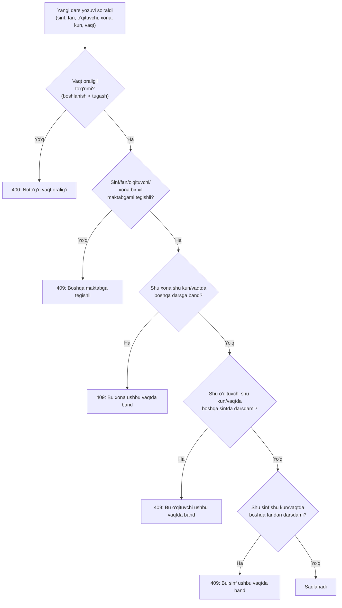
```mermaid
flowchart TD
    Start["Yangi dars yozuvi so'raldi\n(sinf, fan, o'qituvchi, xona, kun, vaqt)"] --> T{"Vaqt oralig'i\nto'g'rimi?\n(boshlanish < tugash)"}
    T -- "Yo'q" --> E1["400: Noto'g'ri vaqt oralig'i"]
    T -- "Ha" --> S{"Sinf/fan/o'qituvchi/\nxona bir xil\nmaktabgami tegishli?"}
    S -- "Yo'q" --> E2["409: Boshqa maktabga tegishli"]
    S -- "Ha" --> R{"Shu xona shu kun/vaqtda\nboshqa darsga band?"}
    R -- "Ha" --> E3["409: Bu xona ushbu vaqtda band"]
    R -- "Yo'q" --> Emp{"Shu o'qituvchi shu kun/vaqtda\nboshqa sinfda darsdami?"}
    Emp -- "Ha" --> E4["409: Bu o'qituvchi ushbu vaqtda band"]
    Emp -- "Yo'q" --> Cls{"Shu sinf shu kun/vaqtda\nboshqa fandan darsdami?"}
    Cls -- "Ha" --> E5["409: Bu sinf ushbu vaqtda band"]
    Cls -- "Yo'q" --> OK["Saqlanadi"]
```

Har uch tekshiruv ham `LessonSlotRepository`da vaqt oralig'i kesishishini (`startTime < :end AND endTime > :start`) JPQL orqali tekshiradigan alohida `existsXxxConflict` metodlari — `excludeId` parametri **yangilashda** dars o'zini o'ziga qarshi to'qnashuv deb hisoblamasligi uchun (o'sha yozuvning o'zi tekshiruvdan chiqarib tashlanadi).

## Dashboard ko'rsatkichlari qanday hisoblanadi

Barchasi `service/DashboardService.java`da, `Asia/Tashkent` vaqt zonasida hisoblanadi.

### Bugungi/kunlik davomat foizi

```
davomat % = (PRESENT + LATE holatidagi yozuvlar soni) / (jami yozuvlar soni) × 100
```
Metod: `attendanceRateOn(schoolId, date)` → `AttendanceRepository.countPresentBySchoolIdAndRecordDate` / `countBySchoolIdAndRecordDate`.

### Sinflar reytingi — uch ko'rsatkich (`getClassRankings`)

| Ko'rsatkich | Formula | Davr |
|---|---|---|
| **Davomat** | `(PRESENT+LATE) / jami × 100` | oxirgi 30 kun |
| **O'rtacha baho** | barcha baholarning arifmetik o'rtachasi | oxirgi 30 kun |
| **Umumiy ball** | `davomat% × 0.5 + normallashtirilgan_baho × 0.5`, bunda `normallashtirilgan_baho = (baho − 2) / (5 − 2) × 100` | oxirgi 30 kun |

Har bir ko'rsatkich uchun **oldingi** 30 kunlik davr bilan solishtirilgan o'zgarish (`Delta`) ham hisoblanadi (masalan "↑2.9"), sinf reytingi kartasida ko'rsatiladi.

### "E'tibor talab qiladi" — uchta qoida (`getAttentionItems`)

1. **`CONSECUTIVE_ABSENCE`** — oxirgi 10 kun ichida o'quvchi **ketma-ket 3 yoki undan ko'p kun** butunlay darsga kelmagan bo'lsa (har kunlik barcha darslarida `ABSENT`).
2. **`LOW_GRADE`** — o'quvchining barcha baholari o'rtachasi **3.0 dan past** bo'lsa (natija ro'yxati 30 tagacha cheklangan).
3. **`MISSING_ATTENDANCE`** — bugungi sinfning **birinchi darsi** boshlanish vaqti allaqachon o'tgan, lekin hali davomat kiritilmagan bo'lsa (30 tagacha cheklangan).

### Fanlar bo'yicha o'rtacha baho

Har bir fan uchun shu fandan qo'yilgan barcha baholarning o'rtachasi (`GradeRepository.averageScoreBySubject`), kamayish tartibida saralanadi.

---

# 10 — O'rnatish va ishga tushirish

**Mundarija**
- [Talablar](#talablar)
- [1-qadam: repozitoriyni olish](#1-qadam-repozitoriyni-olish)
- [2-qadam: bazani tayyorlash](#2-qadam-bazani-tayyorlash)
- [3-qadam: sozlamalar (maxfiy qiymatlar va environment variable'lar)](#3-qadam-sozlamalar-maxfiy-qiymatlar-va-environment-variablelar)
- [4-qadam: backend'ni ishga tushirish](#4-qadam-backendni-ishga-tushirish)
- [5-qadam: frontend'ni ishga tushirish](#5-qadam-frontendni-ishga-tushirish)
- [Ikkalasini birga ishga tushirish](#ikkalasini-birga-ishga-tushirish)
- [Test foydalanuvchilar](#test-foydalanuvchilar)
- [Testlarni ishga tushirish](#testlarni-ishga-tushirish)

## Talablar

| Vosita | Versiya | Izoh |
|---|---|---|
| JDK | 21 | Gradle Wrapper avtomatik shu versiyani talab qiladi (`build.gradle`, toolchain) |
| Gradle | alohida o'rnatish **shart emas** | Loyihada Gradle Wrapper (`gradlew`/`gradlew.bat`, versiya 9.5.1) bor |
| PostgreSQL | islagan versiya (masalan 14+) | Mahalliy ishga tushirilgan bo'lishi kerak, `localhost:5432` |
| Node.js | `>= 26` yoki `^24` yoki `^22.12` | `frontend/package.json`, `engines` maydoni |
| npm | Node bilan birga keladi | Frontend paketlarini o'rnatish uchun |

## 1-qadam: repozitoriyni olish

```bash
git clone <repozitoriy-manzili>
cd maktab-boshqaruv
```

## 2-qadam: bazani tayyorlash

PostgreSQL'da `maktab_db` nomli bo'sh baza yaratiladi (jadvallarni Hibernate o'zi yaratadi — [05-malumotlar-bazasi.md](#migratsiyalar-bu-loyihada-qanday-ishlaydi)):

```sql
CREATE DATABASE maktab_db;
```

Baza foydalanuvchisi standart holatda `postgres`; uning parolini (`<parolingiz>`) 3-qadamda lokal sozlamalar fayliga yozasiz. Parol kodda ham, hujjatlarda ham saqlanmaydi.

## 3-qadam: sozlamalar (maxfiy qiymatlar va environment variable'lar)

Sozlamalar `src/main/resources/application.properties`da (`${VAR:standart_qiymat}`). Maxfiy qiymatlar — **`DB_PASSWORD` va `JWT_SECRET` — standartsiz**: ular berilmasa backend ishga tushmaydi (`Could not resolve placeholder 'JWT_SECRET'`).

**Lokal ishlab chiqish uchun** ularni `local` profil fayliga yozing:

1. Shablondan nusxa oling (fayl `.gitignore`da — hech qachon commit qilinmaydi):
   ```bash
   cp src/main/resources/application-local.properties.example src/main/resources/application-local.properties
   ```
2. `o'zgartiring` yozuvlarini haqiqiy qiymatlar bilan almashtiring:
   ```properties
   spring.datasource.password=<parolingiz>
   jwt.secret=<base64-jwt-secret>
   ```
3. JWT secret uchun yangi tasodifiy qiymat generatsiya qiling (kamida 32 bayt, Base64):
   ```bash
   openssl rand -base64 64 | tr -d '\n'
   ```
   ```powershell
   [Convert]::ToBase64String((1..64 | ForEach-Object { Get-Random -Maximum 256 }) -as [byte[]])
   ```
4. Backend'ni `local` profil bilan ishga tushiring — `start.sh`/`start.bat` va IntelliJ'dagi `MaktabBoshqaruvApplication (local)` konfiguratsiyasi buni avtomatik qiladi (4-qadamga qarang).

**Server/production'da** `application-local.properties` ishlatilmaydi — qiymatlar environment variable orqali beriladi:

| O'zgaruvchi | Standart qiymati | Ma'nosi |
|---|---|---|
| `DB_URL` | `jdbc:postgresql://localhost:5432/maktab_db` | Baza manzili |
| `DB_USERNAME` | `postgres` | Baza foydalanuvchisi |
| `DB_PASSWORD` | **yo'q (majburiy)** | Baza paroli |
| `JWT_SECRET` | **yo'q (majburiy)** | JWT imzolash kaliti (Base64, kamida 32 bayt) |
| `ADMIN_USERNAME` / `ADMIN_PASSWORD` | `admin` / `admin123` | Birinchi ADMIN akkaunt |
| `CORS_ALLOWED_ORIGINS` | `http://localhost:9000` | Qaysi frontend manzilidan so'rov qabul qilinishi |

> **Diqqat:** `ADMIN_PASSWORD`ning standart qiymati (`admin123`) ham faqat lokal/o'rganish uchun — real serverda uni ham albatta almashtiring. `JWT_SECRET` o'zgarsa, avval berilgan barcha tokenlar yaroqsiz bo'lib qoladi (foydalanuvchilar qayta kiradi).

Frontend uchun `frontend/.env` (`frontend/.env.example`dan nusxa):
```
QCLI_API_BASE_URL=http://localhost:8080
```

## 4-qadam: backend'ni ishga tushirish

### Terminal orqali

```bash
SPRING_PROFILES_ACTIVE=local ./gradlew bootRun                   # macOS/Linux/Git Bash
```
```powershell
$env:SPRING_PROFILES_ACTIVE="local"; .\gradlew.bat bootRun        # Windows PowerShell
```

Birinchi ishga tushirishda Gradle kerakli versiyani (9.5.1) avtomatik yuklab oladi. Backend `http://localhost:8080` da ko'tariladi; tayyorligini tekshirish:
```bash
curl http://localhost:8080/api/health
# {"status":"UP"}
```

### IntelliJ IDEA'da

1. Loyihani papka sifatida oching (`Open` → loyiha ildizi) — IntelliJ Gradle loyihasini avtomatik taniydi.
2. Yuqoridagi run konfiguratsiyalar ro'yxatidan **`MaktabBoshqaruvApplication (local)`**ni tanlab ▶ (Run) bosing. Bu konfiguratsiya repozitoriyda (`.run/` papkasi) saqlangan va `local` profilni yoqadi. (`MaktabBoshqaruvApplication.java` ichidagi yashil strelka profilsiz konfiguratsiya yaratadi — undan foydalansangiz, `Edit Configurations → Active profiles` maydoniga `local` yozing.)
3. **Run** va **Debug** rejimlari orasidagi farq: `Run` (Shift+F10) — oddiy ishga tushirish, breakpoint'larga e'tibor bermaydi. `Debug` (Shift+F9) — agar kodda breakpoint (qizil nuqta) qo'yilgan bo'lsa yoki "Exception breakpoint"lar yoqilgan bo'lsa, o'sha joyda **to'xtaydi** va butun ilova muzlaganday ko'rinadi. Login cheksiz aylanib, hech qanday javob kelmasa — avval shu narsani tekshiring: [11-muammolar-va-yechimlar.md](#login-bosilganda-intellij-debuggerda-toxtab-qoladi).

## 5-qadam: frontend'ni ishga tushirish

```bash
cd frontend
npm install
cp .env.example .env      # kerak bo'lsa QCLI_API_BASE_URL'ni o'zgartiring
npm run dev
```

`http://localhost:9000` da ochiladi (`devServer.open: true` tufayli brauzer avtomatik ochiladi). Backend'ning `CORS_ALLOWED_ORIGINS` shu manzilga mos bo'lishi kerak (standart qiymat allaqachon mos).

## Ikkalasini birga ishga tushirish

Loyiha ildizida tayyor skriptlar bor:

```bash
./start.sh        # Git Bash / macOS / Linux — ikkalasini ham fon jarayoni sifatida ishga tushiradi, Ctrl+C ikkalasini ham to'xtatadi
start.bat          # Windows — ikkitasini alohida oynada ochadi
```

Ikkala skript ham `SPRING_PROFILES_ACTIVE` berilmagan bo'lsa `local` profilni yoqadi va `application-local.properties` topilmasa, tushunarli xabar bilan to'xtaydi.

## Test foydalanuvchilar

Birinchi ishga tushirishda (bo'sh baza bilan) seederlar avtomatik quyidagi akkauntlarni yaratadi ([05-malumotlar-bazasi.md — Seed ma'lumotlar](#seed-malumotlar)):

| Username | Parol | Rol | Izoh |
|---|---|---|---|
| `admin` | `admin123` | `ADMIN` | To'liq huquq |
| `direktor` | `direktor123` | `EDITOR` | |
| `ustoz1` | `ustoz123` | `EDITOR` | Bitta `Employee`ga bog'langan — "faqat mening darslarim" filtri ishlaydi |
| `ustoz2` | `ustoz123` | `EDITOR` | Xuddi shunday, boshqa xodimga bog'langan |

## Testlarni ishga tushirish

```bash
./gradlew test
```

13 ta test fayli, jami ~65 ta test (`@SpringBootTest` kontekst-yuklash testi — `local` profil bilan ishlaydi, ya'ni `application-local.properties` va ishlab turgan PostgreSQL talab qiladi + har bir Service uchun Mockito bilan yozilgan unit testlar). Natija: `build/reports/tests/test/index.html`.

Frontend'da rasmiy test fayllari yo'q — sifat `npm run lint` (oxfmt + oxlint) va `npm run build` (Vite kompilyatsiyasi, xato bo'lsa build to'xtaydi) orqali tekshiriladi:

```bash
cd frontend
npm run lint
npm run build
```

---

# 11 — Muammolar va yechimlar

**Mundarija**
- [Login cheksiz aylanadi](#login-cheksiz-aylanadi)
- [Login bosilganda IntelliJ debugger'da to'xtab qoladi](#login-bosilganda-intellij-debuggerda-toxtab-qoladi)
- [8080-port band](#8080-port-band)
- [JDK versiyasi mos emas](#jdk-versiyasi-mos-emas)
- [Bazaga ulanib bo'lmaydi](#bazaga-ulanib-bolmaydi)
- [Flyway/Liquibase xatolari](#flywayliquibase-xatolari)
- [CORS xatosi](#cors-xatosi)
- [401/403 xatolari](#401403-xatolari)
- [LazyInitializationException](#lazyinitializationexception)
- [Ikonkalar o'rniga matn chiqadi](#ikonkalar-orniga-matn-chiqadi)
- [Dark mode'da matn ko'rinmaydi](#dark-modeda-matn-korinmaydi)

## Login cheksiz aylanadi

**Alomat**: Login tugmasi bosiladi, "Yuklanmoqda" holatida qoladi yoki hech narsa bo'lmaydi, xato ham chiqmaydi.

**Sabab**: 99% holatda — **backend ishlamayapti** (ishga tushmagan yoki o'chib qolgan). `LoginPage.vue` avval `GET /api/health`ni tekshiradi, lekin agar backend butunlay javob bermasa (portga ulanib bo'lmasa), so'rov `ECONNABORTED`/tarmoq xatosiga uchraydi.

**Tekshirish**:
```bash
curl -v http://localhost:8080/api/health
```
Agar "Connection refused" chiqsa — backend ishlamayapti.

**Yechim**: backend'ni ishga tushiring ([10-ornatish-va-ishga-tushirish.md](#4-qadam-backendni-ishga-tushirish)) va konsol logini kuzating — "Started MaktabBoshqaruvApplication" degan qator chiqishi kerak.

## Login bosilganda IntelliJ debugger'da to'xtab qoladi

**Alomat**: Backend'ni IntelliJ'da **Debug** rejimida (Shift+F9) ishga tushirgansiz, login tugmasi bosilganda brauzer "muzlab qoladi" — javob kelmaydi, lekin xato ham chiqmaydi.

**Sabab**: IntelliJ'da avvalroq **breakpoint** (qizil nuqta, satr chetida) qo'yilgan bo'lishi mumkin — masalan `AuthController.login()` ichida yoki `JwtAuthFilter`da. Debug rejimida dastur shu qatorga yetganda **to'liq to'xtaydi** va IntelliJ oynasi javob kutayotganini ko'rsatadi (pastdagi "Debug" panelida qizil "to'xtash" belgisi). Bu — xato emas, balki debugger o'z vazifasini bajaryapti; brauzer esa shunchaki javobni kuta beradi.

Yana bir kamdan-kam sabab: agar **"Exception Breakpoint"** (istisno chiqqanda avtomatik to'xtaydigan maxsus breakpoint turi, masalan "har qanday Exception'da to'xta") yoqilgan bo'lsa, `GlobalExceptionHandler` ushlaydigan **oddiy** xatolar (masalan `IllegalStateException` — bu loyihada "topilmadi" holatlari uchun **qasddan** ishlatiladi) ham debugger'ni to'xtatib qo'yadi, garchi bu xato dastur uchun normal oqim bo'lsa ham.

**Yechim**:
1. IntelliJ'ning **Debug** panelida (odatda pastda) barcha breakpoint'larni ko'rib chiqing (`Run → View Breakpoints`, yoki `Ctrl+Shift+F8`), keraksizlarini o'chiring yoki vaqtincha o'chirib qo'ying (checkbox).
2. Agar Exception Breakpoint yoqilgan bo'lsa, uni "faqat ushlanmagan (uncaught) istisnolarda to'xtash" rejimiga o'zgartiring — `IllegalStateException` bu loyihada har doim `GlobalExceptionHandler` tomonidan ushlanadi, shuning uchun "uncaught"ga cheklash debugger'ni keraksiz to'xtatishdan saqlaydi.
3. Oddiy ishlab chiqish/kundalik ishlash uchun **Debug** o'rniga **Run** (Shift+F10) rejimini ishlating — faqat aniq bir xatoni qadam-baqadam kuzatish kerak bo'lgandagina Debug'ga o'ting.

## 8080-port band

**Alomat**: `./gradlew bootRun` ishga tushiriladi, lekin log'da `Port 8080 was already in use` yoki shunga o'xshash xato chiqadi.

**Sabab**: portni allaqachon boshqa jarayon (masalan avvalgi to'xtatilmagan backend nusxasi) band qilib turibdi.

**Yechim (Windows)**:
```powershell
netstat -ano | findstr :8080
taskkill /PID <topilgan_PID> /F
```
**Yechim (macOS/Linux)**:
```bash
lsof -i :8080
kill -9 <topilgan_PID>
```
Muqobil: backend'ni boshqa portda ishga tushirish — `SERVER_PORT=8081 ./gradlew bootRun` (Spring Boot'ning standart `server.port` sozlamasi orqali). Bu holda **frontend'dagi `QCLI_API_BASE_URL`** (`frontend/.env`) yangi portga moslanadi (`http://localhost:8081`) va frontend qayta ishga tushiriladi. `CORS_ALLOWED_ORIGINS`ni o'zgartirish **shart emas** — u backend porti emas, frontend manzilini (`http://localhost:9000`) bildiradi, frontend esa o'z portida qolaveradi.

## JDK versiyasi mos emas

**Alomat**: `./gradlew bootRun` ishga tushirilganda `Unsupported class file major version` yoki `toolchain` bilan bog'liq xato.

**Sabab**: loyiha Java 21'ni talab qiladi (`build.gradle`, `toolchain.languageVersion = JavaLanguageVersion.of(21)`), tizimda eskiroq (masalan Java 17 yoki 11) versiya o'rnatilgan.

**Yechim**: Gradle Toolchain mexanizmi — agar tizimda Java 21 topilmasa, Gradle uni **avtomatik yuklab olishga** harakat qiladi (internet aloqasi kerak). Agar bu ishlamasa, JDK 21'ni qo'lda o'rnating (masalan [Eclipse Temurin](https://adoptium.net)) va `JAVA_HOME`ni shu versiyaga ko'rsating, yoki IntelliJ'da `File → Project Structure → SDK`ni 21'ga o'zgartiring.

## Bazaga ulanib bo'lmaydi

**Alomat**: Backend ishga tushishda `Connection refused` yoki `FATAL: database "maktab_db" does not exist` xatosi bilan to'xtaydi.

**Sabablar va yechimlar**:
- **PostgreSQL ishlamayapti** — xizmatni ishga tushiring (`pg_ctl start`, yoki Windows'da "Services" orqali PostgreSQL xizmatini tekshiring).
- **Baza yaratilmagan** — `CREATE DATABASE maktab_db;` bajarilmagan ([10-ornatish-va-ishga-tushirish.md — 2-qadam](#2-qadam-bazani-tayyorlash)).
- **Login/parol mos emas** (`password authentication failed`) — lokalda `src/main/resources/application-local.properties`dagi `spring.datasource.password=<parolingiz>` qiymatini PostgreSQL parolingizga moslang (foydalanuvchi nomi standart `postgres`, boshqasi bo'lsa `DB_USERNAME`); serverda esa `DB_USERNAME`/`DB_PASSWORD` environment variable orqali bering. Sozlash: [10-ornatish-va-ishga-tushirish.md — 3-qadam](#3-qadam-sozlamalar-maxfiy-qiymatlar-va-environment-variablelar).
- **`Could not resolve placeholder 'DB_PASSWORD'` / `'JWT_SECRET'`** — backend `local` profilsiz ishga tushirilgan yoki `application-local.properties` yaratilmagan. `start.sh`/`start.bat` yoki IntelliJ'dagi `MaktabBoshqaruvApplication (local)` konfiguratsiyasidan foydalaning.
- **Boshqa port** — agar PostgreSQL standart `5432` emas, boshqa portda ishlasa, `DB_URL`ni to'liq o'zgartiring.

## Flyway/Liquibase xatolari

**Bu loyihada Flyway ham, Liquibase ham ishlatilmaydi** — shuning uchun "checksum mismatch" yoki "migration failed" kabi xatolar bu loyihada **yuzaga kelmaydi**. Sxema `spring.jpa.hibernate.ddl-auto=update` orqali avtomatik boshqariladi ([05-malumotlar-bazasi.md — Migratsiyalar](#migratsiyalar-bu-loyihada-qanday-ishlaydi)).

Agar shunga o'xshash "ustun topilmadi" (`column ... does not exist`) xatosi chiqsa, sabab boshqacha: yangi `@Column(nullable = false)` maydon to'la jadvalga standart qiymatsiz qo'shilgan bo'lishi mumkin — Postgres bunday `ALTER TABLE`ni bajara olmaydi va Hibernate buni jimgina o'tkazib yuboradi. Yechim: o'sha maydonni vaqtincha `nullable` (standart) qilib qo'ying, ilovani ishga tushirib ustunni yaratdiring, kerak bo'lsa keyin qo'lda `NOT NULL` cheklovini (standart qiymat bilan birga) qo'shing.

## CORS xatosi

**Alomat**: brauzer konsolida `has been blocked by CORS policy` degan xato, so'rov Network panelida "failed" deb ko'rinadi (garchi backend ishlab tursa ham).

**Sabab**: frontend boshqa manzildan (masalan `http://localhost:9001` yoki boshqa domen) so'rov yuboryapti, lekin backend'ning `CORS_ALLOWED_ORIGINS` sozlamasi shu manzilni o'z ichiga olmaydi.

**Yechim**: `CORS_ALLOWED_ORIGINS` environment variable'ni frontend qaysi manzilda ishlayotgan bo'lsa, shunga moslang (bir nechtasi vergul bilan: `http://localhost:9000,http://192.168.1.5:9000`). O'zgartirgandan so'ng backend'ni qayta ishga tushirish shart (`application.properties` qayta o'qiladi).

## 401/403 xatolari

| Status | Ma'nosi | Sabab | Yechim |
|---|---|---|---|
| **401 Unauthorized** | Token yo'q, noto'g'ri yoki muddati tugagan | Token 10 soatdan keyin tugaydi (`JwtUtil.expirationMs`); yoki `localStorage`dan qo'lda o'chirilgan | Qayta login qiling. Frontend 401 kelganda avtomatik `/login`ga qaytaradi (`boot/axios.js` interceptor) |
| **403 Forbidden** | Token to'g'ri, lekin rolga ruxsat yo'q | Masalan `VIEWER` roli bilan `POST`/`DELETE` so'ralgan, yoki `EDITOR` bilan biror narsani o'chirishga urinilgan | Kerakli rolga ega akkaunt bilan kiring, yoki [07-api.md](#07--api-endpointlar)dagi rol jadvalidan qaysi endpoint qaysi rolga ochiqligini tekshiring |

## LazyInitializationException

**Bu xato haqida**: [13-lugat.md — LazyInitializationException](#lazyinitializationexception-1)da tushuntirilgan.

**Bu loyihada nega kamdan-kam uchraydi**: ikkita sabab bor:
1. Barcha `@ManyToOne` bog'lanishlar standart holatda **EAGER** (darhol yuklanadi) — loyihada hech qayerda `fetch = FetchType.LAZY` qo'lda yozilmagan.
2. `spring.jpa.open-in-view=false` — bu HTTP so'rov tugagach baza ulanishini ochiq qoldirmaydi, shuning uchun agar biror joyda lazy-yuklanadigan maydonga Controller/JSON-serializatsiya bosqichida (Service tugagandan keyin) murojaat qilinsa, xato **darhol** ko'rinadi (jimgina "ba'zan ishlaydi, ba'zan yo'q" degan holat bo'lmaydi).

**Agar shunday xato chiqsa**: sabab — Service metodi tugagandan keyin (masalan Controller'da) Entity'ning hali yuklanmagan bog'lanishiga murojaat qilingan. Yechim: kerakli ma'lumotni Service ichida, Entity hali "tirik" (tranzaksiya ochiq) paytida DTO'ga o'tkazing — bu loyihaning har bir `toResponseDto(...)` metodi aynan shuni qiladi.

## Ikonkalar o'rniga matn chiqadi

**Alomat**: `q-icon` o'rniga ekranda `fact_check`, `dashboard` kabi so'zlar ko'rinadi (ikonka emas).

**Sabab**: Material Icons shrifti yuklanmagan — odatda internet aloqasi yo'qligi (agar shrift build vaqtida to'g'ri joylashtirilmagan/keshlangan bo'lsa) yoki `quasar.config.js`dagi `extras: ['material-icons']` qatori o'chirilgan/olib tashlangan bo'lsa.

**Yechim**: `frontend/quasar.config.js`da `extras` ro'yxatida `'material-icons'` borligini tekshiring, `npm install`ni qayta bajaring (`@quasar/extras` paketi to'g'ri o'rnatilganini tasdiqlash uchun), va build'ni tozalab qayta ishga tushiring (`rm -rf frontend/dist frontend/.quasar && npm run dev`).

## Dark mode'da matn ko'rinmaydi

**Alomat**: dark rejimga o'tilganda, ba'zi matn/fon kombinatsiyasi o'qib bo'lmaydigan darajada past kontrastli bo'lib qoladi (masalan qora matn qora fonda).

**Sabab**: kimdir CSS'da to'g'ridan-to'g'ri qattiq rang (`color: #000`, `background: white`, yoki Quasar'ning `bg-white`/`text-dark` kabi utility klasslari) yozgan — bular **hech qachon** dark mode'ga moslashmaydi, chunki ular doim bir xil qiymatda qoladi.

**Yechim**: loyihaning qat'iy qoidasi — har qanday rang **faqat** `css/app.scss`da e'lon qilingan CSS custom property (`var(--card-bg)`, `var(--text-primary)`, `var(--brand-border)`, `var(--brand-text-muted)` va h.k.) orqali yozilishi kerak, hech qachon qattiq hex qiymat yoki Quasar'ning `bg-*`/`text-*` fiksatsiya qiluvchi utility klasslari orqali emas. Yangi komponent yozganda mavjud tokenlar ro'yxati uchun: [08-frontend.md — Tema tizimi](#tema-tizimi-darklight-dizayn-tokenlari).

---

# 12 — Yangi modul qo'shish

**Mundarija**
- [Misol: "Kutubxona kitoblari" moduli](#misol-kutubxona-kitoblari-moduli)
- [1. Entity](#1-entity)
- [2. Repository](#2-repository)
- [3. DTO](#3-dto)
- [4. Service](#4-service)
- [5. Controller (xavfsizlik va ruxsatlar shu yerda)](#5-controller-xavfsizlik-va-ruxsatlar-shu-yerda)
- [6. Frontend: modules.js — bitta konfiguratsiya, yangi sahifa kerak emas](#6-frontend-modulesjs--bitta-konfiguratsiya-yangi-sahifa-kerak-emas)
- [7. Router va sidebar — hech narsa qilish shart emas](#7-router-va-sidebar--hech-narsa-qilish-shart-emas)
- [8. Seed (ixtiyoriy)](#8-seed-ixtiyoriy)
- [9. Test](#9-test)
- [Tekshirish ro'yxati](#tekshirish-royxati)

## Misol: "Kutubxona kitoblari" moduli

Har bir sinf/maktab uchun kutubxona kitoblari ro'yxatini boshqaradigan yangi modul qo'shamiz: sarlavha, muallif, jami nusxa soni, mavjud nusxa soni. Bu — loyihadagi **oddiy CRUD modul** (Rooms/Buildings kabi) qanday qo'shilishining to'liq amaliy misoli, mavjud uslubga qat'iy rioya qilgan holda.

**Migratsiya kerak emas**: bu loyihada Flyway/Liquibase yo'q — yangi `@Entity` yozilib, ilova qayta ishga tushirilishi bilan (`ddl-auto=update`) jadval avtomatik yaratiladi ([05-malumotlar-bazasi.md](#migratsiyalar-bu-loyihada-qanday-ishlaydi)).

## 1. Entity

`src/main/java/uz/azizbek/maktabboshqaruv/entity/LibraryBook.java`:

```java
package uz.azizbek.maktabboshqaruv.entity;
import jakarta.persistence.*;

@Entity
@Table(name = "library_book")
public class LibraryBook {

    @Id
    @GeneratedValue(strategy = GenerationType.IDENTITY)
    private Long id;

    @ManyToOne
    @JoinColumn(name = "school_id", nullable = false)
    private School school;

    @Column(nullable = false)
    private String title;

    @Column(nullable = false)
    private String author;

    @Column(nullable = false)
    private Integer totalCopies;

    @Column(nullable = false)
    private Integer availableCopies;

    public Long getId() { return id; }
    public void setId(Long id) { this.id = id; }

    public School getSchool() { return school; }
    public void setSchool(School school) { this.school = school; }

    public String getTitle() { return title; }
    public void setTitle(String title) { this.title = title; }

    public String getAuthor() { return author; }
    public void setAuthor(String author) { this.author = author; }

    public Integer getTotalCopies() { return totalCopies; }
    public void setTotalCopies(Integer totalCopies) { this.totalCopies = totalCopies; }

    public Integer getAvailableCopies() { return availableCopies; }
    public void setAvailableCopies(Integer availableCopies) { this.availableCopies = availableCopies; }
}
```

> **Diqqat**: yangi maydonlar hech biri `nullable=false` bilan **allaqachon to'la jadvalga** qo'shilmayapti (yangi jadval, bo'sh boshlanadi), shuning uchun bu xavfsiz. Agar kelajakda **mavjud, to'la** jadvalga yangi majburiy ustun qo'shsangiz, [05-malumotlar-bazasi.md](#migratsiyalar-bu-loyihada-qanday-ishlaydi)dagi ogohlantirishga rioya qiling.

## 2. Repository

`src/main/java/uz/azizbek/maktabboshqaruv/repository/LibraryBookRepository.java`:

```java
package uz.azizbek.maktabboshqaruv.repository;

import uz.azizbek.maktabboshqaruv.entity.LibraryBook;
import org.springframework.data.domain.Page;
import org.springframework.data.domain.Pageable;
import org.springframework.data.jpa.repository.JpaRepository;

public interface LibraryBookRepository extends JpaRepository<LibraryBook, Long> {
    Page<LibraryBook> findBySchoolId(Long schoolId, Pageable pageable);
}
```

## 3. DTO

`src/main/java/uz/azizbek/maktabboshqaruv/dto/LibraryBookRequestDto.java`:

```java
package uz.azizbek.maktabboshqaruv.dto;

import jakarta.validation.constraints.Min;
import jakarta.validation.constraints.NotBlank;
import jakarta.validation.constraints.NotNull;

public class LibraryBookRequestDto {

    @NotNull(message = "Maktab tanlanishi shart")
    private Long schoolId;

    @NotBlank(message = "Kitob nomi kiritilishi shart")
    private String title;

    @NotBlank(message = "Muallif kiritilishi shart")
    private String author;

    @NotNull @Min(value = 1, message = "Nusxalar soni kamida 1 bo'lishi kerak")
    private Integer totalCopies;

    // getter/setter — BuildingRequestDto.java uslubida
}
```

`src/main/java/uz/azizbek/maktabboshqaruv/dto/LibraryBookResponseDto.java` — tekis (flat) shakl, `schoolName` kabi qo'shimcha o'qish uchun qulay maydonlar bilan:

```java
package uz.azizbek.maktabboshqaruv.dto;

public class LibraryBookResponseDto {
    private Long id;
    private String title;
    private String author;
    private Integer totalCopies;
    private Integer availableCopies;
    private Long schoolId;
    private String schoolName;
    // getter/setter — BuildingResponseDto.java uslubida
}
```

## 4. Service

`src/main/java/uz/azizbek/maktabboshqaruv/service/LibraryBookService.java` — mavjud `BuildingService.java` bilan **bir xil naqsh**:

```java
package uz.azizbek.maktabboshqaruv.service;

import uz.azizbek.maktabboshqaruv.dto.LibraryBookRequestDto;
import uz.azizbek.maktabboshqaruv.dto.LibraryBookResponseDto;
import uz.azizbek.maktabboshqaruv.entity.LibraryBook;
import uz.azizbek.maktabboshqaruv.entity.School;
import uz.azizbek.maktabboshqaruv.repository.LibraryBookRepository;
import uz.azizbek.maktabboshqaruv.repository.SchoolRepository;
import org.springframework.beans.factory.annotation.Autowired;
import org.springframework.data.domain.Page;
import org.springframework.data.domain.Pageable;
import org.springframework.stereotype.Service;
import org.springframework.transaction.annotation.Transactional;

@Service
public class LibraryBookService {

    @Autowired private LibraryBookRepository libraryBookRepository;
    @Autowired private SchoolRepository schoolRepository;

    public Page<LibraryBookResponseDto> getAllBooks(Long schoolId, Pageable pageable) {
        return libraryBookRepository.findBySchoolId(schoolId, pageable).map(this::toResponseDto);
    }

    public LibraryBookResponseDto getBookById(Long id) {
        return toResponseDto(libraryBookRepository.findById(id)
                .orElseThrow(() -> new IllegalStateException("Bunday kitob topilmadi: " + id)));
    }

    @Transactional
    public LibraryBookResponseDto createBook(LibraryBookRequestDto request) {
        School school = schoolRepository.findById(request.getSchoolId())
                .orElseThrow(() -> new IllegalStateException("Bunday maktab mavjud emas"));

        LibraryBook book = new LibraryBook();
        book.setSchool(school);
        book.setTitle(request.getTitle());
        book.setAuthor(request.getAuthor());
        book.setTotalCopies(request.getTotalCopies());
        book.setAvailableCopies(request.getTotalCopies());   // yangi kitob — hammasi mavjud

        return toResponseDto(libraryBookRepository.save(book));
    }

    @Transactional
    public LibraryBookResponseDto updateBook(Long id, LibraryBookRequestDto request) {
        LibraryBook book = libraryBookRepository.findById(id)
                .orElseThrow(() -> new IllegalStateException("Bunday kitob topilmadi: " + id));
        book.setTitle(request.getTitle());
        book.setAuthor(request.getAuthor());
        book.setTotalCopies(request.getTotalCopies());
        return toResponseDto(libraryBookRepository.save(book));
    }

    @Transactional
    public void deleteBook(Long id) {
        if (!libraryBookRepository.existsById(id)) {
            throw new IllegalStateException("Bunday kitob topilmadi: " + id);
        }
        libraryBookRepository.deleteById(id);
    }

    private LibraryBookResponseDto toResponseDto(LibraryBook book) {
        LibraryBookResponseDto dto = new LibraryBookResponseDto();
        dto.setId(book.getId());
        dto.setTitle(book.getTitle());
        dto.setAuthor(book.getAuthor());
        dto.setTotalCopies(book.getTotalCopies());
        dto.setAvailableCopies(book.getAvailableCopies());
        dto.setSchoolId(book.getSchool().getId());
        dto.setSchoolName(book.getSchool().getName());
        return dto;
    }
}
```

## 5. Controller (xavfsizlik va ruxsatlar shu yerda)

`src/main/java/uz/azizbek/maktabboshqaruv/controller/LibraryBookController.java`:

```java
package uz.azizbek.maktabboshqaruv.controller;

import uz.azizbek.maktabboshqaruv.dto.LibraryBookRequestDto;
import uz.azizbek.maktabboshqaruv.dto.LibraryBookResponseDto;
import uz.azizbek.maktabboshqaruv.service.LibraryBookService;
import org.springframework.beans.factory.annotation.Autowired;
import org.springframework.data.domain.Page;
import org.springframework.data.domain.Pageable;
import org.springframework.http.ResponseEntity;
import org.springframework.security.access.prepost.PreAuthorize;
import org.springframework.web.bind.annotation.*;
import jakarta.validation.Valid;

@RestController
@RequestMapping("/api/library-books")
public class LibraryBookController {

    @Autowired private LibraryBookService libraryBookService;

    @PreAuthorize("hasAnyRole('ADMIN', 'EDITOR', 'VIEWER')")
    @GetMapping
    public Page<LibraryBookResponseDto> getAllBooks(@RequestParam Long schoolId, Pageable pageable) {
        return libraryBookService.getAllBooks(schoolId, pageable);
    }

    @PreAuthorize("hasAnyRole('ADMIN', 'EDITOR', 'VIEWER')")
    @GetMapping("/{id}")
    public ResponseEntity<LibraryBookResponseDto> getBookById(@PathVariable Long id) {
        return ResponseEntity.ok(libraryBookService.getBookById(id));
    }

    @PreAuthorize("hasAnyRole('ADMIN', 'EDITOR')")
    @PostMapping
    public ResponseEntity<LibraryBookResponseDto> createBook(@Valid @RequestBody LibraryBookRequestDto request) {
        return ResponseEntity.status(201).body(libraryBookService.createBook(request));
    }

    @PreAuthorize("hasAnyRole('ADMIN', 'EDITOR')")
    @PutMapping("/{id}")
    public ResponseEntity<LibraryBookResponseDto> updateBook(@PathVariable Long id, @Valid @RequestBody LibraryBookRequestDto request) {
        return ResponseEntity.ok(libraryBookService.updateBook(id, request));
    }

    @PreAuthorize("hasRole('ADMIN')")
    @DeleteMapping("/{id}")
    public ResponseEntity<String> deleteBook(@PathVariable Long id) {
        libraryBookService.deleteBook(id);
        return ResponseEntity.ok("ID " + id + " bilan kitob muvaffaqiyatli o'chirildi");
    }
}
```

Ruxsat naqshi loyihaning har bir oddiy CRUD moduli bilan bir xil: o'qish — hammaga, yaratish/yangilash — `ADMIN`/`EDITOR`, o'chirish — faqat `ADMIN` ([06-backend.md — Rollar va ruxsatlar](#rollar-va-ruxsatlar)).

Backend endi tayyor. `./gradlew bootRun` bilan qayta ishga tushirilganda `library_book` jadvali avtomatik yaratiladi.

## 6. Frontend: modules.js — bitta konfiguratsiya, yangi sahifa kerak emas

Bu — loyihaning eng katta qulayligi: `pages/CrudPage.vue` **universal** bo'lgani uchun ([08-frontend.md — CrudPage](#crudpage-universal-komponent)), yangi `.vue` fayl yozish shart **emas**. Faqat `frontend/src/config/modules.js`dagi `modules` massiviga yangi obyekt qo'shiladi:

```js
{
  key: 'library-books',
  title: 'Kutubxona kitoblari',
  icon: 'menu_book',
  color: '#7c3aed',
  group: 'Kundalik hayot',
  endpoint: '/api/library-books',
  schoolScoped: true,
  columns: [
    { name: 'id', label: 'ID', field: 'id', sortable: true, align: 'left' },
    { name: 'title', label: 'Nomi', field: 'title', sortable: true, align: 'left' },
    { name: 'author', label: 'Muallif', field: 'author', align: 'left' },
    { name: 'availableCopies', label: 'Mavjud', field: 'availableCopies', align: 'left' },
    { name: 'totalCopies', label: 'Jami', field: 'totalCopies', align: 'left' }
  ],
  fields: [
    { key: 'title', label: 'Nomi', type: 'text', required: true },
    { key: 'author', label: 'Muallif', type: 'text', required: true },
    { key: 'totalCopies', label: 'Nusxalar soni', type: 'number', required: true },
    { key: 'schoolId', label: 'Maktab', autoSchool: true, required: true }
  ]
}
```

Tushuntirish: `group: 'Kundalik hayot'` — sidebar'da mavjud "Kundalik hayot" bo'limiga (E'lonlar, Tadbirlar, Xulq yozuvlari bilan bir qatorda) avtomatik qo'shiladi. `schoolScoped: true` — ro'yxat va forma avtomatik joriy maktabga bog'lanadi (`schoolId: autoSchool: true` maydoni forma yuborilganda avtomatik to'ldiriladi, foydalanuvchi tanlamaydi).

## 7. Router va sidebar — hech narsa qilish shart emas

- **Router**: `/app/:moduleKey` marshruti allaqachon `library-books` kalitini ham avtomatik ushlaydi (`router/routes.js`ga hech narsa qo'shilmaydi).
- **Sidebar**: `MainLayout.vue`dagi `groupedModules` computed'i `modules.js`ni o'qib, avtomatik guruhlaydi — hech qanday qo'lda qo'shish kerak emas ([08-frontend.md — Layout](#layout-mainlayout-va-pagelayout)).

## 8. Seed (ixtiyoriy)

Agar demo ma'lumot kerak bo'lsa, `config/OperationalDataSeeder.java`ga (yoki yangi, alohida `@Order`li seederga) o'xshash naqshda qo'shiladi — mavjudligini tekshirib, bo'lmasa yaratadi (idempotent, batafsil: [05-malumotlar-bazasi.md — Seed ma'lumotlar](#seed-malumotlar)).

## 9. Test

`src/test/java/uz/azizbek/maktabboshqaruv/service/LibraryBookServiceTest.java` — `BuildingServiceTest.java` bilan bir xil Mockito naqshi:

```java
package uz.azizbek.maktabboshqaruv.service;

import uz.azizbek.maktabboshqaruv.dto.LibraryBookRequestDto;
import uz.azizbek.maktabboshqaruv.entity.School;
import uz.azizbek.maktabboshqaruv.repository.LibraryBookRepository;
import uz.azizbek.maktabboshqaruv.repository.SchoolRepository;
import org.junit.jupiter.api.Test;
import org.junit.jupiter.api.extension.ExtendWith;
import org.mockito.InjectMocks;
import org.mockito.Mock;
import org.mockito.junit.jupiter.MockitoExtension;

import java.util.Optional;

import static org.junit.jupiter.api.Assertions.assertThrows;
import static org.mockito.ArgumentMatchers.any;
import static org.mockito.Mockito.never;
import static org.mockito.Mockito.verify;
import static org.mockito.Mockito.when;

@ExtendWith(MockitoExtension.class)
class LibraryBookServiceTest {

    @Mock private LibraryBookRepository libraryBookRepository;
    @Mock private SchoolRepository schoolRepository;
    @InjectMocks private LibraryBookService libraryBookService;

    @Test
    void createBook_unknownSchool_throws() {
        LibraryBookRequestDto request = new LibraryBookRequestDto();
        request.setSchoolId(1L);
        when(schoolRepository.findById(1L)).thenReturn(Optional.empty());

        assertThrows(IllegalStateException.class, () -> libraryBookService.createBook(request));
        verify(libraryBookRepository, never()).save(any());
    }

    @Test
    void deleteBook_notFound_throws() {
        when(libraryBookRepository.existsById(1L)).thenReturn(false);
        assertThrows(IllegalStateException.class, () -> libraryBookService.deleteBook(1L));
    }
}
```

## Tekshirish ro'yxati

| Qadam | Fayl | Bajarilganmi |
|---|---|---|
| Entity | `entity/LibraryBook.java` | ☐ |
| Repository | `repository/LibraryBookRepository.java` | ☐ |
| Request/Response DTO | `dto/LibraryBookRequestDto.java`, `dto/LibraryBookResponseDto.java` | ☐ |
| Service (`@Transactional` yozuvchi metodlarda) | `service/LibraryBookService.java` | ☐ |
| Controller (`@PreAuthorize` har bir metodda) | `controller/LibraryBookController.java` | ☐ |
| Frontend konfiguratsiyasi | `frontend/src/config/modules.js` | ☐ |
| Backend qayta ishga tushirildi, jadval yaratilganini tekshirish | — | ☐ |
| Brauzerda: sidebar'da ko'rinishi, CRUD amallarni qo'lda sinab ko'rish | — | ☐ |
| Test | `test/.../service/LibraryBookServiceTest.java` | ☐ |
| `./gradlew test`, `npm run lint`, `npm run build` xatosiz o'tishi | — | ☐ |

---

# 13 — Lug'at

Barcha atamalar oddiy tilda, alifbo tartibida (lotin harflari bo'yicha).

**Mundarija**
A · B · C · D · E · F · G · H · I · J · L · M · N · O · P · R · S · T

---

### Annotatsiya (annotation)

Java kodida `@` belgisi bilan boshlanadigan, klass/metod/maydonga "yorliq" qo'yish usuli (masalan `@Entity`, `@GetMapping`). O'zi hech narsa bajarmaydi, lekin Spring kabi freymvorklarga "bu klass/metod bilan nima qilish kerakligini" aytadi.

### API (Application Programming Interface)

Ikki dastur bir-biri bilan qanday "gaplashishi" kerakligini belgilaydigan qoidalar to'plami. Bu loyihada — backend'ning frontend'ga taqdim etadigan barcha `/api/...` yo'llari.

### Bean

Spring tomonidan boshqariladigan (yaratiladigan, hayot siklini kuzatadigan) obyekt. `@Service`, `@Repository`, `@Component` bilan belgilangan har bir klass — Bean.

### BCrypt

Parolni xavfsiz saqlash algoritmi: parolni qaytarib bo'lmaydigan (bir tomonlama) "xesh"ga aylantiradi, va har safar tasodifiy "tuz" qo'shadi. Batafsil: [06-backend.md — Parol xeshlash](#parol-xeshlash-bcrypt).

### Build

Loyiha manba kodini ishga tayyor holatga keltirish jarayoni (backend'da: kompilyatsiya + `.jar` yig'ish, `./gradlew build`; frontend'da: JS/CSS'ni optimallashtirib, statik fayllarga aylantirish, `npm run build`).

### Component (komponent)

Vue'da: mustaqil, qayta ishlatiladigan UI bo'lagi (bitta `.vue` fayl). Batafsil: [08-frontend.md — Vue asoslari](#vue-asoslari--loyihadagi-misollar-bilan).

### Controller

HTTP so'rovlarni qabul qiluvchi qatlam (`@RestController`). Batafsil: [06-backend.md — Controller](#controller).

### CORS (Cross-Origin Resource Sharing)

Brauzer xavfsizlik siyosati: turli manzil (port/domen)dagi sayt/server orasidagi so'rovlarni server aniq ruxsat bermaguncha bloklaydi. Batafsil: [06-backend.md — CORS](#cors).

### Dependency Injection (DI, "bog'liqlikni tashqaridan berish")

Klass o'ziga kerakli obyektni (masalan Repository'ni) o'zi `new` bilan yaratmasdan, Spring tomonidan "tashqaridan" avtomatik berilishi (`@Autowired`). Bu — IoC tamoyilining amaliy ko'rinishi.

### DTO (Data Transfer Object)

Ma'lumotni bir qatlamdan ikkinchisiga (masalan Service'dan Controller'ga, keyin JSON'ga) tashish uchun mo'ljallangan, oddiy Java klassi. Entity emas — nega alohida kerakligi: [06-backend.md — Entity, DTO va Mapper](#entity-dto-va-mapper).

### Endpoint

API'ning bitta aniq "eshigi": bitta HTTP metod + bitta URL kombinatsiyasi (masalan `GET /api/rooms/{id}`).

### Entity

Baza jadvalining bevosita Java aksi (`@Entity` bilan belgilangan klass). Bitta Entity obyekti = bazadagi bitta qator.

### Filter

Har bir HTTP so'rov Controller'ga yetib borishidan **oldin** ishga tushadigan kod bo'lagi (masalan `JwtAuthFilter` — tokenni tekshiradi). Interceptor'dan farqi: Filter — servlet konteyneri (Tomcat) darajasida, freymvorkdan mustaqil ishlaydi.

### Guard

Vue Router'da: sahifaga o'tishdan oldin ishga tushadigan, "ruxsat bormi" tekshiruvchi funksiya (`Router.beforeEach`). Batafsil: [08-frontend.md — Router va himoyalangan sahifalar](#router-va-himoyalangan-sahifalar).

### Hibernate

JPA standartining eng ko'p ishlatiladigan implementatsiyasi — Java obyektlarini haqiqiy SQL so'rovlariga aylantiruvchi kutubxona.

### HTTP metodlari

Brauzer/klient serverga "nima qilmoqchiligini" bildiruvchi so'rov turlari: **GET** (ma'lumot olish), **POST** (yangi narsa yaratish), **PUT** (mavjudni to'liq yangilash), **DELETE** (o'chirish).

### Idempotent

Bir xil amalni bir necha marta takrorlash bir marta bajarishdan farq qilmaydigan xususiyat. Masalan `DELETE /api/rooms/5` — birinchi chaqiriqda o'chiradi, ikkinchisida ham natija bir xil ("bu xona yo'q"). Loyihadagi seederlar ham idempotent qilib yozilgan — qayta ishga tushirilsa, ma'lumotni takrorlamaydi.

### Interceptor

axios'da: har bir chiqayotgan so'rov yoki kirayotgan javobni "ushlab qolib" o'zgartirish imkoni (masalan token qo'shish, 401'da chiqarish). Batafsil: [08-frontend.md — axios sozlamalari va interceptor'lar](#axios-sozlamalari-va-interceptorlar).

### IoC (Inversion of Control, "boshqaruvni teskari aylantirish")

Odatiy dasturlashda klass o'ziga kerakli obyektlarni o'zi yaratadi; IoC'da esa freymvork (Spring) buni klass o'rniga bajaradi va tayyor obyektni beradi. Dependency Injection — shu tamoyilning amalga oshirilishi.

### JPA (Java Persistence API)

Java obyektlarini baza jadvaliga moslashtirish uchun standart interfeys (spetsifikatsiya, aniq kutubxona emas).

### JPQL (Java Persistence Query Language)

JPA'ning o'z so'rov tili, SQL'ga o'xshash, lekin jadval/ustun nomlari o'rniga Entity klass/maydon nomlari ishlatiladi. Misollar: [05-malumotlar-bazasi.md — JPA metodlari qanday SQL'ga aylanadi](#jpa-metodlari-qanday-sqlga-aylanadi).

### JSON (JavaScript Object Notation)

Matn shaklida ma'lumot almashish formati (`{"key": "value"}`), API so'rov/javoblarining standart tanasi.

### JWT (JSON Web Token)

Foydalanuvchi haqidagi ma'lumotni o'zida tashuvchi, raqamli imzo bilan tasdiqlangan token. Batafsil: [03-texnologiyalar.md — JWT](#jwt-jjwt-kutubxonasi).

### Lazy/Eager loading

Bog'liq ma'lumot **qachon** yuklanishi: **eager** — darhol, asosiy so'rov bilan birga; **lazy** — faqat aynan shu maydonga murojaat qilingandagina, alohida qo'shimcha so'rov bilan. Bu loyihada barcha `@ManyToOne` bog'lanishlar standart bo'yicha **eager**.

### LazyInitializationException

Hibernate'ning "lazy" (kechiktirilgan) yuklanadigan maydoniga, baza ulanishi (tranzaksiya/sessiya) allaqachon yopilgandan keyin murojaat qilinsa chiqadigan xato. Oddiy tilda: siz "keyinroq olib kelaman" deb va'da qilingan ma'lumotni so'rayapsiz, lekin uni olib keladigan "xat tashuvchi" (baza ulanishi) allaqachon ketib qolgan. Bu loyihada kamdan-kam uchraydi, chunki barcha `@ManyToOne` bog'lanishlar eager (darhol yuklanadi), va `spring.jpa.open-in-view=false` tufayli, agar shunday xato bo'lsa ham, u yashirin qolmay, **darhol** ko'rinadi. Batafsil: [06-backend.md — application.properties](#applicationproperties) va [11-muammolar-va-yechimlar.md](#lazyinitializationexception).

### Migratsiya

Baza sxemasini (jadval/ustun qo'shish, o'zgartirish) versiyalab, har bir o'zgarishni alohida, tartiblangan fayl sifatida boshqarish usuli (Flyway/Liquibase kabi vositalar bilan). Bu loyihada ishlatilmaydi — [05-malumotlar-bazasi.md](#migratsiyalar-bu-loyihada-qanday-ishlaydi)ga qarang.

### N+1 muammosi

Bitta so'rov o'rniga, ro'yxatdagi har bir element uchun **qo'shimcha** alohida so'rov yuborilib ketishi (masalan 20 ta xonani olish uchun 1 ta so'rov, keyin har birining binosi uchun yana 20 ta so'rov — jami 21 ta, "N+1"). Sabab — lazy loading'ni e'tiborsiz ishlatish. Bu loyihada barcha bog'lanishlar eager bo'lgani va Repository darajasida aniq JOIN so'rovlar yozilgani uchun bu muammo kamdan-kam uchraydi.

### ORM (Object-Relational Mapping)

Java obyektlari (ob'ekt dunyosi) va baza jadvallari (relyatsion dunyo) orasidagi "tarjimon" yondashuvining umumiy nomi. Hibernate — ORM'ning bitta implementatsiyasi.

### Pagination (sahifalash)

Katta ro'yxatni bir vaqtda to'liq emas, kichik "sahifalar" (masalan 20 tadan) qilib qaytarish. Loyihada `Pageable`/`Page<T>` orqali amalga oshiriladi.

### Props

Vue'da: ota-komponentdan bola-komponentga uzatiladigan ma'lumot (bir tomonlama, yuqoridan pastga). Batafsil: [08-frontend.md — Vue asoslari](#vue-asoslari--loyihadagi-misollar-bilan).

### Repository

Bazaga to'g'ridan-to'g'ri murojaat qiluvchi qatlam, Spring Data JPA interfeysi orqali. Batafsil: [06-backend.md — Repository](#repository).

### REST (Representational State Transfer)

API qurish uslubi: har bir resurs (masalan "o'quvchi") o'z URL'iga ega, va standart HTTP metodlari (GET/POST/PUT/DELETE) orqali boshqariladi.

### Router

Vue'da: URL manzil bilan qaysi sahifa (komponent) ko'rsatilishini bog'lovchi tizim.

### Seed (ma'lumot urug'i)

Ilova birinchi marta ishga tushirilganda avtomatik yaratiladigan namunaviy/boshlang'ich ma'lumot (masalan dastlabki ADMIN foydalanuvchi). Batafsil: [05-malumotlar-bazasi.md — Seed ma'lumotlar](#seed-malumotlar).

### Service

Biznes mantiq qatlami: qoidalarni tekshiradi, bir nechta Repository'ni birlashtiradi. Batafsil: [06-backend.md — Service va @Transactional](#service-va-transactional).

### SPA (Single Page Application, "bitta sahifali ilova")

Brauzer bitta HTML sahifani yuklaydi, keyingi barcha navigatsiya sahifa qayta yuklanmasdan, JavaScript orqali bo'ladigan veb-ilova turi.

### Store

Vue ilovasida bir nechta komponent orasida umumiy holatni (masalan "kim tizimga kirgan") saqlovchi joy (bu loyihada — Pinia).

### Tranzaksiya (transaction)

Bir nechta baza amalini "bitta bo'lak" qilib bog'lash: yoki hammasi muvaffaqiyatli bajariladi, yoki (xato chiqsa) hammasi bekor qilinadi. Spring'da `@Transactional` annotatsiyasi orqali. Batafsil: [06-backend.md — Service va @Transactional](#service-va-transactional).

---

# 14 — Kelajak rejalari

**Mundarija**
- [Hozirgi cheklovlar](#hozirgi-cheklovlar)
- [Bajarildi](#bajarildi)
- [Rejalashtirilgan takomillashtirishlar](#rejalashtirilgan-takomillashtirishlar)

## Hozirgi cheklovlar

Bu loyiha qasddan **oddiy va o'rganish uchun tushunarli** qilib qurilgan — quyidagilar hozircha yo'q yoki soddalashtirilgan (koddan tasdiqlangan):

- **Migratsiya vositasi yo'q** (Flyway/Liquibase) — sxema `ddl-auto=update` bilan avtomatik boshqariladi, versiyalangan tarix yo'q. Batafsil: [05-malumotlar-bazasi.md](#migratsiyalar-bu-loyihada-qanday-ishlaydi).
- **API hujjat sahifasi yo'q** (Swagger/springdoc) — barcha endpoint qo'lda yozilgan `.md` fayllarda ([07-api.md](#07--api-endpointlar)).
- **Avtomatik Entity↔DTO mapper yo'q** (MapStruct) — har bir Service'da qo'lda yozilgan `toResponseDto(...)`.
- **Frontend'da avtomatlashtirilgan testlar yo'q** — faqat lint + build + qo'lda (Playwright bilan ad-hoc) tekshiruv.
- **Docker/konteynerlashtirish yo'q** — loyiha to'g'ridan-to'g'ri JVM va Node ustida ishga tushiriladi, `Dockerfile`/`docker-compose.yml` mavjud emas.
- **CI/CD yo'q** — `.github/workflows` yoki shunga o'xshash avtomatik build/test quvuri yo'q.
- **JWT yangilanish (refresh token) mexanizmi yo'q** — token 10 soatdan keyin oddiy tugaydi, foydalanuvchi qayta login qilishi kerak.
- **Bitta til** — faqat o'zbekcha, `vue-i18n` kabi ko'p tillilik kutubxonasi ulanmagan.
- **PWA (Progressive Web App) emas** — offline ishlash, mobil qurilmaga "o'rnatish" imkoniyati yo'q (Quasar bu imkoniyatni beradi, lekin loyihada yoqilmagan).
- **Ma'lumotlar bazasida ko'p tenantlilik izolyatsiyasi yo'q** — barcha maktablar bitta bazada, bitta sxemada, faqat `school_id` bo'yicha filtrlash orqali ajratilgan (haqiqiy sxema/baza darajasidagi izolyatsiya emas). Batafsil: [02-arxitektura.md — Ko'p maktablilik](#kop-maktablilik-multi-school-qanday-ishlaydi).
- **Foydalanuvchilar maktabga bog'lanmagan — maktablararo ruxsat izolyatsiyasi yo'q.** `User` entity'sida `School` maydoni yo'q (faqat ixtiyoriy `employee`), `schoolId` esa frontend yuboradigan oddiy so'rov parametri. Natijada istalgan `EDITOR`/`VIEWER` `schoolId`ni almashtirib, **boshqa maktab** ma'lumotlarini ko'ra oladi (`EDITOR` esa o'zgartira ham oladi). Haqiqiy ko'p maktabli foydalanish uchun `User`ni maktabga bog'lash va backend'da har bir so'rovda `schoolId`ni shu bog'lanish bo'yicha tekshirish kerak.
- **N+1 so'rov xavfi** — barcha 23 ta `@ManyToOne` bog'lanish `fetch` ko'rsatilmagan, ya'ni JPA standarti bo'yicha `EAGER`. Ro'yxat qaytaruvchi so'rovlarda Hibernate har bir qatorning bog'langan obyektlarini (masalan `LessonSlot` → sinf, fan, xodim, xona) alohida `SELECT`lar bilan yuklashi mumkin — ma'lumot ko'paygan sari sekinlashadi. Yechim: `@ManyToOne(fetch = FetchType.LAZY)` va kerakli joylarda `JOIN FETCH`/`@EntityGraph`.

## Bajarildi

### Telegram bot — ota-onalarga bildirishnoma ✅

**Bajarildi (30.09.2026).** Ota-onalar Telegram orqali quyidagi xabarlarni oladi:
- **davomat** — kelmadi/kechikdi;
- **baho** — yangi yoki o'zgartirilgan;
- **e'lonlar** — maktab bo'yicha yoki sinf bo'yicha.

Bog'lash ikki yo'l bilan qilinadi: deep link/QR kod yoki telefon raqamini ulashish. Bot long polling rejimida ishlaydi (ochiq manzil kerak emas). Xabarlar outbox (`notification_log`) orqali ishonchli yuboriladi: dedup, Telegram limitlari, 429/403 ishlovi, tinch soatlar. Admin panelda o'quvchi profilidagi Telegram bloki, sinf uchun QR varaq va «Xabarnomalar» sahifasi bor. Token faqat lokal faylda yoki muhit o'zgaruvchisida saqlanadi.

To'liq tavsif va administrator yo'riqnomasi: [15-telegram-bot.md](#15--telegram-bot-ota-onalar-uchun).

Dastlabki rejadan farqlar:
- `Student`da bitta `telegramChatId` o'rniga alohida `ParentTelegramLink` jadvali ishlatildi — bir o'quvchiga bir nechta ota-ona bog'lanishi mumkin.
- Tadbirlar (`CalendarEvent`) haqida eslatmalar hozircha yuborilmaydi; bu qism quyidagi rejalarga o'tkazildi.

## Rejalashtirilgan takomillashtirishlar

### Boshqa yo'nalishlar

- **Tadbir eslatmalari Telegram orqali** — yaqinlashayotgan tadbir (masalan, ota-onalar yig'ilishi) haqida bir kun oldin xabar yuborish. Mavjud outbox va `NotificationType` kengaytiriladi.

- **Boyroq PDF hisobotlar** — hozirgi print-CSS asosidagi chop etishdan tashqari, haqiqiy `jsPDF`/server-side PDF generatsiyasi, davomat/baho tabellari uchun.
- **Rollarni kengaytirish** — masalan alohida "ota-ona" roli (faqat o'z farzandi ma'lumotlarini ko'radigan), yoki sinf rahbariga maxsus huquqlar.
- **i18n** — rus/ingliz tillarini qo'shish (`vue-i18n` orqali).
- **PWA** — mobil qurilmada "ilova" sifatida o'rnatish, asosiy sahifalarni offline ko'rish.
- **Testlar** — frontend uchun Playwright'ni rasmiy `devDependency` sifatida ulab, CI'da avtomatik ishga tushiriladigan test to'plami yozish; backend uchun integratsion (`@SpringBootTest` + haqiqiy/test baza) testlar qo'shish.
- **Docker bilan deploy** — backend, frontend va PostgreSQL uchun `docker-compose.yml`, production'ga bir buyruqda chiqarish imkoni.
- **Migratsiya vositasiga o'tish** — loyiha kattalashsa, Flyway'ga o'tish (har bir sxema o'zgarishi versiyalangan SQL fayl sifatida saqlanadi, jamoada ishlash osonlashadi).

---

# 15 — Telegram bot (ota-onalar uchun)

**Mundarija**
- [Nima qiladi](#nima-qiladi)
- [Bo'limlar xaritasi](#bolimlar-xaritasi)
- [Sahifalar](#sahifalar)
- [Avtomatik xabarlar](#avtomatik-xabarlar)
- [Rasmlar (PNG)](#rasmlar-png)
- [Mini App «Farzandim kundaligi»](#mini-app-farzandim-kundaligi)
- [Arxitektura](#arxitektura)
- [Ota-onani farzandga bog'lash](#ota-onani-farzandga-boglash)
- [Sozlamalar](#sozlamalar)
- [Ishonchlilik: takrorlanmaslik, limitlar, qayta urinish](#ishonchlilik-takrorlanmaslik-limitlar-qayta-urinish)
- [Ma'lumotlar bazasi](#malumotlar-bazasi)
- [Admin panel](#admin-panel)
- [Xavfsizlik](#xavfsizlik-1)
- [Tokensiz sinash: mock rejimi va demo](#tokensiz-sinash-mock-rejimi-va-demo)
- [ADMINISTRATOR UCHUN YO'RIQNOMA](#administrator-uchun-yoriqnoma)
- [Muammolar va yechimlar](#muammolar-va-yechimlar)

Ota-onalar uchun bir sahifalik qo'llanma: [ota-onalar-uchun.md](ota-onalar-uchun.md). Botning har bir sahifasi qanday ko'rinishi: [bot-demo.md](bot-demo.md) (avtomatik simulyatsiya natijasi).

## Nima qiladi

Bot ota-onaga ikki xil xizmat qiladi:

1. **O'zi xabar beradi** — farzand darsga kelmasa, kechiksa, baho olsa, maktab e'lon bersa, ertangi jadval, haftalik hisobot, tadbir eslatmasi ([to'liq jadval](#avtomatik-xabarlar)).
2. **Ota-ona so'raganini ko'rsatadi** — jadval, davomat, baholar, hisobot, xulq, e'lonlar, tadbirlar, o'qituvchilar; maktabga yozish va sababli ariza yuborish ([sahifalar](#sahifalar)).

Bot 3 tilda ishlaydi: **o'zbek (lotin)**, **ўзбек (кирилл)**, **русский**. Barcha matnlar `src/main/resources/bot/i18n/messages_{uz,cy,ru}.properties` fayllarida; kirill fayli `scripts/uz-latin-to-cyrillic.py` bilan lotin faylidan yaratiladi.

Bot long polling rejimida ishlaydi: serverga tashqi ochiq manzil (webhook, domen, SSL) **kerak emas**. Faqat Mini App uchun HTTPS manzil kerak ([pastda](#mini-app-farzandim-kundaligi)).

## Bo'limlar xaritasi

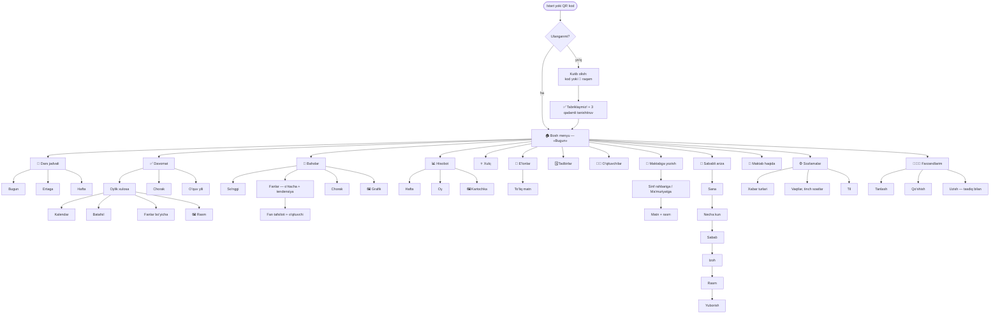
```mermaid
flowchart TD
    START([/start yoki QR kod]) --> LINK{Ulanganmi?}
    LINK -- yo'q --> ONB[Kutib olish:<br/>kod yoki 📱 raqam]
    ONB --> CONGR[✅ Tabriklaymiz! + 3 qadamli tanishtiruv]
    LINK -- ha --> HOME
    CONGR --> HOME[🏠 Bosh menyu — «Bugun»]

    HOME --> SCH[📅 Dars jadvali]
    SCH --> SCH1[Bugun] & SCH2[Ertaga] & SCH3[Hafta]

    HOME --> ATT[✅ Davomat]
    ATT --> ATT1[Oylik xulosa] --> ATT2[Kalendar] & ATT3[Batafsil] & ATT4[Fanlar bo'yicha] & ATT5[🖼 Rasm]
    ATT --> ATT6[Chorak] & ATT7[O'quv yili]

    HOME --> GR[📘 Baholar]
    GR --> GR1[So'nggi] & GR2[Fanlar — o'rtacha + tendensiya] & GR4[Chorak] & GR5[🖼 Grafik]
    GR2 --> GR3[Fan tafsiloti + o'qituvchi]

    HOME --> REP[📊 Hisobot] --> REP1[Hafta] & REP2[Oy] & REP3[🖼 Kartochka]
    HOME --> BEH[⭐ Xulq]
    HOME --> ANN[📢 E'lonlar] --> ANN1[To'liq matn]
    HOME --> EV[🗓 Tadbirlar]
    HOME --> TCH[👩‍🏫 O'qituvchilar]
    HOME --> MSG[💬 Maktabga yozish] --> MSG1[Sinf rahbariga / Ma'muriyatga] --> MSG2[Matn + rasm]
    HOME --> ABS[🤒 Sababli ariza] --> ABS1[Sana] --> ABS2[Necha kun] --> ABS3[Sabab] --> ABS4[Izoh] --> ABS5[Rasm] --> ABS6[Yuborish]
    HOME --> INFO[🏫 Maktab haqida]
    HOME --> SET[⚙️ Sozlamalar] --> SET1[Xabar turlari] & SET2[Vaqtlar, tinch soatlar] & SET3[Til]
    HOME --> CH[👨‍👩‍👧 Farzandlarim] --> CH1[Tanlash] & CH2[Qo'shish] & CH3[Uzish — tasdiq bilan]
```

## Sahifalar

### Umumiy qoidalar

- **Bitta xabar — bitta sahifa.** Tugma bosilganda bot yangi xabar yubormaydi, **o'sha xabarni tahrirlaydi** (`editMessageText`). Chat to'lib ketmaydi. Rasmli sahifadan matnli sahifaga o'tishda xabar o'chiriladi va yangisi yuboriladi.
- **Navigatsiya.** Har sahifa ostida `⬅️ Orqaga` va `🏠 Bosh menyu`; tepada yo'l ko'rsatkichi, masalan `🏠 › ✅ Davomat › Sentabr`.
- **Pastki klaviatura** (doim ko'rinadi, 2 ustun): `📅 Dars jadvali` · `✅ Davomat` · `📘 Baholar` · `📊 Hisobot` · `📢 E'lonlar` · `🗓 Tadbirlar` · `👩‍🏫 O'qituvchilar` · `💬 Maktabga yozish` · `⚙️ Sozlamalar` · `👨‍👩‍👧 Farzandlarim`. Tugma bosilsa — yangi sahifa-xabar ochiladi.
- **Tezlik.** Har bosishga darhol `answerCallbackQuery` qaytadi (soat belgisi aylanmaydi); og'ir sahifalarda `typing…` / `sending photo…` holati ko'rsatiladi.
- **Format.** HTML (`<b>`, `<i>`, `<blockquote>`), sanalar «30-sentabr, seshanba», vaqt Asia/Tashkent bo'yicha. Uzun ro'yxatlar sahifalanadi: `◀️ 1/3 ▶️`. Ma'lumot bo'lmasa — do'stona bo'sh holat («Bu oyda baho hali yo'q 🙂»).
- **Bir nechta farzand.** Tepada tanlangan farzand: `👦 Ali Valiyev · 5-A`, ostida `🔄 Farzandni almashtirish`. Tanlov eslab qolinadi (`parent_session.selected_student_id`).
- **Buyruqlar** (`setMyCommands`): `/start`, `/menu`, `/jadval`, `/davomat`, `/baholar`, `/yordam`, `/stop`. Bot faqat shaxsiy chatlarda javob beradi.

### Sahifalar ro'yxati

| Sahifa | callback | Nima ko'rsatadi |
|---|---|---|
| 🏠 **Bosh menyu — «Bugun»** | `home` | Bugungi holat (keldi/kechikdi/kelmadi), bugungi baholar, joriy dars (▶️), yangi e'lonlar soni, yaqin tadbir |
| 📅 **Dars jadvali** | `sch` (`t=today\|tomorrow\|week`) | Bugun / Ertaga / Hafta; joriy dars ▶️, tanaffuslar, o'qituvchi; bayram va ta'til kunlari «🎉 Dam olish kuni» |
| ✅ **Davomat** | `att` (`k=m\|q\|y`, `m`, `v=sum\|cal\|det\|sub\|img`) | Oylik xulosa: foiz, progress-bar `▓▓▓▓▓▓▓▓░░`, sinf o'rtachasi; ◀️ oy ▶️; kalendar; «Batafsil» — har kelmagan/kechikkan dars; fanlar bo'yicha; chorak va o'quv yili; 🖼 rasm |
| 📘 **Baholar** | `gr` (`v=recent\|subj\|det\|qtr\|chart`) | So'nggi baholar; fanlar bo'yicha o'rtacha (bar + ↑↓ tendensiya); fan tafsiloti — barcha baholar va o'qituvchi; chorak baholari; 🖼 grafik |
| 📊 **Hisobot** | `rep` (`t=week\|month`) | Davomat, o'rtacha baho, kuchli fanlar, e'tibor talab qiladigan fanlar, xulq; 🖼 hisobot kartochkasi |
| ⭐ **Xulq** | `beh` (`m`) | Avval rag'batlar, keyin ogohlantirishlar; oylar bo'yicha |
| 📢 **E'lonlar** | `ann` (`p`, `id`) | Sahifalangan ro'yxat; 🔴 muhim, 🆕 o'qilmagan; to'liq matn ochilsa o'qilgan deb belgilanadi |
| 🗓 **Tadbirlar** | `ev` | Yaqinlashayotgan tadbirlar (majlis, imtihon, bayram) |
| 👩‍🏫 **O'qituvchilar** | `tch` | Sinf rahbari va fan o'qituvchilari; telefonlar faqat «Bot sozlamalari»da ruxsat berilsa |
| 💬 **Maktabga yozish** | `msg` (`a=to`, `to=CT\|AD`) | Kimga: sinf rahbari yoki ma'muriyat → matn (+ rasm). Maktab javobi botga keladi; yozishmalar tarixi |
| 🤒 **Sababli ariza** | `abs` (`d`, `n`, `r=I\|F\|O`) | Sana → necha kun → sabab (kasallik / oilaviy / boshqa) → izoh → rasm (ixtiyoriy) → tasdiqlash. Tasdiqlansa davomat «Sababli» bo'ladi, rad etilsa sababi bilan xabar keladi |
| 🏫 **Maktab haqida** | `info` | Telefon, direktor, qabul kunlari, qo'ng'iroq jadvali |
| ⚙️ **Sozlamalar** | `set` | 7 ta xabar turini yoqish/o'chirish; ertangi jadval vaqti (18:00–21:00); tinch soatlar (maktabniki / o'chiq / 21–07 / 22–07 / 23–07); til |
| 👨‍👩‍👧 **Farzandlarim** | `ch` | Farzandni tanlash, yangi farzand qo'shish (kod bilan), uzish — tasdiqlash bilan |

`callback_data` 64 baytdan oshmaydi (`CallbackData.toString()` buni tekshiradi). Format: `bo'lim:kalit:qiymat:...`, masalan `att:k:m:m:2026-09:v:cal`.

### Kutib olish (onboarding)

1. `/start` (kodsiz) — iliq salomlashuv, nima qila olishi va ikki yo'l: kodni yuborish yoki `📱 Raqamni ulashish`.
2. Ulangandan keyin: «✅ Tabriklaymiz! Endi **Ali** haqida hamma narsa shu yerda», 3 qadamli qisqa tanishtiruv va Bosh menyu.
3. Noto'g'ri kod — «❌ Kod topilmadi» (qaysi kodlar mavjudligi oshkor qilinmaydi).

To'liq dialoglar tugmalari bilan: [bot-demo.md](bot-demo.md).

## Avtomatik xabarlar

| Xabar | Qachon | Turi (`NotificationType`) | Ota-ona o'chira oladimi |
|---|---|---|---|
| 🔴 Darsga kelmadi | Davomatda `ABSENT` belgilanganda | `ATTENDANCE_ABSENT` | ✅ «Davomat» |
| 🟡 Kechikdi | Davomatda `LATE` belgilanganda | `ATTENDANCE_LATE` | ✅ «Davomat» |
| 📘 Yangi baho / ✏️ o'zgardi | Baho qo'yilganda yoki o'zgartirilganda | `GRADE_NEW`, `GRADE_UPDATED` | ✅ «Baholar» |
| 💛 Past baho | Baho ≤ chegara (standart 2, «Bot sozlamalari»da 3 qilish mumkin) — yumshoq ohangda, «✍️ O'qituvchiga yozish» tugmasi bilan | `GRADE_LOW` | ✅ «Past baho» (o'chirilsa oddiy baho xabari keladi) |
| 📢 Maktab e'loni | E'lon joylanganda (`ALL` yoki o'sha sinf) | `ANNOUNCEMENT` | ✅ «E'lonlar» |
| 📅 Ertangi dars jadvali | Har kuni ota-ona tanlagan vaqtda (standart 19:00). Ertaga dars bo'lmasa yubormaydi; bayram bo'lsa «dam olish kuni» deydi; ertangi majlis/imtihonni eslatadi | `TOMORROW_SCHEDULE` | ✅ «Ertangi jadval» |
| 📊 Haftalik hisobot | Har hafta (standart shanba 18:00) | `WEEKLY_REPORT` | ✅ «Haftalik hisobot» |
| 🗓 Tadbir eslatmasi | Tadbirdan 1 kun oldin (standart 18:00) | `EVENT_REMINDER` | ✅ «Tadbirlar» |
| 💬 Maktab javobi | Admin «Murojaatlar»da javob yozganda | `MESSAGE_REPLY` | ❌ (javob doim keladi) |
| ✅/❌ Ariza qarori | Sababli ariza tasdiqlansa yoki rad etilsa | `ABSENCE_DECISION` | ❌ |
| 📣 Ota-onalarga umumiy xabar | Admin «Ota-onalarga xabar» sahifasidan yuborganda | `BROADCAST` | ✅ «E'lonlar» bilan birga |

- Hammasi bitta **outbox** (`notification_log`) orqali o'tadi: dedup, tinch soatlar, til va ota-onaning tanlovlari hamma turga bir xil qo'llanadi.
- Rejalashtirilgan xabarlar (`BotScheduledJobs`) har 5 daqiqada tekshiriladi. Xabar o'z vaqtidan 3 soat ichida yuboriladi — server shu vaqtda o'chiq bo'lsa ham, yonganida yetkaziladi; dedup kaliti har birini bir marta yuborishni kafolatlaydi.
- Tinch soatlarda yaratilgan xabar ertalab yuboriladi. Ota-onaning o'z tinch soatlari maktabnikidan ustun turadi.

## Rasmlar (PNG)

`bot/image/BotImageRenderer` Java2D bilan uchta rasm chizadi (tashqi servis yo'q). Shrift — ilova ichiga qo'shilgan **Inter** (OFL litsenziyasi, `src/main/resources/bot/fonts/`), shuning uchun `oʻ`, `gʻ`, `ў`, `ғ`, `қ`, `ҳ` har qanday serverda to'g'ri chiqadi. Ranglar — loyiha brendi (indigo → binafsha).

| Davomat kalendari | Fanlar grafigi | Hisobot kartochkasi |
|---|---|---|
| 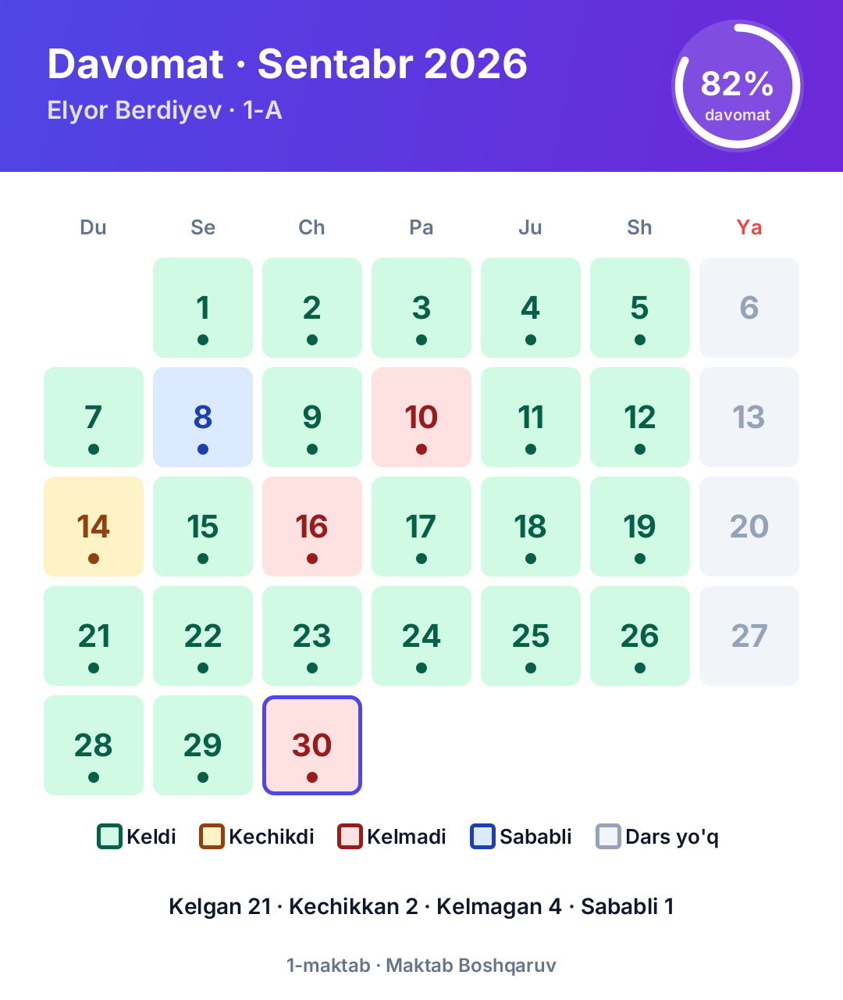 | 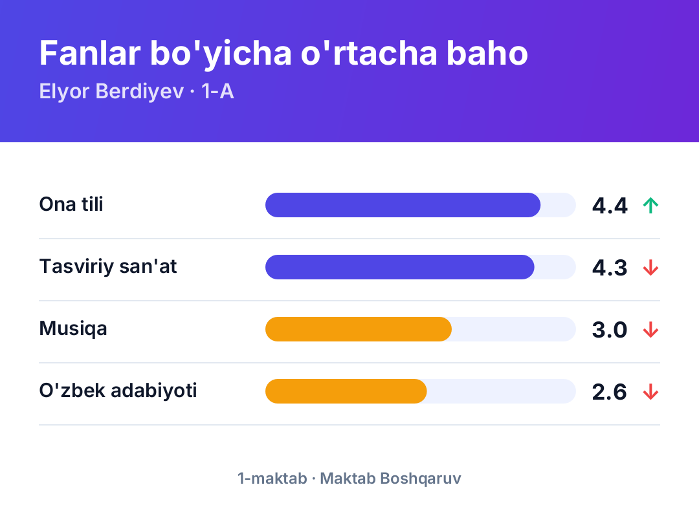 | 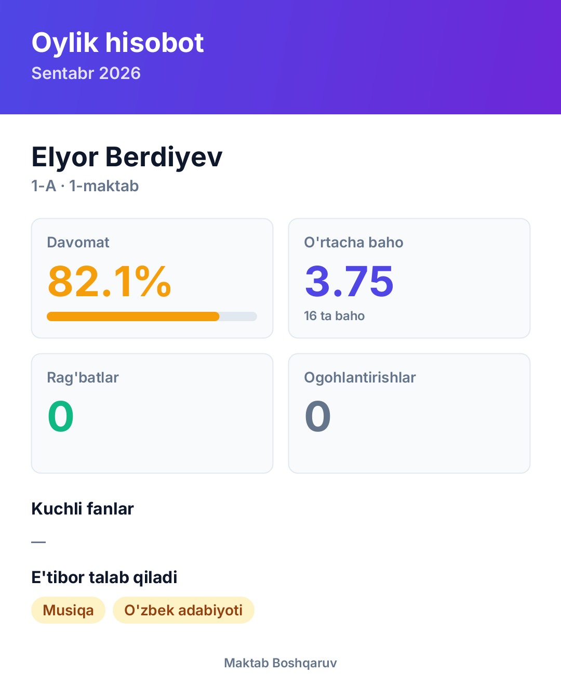 |

`BotImageService` rasmni bir marta chizadi va Telegram qaytargan `file_id`ni keshlaydi: ma'lumot o'zgarmaguncha keyingi so'rovlar faylni qayta yuklamaydi.

## Mini App «Farzandim kundaligi»

Telegram ichida ochiladigan veb-sahifa (bot menyusidagi tugma). Sahifalar: **Bugun**, **Jadval**, **Davomat** (interaktiv kalendar — kun bosilsa o'sha kunning darslari), **Baholar** (grafiklar, fan bosilsa baholari), **E'lonlar**. Bir nechta farzand bo'lsa — tepada almashtirgich. Telegram mavzusiga (`themeParams`, yorug'/qorong'i) moslashadi.

| Bugun | Davomat | Baholar (qorong'i) |
|---|---|---|
| 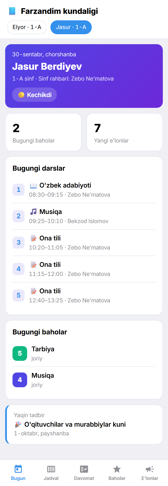 | 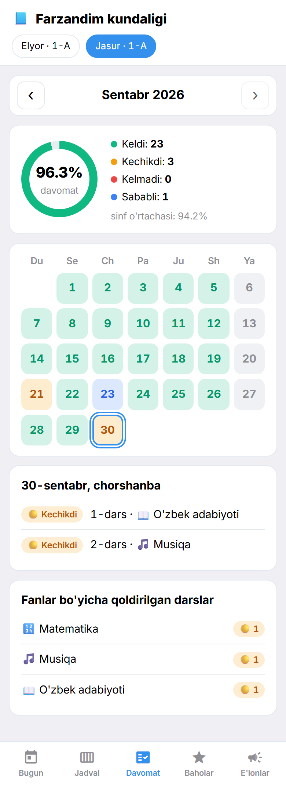 | 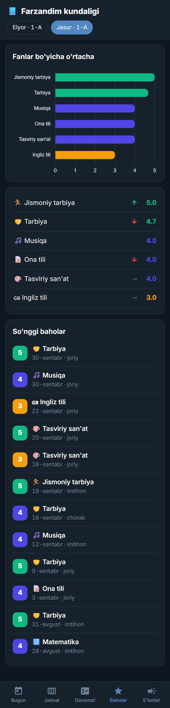 |

**Qanday ishlaydi.**
- Frontend: `frontend/src/layouts/WebAppLayout.vue`, `frontend/src/pages/webapp/*`, `frontend/src/webapp/*`; marshrut `/#/webapp` (login talab qilinmaydi).
- Backend: `/api/parent/**` — **faqat o'qish**. Har so'rov `X-Telegram-Init-Data` sarlavhasini yuboradi.
- `TelegramInitDataValidator` imzoni tekshiradi: `secret = HMAC_SHA256("WebAppData", bot_token)`, `hash = hex(HMAC_SHA256(secret, saralangan "kalit=qiymat" qatorlari))`. Taqqoslash vaqtga bog'liq bo'lmagan usulda. `auth_date` 24 soatdan eski bo'lsa — rad etiladi (`telegram.init-data-max-age-seconds`).
- Foydalanuvchi id'si = chat id. Har so'rovda `ParentAccessService.requireLinked(chatId, studentId)` — boshqa bolaning id'si 403 qaytaradi.

**Ulash.** `TELEGRAM_WEBAPP_URL` muhit o'zgaruvchisiga Mini App manzilini yozing (faqat `https://`). Bo'sh bo'lsa — Mini App tugmasi umuman chiqmaydi, bot odatdagidek ishlaydi. Manzil o'rnatilsa, bot ishga tushganda menyu tugmasini (`setChatMenuButton`) o'zi sozlaydi.

Lokal kompyuterda sinash uchun HTTPS tunnel kerak:

```bash
# frontend (9000) va backend (8080) ishlab turganda
cloudflared tunnel --url http://localhost:9000
# yoki
ngrok http 9000
# chiqqan https manzilni yozing (oxiriga /#/webapp):
TELEGRAM_WEBAPP_URL=https://<tunnel-manzil>/#/webapp
```

Frontend backend'ga `VITE_API_URL` orqali murojaat qiladi — tunnel orqali ochilganda backend ham tashqaridan ko'rinishi kerak (ikkinchi tunnel yoki bitta domen ostida reverse proxy). Production'da Mini App oddiy veb-ilova bilan bir domenda turadi.

## Arxitektura

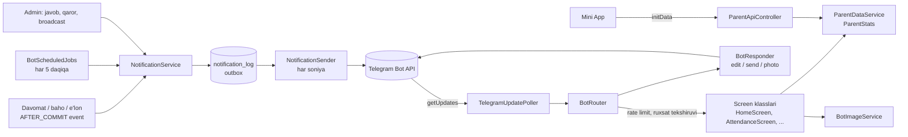
```mermaid
flowchart LR
    TG[(Telegram Bot API)] -- getUpdates --> P[TelegramUpdatePoller]
    P --> R[BotRouter]
    R -- rate limit, ruxsat tekshiruvi --> SC[Screen klasslari<br/>HomeScreen, AttendanceScreen, ...]
    SC --> D[ParentDataService<br/>ParentStats]
    SC --> I[BotImageService]
    R --> RESP[BotResponder<br/>edit / send / photo]
    RESP --> TG
    EV[Davomat / baho / e'lon<br/>AFTER_COMMIT event] --> NS[NotificationService]
    J[BotScheduledJobs<br/>har 5 daqiqa] --> NS
    A[Admin: javob, qaror, broadcast] --> NS
    NS --> OB[(notification_log<br/>outbox)]
    OB --> S[NotificationSender<br/>har soniya] --> TG
    MA[Mini App] -- initData --> API[ParentApiController] --> D
```

Asosiy g'oya — **outbox** namunasi. Davomat/baho/e'lonni saqlovchi servis Telegram bilan to'g'ridan-to'g'ri gaplashmaydi, faqat Spring event chiqaradi. Tranzaksiya muvaffaqiyatli tugagach (**AFTER_COMMIT**), listener `notification_log`ga `PENDING` yozuv qo'shadi. Alohida `@Scheduled` yuboruvchi shu jadvalni o'qib, xabarlarni Telegram limitlariga rioya qilgan holda jo'natadi. Rollback bo'lsa listener umuman ishlamaydi (`TelegramMockFlowIntegrationTest.rolledBackSave_producesNoNotification`).

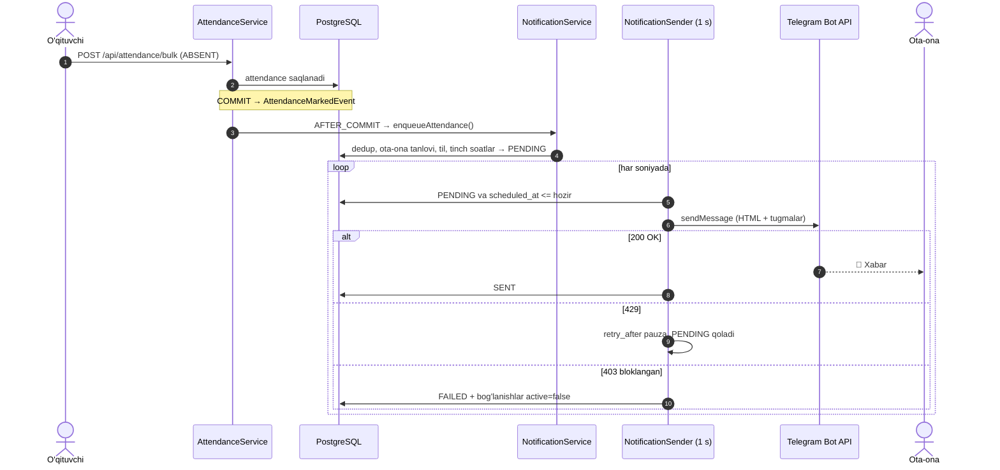
```mermaid
sequenceDiagram
    autonumber
    actor O as O'qituvchi
    participant AS as AttendanceService
    participant DB as PostgreSQL
    participant NS as NotificationService
    participant S as NotificationSender (1 s)
    participant TG as Telegram Bot API
    actor P as Ota-ona

    O->>AS: POST /api/attendance/bulk (ABSENT)
    AS->>DB: attendance saqlanadi
    Note over AS,DB: COMMIT → AttendanceMarkedEvent
    AS->>NS: AFTER_COMMIT → enqueueAttendance()
    NS->>DB: dedup, ota-ona tanlovi, til, tinch soatlar → PENDING
    loop har soniyada
        S->>DB: PENDING va scheduled_at <= hozir
        S->>TG: sendMessage (HTML + tugmalar)
        alt 200 OK
            TG-->>P: 🔴 Xabar
            S->>DB: SENT
        else 429
            S->>S: retry_after pauza, PENDING qoladi
        else 403 bloklangan
            S->>DB: FAILED + bog'lanishlar active=false
        end
    end
```

### Fayllar

| Qatlam | Fayl | Vazifasi |
|---|---|---|
| Bot | `bot/BotRouter` | Markaziy router: rate limit, ruxsat tekshiruvi, callback → `Screen`, matn/buyruq/klaviatura → sahifa, kutilayotgan kiritishlar (`InputHandler`) |
| Bot | `bot/screens/*Screen` | Har bo'lim — alohida klass (`Screen.render(ctx, data) → BotView`) |
| Bot | `bot/BotResponder` | Sahifani tahrirlash / yangi xabar / rasm (keshlangan `file_id`) |
| Bot | `bot/CallbackData`, `BotContext`, `BotView`, `Keyboards`, `Onboarding`, `ChatRateLimiter`, `BotI18n`, `SubjectIcons` | Yordamchilar |
| Bot | `bot/BotProfileInitializer` | Ishga tushishda `setMyCommands`, `setMyDescription`, `setMyShortDescription` (o'zbekcha — hammaga, ruscha — Telegram'i rus tilidagilarga), menyu tugmasi |
| Bot | `bot/image/BotImageRenderer`, `BotImageService` | PNG rasmlar va kesh |
| Servis | `service/parent/ParentDataService`, `ParentStats`, `ParentAccessService` | Ota-ona ko'radigan ma'lumot (bot ham, Mini App ham shu yerdan oladi), statistika, ruxsat |
| Servis | `service/NotificationService`, `NotificationSender` | Outbox: yozish (dedup, til, tanlovlar, tinch soatlar) va yuborish |
| Servis | `service/BotScheduledJobs` | Ertangi jadval, haftalik hisobot, tadbir eslatmasi |
| Servis | `service/LinkingService`, `ParentMessageService`, `AbsenceRequestService`, `BroadcastService`, `BotSettingService`, `BotStatsService`, `BotUsageService` | Bog'lash, murojaatlar, arizalar, umumiy xabar, sozlamalar, statistika |
| Servis | `service/TelegramUpdatePoller` | `getUpdates` long polling |
| Telegram | `telegram/HttpTelegramClient`, `MockTelegramClient` | Haqiqiy va soxta klient (Spring `RestClient`, tashqi kutubxona yo'q) |
| Telegram | `telegram/TelegramInitDataValidator`, `MessageFormatter`, `PhoneNormalizer`, `QuietHours`, `TokenMasker` | Sof yordamchilar, unit testlangan |
| Controller | `ParentApiController`, `ParentMessageController`, `AbsenceRequestController`, `BroadcastController`, `BotAdminController`, `TelegramController` | API ([07-api.md](#telegram-va-xabarnomalar--apitelegram-apinotifications)) |
| Config | `config/TelegramSchemaMigration` | Hibernate eski enum `CHECK` cheklovlarini olib tashlaydi (yangi xabar turlari uchun) |

## Ota-onani farzandga bog'lash

Har bir o'quvchida **tasodifiy, taxmin qilib bo'lmaydigan** `telegram_link_code` bor (`SecureRandom`, 10 belgi, ~58 bit; `0/O`, `1/l/I` ishlatilmaydi). Bir o'quvchiga bir nechta ota-ona, bitta ota-onaga bir nechta farzand bog'lanishi mumkin (`parent_telegram_link`).

- **QR kod / havola.** `https://t.me/<bot_username>?start=<kod>`. Sinf profilidagi **«Ota-onalar uchun QR kodlar»** — A4 chop etish varag'i (12 ta kartochka).
- **Telefon raqami.** Kodsiz `/start` → `📱 Raqamni ulashish`. Raqam `students.guardian_phone` bilan solishtiriladi (`PhoneNormalizer`); shu raqamdagi **barcha** farzandlar ulanadi. Faqat o'z raqami qabul qilinadi (`contact.user_id == from.id`).
- **Bot ichida.** «👨‍👩‍👧 Farzandlarim → ➕ Farzand qo'shish» — ikkinchi farzand kodini yuborish.
- **Kodni yangilash** — eski kod ishlamay qoladi, ulanganlar uzilmaydi.

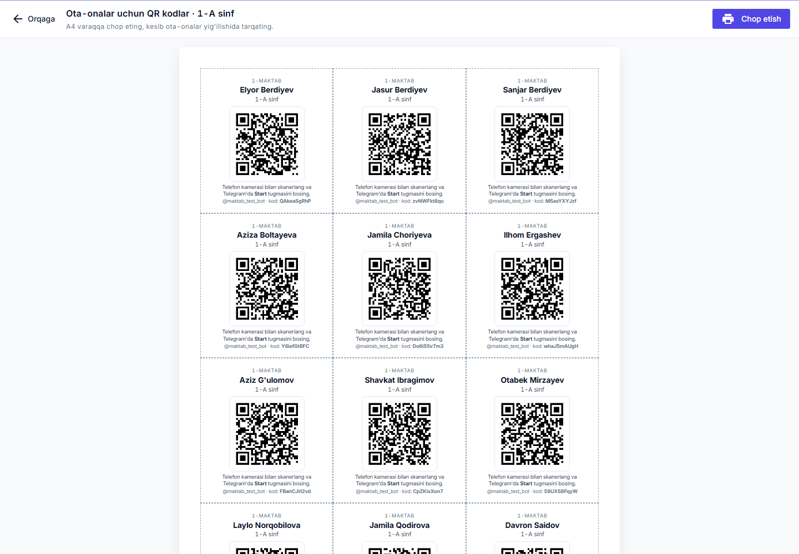

## Sozlamalar

### Server (`application.properties` → muhit o'zgaruvchilari)

| Sozlama | Muhit o'zgaruvchisi | Standart | Izoh |
|---|---|---|---|
| `telegram.enabled` | `TELEGRAM_ENABLED` | `false` | O'chiq bo'lsa xabarlar `SKIPPED` |
| `telegram.bot-token` | `TELEGRAM_BOT_TOKEN` | bo'sh | **Faqat** `application-local.properties` yoki muhit o'zgaruvchisida |
| `telegram.bot-username` | `TELEGRAM_BOT_USERNAME` | bo'sh | `@`siz. Deep link va QR uchun |
| `telegram.mock` | `TELEGRAM_MOCK` | `false` | Soxta klient ([pastda](#tokensiz-sinash-mock-rejimi-va-demo)) |
| `telegram.webapp-url` | `TELEGRAM_WEBAPP_URL` | bo'sh | Mini App manzili (`https://`). Bo'sh — tugma yo'q |
| `telegram.quiet-hours-start` / `-end` | `TELEGRAM_QUIET_START` / `_END` | `22:00` / `07:00` | Yangi maktab uchun standart tinch soatlar |
| `telegram.max-per-second` | — | `25` | Umumiy yuborish tezligi |
| `telegram.chat-rate-per-second` | — | `2` | Bitta chatdan sekundiga nechta bosish qabul qilinadi |
| `telegram.init-data-max-age-seconds` | — | `86400` | Mini App `initData` amal qilish muddati |
| `telegram.max-attempts` | — | `3` | Xatoda urinishlar soni |

Rejimlar (`GET /api/telegram/status` → `mode`): `LIVE` (token bor), `MOCK`, `DISABLED`, `NO_TOKEN`.

### Maktab darajasida

- **«Xabarnomalar»** sahifasi (`notification_settings`): davomat / baholar / e'lonlar turlarini yoqish-o'chirish va maktab tinch soatlari.
- **«Bot sozlamalari»** sahifasi (`bot_setting`, faqat ADMIN o'zgartiradi):
  - «Maktab haqida» ma'lumotlari: telefon, direktor, qabul kunlari, qo'lda yozilgan qo'ng'iroq jadvali (bo'lsa avtomatik jadval o'rniga);
  - o'qituvchilar telefonini ko'rsatish (standart — **yo'q**);
  - ertangi jadval vaqti (19:00), haftalik hisobot kuni va vaqti (shanba 18:00), tadbir eslatmasi vaqti (18:00);
  - past baho chegarasi (≤2 yoki ≤3).

### Ota-ona darajasida (bot → ⚙️ Sozlamalar, `parent_session`)

- 7 ta tur: kelmadi/kechikdi, baholar, past baho, e'lonlar, ertangi jadval, haftalik hisobot, tadbirlar.
- Ertangi jadval vaqti: 18:00 / 19:00 / 20:00 / 21:00.
- Tinch soatlar: maktabniki / o'chiq / 21:00–07:00 / 22:00–07:00 / 23:00–07:00.
- Til: O'zbekcha / Ўзбекча / Русский. Yangi ota-onaning tili Telegram tilidan olinadi (`ru` → rus, qolgani o'zbek lotin).

## Ishonchlilik: takrorlanmaslik, limitlar, qayta urinish

- **Holat o'zgarmasa, xabar yo'q.** Butun davomat ro'yxatini qayta saqlash xabar yubormaydi; `PRESENT → ABSENT` yuboradi.
- **Dedup kaliti** — `(student, type, referenceId, recordDate, chat_id)`; bazada `uk_notification_dedup`.
  - Baho o'zgarishi: bir kunda 5 marta tuzatish — bitta xabar.
  - E'lon va umumiy xabar: 2 farzandi bor ota-ona bir marta oladi.
  - Ertangi jadval: `referenceId` = o'quvchi, `recordDate` = ertangi sana; haftalik hisobot: `recordDate` = hafta dushanbasi.
- **Limitlar.** Umumiy ≤25 xabar/s, bitta chatga ≤1 xabar/s. Kiruvchi bosishlar: bitta chatdan ≤2/s (`ChatRateLimiter`), ortig'iga «⏳ Biroz sekinroq, iltimos 🙂» deyiladi.
- **429** — `retry_after` pauza, xabar `PENDING` qoladi. **403** — `FAILED`, chatning bog'lanishlari o'chiriladi. **Boshqa xatolar** — 30 s / 60 s dan keyin qayta, 3-urinishdan keyin `FAILED`; admin «Qayta yuborish» qila oladi.
- **Polling xatoga chidamli.** Bitta update'ni qayta ishlashda xato bo'lsa, ota-onaga «😔 Nimadir xato ketdi. Iltimos, qayta urinib ko'ring.» deyiladi, xato logga yoziladi, polling to'xtamaydi.

## Ma'lumotlar bazasi

Barcha jadvallar `ddl-auto=update` bilan yaratiladi, yangi ustunlar **nullable**.

| Jadval | Ustunlar |
|---|---|
| `parent_telegram_link` | `student_id`, `chat_id`, `telegram_username`, `first_name`, `linked_at`, `active`. Noyob: `(student_id, chat_id)` |
| `notification_log` | `school_id`, `student_id`, `chat_id`, `type`, `reference_id`, `record_date`, `text`, `reply_markup` (yangi — tugmalar JSON), `status`, `attempts`, `last_error`, `created_at`, `scheduled_at`, `sent_at` |
| `notification_settings` | maktab bo'yicha turlar va tinch soatlar |
| `parent_session` (yangi) | `chat_id` (noyob), `selected_student_id`, `language`, `first_name`, `username`, `pending_action`/`pending_data` (ko'p qadamli kiritish), `read_announcements`, `notify_*` (7 ta), `schedule_time`, `quiet_hours_enabled`, `quiet_start`, `quiet_end`, `last_active_at` |
| `parent_message` (yangi) | murojaatlar: `school_id`, `student_id`, `chat_id`, `parent_name`, `parent_username`, `recipient` (`CLASS_TEACHER`/`ADMINISTRATION`), `text`, `photo_file_id`, `status` (`NEW`/`ANSWERED`), `reply_text`, `replied_by`, `replied_at` |
| `absence_request` (yangi) | `school_id`, `student_id`, `chat_id`, `parent_name`, `date_from`, `date_to`, `reason` (`ILLNESS`/`FAMILY`/`OTHER`), `comment`, `photo_file_id`, `status` (`PENDING`/`APPROVED`/`REJECTED`), `decision_note`, `decided_by`, `decided_at`, `excused_lessons` |
| `bot_setting` (yangi) | maktab bo'yicha bot sozlamalari ([yuqorida](#maktab-darajasida)) |
| `bot_usage_event` (yangi) | `chat_id`, `school_id`, `student_id`, `section`, `created_at` — statistika uchun |
| `broadcast` (yangi) | `school_id`, `audience` (`ALL`/`CLASSES`), `class_ids`, `text`, `recipient_count`, `created_by`, `created_at` |

Hibernate enum ustunlariga `CHECK` cheklovi qo'yadi va `ddl-auto=update` uni kengaytirmaydi. Yangi xabar turlari rad etilmasligi uchun `TelegramSchemaMigration` ishga tushishda `notification_log_type_check` va `notification_log_status_check`ni olib tashlaydi.

## Admin panel

Sidebar → **Boshqaruv** guruhi (yangi murojaat va ariza sonlari belgida ko'rinadi):

| Sahifa | Kim | Nima qiladi |
|---|---|---|
| **Xabarnomalar** | ADMIN/EDITOR | Bot holati, jurnal, filtrlar, «Qayta yuborish», maktab sozlamalari (v1) |
| **Murojaatlar** | ADMIN/EDITOR | Ota-onalar yozgan xabarlar (Yangi / Javob berilgan / Hammasi), rasmni ko'rish, «Javob yozish» → javob botga boradi |
| **Sababli arizalar** | ADMIN/EDITOR | Kutilayotgan arizalar, ma'lumotnoma rasmi, «Tasdiqlash» (davomat avtomatik «Sababli», bayram/ta'til kunlari bundan mustasno) yoki «Rad etish» (sabab majburiy) |
| **Ota-onalarga xabar** | faqat ADMIN | Butun maktab yoki tanlangan sinflarga; «Oldindan ko'rish» — ota-ona ko'radigan ko'rinish va qabul qiluvchilar soni; yuborilganlar tarixi va natija (yuborildi / jami) |
| **Bot statistikasi** | ADMIN/EDITOR | Ulangan ota-onalar foizi, faol (7/30 kun), 30 kunlik yuborilgan xabarlar grafigi, eng ko'p ochiladigan bo'limlar, sinflar bo'yicha qamrov va QR varaq havolasi |
| **Bot sozlamalari** | ko'rish — ADMIN/EDITOR, o'zgartirish — ADMIN | [Maktab darajasidagi sozlamalar](#maktab-darajasida) |

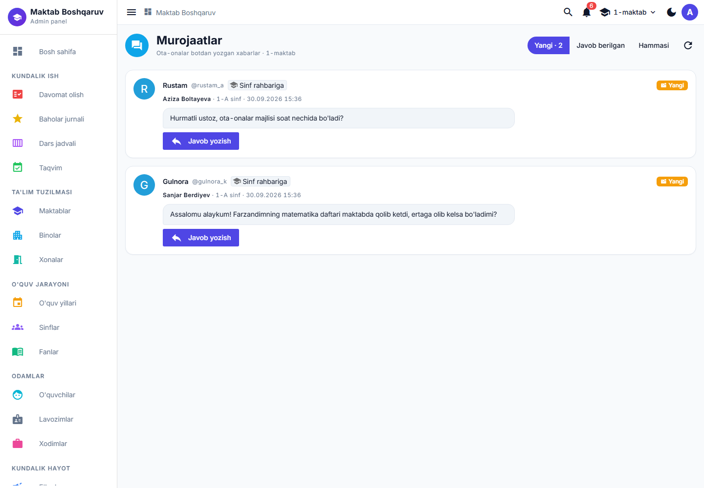

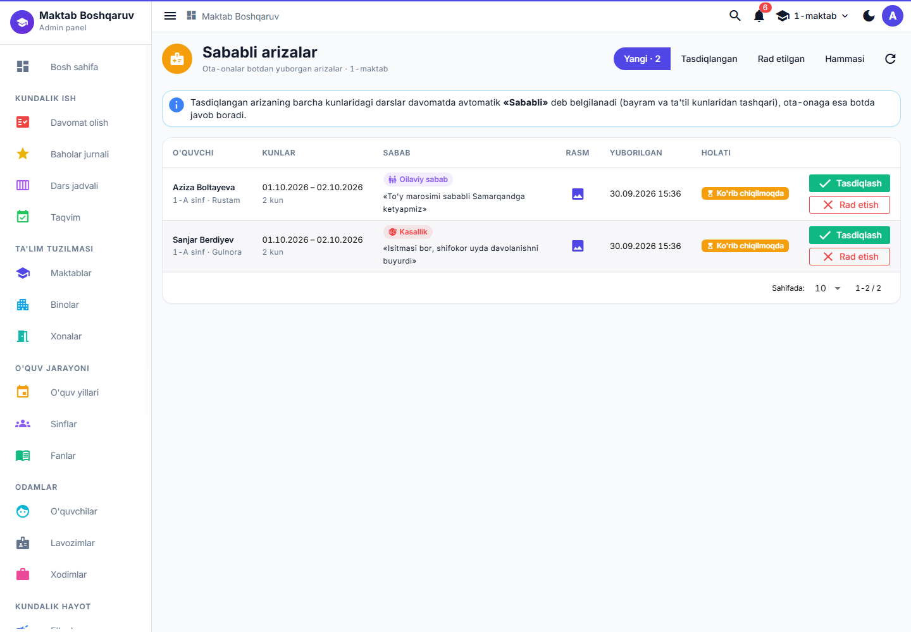

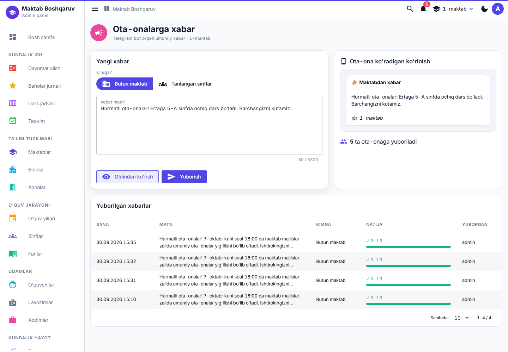

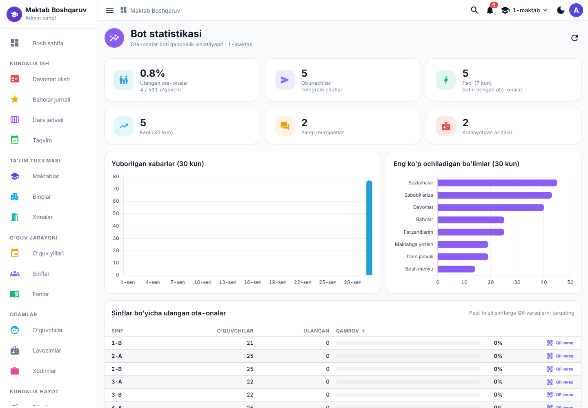

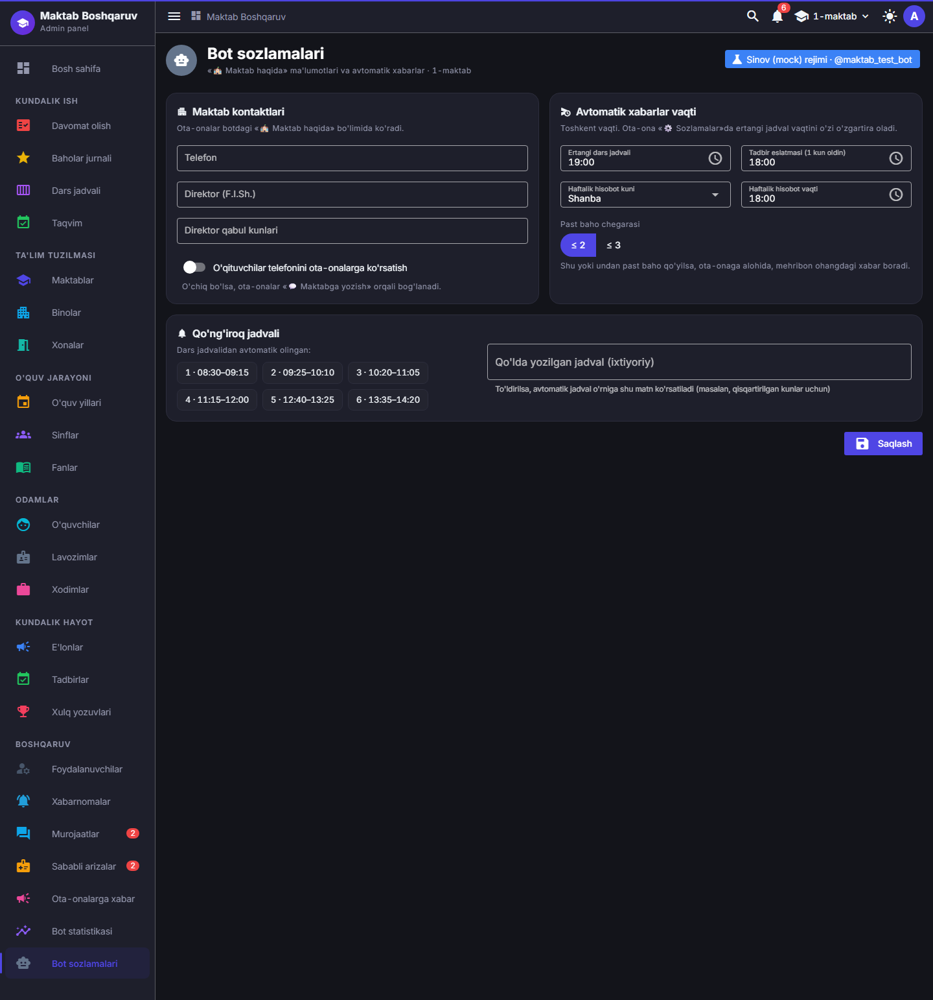

O'quvchi profilidagi «Telegram» bloki (kod, QR, ulangan ota-onalar) v1'dagidek qoladi:


## Xavfsizlik

- **Har bir callback va buyruqda ruxsat tekshiriladi.** Callback'dagi `s` (o'quvchi id'si) ko'r-ko'rona ishlatilmaydi: `ParentAccessService.requireLinked(chatId, studentId)` shu chat shu o'quvchiga **faol** bog'langanini tekshiradi. Bog'lanmagan bo'lsa — hech qanday ma'lumot qaytmaydi, faqat «🔒 Bu ma'lumot sizga ochiq emas» ogohlantirishi. Testlar: `BotScreensSeedIntegrationTest.foreignStudentIdInCallback_returnsNothing`, `ParentAccessServiceTest`.
- **Mini App** — `initData` HMAC imzosi va `auth_date` muddati tekshiriladi; `/api/parent/**` faqat o'qish; boshqa bolaning id'si → 403 (`TelegramInitDataValidatorTest`).
- **Token hech qachon kodda, hujjatda, logda yoki git'da bo'lmaydi.** Faqat `application-local.properties` (`.gitignore`da) yoki `TELEGRAM_BOT_TOKEN`. Har bir xato matni `TokenMasker`dan o'tadi; `TelegramProperties.toString()` tokenni yashiradi. Telegram fayllari (rasmlar) admin panelga backend orqali beriladi (`/api/telegram/files/{id}`) — token brauzerga chiqmaydi.
- **Kodlarni topib bo'lmaydi:** ~58 bit, noto'g'ri koddagi javob bir xil, 10 daqiqada 5 xato kod — blok.
- **Rate limit:** bitta chatdan sekundiga 2 tadan ortiq bosish qabul qilinmaydi.
- **Rollar:** umumiy xabarni faqat ADMIN yuboradi; bot sozlamalarini faqat ADMIN o'zgartiradi; `/api/telegram/mock/**` va `/api/bot/mock/**` faqat ADMIN va faqat mock rejimida.
- **HTML** — bazadan kelgan har bir qiymat escape qilinadi.

## Tokensiz sinash: mock rejimi va demo

`telegram.mock=true` rejimida haqiqiy Telegram o'rniga `MockTelegramClient` ishlaydi: yuborilgan, tahrirlangan, o'chirilgan xabarlar va rasmlar xotirada saqlanadi va logga yoziladi.

| Endpoint | Vazifasi |
|---|---|
| `POST /api/telegram/mock/updates` | Ota-ona harakatini simulyatsiya qilish: `text`, `contactPhone`, `photoBase64`, `callbackData` + `messageId`, `languageCode` |
| `GET /api/telegram/mock/messages?chatId=&from=` | Bot shu chatga nima yuborgani (tugmalari bilan) |
| `GET /api/telegram/mock/photos/{id}` | Bot yuborgan PNG |
| `POST /api/bot/mock/run-jobs` | Ertangi jadval / haftalik hisobot / tadbir eslatmasini hoziroq ishga tushirish |

**To'liq demo** — barcha sahifalarni ota-ona sifatida bosib chiqadi, admin harakatlarini (davomat, baho, javob, ariza qarori, umumiy xabar) API orqali bajaradi va natijani [bot-demo.md](bot-demo.md)ga yozadi:

```bash
# backend mock rejimida (masalan 8081 portda) ishlab turganda
API_URL=http://localhost:8081 node scripts/bot-demo.mjs
```

Avtomatik testlar: `BotScreensSeedIntegrationTest` (seed bilan har bir sahifa, 3 til, rasmlar, begona o'quvchi), `TelegramMockFlowIntegrationTest` (bog'lash → davomat → outbox → yuborish), `NotificationServiceTest`, `AbsenceRequestServiceTest`, `LinkingServiceTest`, `ParentStatsTest`, `CallbackDataTest`, `BotI18nTest` (3 til faylida kalitlar bir xil), `TelegramInitDataValidatorTest`.

## ADMINISTRATOR UCHUN YO'RIQNOMA

**1. Bot yaratish.** Telegram'da [@BotFather](https://t.me/BotFather) → `/newbot` → ko'rinadigan nom (masalan `1-maktab — Farzandim`) → username (`bot` bilan tugaydi, masalan `maktab1_farzandim_bot`).

**2. Tokenni olish.** BotFather `raqamlar:harflar` ko'rinishidagi token beradi. Uni hech kimga bermang, chatlarga, hujjatlarga yoki git'ga joylamang. Oshkor bo'lsa — BotFather'da `/revoke`.

**3. Tokenni serverga yozish.** `src/main/resources/application-local.properties` (bo'lmasa `.example`dan nusxa oling; fayl `.gitignore`da):

```properties
telegram.enabled=true
telegram.bot-token=<BotFather bergan token>
telegram.bot-username=maktab1_farzandim_bot
# ixtiyoriy, Mini App uchun:
telegram.webapp-url=https://kundalik.maktab.uz/#/webapp
```

Production'da: `TELEGRAM_ENABLED`, `TELEGRAM_BOT_TOKEN`, `TELEGRAM_BOT_USERNAME`, `TELEGRAM_WEBAPP_URL` muhit o'zgaruvchilari.

**4. Backend'ni qayta ishga tushiring.** Logda: `Telegram bot: yoqilgan (@maktab1_farzandim_bot, token: ***)`. Bot ishga tushganda **buyruqlar menyusi, tavsif va qisqa tavsif avtomatik o'rnatiladi** (o'zbekcha va ruscha) — BotFather'da `/setcommands`, `/setdescription`, `/setabouttext` qilish shart emas (qo'lda o'zgartirsangiz, keyingi ishga tushishda bot o'z matnlarini qayta yozadi).

**5. Bot rasmi (avatar).** BotFather → `/setuserpic` → botni tanlang → kvadrat rasm yuboring (kamida 512×512, masalan maktab logotipi brend fonida). Buni faqat qo'lda qilish mumkin — Bot API avatar o'rnatishga ruxsat bermaydi.

**6. Mini App (ixtiyoriy).**
1. Frontend'ni HTTPS manzilda joylang (yoki sinov uchun [cloudflared/ngrok](#mini-app-farzandim-kundaligi)).
2. `TELEGRAM_WEBAPP_URL=https://<manzil>/#/webapp` ni yozib backend'ni qayta ishga tushiring — bot menyu tugmasini o'zi «📱 Kundalik» qilib qo'yadi.
3. Xohlasangiz BotFather → `/newapp` orqali Mini App'ni alohida ro'yxatdan o'tkazib, `t.me/<bot>/<app>` havolasini olish mumkin (majburiy emas).

**7. Tekshirish.**
1. Admin panel → **Xabarnomalar**: «Ulangan · @bot» belgisi.
2. O'quvchi profilidagi QR kodni o'z telefoningiz bilan skanerlang → **Start** → «✅ Tabriklaymiz!» va Bosh menyu.
3. Pastki klaviaturadan bir nechta bo'limni oching.
4. **Davomat olish** sahifasida shu o'quvchini **Kelmadi** qiling → bir necha soniyada 🔴 xabar (tinch soatlarda — ertalab).
5. Botda «💬 Maktabga yozish» → xabar yozing → admin panel **Murojaatlar**da paydo bo'ladi → javob yozing → javob botga keladi.

**8. Ota-onalarga tarqatish.** Har sinf profilidagi **«Ota-onalar uchun QR kodlar»** → Chop etish → yig'ilishda tarqating. Ota-onalar uchun bir sahifalik qo'llanmani ham chop eting: [ota-onalar-uchun.md](ota-onalar-uchun.md). **Bot statistikasi** sahifasida qaysi sinflarda qamrov past ekanini kuzatib boring.

## Muammolar va yechimlar

| Belgi | Sabab | Yechim |
|---|---|---|
| «Bot sozlanmagan», xabarlar `SKIPPED` | `TELEGRAM_ENABLED=false` yoki token yo'q | [Yo'riqnoma](#administrator-uchun-yoriqnoma) 3–4-qadamlar |
| «Token noto'g'ri (Telegram 401)» | Token xato yoki `/revoke` qilingan | Tokenni qayta oling, backend'ni qayta ishga tushiring |
| «Boshqa nusxa yoki webhook ishlayapti (409)» | Bir token bilan ikkita backend ishlayapti yoki webhook o'rnatilgan | Bitta nusxa qoldiring; webhook bo'lsa `deleteWebhook` |
| Tugma bosilganda hech narsa bo'lmaydi | Juda tez bosish (rate limit) yoki eski xabardagi tugma | Biroz kuting; `/menu` yuboring |
| «🔒 Bu ma'lumot sizga ochiq emas» | Farzand uzilgan yoki boshqa chatdan eski tugma | «👨‍👩‍👧 Farzandlarim»dan qayta tanlang yoki qayta ulaning |
| Mini App tugmasi yo'q | `TELEGRAM_WEBAPP_URL` bo'sh yoki `https://` emas | To'g'ri HTTPS manzilni yozib qayta ishga tushiring |
| Mini App «Ma'lumotni yuklab bo'lmadi» | `initData` eskirgan (>24 soat), boshqa bot tokeni (401) yoki backend'ga yetib bo'lmayapti | Mini App'ni bot menyusidan qayta oching; backend shu bot tokeni bilan ishlayotganini tekshiring |
| Ertangi jadval kelmadi | Ota-ona o'chirgan, ertaga dars yo'q yoki tinch soat | Sozlamalarni tekshiring; jurnalda `TOMORROW_SCHEDULE` yozuvlari |
| Ariza tasdiqlandi, lekin ba'zi kunlar «Sababli» bo'lmadi | U kunlar bayram/ta'til (kalendarda) | Kutilgan xatti-harakat |
| Rasmlarda harflar noto'g'ri | — | Inter shrifti ilova ichida; agar `src/main/resources/bot/fonts/` o'chirilgan bo'lsa, qayta tiklang |
| Holat `FAILED`, «403» | Ota-ona botni bloklagan | Ota-ona botni qayta ochib `/start` bossa, tiklanadi |
| Serverda Telegram bloklangan | `api.telegram.org`ga chiqish yo'q | JVM proksi: `-Dhttps.proxyHost=... -Dhttps.proxyPort=...` |
