# Ota-onalar boti — to'liq demo

> Bu fayl `scripts/bot-demo.mjs` tomonidan avtomatik yaratildi (02/10/2026, 09:39:44),
> backend `telegram.mock=true` rejimida, seed ma'lumot bilan. Har bir 👤 qadam — ota-onaning harakati,
> 🤖 — bot javobi, `[...]` — inline tugmalar, ✏️ — xabar yangisi yuborilmay, o'rnida tahrirlangani,
> 🔄 — kartochka (banner rasmi + matn + tugmalar) shu xabarning o'zida almashtirilgani. Har sahifa tepasidagi rasm — bo'lim banneri.
> Botni Telegram'da ochmasdan turib barcha sahifalarni shu yerda ko'rish mumkin.

**Mundarija:** 
[1. Kutib olish](#1-kutib-olish-va-ulanish) · [2. Bosh menyu](#2-bosh-menyu--bugun) · [3. Dars jadvali](#3-dars-jadvali) · [4. Davomat](#4-davomat) · [5. Baholar](#5-baholar) · [6. Hisobot](#6-hisobot) · [7. Xulq](#7-xulq) · [8. E'lonlar](#8-elonlar) · [9. Tadbirlar](#9-tadbirlar) · [10. O'qituvchilar](#10-oqituvchilar) · [11. Maktabga yozish](#11-maktabga-yozish) · [12. Sababli ariza](#12-sababli-ariza) · [13. Maktab haqida](#13-maktab-haqida) · [14. Sozlamalar](#14-sozlamalar-3-til) · [15. Farzandlarim](#15-farzandlarim) · [16. Xavfsizlik](#16-xavfsizlik) · [17. Avtomatik xabarlar](#17-avtomatik-xabarlar)

## 1. Kutib olish va ulanish

### 1.1. Birinchi /start (hali ulanmagan)

👤 **Ota-ona:** `/start`

🤖 **Bot:**

> 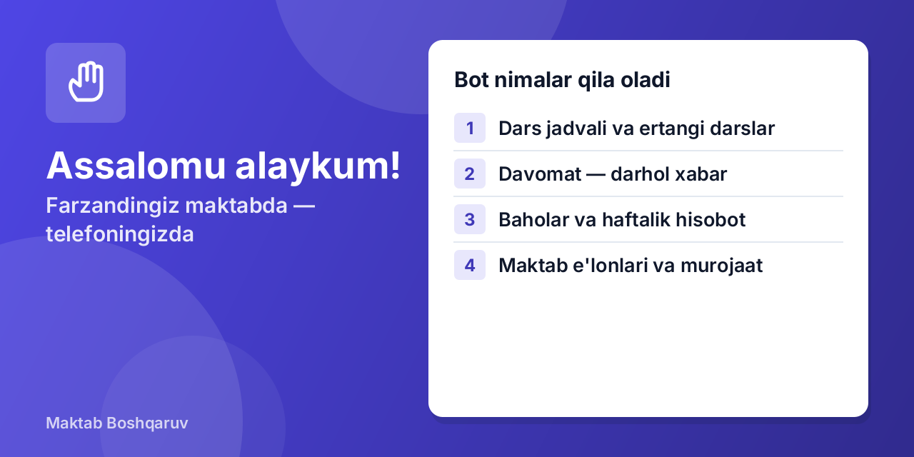
>
> 👋 **Assalomu alaykum!**
>
> Men — **Maktab Boshqaruv** boti, farzandingizning maktabdagi yordamchisiman:
>
> 📅 Dars jadvali va ertangi darslar
> ✅ Davomat — kelmasa yoki kechiksa, darhol xabar
> 📘 Baholar, hisobot va maktab e'lonlari
> 💬 Maktabga to'g'ridan-to'g'ri yozish
>
> **Ulanish uchun** pastdagi tugmalardan birini bosing 👇
> 📱 **Telefon raqamni ulashish** — maktabda yozilgan raqamingiz bo'yicha
> 🔑 **Kod kiritish** — sinf rahbari bergan kartochkadagi kod
> _QR kodni skanerlasangiz, ulanish o'zi bo'ladi._
>
> ⌨️ _Pastki klaviatura:_
> `📱 Telefon raqamni ulashish`
> `🔑 Kod kiritish`

### 1.2. Sinf rahbari bergan QR kod / havola orqali ulanish

👤 **Ota-ona:** QR kodni skanerladi → Telegram `/start QAkeaSgRhP` yubordi

🤖 **Bot:**

> ✅ **Tabriklaymiz!** Endi **Elyor Berdiyev** (1-A sinf) haqida hamma narsa shu yerda.
>
> **3 qadamda tanishib oling:**
> 1️⃣ Pastdagi tugmalar — asosiy bo'limlar: jadval, davomat, baholar va boshqalar
> 2️⃣ Muhim voqealar — kelmaslik, yangi baho, e'lon — o'zi xabar bo'lib keladi
> 3️⃣ «⚙️ Sozlamalar»da qaysi xabarlar va qachon kelishini tanlaysiz
>
> ⌨️ _Pastki klaviatura:_
> `📱 Kundalikni ochish`
> `📅 Dars jadvali` `✅ Davomat`
> `📘 Baholar` `📊 Hisobot`
> `📢 E'lonlar` `🗓 Tadbirlar`
> `👩‍🏫 O'qituvchilar` `💬 Maktabga yozish`
> `🤒 Sababli ariza` `⚙️ Sozlamalar`
> `👨‍👩‍👧 Farzandlarim`

🤖 **Bot:**

> 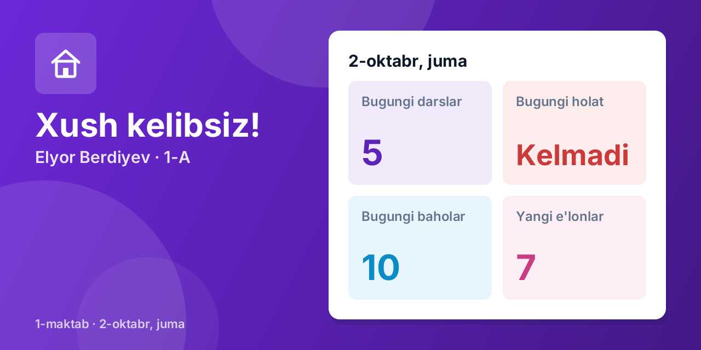
>
> 🏠 **Bosh menyu** · 2-oktabr, juma
>
> 👤 **Elyor Berdiyev** · 1-A sinf
> 👩‍🏫 Sinf rahbari: Zebo Ne'matova
>
> **Bugun:**
> 📚 5 ta dars · 08:30–13:25
> 🔴 1 ta darsga kelmadi
> 📘 Bugungi baholar: 🔴 **2** O'zbek adabiyoti, 🟢 **5** Ona tili, 🔴 **2** O'zbek adabiyoti, 🟢 **5** Ona tili, 🔴 **2** O'zbek adabiyoti, 🟢 **5** Ona tili, 🔴 **2** O'zbek adabiyoti, 🟢 **5** Ona tili, 🔴 **2** O'zbek adabiyoti, 🟢 **5** Ona tili
> 📢 Yangi e'lonlar: **7**
> 🗓 Yaqin tadbir: **Ota-onalar yig'ilishi** — 8-oktabr
> 📅 Ertaga 1-dars: **08:30** · 🔢 Matematika
>
> Bo'limni tanlang 👇
>
> `[📱 Kundalikni ochish ↗]`
> `[📅 Dars jadvali]` `[✅ Davomat]`
> `[📘 Baholar]` `[📊 Hisobot]`
> `[⭐ Xulq]` `[📢 E'lonlar]`
> `[🗓 Tadbirlar]` `[👩‍🏫 O'qituvchilar]`
> `[💬 Maktabga yozish]` `[🤒 Sababli ariza]`
> `[🏫 Maktab haqida]` `[⚙️ Sozlamalar]`
> `[👨‍👩‍👧 Farzandlarim]`

### 1.3. Noto'g'ri kod

👤 **Ota-ona:** `/start NotoGriKod1`

🤖 **Bot:**

> ❌ Kod topilmadi. Havolani sinf rahbaringizdan qayta so'rang yoki /start bosib raqamingizni ulashing.
>
> ⌨️ _Pastki klaviatura:_
> `📱 Kundalikni ochish`
> `📅 Dars jadvali` `✅ Davomat`
> `📘 Baholar` `📊 Hisobot`
> `📢 E'lonlar` `🗓 Tadbirlar`
> `👩‍🏫 O'qituvchilar` `💬 Maktabga yozish`
> `🤒 Sababli ariza` `⚙️ Sozlamalar`
> `👨‍👩‍👧 Farzandlarim`

## 2. Bosh menyu — "Bugun"

### 2.1. Bosh menyu

👤 **Ota-ona:** tugmani bosdi `[🏠 Bosh menyu]`

🤖 **Bot:**

> 
>
> 🏠 **Bosh menyu** · 2-oktabr, juma
>
> 👤 **Elyor Berdiyev** · 1-A sinf
> 👩‍🏫 Sinf rahbari: Zebo Ne'matova
>
> **Bugun:**
> 📚 5 ta dars · 08:30–13:25
> 🔴 1 ta darsga kelmadi
> 📘 Bugungi baholar: 🔴 **2** O'zbek adabiyoti, 🟢 **5** Ona tili, 🔴 **2** O'zbek adabiyoti, 🟢 **5** Ona tili, 🔴 **2** O'zbek adabiyoti, 🟢 **5** Ona tili, 🔴 **2** O'zbek adabiyoti, 🟢 **5** Ona tili, 🔴 **2** O'zbek adabiyoti, 🟢 **5** Ona tili
> 📢 Yangi e'lonlar: **7**
> 🗓 Yaqin tadbir: **Ota-onalar yig'ilishi** — 8-oktabr
> 📅 Ertaga 1-dars: **08:30** · 🔢 Matematika
>
> Bo'limni tanlang 👇
>
> `[📱 Kundalikni ochish ↗]`
> `[📅 Dars jadvali]` `[✅ Davomat]`
> `[📘 Baholar]` `[📊 Hisobot]`
> `[⭐ Xulq]` `[📢 E'lonlar]`
> `[🗓 Tadbirlar]` `[👩‍🏫 O'qituvchilar]`
> `[💬 Maktabga yozish]` `[🤒 Sababli ariza]`
> `[🏫 Maktab haqida]` `[⚙️ Sozlamalar]`
> `[👨‍👩‍👧 Farzandlarim]`

## 3. Dars jadvali

### 3.1. Bugun

👤 **Ota-ona:** tugmani bosdi `[📅 Dars jadvali]`

🤖 **Bot:**

> 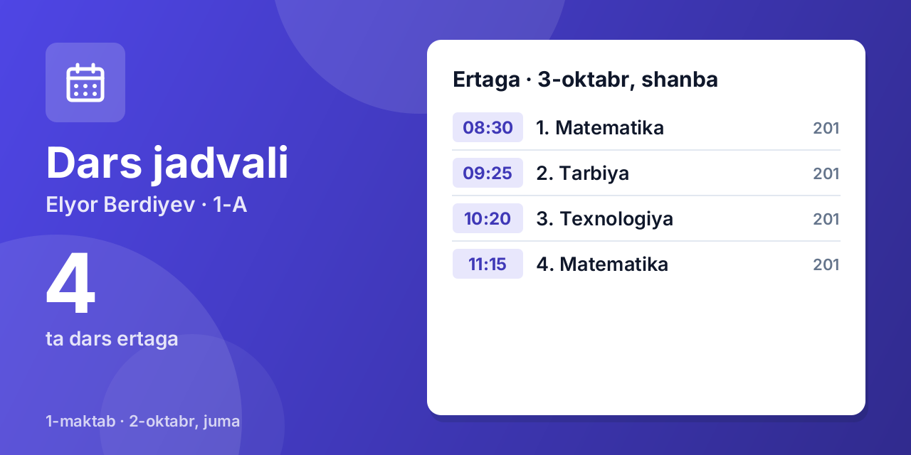
>
> 🏠 › 📅 Jadval › Bugun
>
> **2-oktabr, juma**
>
> **1.** 08:30–09:15 · 🔢 **Matematika**
>       👩‍🏫 Zebo Ne'matova · 🚪 201-xona
>       ☕ _Tanaffus 10 daqiqa_
> ▶️ **2.** 09:25–10:10 · 🔢 **Matematika**
>       👩‍🏫 Zebo Ne'matova · 🚪 201-xona
>       ☕ _Tanaffus 10 daqiqa_
> **3.** 10:20–11:05 · 🔢 **Matematika**
>       👩‍🏫 Zebo Ne'matova · 🚪 201-xona
>       ☕ _Tanaffus 10 daqiqa_
> **4.** 11:15–12:00 · 🛠 **Texnologiya**
>       👩‍🏫 Robiya Yoqubova · 🚪 201-xona
>       ☕ _Tanaffus 40 daqiqa_
> **5.** 12:40–13:25 · 📖 **O'zbek adabiyoti**
>       👩‍🏫 Zebo Ne'matova · 🚪 201-xona
>
>> ▶️ — hozir ketayotgan dars
>
> `[• Bugun •]` `[Ertaga]` `[Hafta]`
> `[🏠 Bosh menyu]`

### 3.2. Ertaga

👤 **Ota-ona:** tugmani bosdi `[Ertaga]`

🤖 **Bot:**

> 
>
> 🏠 › 📅 Jadval › Ertaga
>
> **3-oktabr, shanba**
>
> **1.** 08:30–09:15 · 🔢 **Matematika**
>       👩‍🏫 Zebo Ne'matova · 🚪 201-xona
>       ☕ _Tanaffus 10 daqiqa_
> **2.** 09:25–10:10 · 🤝 **Tarbiya**
>       👩‍🏫 Zebo Ne'matova · 🚪 201-xona
>       ☕ _Tanaffus 10 daqiqa_
> **3.** 10:20–11:05 · 🛠 **Texnologiya**
>       👩‍🏫 Robiya Yoqubova · 🚪 201-xona
>       ☕ _Tanaffus 10 daqiqa_
> **4.** 11:15–12:00 · 🔢 **Matematika**
>       👩‍🏫 Zebo Ne'matova · 🚪 201-xona
>
> `[Bugun]` `[• Ertaga •]` `[Hafta]`
> `[🏠 Bosh menyu]`

### 3.3. Hafta

👤 **Ota-ona:** tugmani bosdi `[Hafta]`

🤖 **Bot:**

> 
>
> 🏠 › 📅 Jadval › Hafta
>
> **Dushanba, 28-sentabr** · 5 ta dars · 08:30–13:25
>    1. 🔢 Matematika
>    2. 🏃 Jismoniy tarbiya
>    3. 📖 O'zbek adabiyoti
>    4. 🇬🇧 Ingliz tili
>    5. 🎵 Musiqa
>
> **Seshanba, 29-sentabr** · 5 ta dars · 08:30–13:25
>    1. 🎨 Tasviriy san'at
>    2. 🤝 Tarbiya
>    3. 🇬🇧 Ingliz tili
>    4. 🏃 Jismoniy tarbiya
>    5. 📝 Ona tili
>
> **Chorshanba, 30-sentabr** · 5 ta dars · 08:30–13:25
>    1. 📖 O'zbek adabiyoti
>    2. 🎵 Musiqa
>    3. 📝 Ona tili
>    4. 📝 Ona tili
>    5. 📝 Ona tili
>
> **Payshanba, 1-oktabr**
> 🎉 O'qituvchilar va murabbiylar kuni — dars yo'q
>
> **Juma, 2-oktabr** · 5 ta dars · 08:30–13:25
>    1. 🔢 Matematika
>    2. 🔢 Matematika ▶️
>    3. 🔢 Matematika
>    4. 🛠 Texnologiya
>    5. 📖 O'zbek adabiyoti
>
> **Shanba, 3-oktabr** · 4 ta dars · 08:30–12:00
>    1. 🔢 Matematika
>    2. 🤝 Tarbiya
>    3. 🛠 Texnologiya
>    4. 🔢 Matematika
>
> `[Bugun]` `[Ertaga]` `[• Hafta •]`
> `[🏠 Bosh menyu]`

### 3.4. Pastki klaviatura orqali ochish

👤 **Ota-ona:** «📅 Dars jadvali»

🤖 **Bot:**

> 
>
> 🏠 › 📅 Jadval › Bugun
>
> **2-oktabr, juma**
>
> **1.** 08:30–09:15 · 🔢 **Matematika**
>       👩‍🏫 Zebo Ne'matova · 🚪 201-xona
>       ☕ _Tanaffus 10 daqiqa_
> ▶️ **2.** 09:25–10:10 · 🔢 **Matematika**
>       👩‍🏫 Zebo Ne'matova · 🚪 201-xona
>       ☕ _Tanaffus 10 daqiqa_
> **3.** 10:20–11:05 · 🔢 **Matematika**
>       👩‍🏫 Zebo Ne'matova · 🚪 201-xona
>       ☕ _Tanaffus 10 daqiqa_
> **4.** 11:15–12:00 · 🛠 **Texnologiya**
>       👩‍🏫 Robiya Yoqubova · 🚪 201-xona
>       ☕ _Tanaffus 40 daqiqa_
> **5.** 12:40–13:25 · 📖 **O'zbek adabiyoti**
>       👩‍🏫 Zebo Ne'matova · 🚪 201-xona
>
>> ▶️ — hozir ketayotgan dars
>
> `[• Bugun •]` `[Ertaga]` `[Hafta]`
> `[🏠 Bosh menyu]`

## 4. Davomat

### 4.1. Oylik xulosa

👤 **Ota-ona:** tugmani bosdi `[✅ Davomat]`

🤖 **Bot:**

> 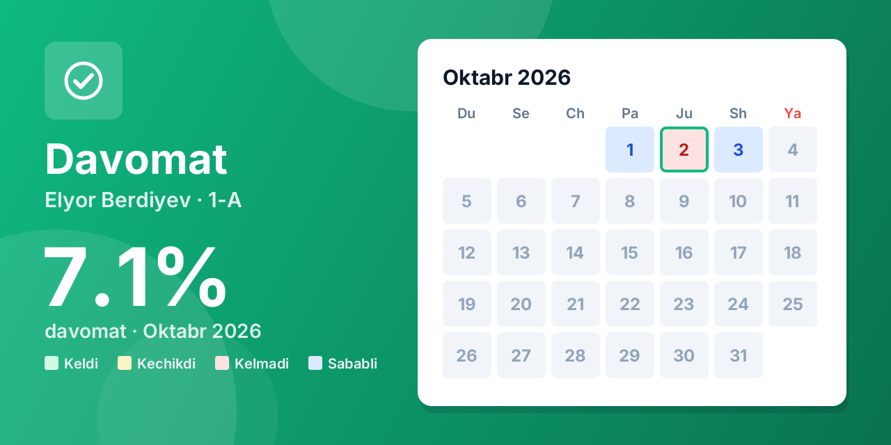
>
> 🏠 › ✅ Davomat › Oktabr 2026
>
> **Oktabr 2026**
>
> 📚 Jami darslar: **14**
> ✅ Kelgan: **0**
> 🟡 Kechikkan: **1**
> 🔴 Kelmagan: **1**
> 🔵 Sababli: **12**
>
> ▰▱▱▱▱▱▱▱▱▱ **7.1%**
>> Sinf o'rtachasi: 7.1% — o'rtacha darajada
>
> `[◀️ Sentabr]` `[Oktabr 2026]` `[·]`
> `[🗓 Kalendar]` `[📋 Batafsil]`
> `[📚 Fanlar bo'yicha]` `[🖼 Rasm ko'rinishida]`
> `[• 🗓 Oy •]` `[🏷 Chorak]` `[🎓 O'quv yili]`
> `[🏠 Bosh menyu]`

### 4.2. Oldingi oy

👤 **Ota-ona:** tugmani bosdi `[◀️ Sentabr]`

🤖 **Bot:**

> 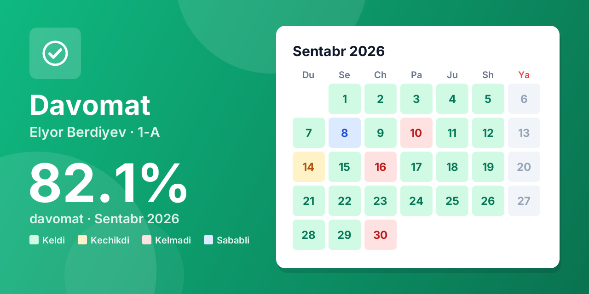
>
> 🏠 › ✅ Davomat › Sentabr 2026
>
> **Sentabr 2026**
>
> 📚 Jami darslar: **28**
> ✅ Kelgan: **21**
> 🟡 Kechikkan: **2**
> 🔴 Kelmagan: **4**
> 🔵 Sababli: **1**
>
> ▰▰▰▰▰▰▰▰▱▱ **82.1%**
>> Sinf o'rtachasi: 94.2% — o'rtachadan pastroq, e'tibor bering
>
> `[◀️ Avgust]` `[Sentabr 2026]` `[Oktabr ▶️]`
> `[🗓 Kalendar]` `[📋 Batafsil]`
> `[📚 Fanlar bo'yicha]` `[🖼 Rasm ko'rinishida]`
> `[• 🗓 Oy •]` `[🏷 Chorak]` `[🎓 O'quv yili]`
> `[🏠 Bosh menyu]`

### 4.3. Kalendar

👤 **Ota-ona:** tugmani bosdi `[🗓 Kalendar]`

🤖 **Bot:**

> 
>
> 🏠 › ✅ Davomat › Oktabr 2026 › 🗓 Kalendar
>
> **Oktabr 2026** · kalendar
>
> `01–04` ▫️▫️▫️🟦🟥🟦⬜
> `05–11` ⬜⬜⬜⬜⬜⬜⬜
> `12–18` ⬜⬜⬜⬜⬜⬜⬜
> `19–25` ⬜⬜⬜⬜⬜⬜⬜
> `26–31` ⬜⬜⬜⬜⬜⬜
>
> 🟩 keldi · 🟨 kechikdi · 🟥 kelmadi · 🟦 sababli · ⬜ dars yo'q
>
> `[🖼 Rasm ko'rinishida]`
> `[⬅️ Orqaga]` `[🏠 Bosh menyu]`

### 4.4. Batafsil — kelmagan va kechikkan darslar

👤 **Ota-ona:** tugmani bosdi `[📋 Batafsil]`

🤖 **Bot:**

> 
>
> 🏠 › ✅ Davomat › Oktabr 2026 › 📋 Batafsil
>
> **Kelmagan va kechikkan darslar** · Oktabr 2026
>
> 🔴 **2-oktabr, juma** · 1-dars · Matematika
> 🟡 **2-oktabr, juma** · 2-dars · Matematika
>
> `[⬅️ Orqaga]` `[🏠 Bosh menyu]`

### 4.5. Fanlar bo'yicha

👤 **Ota-ona:** tugmani bosdi `[📚 Fanlar bo'yicha]`

🤖 **Bot:**

> 
>
> 🏠 › ✅ Davomat › Oktabr 2026 › 📚 Fanlar bo'yicha
>
> **Fanlar bo'yicha** · Oktabr 2026
>
> 🔢 Matematika: 🔴 1 · 🟡 1
>
> `[⬅️ Orqaga]` `[🏠 Bosh menyu]`

### 4.6. Kalendar rasm ko'rinishida

👤 **Ota-ona:** tugmani bosdi `[🖼 Rasm ko'rinishida]`

🤖 **Bot:**

> 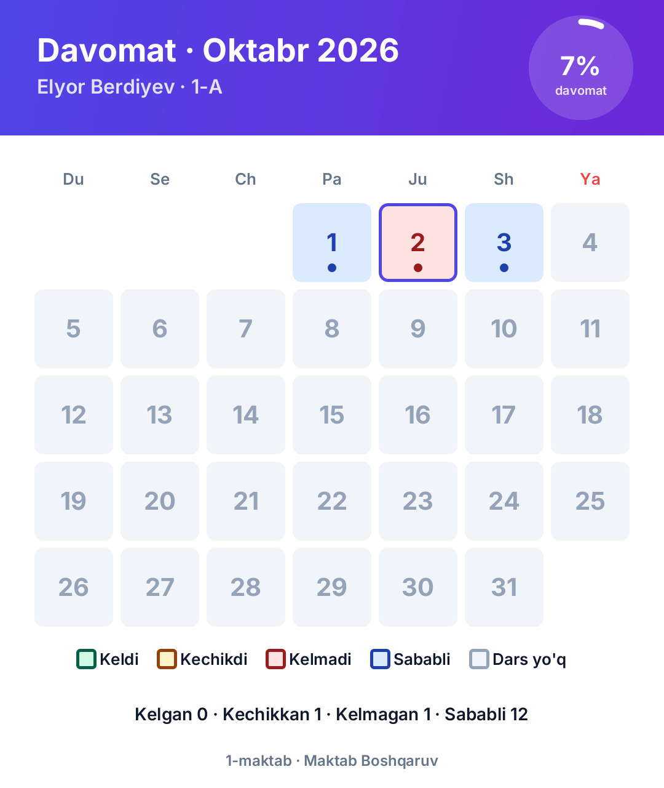
>
> 🗓 **Elyor Berdiyev** · Oktabr 2026
>
> `[⬅️ Orqaga]` `[🏠 Bosh menyu]`

### 4.7. Chorak bo'yicha

👤 **Ota-ona:** tugmani bosdi `[🏷 Chorak]`

🤖 **Bot:**

> 
>
> 🏠 › ✅ Davomat › 1-chorak
>
> **1-chorak**
>
> 📚 Jami darslar: **42**
> ✅ Kelgan: **21**
> 🟡 Kechikkan: **3**
> 🔴 Kelmagan: **5**
> 🔵 Sababli: **13**
>
> ▰▰▰▰▰▰▱▱▱▱ **57.1%**
>> Sinf o'rtachasi: 92% — o'rtachadan pastroq, e'tibor bering
>
> `[·]` `[1-chorak]` `[2-chorak ▶️]`
> `[🗓 Kalendar]` `[📋 Batafsil]`
> `[📚 Fanlar bo'yicha]`
> `[🗓 Oy]` `[• 🏷 Chorak •]` `[🎓 O'quv yili]`
> `[🏠 Bosh menyu]`

### 4.8. O'quv yili bo'yicha

👤 **Ota-ona:** tugmani bosdi `[🎓 O'quv yili]`

🤖 **Bot:**

> 
>
> 🏠 › ✅ Davomat › 2026–2027 o'quv yili
>
> **2026–2027 o'quv yili**
>
> 📚 Jami darslar: **42**
> ✅ Kelgan: **21**
> 🟡 Kechikkan: **3**
> 🔴 Kelmagan: **5**
> 🔵 Sababli: **13**
>
> ▰▰▰▰▰▰▱▱▱▱ **57.1%**
>> Sinf o'rtachasi: 92% — o'rtachadan pastroq, e'tibor bering
>
> `[🗓 Kalendar]` `[📋 Batafsil]`
> `[📚 Fanlar bo'yicha]`
> `[🗓 Oy]` `[🏷 Chorak]` `[• 🎓 O'quv yili •]`
> `[🏠 Bosh menyu]`

## 5. Baholar

### 5.1. So'nggi baholar

👤 **Ota-ona:** tugmani bosdi `[📘 Baholar]`

🤖 **Bot:**

> 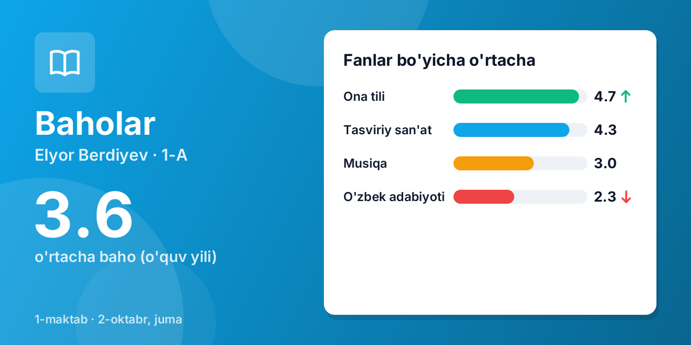
>
> 🏠 › 📘 Baholar › 🕘 So'nggi
>
> **So'nggi baholar**
>
> 🟢 **5** · Ona tili · 2-oktabr
>       _joriy_
> 🔴 **2** · O'zbek adabiyoti · 2-oktabr
>       _joriy_ — «Uy vazifasi bajarilmagan»
> 🟢 **5** · Ona tili · 2-oktabr
>       _joriy_
> 🔴 **2** · O'zbek adabiyoti · 2-oktabr
>       _joriy_ — «Uy vazifasi bajarilmagan»
> 🟢 **5** · Ona tili · 2-oktabr
>       _joriy_
> 🔴 **2** · O'zbek adabiyoti · 2-oktabr
>       _joriy_ — «Uy vazifasi bajarilmagan»
> 🟢 **5** · Ona tili · 2-oktabr
>       _joriy_
> 🔴 **2** · O'zbek adabiyoti · 2-oktabr
>       _joriy_ — «Uy vazifasi bajarilmagan»
>
> `[• 🕘 So'nggi •]` `[📚 Fanlar]` `[🏅 Chorak]`
> `[·]` `[1/6]` `[▶️]`
> `[🏠 Bosh menyu]`

### 5.2. Fanlar bo'yicha o'rtacha (tendensiya bilan)

👤 **Ota-ona:** tugmani bosdi `[📚 Fanlar]`

🤖 **Bot:**

> 
>
> 🏠 › 📘 Baholar › 📚 Fanlar
>
> **Fanlar bo'yicha o'rtacha**
>
> 📗 Ona tili **4.7** ▰▰▰▰▰ ↑
> 📘 Tasviriy san'at **4.3** ▰▰▰▰▱ 
> 📙 Musiqa **3.0** ▰▰▰▱▱ 
> 📕 O'zbek adabiyoti **2.3** ▰▰▱▱▱ ↓
>
>> ↑ ↓ — o'tgan oyga nisbatan o'zgarish. Fanni bosing — barcha baholar ochiladi.
>
> `[🕘 So'nggi]` `[• 📚 Fanlar •]` `[🏅 Chorak]`
> `[📝 Ona tili]` `[🎨 Tasviriy san'at]`
> `[🎵 Musiqa]` `[📖 O'zbek adabiyoti]`
> `[📈 Grafik]`
> `[🏠 Bosh menyu]`

### 5.3. Fan tafsiloti — barcha baholar va o'qituvchi

👤 **Ota-ona:** tugmani bosdi `[📝 Ona tili]`

🤖 **Bot:**

> 
>
> 🏠 › 📘 Baholar › Ona tili
>
> 📝 **Ona tili**
> 👩‍🏫 O'qituvchi: Zebo Ne'matova
> 📈 O'rtacha: **4.69** · 13 ta baho
>
> 🟢 **5** · 2-oktabr, juma · _joriy_
> 🟢 **5** · 2-oktabr, juma · _joriy_
> 🟢 **5** · 2-oktabr, juma · _joriy_
> 🟢 **5** · 2-oktabr, juma · _joriy_
> 🟢 **5** · 2-oktabr, juma · _joriy_
> 🟢 **5** · 30-sentabr, chorshanba · _joriy_
> 🟢 **5** · 30-sentabr, chorshanba · _joriy_
> 🟢 **5** · 30-sentabr, chorshanba · _joriy_
>
> `[·]` `[1/2]` `[▶️]`
> `[💬 Maktabga yozish]`
> `[⬅️ Orqaga]` `[🏠 Bosh menyu]`

### 5.4. Chorak baholari

👤 **Ota-ona:** tugmani bosdi `[🏅 Chorak]`

🤖 **Bot:**

> 
>
> 🏠 › 📘 Baholar › 🏅 Chorak
>
> **Chorak baholari**
>
> Chorak baholari hali qo'yilmagan 🙂
>
> `[🕘 So'nggi]` `[📚 Fanlar]` `[• 🏅 Chorak •]`
> `[🏠 Bosh menyu]`

### 5.5. Grafik (rasm)

👤 **Ota-ona:** tugmani bosdi `[📈 Grafik]`

🤖 **Bot:**

> 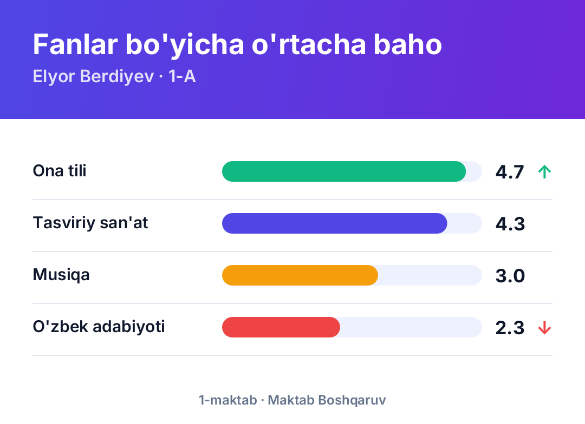
>
> 📈 **Elyor Berdiyev** · fanlar bo'yicha o'rtacha baholar
>
> `[⬅️ Orqaga]` `[🏠 Bosh menyu]`

## 6. Hisobot

### 6.1. Hafta

👤 **Ota-ona:** tugmani bosdi `[📊 Hisobot]`

🤖 **Bot:**

> 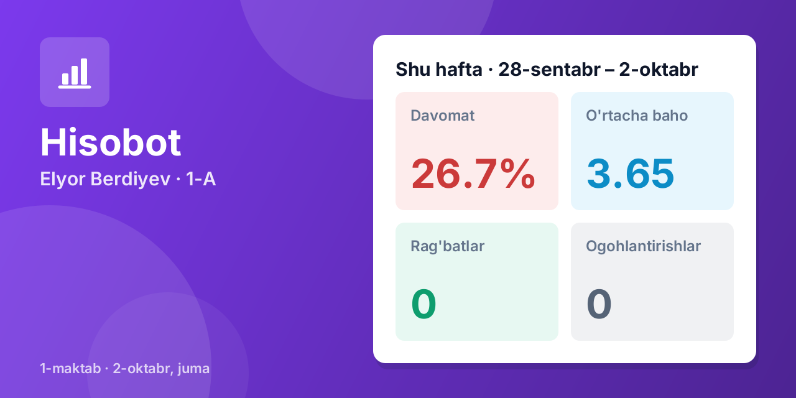
>
> 🏠 › 📊 Hisobot › 🗓 Hafta
>
> **28-sentabr – 2-oktabr**
>
> ✅ **Davomat:** 26.7% (4/15) · 🔴 3 · 🟡 2
> 📘 **Baholar:** 20 ta, o'rtacha **3.65**
> ⭐ **Xulq:** 🌟 0 rag'bat · ⚠️ 0 ogohlantirish
>
> 💪 **Kuchli fanlar:** 📝 Ona tili, 🎨 Tasviriy san'at
> 🎯 **E'tibor talab qiladi:** 📖 O'zbek adabiyoti
>
> `[• 🗓 Hafta •]` `[📆 Oy]`
> `[🖼 Rasm ko'rinishida]`
> `[🏠 Bosh menyu]`

### 6.2. Oy

👤 **Ota-ona:** tugmani bosdi `[Oy]`

🤖 **Bot:**

> 
>
> 🏠 › 📊 Hisobot › 📆 Oy
>
> **Oktabr 2026**
>
> ✅ **Davomat:** 10% (1/10) · 🔴 1 · 🟡 1
> 📘 **Baholar:** 10 ta, o'rtacha **3.50**
> ⭐ **Xulq:** 🌟 0 rag'bat · ⚠️ 0 ogohlantirish
>
> 💪 **Kuchli fanlar:** 📝 Ona tili
> 🎯 **E'tibor talab qiladi:** 📖 O'zbek adabiyoti
>
> `[🗓 Hafta]` `[• 📆 Oy •]`
> `[🖼 Rasm ko'rinishida]`
> `[🏠 Bosh menyu]`

### 6.3. Hisobot kartochkasi (rasm)

👤 **Ota-ona:** tugmani bosdi `[🖼 Rasm ko'rinishida]`

🤖 **Bot:**

> 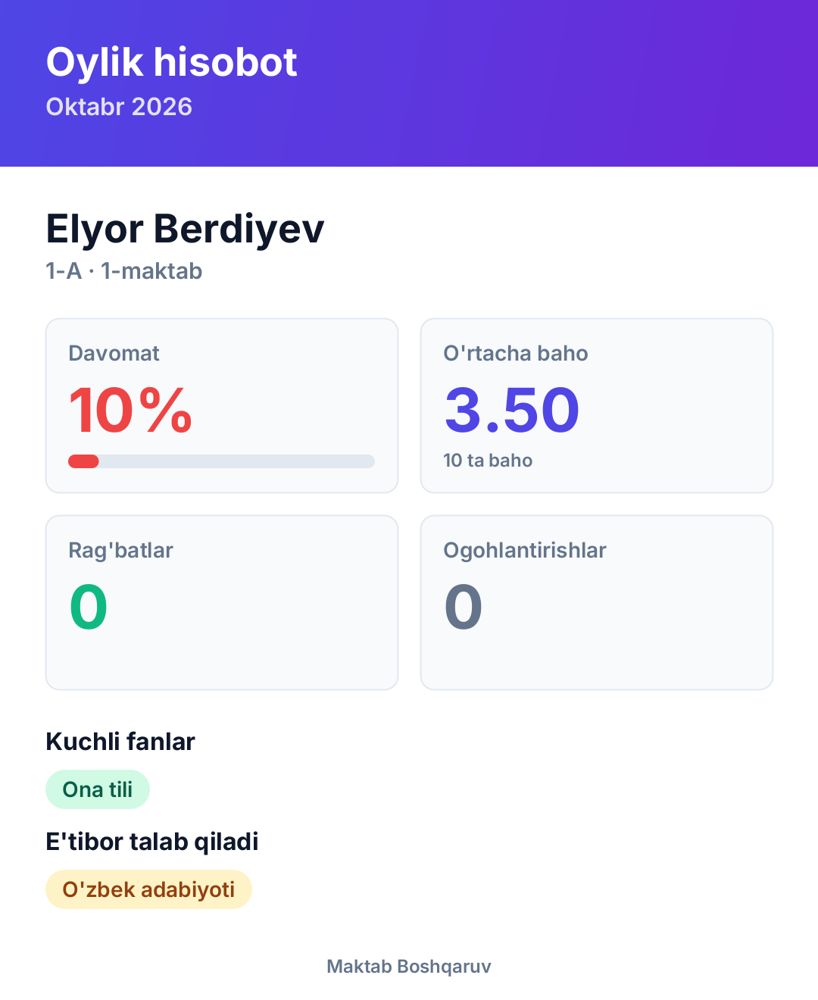
>
> 📊 **Elyor Berdiyev** · Oktabr 2026
>
> `[⬅️ Orqaga]` `[🏠 Bosh menyu]`

## 7. Xulq

### 7.1. Joriy oy

👤 **Ota-ona:** tugmani bosdi `[⭐ Xulq]`

🤖 **Bot:**

> 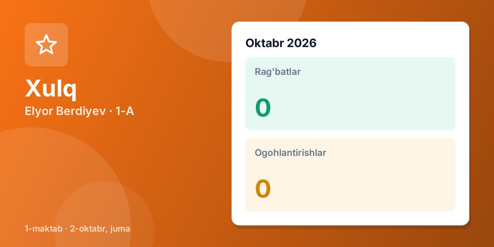
>
> 🏠 › ⭐ Xulq › Oktabr 2026
>
> **Oktabr 2026**: 🌟 0 ta rag'bat · ⚠️ 0 ta ogohlantirish
>
> Hozircha xulq yozuvlari yo'q 🙂
>
> `[◀️ Sentabr]` `[Oktabr 2026]` `[·]`
> `[🏠 Bosh menyu]`

### 7.2. Oldingi oy

👤 **Ota-ona:** tugmani bosdi `[◀️ Sentabr]`

🤖 **Bot:**

> 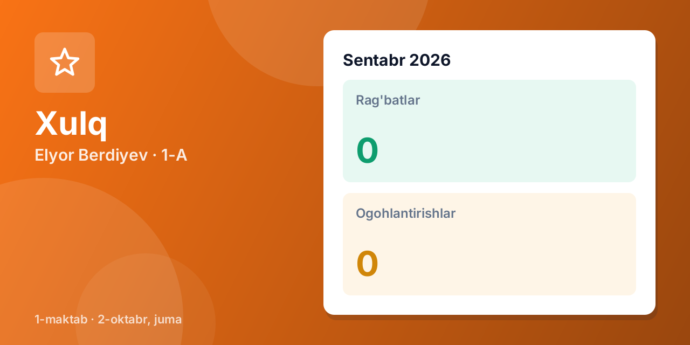
>
> 🏠 › ⭐ Xulq › Sentabr 2026
>
> **Sentabr 2026**: 🌟 0 ta rag'bat · ⚠️ 0 ta ogohlantirish
>
> Hozircha xulq yozuvlari yo'q 🙂
>
> `[◀️ Avgust]` `[Sentabr 2026]` `[Oktabr ▶️]`
> `[🏠 Bosh menyu]`

## 8. E'lonlar

### 8.1. Ro'yxat

👤 **Ota-ona:** tugmani bosdi `[📢 E'lonlar]`

🤖 **Bot:**

> 
>
> 🏠 › 📢 E'lonlar
>
> **E'lonlar** · 16 ta
>
> 🆕 🔴 **Kuzgi sport musobaqasi** · 2-oktabr
> 🔴 **Kuzgi sport musobaqasi** · 2-oktabr
> 🔴 **Kuzgi sport musobaqasi** · 2-oktabr
> 🔴 **Kuzgi sport musobaqasi** · 2-oktabr
> 🔴 **Kuzgi sport musobaqasi** · 2-oktabr
> 🔴 **Kuzgi sport musobaqasi** · 30-sentabr
>
>> 🆕 — yangi · 🔴 — muhim
>
> `[🆕 🔴 Kuzgi sport musobaqasi]`
> `[🔴 Kuzgi sport musobaqasi]`
> `[🔴 Kuzgi sport musobaqasi]`
> `[🔴 Kuzgi sport musobaqasi]`
> `[🔴 Kuzgi sport musobaqasi]`
> `[🔴 Kuzgi sport musobaqasi]`
> `[·]` `[1/3]` `[▶️]`
> `[🏠 Bosh menyu]`

### 8.2. To'liq matn

👤 **Ota-ona:** tugmani bosdi `[🆕 🔴 Kuzgi sport musobaqasi]`

🤖 **Bot:**

> 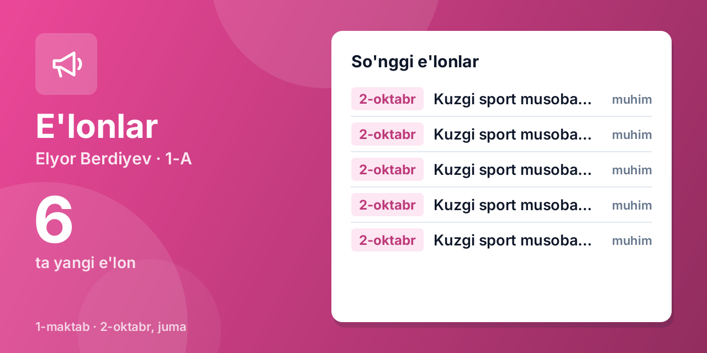
>
> 🏠 › 📢 E'lonlar › Kuzgi sport musobaqasi
>
> 🔴 **Kuzgi sport musobaqasi**
> _2-oktabr, juma_
>
> Shanba kuni soat 10:00 da maktab stadionida «Sog'lom avlod» sport musobaqasi bo'lib o'tadi. Farzandingizga sport kiyimini olib kelishni unutmang!
>
> `[⬅️ Orqaga]` `[🏠 Bosh menyu]`

## 9. Tadbirlar

### 9.1. Yaqinlashayotgan tadbirlar

👤 **Ota-ona:** tugmani bosdi `[🗓 Tadbirlar]`

🤖 **Bot:**

> 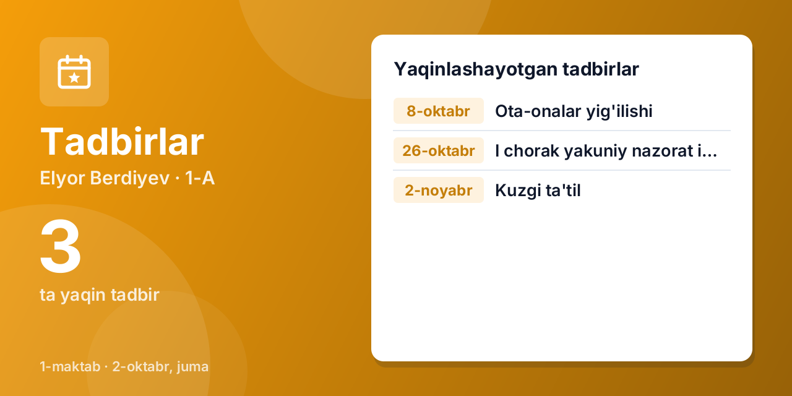
>
> 🏠 › 🗓 Tadbirlar
>
> **Yaqinlashayotgan tadbirlar**
>
> 👨‍👩‍👧 **Ota-onalar yig'ilishi**
>       8-oktabr, payshanba · _6 kundan keyin_
> 📝 **I chorak yakuniy nazorat ishlari**
>       26-oktabr – 30-oktabr · _24 kundan keyin_
> 🏖 **Kuzgi ta'til**
>       2-noyabr – 9-noyabr · _31 kundan keyin_
>
>> 🔔 Har bir tadbirdan 1 kun oldin eslatib qo'yaman
>
> `[🏠 Bosh menyu]`

## 10. O'qituvchilar

### 10.1. Sinf rahbari va fan o'qituvchilari

👤 **Ota-ona:** tugmani bosdi `[👩‍🏫 O'qituvchilar]`

🤖 **Bot:**

> 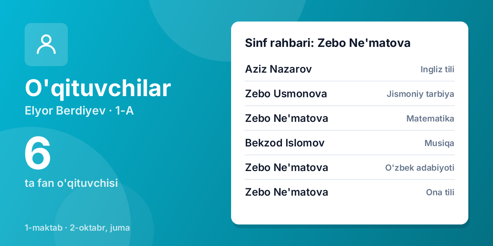
>
> 🏠 › 👩‍🏫 O'qituvchilar
>
> **O'qituvchilar** · 1-A sinf
>
> ⭐ **Sinf rahbari:** Zebo Ne'matova
>
> 🇬🇧 **Ingliz tili** — Aziz Nazarov
> 🏃 **Jismoniy tarbiya** — Zebo Usmonova
> 🔢 **Matematika** — Zebo Ne'matova
> 🎵 **Musiqa** — Bekzod Islomov
> 📖 **O'zbek adabiyoti** — Zebo Ne'matova
> 📝 **Ona tili** — Zebo Ne'matova
> 🤝 **Tarbiya** — Zebo Ne'matova
> 🎨 **Tasviriy san'at** — Bahodir Xasanov
> 🛠 **Texnologiya** — Robiya Yoqubova
>
>> 📞 O'qituvchi bilan bog'lanish uchun «💬 Maktabga yozish» bo'limidan foydalaning
>
> `[💬 Maktabga yozish]`
> `[🏠 Bosh menyu]`

## 11. Maktabga yozish

### 11.1. Bo'lim

👤 **Ota-ona:** tugmani bosdi `[💬 Maktabga yozish]`

🤖 **Bot:**

> 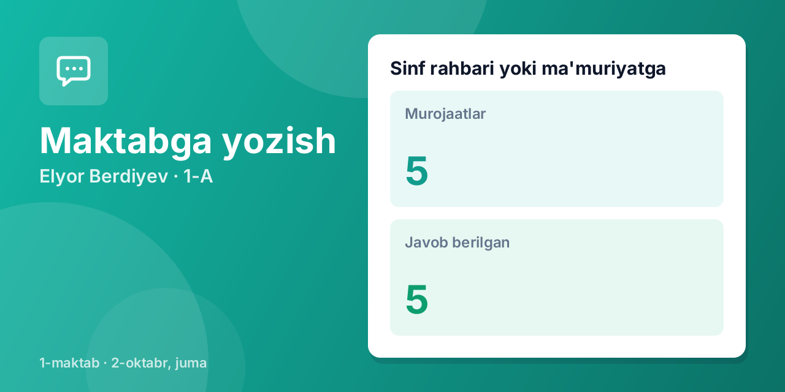
>
> 🏠 › 💬 Murojaat
>
> **Maktabga yozish**
> Savol, taklif yoki muammo bo'lsa — yozing, javob shu yerga keladi.
>
> **Kimga yozasiz?**
>
> **Oxirgi murojaatlar**
> ✅ 2-oktabr · 👩‍🏫 Sinf rahbariga
> _«Assalomu alaykum! Ertaga farzandim tish shifokoriga boradi,…»_
> ↪️ **Javob:** Va alaykum assalom! Albatta, 3-darsdan so'ng olib ketishingiz mumkin. Sinf rahbari.
> ✅ 2-oktabr · 👩‍🏫 Sinf rahbariga
> _«Assalomu alaykum! Ertaga farzandim tish shifokoriga boradi,…»_
> ↪️ **Javob:** Va alaykum assalom! Albatta, 3-darsdan so'ng olib ketishingiz mumkin. Sinf rahbari.
> ✅ 2-oktabr · 👩‍🏫 Sinf rahbariga
> _«Assalomu alaykum! Ertaga farzandim tish shifokoriga boradi,…»_
> ↪️ **Javob:** Va alaykum assalom! Albatta, 3-darsdan so'ng olib ketishingiz mumkin. Sinf rahbari.
>
> `[👩‍🏫 Sinf rahbariga]` `[🏢 Ma'muriyatga]`
> `[🏠 Bosh menyu]`

### 11.2. Sinf rahbariga yozish

👤 **Ota-ona:** tugmani bosdi `[👩‍🏫 Sinf rahbariga]`

🤖 **Bot:**

> 
>
> 🏠 › 💬 Murojaat › 👩‍🏫 Sinf rahbariga
>
> ✍️ **👩‍🏫 Sinf rahbariga** xabaringizni yozing.
> Xohlasangiz, rasm ham yuborishingiz mumkin (izoh bilan).
>
> `[✖️ Bekor qilish]`

👤 **Ota-ona:** «Assalomu alaykum! Ertaga farzandim tish shifokoriga boradi, 3-darsdan keyin olib ketsam bo'ladimi?»

🤖 **Bot:**

> 
>
> ✅ Xabaringiz yuborildi! Javob kelishi bilan shu yerda xabar beraman.
>
> 🏠 › 💬 Murojaat
>
> **Maktabga yozish**
> Savol, taklif yoki muammo bo'lsa — yozing, javob shu yerga keladi.
>
> **Kimga yozasiz?**
>
> **Oxirgi murojaatlar**
> ⏳ 2-oktabr · 👩‍🏫 Sinf rahbariga
> _«Assalomu alaykum! Ertaga farzandim tish shifokoriga boradi,…»_
> ✅ 2-oktabr · 👩‍🏫 Sinf rahbariga
> _«Assalomu alaykum! Ertaga farzandim tish shifokoriga boradi,…»_
> ↪️ **Javob:** Va alaykum assalom! Albatta, 3-darsdan so'ng olib ketishingiz mumkin. Sinf rahbari.
> ✅ 2-oktabr · 👩‍🏫 Sinf rahbariga
> _«Assalomu alaykum! Ertaga farzandim tish shifokoriga boradi,…»_
> ↪️ **Javob:** Va alaykum assalom! Albatta, 3-darsdan so'ng olib ketishingiz mumkin. Sinf rahbari.
>
> `[👩‍🏫 Sinf rahbariga]` `[🏢 Ma'muriyatga]`
> `[🏠 Bosh menyu]`

### 11.3. Maktab javob berdi

🏫 **Maktab (admin panel):** «Murojaatlar» sahifasida javob yozdi

_(bir necha soniyadan so'ng botdan avtomatik xabar keldi)_

🤖 **Bot:**

> 💬 **Maktabdan javob**
>> Assalomu alaykum! Ertaga farzandim tish shifokoriga boradi, 3-darsdan keyin olib ketsam bo'ladimi?
> Va alaykum assalom! Albatta, 3-darsdan so'ng olib ketishingiz mumkin. Sinf rahbari.
>
> 🏫 _1-maktab_

## 12. Sababli ariza

### 12.1. Bo'lim — sana tanlash

👤 **Ota-ona:** tugmani bosdi `[🤒 Sababli ariza]`

🤖 **Bot:**

> 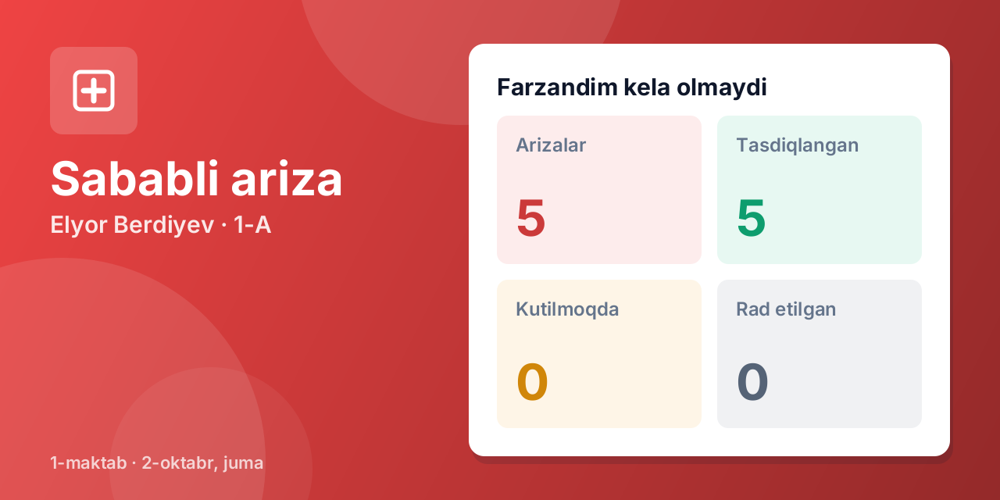
>
> 🏠 › 🤒 Sababli ariza
>
> **Sababli ariza**
> Farzandingiz maktabga kela olmasa, oldindan xabar bering.
>
> **Qaysi kundan boshlab?**
>
> **Oldingi arizalar**
> ✅ Qabul qilindi · 3-oktabr – 4-oktabr · 🤒 Kasallik
> ✅ Qabul qilindi · 3-oktabr – 4-oktabr · 🤒 Kasallik
> ✅ Qabul qilindi · 3-oktabr – 4-oktabr · 🤒 Kasallik
> ✅ Qabul qilindi · 3-oktabr – 4-oktabr · 🤒 Kasallik
> ✅ Qabul qilindi · 3-oktabr – 4-oktabr · 🤒 Kasallik
>
> `[Bugun]` `[Ertaga]`
> `[5-oktabr, Du]` `[6-oktabr, Se]`
> `[7-oktabr, Ch]` `[8-oktabr, Pa]`
> `[🏠 Bosh menyu]`

### 12.2. Necha kun?

👤 **Ota-ona:** tugmani bosdi `[Ertaga]`

🤖 **Bot:**

> 
>
> 🏠 › 🤒 Sababli ariza
>
> **Necha kun?**
> 📅 Boshlanish: 3-oktabr, shanba
>
> `[1 kun]` `[2 kun]` `[3 kun]`
> `[5 kun]` `[7 kun]`
> `[⬅️ Orqaga]` `[🏠 Bosh menyu]`

### 12.3. Sabab

👤 **Ota-ona:** tugmani bosdi `[2 kun]`

🤖 **Bot:**

> 
>
> 🏠 › 🤒 Sababli ariza
>
> **Sabab nima?**
>
> `[🤒 Kasallik]`
> `[👨‍👩‍👧 Oilaviy sabab]`
> `[📝 Boshqa]`
> `[⬅️ Orqaga]` `[🏠 Bosh menyu]`

### 12.4. Izoh

👤 **Ota-ona:** tugmani bosdi `[🤒 Kasallik]`

🤖 **Bot:**

> 
>
> 🏠 › 🤒 Sababli ariza
>
> ✍️ Qisqa izoh yozing (masalan: «isitmasi bor»), yoki «O'tkazib yuborish»ni bosing.
>
> `[⏭ O'tkazib yuborish]`
> `[✖️ Bekor qilish]`

👤 **Ota-ona:** «Isitmasi bor, shifokor 2 kun uyda dam olishni buyurdi»

🤖 **Bot:**

> 
>
> 🏠 › 🤒 Sababli ariza
>
> 📎 Shifokor ma'lumotnomasi bo'lsa, rasmini yuboring. Bo'lmasa — «O'tkazib yuborish».
>
> `[⏭ O'tkazib yuborish]`
> `[✖️ Bekor qilish]`

### 12.5. Ma'lumotnoma rasmi

👤 **Ota-ona:** shifokor ma'lumotnomasining rasmini yubordi 📎

🤖 **Bot:**

> 
>
> 🏠 › 🤒 Sababli ariza
>
> **Arizani tekshiring:**
> 👤 Elyor Berdiyev
> 📅 3-oktabr, shanba – 4-oktabr, yakshanba (2 kun)
> 📝 🤒 Kasallik
> 💬 Isitmasi bor, shifokor 2 kun uyda dam olishni buyurdi
> 📎 Rasm biriktirildi
>
> Yuboraymi?
>
> `[📨 Yuborish]`
> `[✖️ Bekor qilish]`

### 12.6. Tasdiqlash va yuborish

👤 **Ota-ona:** tugmani bosdi `[📨 Yuborish]`

🤖 **Bot:**

> 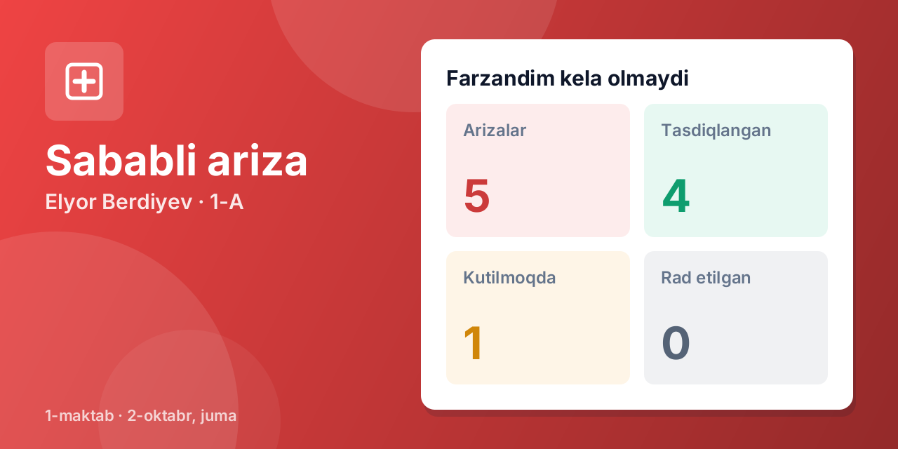
>
> ✅ Ariza yuborildi! Sinf rahbari ko'rib chiqishi bilan xabar beraman.
>
> 🏠 › 🤒 Sababli ariza
>
> **Sababli ariza**
> Farzandingiz maktabga kela olmasa, oldindan xabar bering.
>
> **Qaysi kundan boshlab?**
>
> **Oldingi arizalar**
> ⏳ Ko'rib chiqilmoqda · 3-oktabr – 4-oktabr · 🤒 Kasallik
> ✅ Qabul qilindi · 3-oktabr – 4-oktabr · 🤒 Kasallik
> ✅ Qabul qilindi · 3-oktabr – 4-oktabr · 🤒 Kasallik
> ✅ Qabul qilindi · 3-oktabr – 4-oktabr · 🤒 Kasallik
> ✅ Qabul qilindi · 3-oktabr – 4-oktabr · 🤒 Kasallik
>
> `[Bugun]` `[Ertaga]`
> `[5-oktabr, Du]` `[6-oktabr, Se]`
> `[7-oktabr, Ch]` `[8-oktabr, Pa]`
> `[🏠 Bosh menyu]`

### 12.7. Sinf rahbari arizani tasdiqladi

🏫 **Maktab (admin panel):** «Sababli arizalar» sahifasida «Tasdiqlash»ni bosdi — o'sha kunlarning davomati avtomatik «sababli» bo'ldi

> _Admin panel: 4 ta dars «sababli» (EXCUSED) deb belgilandi._

_(botdan avtomatik xabar)_

🤖 **Bot:**

> ✅ **Arizangiz qabul qilindi**
> 👤 Elyor Berdiyev · 03.10.2026 – 04.10.2026
> Bu kunlardagi darslar sababli deb belgilandi. Tezroq sog'ayib keting! 🌷
>
> 🏫 _1-maktab_

## 13. Maktab haqida

### 13.1. Kontaktlar va qo'ng'iroq jadvali

👤 **Ota-ona:** tugmani bosdi `[🏫 Maktab haqida]`

🤖 **Bot:**

> 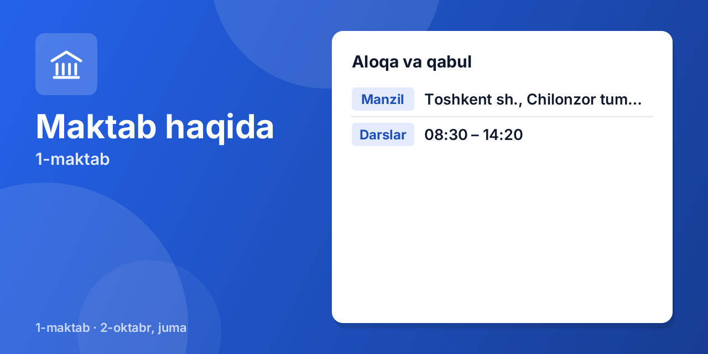
>
> 🏠 › 🏫 Maktab
>
> 🏫 **1-maktab**
> 📍 Toshkent sh., Chilonzor tumani, Bunyodkor ko'chasi 12
>
> 🔔 **Qo'ng'iroq jadvali**
> 1-dars · 08:30–09:15
> 2-dars · 09:25–10:10
> 3-dars · 10:20–11:05
> 4-dars · 11:15–12:00
> 5-dars · 12:40–13:25
> 6-dars · 13:35–14:20
>
> `[💬 Maktabga yozish]`
> `[🏠 Bosh menyu]`

## 14. Sozlamalar (3 til)

### 14.1. Xabarlar

👤 **Ota-ona:** tugmani bosdi `[⚙️ Sozlamalar]`

🤖 **Bot:**

> 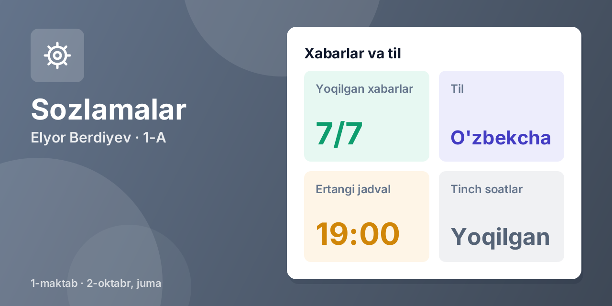
>
> 🏠 › ⚙️ Sozlamalar
>
> **Sozlamalar**
> Qaysi xabarlar kelsin? Bosib yoqing yoki o'chiring.
>
> ✅ Kelmadi / kechikdi
> ✅ Baholar
> ✅ Past baho
> ✅ E'lonlar
> ✅ Ertangi jadval
> ✅ Haftalik hisobot
> ✅ Tadbir eslatmasi
>
> `[✅ Kelmadi / kechikdi]` `[✅ Baholar]`
> `[✅ Past baho]` `[✅ E'lonlar]`
> `[✅ Ertangi jadval]` `[✅ Haftalik hisobot]`
> `[✅ Tadbir eslatmasi]`
> `[⏰ Vaqtlar]` `[🌐 Til / Язык]`
> `[🏠 Bosh menyu]`

### 14.2. «Haftalik hisobot»ni o'chirish

👤 **Ota-ona:** tugmani bosdi `[✅ Haftalik hisobot]`

🤖 **Bot:**

> 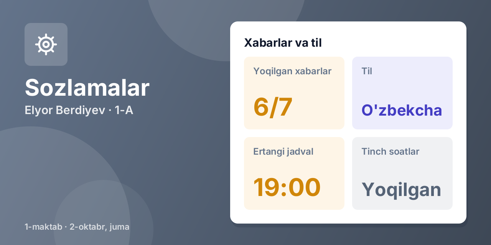
>
> 🏠 › ⚙️ Sozlamalar
>
> **Sozlamalar**
> Qaysi xabarlar kelsin? Bosib yoqing yoki o'chiring.
>
> ✅ Kelmadi / kechikdi
> ✅ Baholar
> ✅ Past baho
> ✅ E'lonlar
> ✅ Ertangi jadval
> ▫️ Haftalik hisobot
> ✅ Tadbir eslatmasi
>
> `[✅ Kelmadi / kechikdi]` `[✅ Baholar]`
> `[✅ Past baho]` `[✅ E'lonlar]`
> `[✅ Ertangi jadval]` `[▫️ Haftalik hisobot]`
> `[✅ Tadbir eslatmasi]`
> `[⏰ Vaqtlar]` `[🌐 Til / Язык]`
> `[🏠 Bosh menyu]`

👤 **Ota-ona:** tugmani bosdi `[▫️ Haftalik hisobot]`

🤖 **Bot:**

> 
>
> 🏠 › ⚙️ Sozlamalar
>
> **Sozlamalar**
> Qaysi xabarlar kelsin? Bosib yoqing yoki o'chiring.
>
> ✅ Kelmadi / kechikdi
> ✅ Baholar
> ✅ Past baho
> ✅ E'lonlar
> ✅ Ertangi jadval
> ✅ Haftalik hisobot
> ✅ Tadbir eslatmasi
>
> `[✅ Kelmadi / kechikdi]` `[✅ Baholar]`
> `[✅ Past baho]` `[✅ E'lonlar]`
> `[✅ Ertangi jadval]` `[✅ Haftalik hisobot]`
> `[✅ Tadbir eslatmasi]`
> `[⏰ Vaqtlar]` `[🌐 Til / Язык]`
> `[🏠 Bosh menyu]`

### 14.3. Vaqtlar

👤 **Ota-ona:** tugmani bosdi `[⏰ Vaqtlar]`

🤖 **Bot:**

> 
>
> 🏠 › ⚙️ Sozlamalar › ⏰ Vaqtlar
>
> **Vaqtlar**
> 📅 Ertangi jadval: **19:00** da
> 🌙 Tinch soatlar: **maktab bo'yicha (22:00–07:00)**
>> Tinch soatlarda yuzaga kelgan xabarlar ertalab yuboriladi
>
> `[📅 Ertangi jadval vaqti:]`
> `[18:00]` `[• 19:00 •]` `[20:00]` `[21:00]`
> `[🌙 Tinch soatlar:]`
> `[21:00–07:00]` `[22:00–07:00]` `[23:00–07:00]`
> `[🏫 Maktabniki]` `[🔔 O'chirish]`
> `[⬅️ Orqaga]` `[🏠 Bosh menyu]`

👤 **Ota-ona:** tugmani bosdi `[20:00]`

🤖 **Bot:**

> 
>
> 🏠 › ⚙️ Sozlamalar › ⏰ Vaqtlar
>
> **Vaqtlar**
> 📅 Ertangi jadval: **20:00** da
> 🌙 Tinch soatlar: **maktab bo'yicha (22:00–07:00)**
>> Tinch soatlarda yuzaga kelgan xabarlar ertalab yuboriladi
>
> `[📅 Ertangi jadval vaqti:]`
> `[18:00]` `[19:00]` `[• 20:00 •]` `[21:00]`
> `[🌙 Tinch soatlar:]`
> `[21:00–07:00]` `[22:00–07:00]` `[23:00–07:00]`
> `[🏫 Maktabniki]` `[🔔 O'chirish]`
> `[⬅️ Orqaga]` `[🏠 Bosh menyu]`

👤 **Ota-ona:** tugmani bosdi `[19:00]`

🤖 **Bot:**

> 
>
> 🏠 › ⚙️ Sozlamalar › ⏰ Vaqtlar
>
> **Vaqtlar**
> 📅 Ertangi jadval: **19:00** da
> 🌙 Tinch soatlar: **maktab bo'yicha (22:00–07:00)**
>> Tinch soatlarda yuzaga kelgan xabarlar ertalab yuboriladi
>
> `[📅 Ertangi jadval vaqti:]`
> `[18:00]` `[• 19:00 •]` `[20:00]` `[21:00]`
> `[🌙 Tinch soatlar:]`
> `[21:00–07:00]` `[22:00–07:00]` `[23:00–07:00]`
> `[🏫 Maktabniki]` `[🔔 O'chirish]`
> `[⬅️ Orqaga]` `[🏠 Bosh menyu]`

### 14.4. Til

👤 **Ota-ona:** tugmani bosdi `[🌐 Til / Язык]`

🤖 **Bot:**

> 
>
> 🏠 › ⚙️ Sozlamalar › 🌐 Til / Язык
>
> **Tilni tanlang** · Тилни танланг · Выберите язык
>
> `[✅ 🇺🇿 O'zbekcha]`
> `[🇺🇿 Ўзбекча]`
> `[🇷🇺 Русский]`
> `[⬅️ Orqaga]` `[🏠 Bosh menyu]`

### 14.5. Ўзбекча (кирилл)

👤 **Ota-ona:** tugmani bosdi `[🇺🇿 Ўзбекча]`

🤖 **Bot:**

> ✅ Тил ўзгартирилди
>
> ⌨️ _Pastki klaviatura:_
> `📱 Кундаликни очиш`
> `📅 Дарс жадвали` `✅ Давомат`
> `📘 Баҳолар` `📊 Ҳисобот`
> `📢 Эълонлар` `🗓 Тадбирлар`
> `👩‍🏫 Ўқитувчилар` `💬 Мактабга ёзиш`
> `🤒 Сабабли ариза` `⚙️ Созламалар`
> `👨‍👩‍👧 Фарзандларим`

🤖 **Bot:**

> 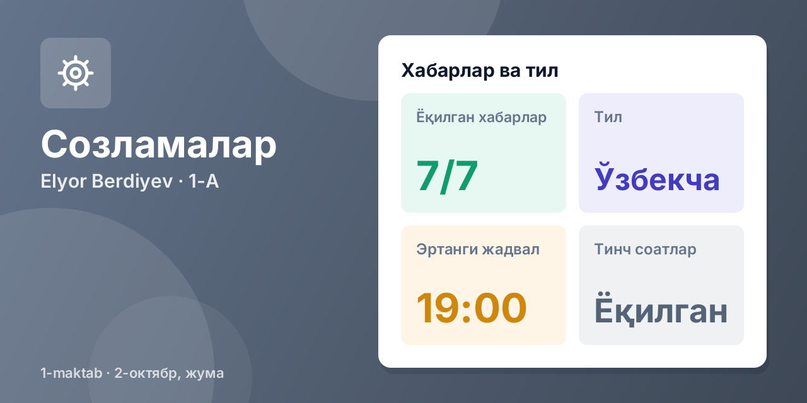
>
> 🏠 › ⚙️ Созламалар
>
> **Созламалар**
> Қайси хабарлар келсин? Босиб ёқинг ёки ўчиринг.
>
> ✅ Келмади / кечикди
> ✅ Баҳолар
> ✅ Паст баҳо
> ✅ Эълонлар
> ✅ Эртанги жадвал
> ✅ Ҳафталик ҳисобот
> ✅ Тадбир эслатмаси
>
> `[✅ Келмади / кечикди]` `[✅ Баҳолар]`
> `[✅ Паст баҳо]` `[✅ Эълонлар]`
> `[✅ Эртанги жадвал]` `[✅ Ҳафталик ҳисобот]`
> `[✅ Тадбир эслатмаси]`
> `[⏰ Вақтлар]` `[🌐 Тил / Язык]`
> `[🏠 Бош меню]`

👤 **Ota-ona:** tugmani bosdi `[🏠 Бош меню]`

🤖 **Bot:**

> 
>
> 🏠 **Бош меню** · 2-октябр, жума
>
> 👤 **Elyor Berdiyev** · 1-A синф
> 👩‍🏫 Синф раҳбари: Zebo Ne'matova
>
> **Бугун:**
> 📚 5 та дарс · 08:30–13:25
> 🔴 1 та дарсга келмади
> 📘 Бугунги баҳолар: 🔴 **2** O'zbek adabiyoti, 🟢 **5** Ona tili, 🔴 **2** O'zbek adabiyoti, 🟢 **5** Ona tili, 🔴 **2** O'zbek adabiyoti, 🟢 **5** Ona tili, 🔴 **2** O'zbek adabiyoti, 🟢 **5** Ona tili, 🔴 **2** O'zbek adabiyoti, 🟢 **5** Ona tili
> 📢 Янги эълонлар: **6**
> 🗓 Яқин тадбир: **Ota-onalar yig'ilishi** — 8-октябр
> 📅 Эртага 1-дарс: **08:30** · 🔢 Matematika
>
> Бўлимни танланг 👇
>
> `[📱 Кундаликни очиш ↗]`
> `[📅 Дарс жадвали]` `[✅ Давомат]`
> `[📘 Баҳолар]` `[📊 Ҳисобот]`
> `[⭐ Хулқ]` `[📢 Эълонлар]`
> `[🗓 Тадбирлар]` `[👩‍🏫 Ўқитувчилар]`
> `[💬 Мактабга ёзиш]` `[🤒 Сабабли ариза]`
> `[🏫 Мактаб ҳақида]` `[⚙️ Созламалар]`
> `[👨‍👩‍👧 Фарзандларим]`

### 14.6. Русский

👤 **Ota-ona:** tugmani bosdi `[🇷🇺 Русский]`

🤖 **Bot:**

> ✅ Язык изменён
>
> ⌨️ _Pastki klaviatura:_
> `📱 Открыть дневник`
> `📅 Расписание` `✅ Посещаемость`
> `📘 Оценки` `📊 Отчёт`
> `📢 Объявления` `🗓 События`
> `👩‍🏫 Учителя` `💬 Написать в школу`
> `🤒 Заявление` `⚙️ Настройки`
> `👨‍👩‍👧 Мои дети`

🤖 **Bot:**

> 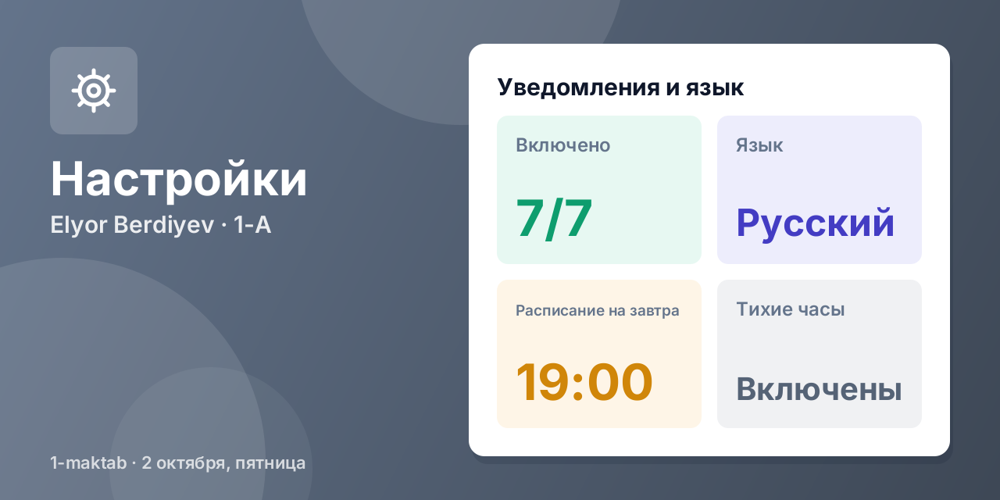
>
> 🏠 › ⚙️ Настройки
>
> **Настройки**
> Какие сообщения получать? Нажмите, чтобы включить или выключить.
>
> ✅ Пропуск / опоздание
> ✅ Оценки
> ✅ Низкая оценка
> ✅ Объявления
> ✅ Расписание на завтра
> ✅ Еженедельный отчёт
> ✅ Напоминание о событиях
>
> `[✅ Пропуск / опоздание]` `[✅ Оценки]`
> `[✅ Низкая оценка]` `[✅ Объявления]`
> `[✅ Расписание на завтра]` `[✅ Еженедельный отчёт]`
> `[✅ Напоминание о событиях]`
> `[⏰ Время]` `[🌐 Til / Язык]`
> `[🏠 Главное меню]`

👤 **Ota-ona:** tugmani bosdi `[✅ Посещаемость]`

🤖 **Bot:**

> 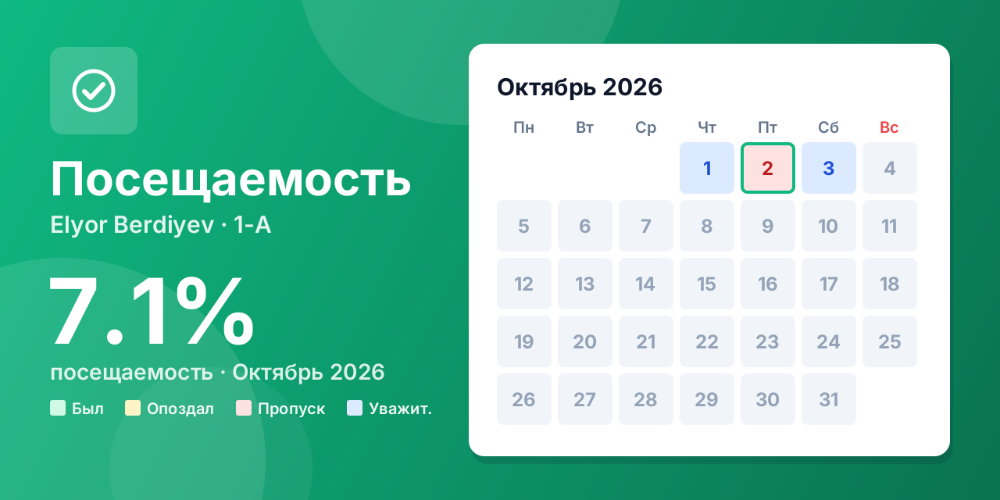
>
> 🏠 › ✅ Посещаемость › Октябрь 2026
>
> **Октябрь 2026**
>
> 📚 Всего уроков: **14**
> ✅ Присутствовал(а): **0**
> 🟡 Опоздания: **1**
> 🔴 Пропуски: **1**
> 🔵 По уважительной: **12**
>
> ▰▱▱▱▱▱▱▱▱▱ **7.1%**
>> Среднее по классу: 7.1% — на среднем уровне
>
> `[◀️ Сентябрь]` `[Октябрь 2026]` `[·]`
> `[🗓 Календарь]` `[📋 Подробно]`
> `[📚 По предметам]` `[🖼 В виде картинки]`
> `[• 🗓 Месяц •]` `[🏷 Четверть]` `[🎓 Учебный год]`
> `[🏠 Главное меню]`

### 14.7. O'zbekcha (lotin) ga qaytish

👤 **Ota-ona:** tugmani bosdi `[🇺🇿 O'zbekcha]`

🤖 **Bot:**

> ✅ Til o'zgartirildi
>
> ⌨️ _Pastki klaviatura:_
> `📱 Kundalikni ochish`
> `📅 Dars jadvali` `✅ Davomat`
> `📘 Baholar` `📊 Hisobot`
> `📢 E'lonlar` `🗓 Tadbirlar`
> `👩‍🏫 O'qituvchilar` `💬 Maktabga yozish`
> `🤒 Sababli ariza` `⚙️ Sozlamalar`
> `👨‍👩‍👧 Farzandlarim`

🤖 **Bot:**

> 
>
> 🏠 › ⚙️ Sozlamalar
>
> **Sozlamalar**
> Qaysi xabarlar kelsin? Bosib yoqing yoki o'chiring.
>
> ✅ Kelmadi / kechikdi
> ✅ Baholar
> ✅ Past baho
> ✅ E'lonlar
> ✅ Ertangi jadval
> ✅ Haftalik hisobot
> ✅ Tadbir eslatmasi
>
> `[✅ Kelmadi / kechikdi]` `[✅ Baholar]`
> `[✅ Past baho]` `[✅ E'lonlar]`
> `[✅ Ertangi jadval]` `[✅ Haftalik hisobot]`
> `[✅ Tadbir eslatmasi]`
> `[⏰ Vaqtlar]` `[🌐 Til / Язык]`
> `[🏠 Bosh menyu]`

## 15. Farzandlarim

### 15.1. Ikkinchi farzandni qo'shish

👤 **Ota-ona:** tugmani bosdi `[👨‍👩‍👧 Farzandlarim]`

🤖 **Bot:**

> 
>
> 🏠 › 👨‍👩‍👧 Farzandlarim
>
> **Farzandlarim**
>
> ✅ **Elyor Berdiyev** — 1-A sinf
>
>> Farzandni tanlang — barcha bo'limlar shu farzand bo'yicha ko'rsatiladi
>
> `[✅ Elyor · 1-A]` `[🔗 Uzish]`
> `[➕ Farzand qo'shish]`
> `[🏠 Bosh menyu]`

👤 **Ota-ona:** tugmani bosdi `[➕ Farzand qo'shish]`

🤖 **Bot:**

> ➕ Farzand qo'shish
>
> ⌨️ _Pastki klaviatura:_
> `📱 Telefon raqamni ulashish`

🤖 **Bot:**

> 
>
> 🏠 › 👨‍👩‍👧 Farzandlarim › ➕ Farzand qo'shish
>
> **Farzand qo'shish**
> Sinf rahbari bergan **kodni** shu yerga yozing yoki QR kodni skanerlang.
> Raqamingiz maktabda yozilgan bo'lsa — «📱 Raqamni ulashish» tugmasini bosing.
>
> `[✖️ Bekor qilish]`

👤 **Ota-ona:** «zvNWFkt8qu»

🤖 **Bot:**

> ✅ **Tabriklaymiz!** Endi **Jasur Berdiyev** (1-A sinf) haqida hamma narsa shu yerda.
>
> **3 qadamda tanishib oling:**
> 1️⃣ Pastdagi tugmalar — asosiy bo'limlar: jadval, davomat, baholar va boshqalar
> 2️⃣ Muhim voqealar — kelmaslik, yangi baho, e'lon — o'zi xabar bo'lib keladi
> 3️⃣ «⚙️ Sozlamalar»da qaysi xabarlar va qachon kelishini tanlaysiz
>
> ⌨️ _Pastki klaviatura:_
> `📱 Kundalikni ochish`
> `📅 Dars jadvali` `✅ Davomat`
> `📘 Baholar` `📊 Hisobot`
> `📢 E'lonlar` `🗓 Tadbirlar`
> `👩‍🏫 O'qituvchilar` `💬 Maktabga yozish`
> `🤒 Sababli ariza` `⚙️ Sozlamalar`
> `👨‍👩‍👧 Farzandlarim`

🤖 **Bot:**

> 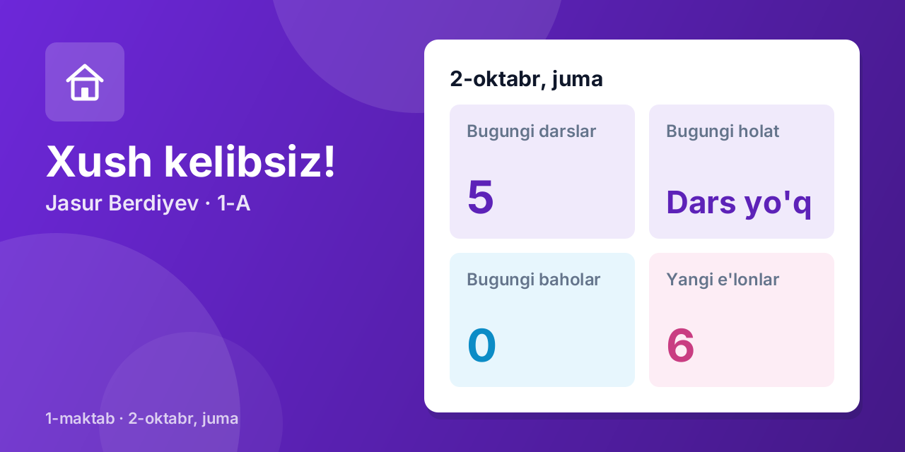
>
> 🏠 **Bosh menyu** · 2-oktabr, juma
>
> 👤 **Jasur Berdiyev** · 1-A sinf
> 👩‍🏫 Sinf rahbari: Zebo Ne'matova
>
> **Bugun:**
> 📚 5 ta dars · 08:30–13:25
> ⏳ Davomat hali belgilanmagan
> 📘 Bugun baho hali yo'q
> 📢 Yangi e'lonlar: **6**
> 🗓 Yaqin tadbir: **Ota-onalar yig'ilishi** — 8-oktabr
> 📅 Ertaga 1-dars: **08:30** · 🔢 Matematika
>
> Bo'limni tanlang 👇
>
> `[📱 Kundalikni ochish ↗]`
> `[📅 Dars jadvali]` `[✅ Davomat]`
> `[📘 Baholar]` `[📊 Hisobot]`
> `[⭐ Xulq]` `[📢 E'lonlar]`
> `[🗓 Tadbirlar]` `[👩‍🏫 O'qituvchilar]`
> `[💬 Maktabga yozish]` `[🤒 Sababli ariza]`
> `[🏫 Maktab haqida]` `[⚙️ Sozlamalar]`
> `[👨‍👩‍👧 Farzandlarim]`
> `[🔄 Farzandni almashtirish]`

### 15.2. Ro'yxat va farzandni almashtirish

👤 **Ota-ona:** tugmani bosdi `[👨‍👩‍👧 Farzandlarim]`

🤖 **Bot:**

> 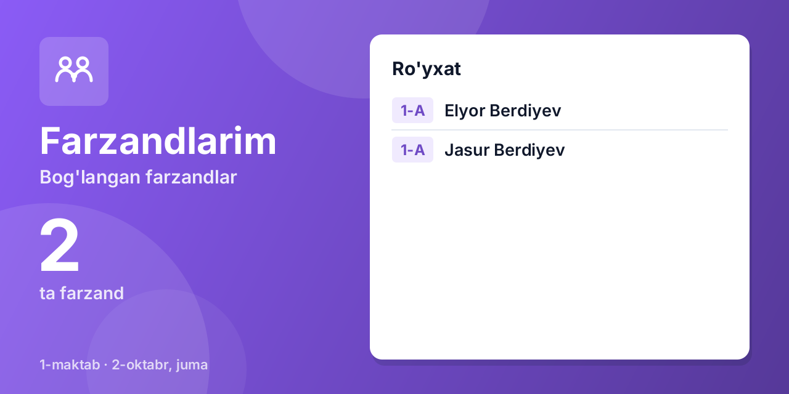
>
> 🏠 › 👨‍👩‍👧 Farzandlarim
>
> **Farzandlarim**
>
> **Elyor Berdiyev** — 1-A sinf
> ✅ **Jasur Berdiyev** — 1-A sinf
>
>> Farzandni tanlang — barcha bo'limlar shu farzand bo'yicha ko'rsatiladi
>
> `[👤 Elyor · 1-A]` `[🔗 Uzish]`
> `[✅ Jasur · 1-A]` `[🔗 Uzish]`
> `[➕ Farzand qo'shish]`
> `[🏠 Bosh menyu]`

👤 **Ota-ona:** tugmani bosdi `[👤 Elyor · 1-A]`

🤖 **Bot:**

> 
>
> 🏠 **Bosh menyu** · 2-oktabr, juma
>
> 👤 **Elyor Berdiyev** · 1-A sinf
> 👩‍🏫 Sinf rahbari: Zebo Ne'matova
>
> **Bugun:**
> 📚 5 ta dars · 08:30–13:25
> 🔴 1 ta darsga kelmadi
> 📘 Bugungi baholar: 🔴 **2** O'zbek adabiyoti, 🟢 **5** Ona tili, 🔴 **2** O'zbek adabiyoti, 🟢 **5** Ona tili, 🔴 **2** O'zbek adabiyoti, 🟢 **5** Ona tili, 🔴 **2** O'zbek adabiyoti, 🟢 **5** Ona tili, 🔴 **2** O'zbek adabiyoti, 🟢 **5** Ona tili
> 📢 Yangi e'lonlar: **6**
> 🗓 Yaqin tadbir: **Ota-onalar yig'ilishi** — 8-oktabr
> 📅 Ertaga 1-dars: **08:30** · 🔢 Matematika
>
> Bo'limni tanlang 👇
>
> `[📱 Kundalikni ochish ↗]`
> `[📅 Dars jadvali]` `[✅ Davomat]`
> `[📘 Baholar]` `[📊 Hisobot]`
> `[⭐ Xulq]` `[📢 E'lonlar]`
> `[🗓 Tadbirlar]` `[👩‍🏫 O'qituvchilar]`
> `[💬 Maktabga yozish]` `[🤒 Sababli ariza]`
> `[🏫 Maktab haqida]` `[⚙️ Sozlamalar]`
> `[👨‍👩‍👧 Farzandlarim]`
> `[🔄 Farzandni almashtirish]`

### 15.3. Har sahifada tanlangan farzand va «🔄 Farzandni almashtirish»

👤 **Ota-ona:** tugmani bosdi `[📘 Baholar]`

🤖 **Bot:**

> 
>
> 🏠 › 📘 Baholar › 🕘 So'nggi
> 👤 **Elyor Berdiyev** · 1-A sinf
>
> **So'nggi baholar**
>
> 🟢 **5** · Ona tili · 2-oktabr
>       _joriy_
> 🔴 **2** · O'zbek adabiyoti · 2-oktabr
>       _joriy_ — «Uy vazifasi bajarilmagan»
> 🟢 **5** · Ona tili · 2-oktabr
>       _joriy_
> 🔴 **2** · O'zbek adabiyoti · 2-oktabr
>       _joriy_ — «Uy vazifasi bajarilmagan»
> 🟢 **5** · Ona tili · 2-oktabr
>       _joriy_
> 🔴 **2** · O'zbek adabiyoti · 2-oktabr
>       _joriy_ — «Uy vazifasi bajarilmagan»
> 🟢 **5** · Ona tili · 2-oktabr
>       _joriy_
> 🔴 **2** · O'zbek adabiyoti · 2-oktabr
>       _joriy_ — «Uy vazifasi bajarilmagan»
>
> `[• 🕘 So'nggi •]` `[📚 Fanlar]` `[🏅 Chorak]`
> `[·]` `[1/6]` `[▶️]`
> `[🔄 Farzandni almashtirish]`
> `[🏠 Bosh menyu]`

👤 **Ota-ona:** tugmani bosdi `[🔄 Farzandni almashtirish]`

🤖 **Bot:**

> 
>
> 🏠 › 👨‍👩‍👧 Farzandlarim
>
> **Farzandlarim**
>
> ✅ **Elyor Berdiyev** — 1-A sinf
> **Jasur Berdiyev** — 1-A sinf
>
>> Farzandni tanlang — barcha bo'limlar shu farzand bo'yicha ko'rsatiladi
>
> `[✅ Elyor · 1-A]` `[🔗 Uzish]`
> `[👤 Jasur · 1-A]` `[🔗 Uzish]`
> `[➕ Farzand qo'shish]`
> `[⬅️ Orqaga]` `[🏠 Bosh menyu]`

### 15.4. Farzandni uzish (tasdiqlash bilan)

👤 **Ota-ona:** tugmani bosdi `[🔗 Uzish]`

🤖 **Bot:**

> 
>
> 🏠 › 👨‍👩‍👧 Farzandlarim
>
> **Jasur Berdiyev**ni uzasizmi?
> Bu farzand haqida xabarlar kelmay qoladi.
>
> `[✅ Ha]` `[✖️ Yo'q]`

👤 **Ota-ona:** tugmani bosdi `[✅ Ha]`

🤖 **Bot:**

> 
>
> 🏠 › 👨‍👩‍👧 Farzandlarim
>
> **Farzandlarim**
>
> ✅ **Elyor Berdiyev** — 1-A sinf
>
>> Farzandni tanlang — barcha bo'limlar shu farzand bo'yicha ko'rsatiladi
>
> `[✅ Elyor · 1-A]` `[🔗 Uzish]`
> `[➕ Farzand qo'shish]`
> `[🏠 Bosh menyu]`

## 16. Xavfsizlik

### 16.1. Boshqa o'quvchining ID'si bilan soxta callback

👤 **Ota-ona:** qo'lda yasalgan callback yubordi: `att:s:27` (o'ziga bog'lanmagan o'quvchi)

> 🔒 _Bot hech qanday ma'lumot qaytarmadi — faqat «🔒 Bu ma'lumot sizga ochiq emas» ogohlantirishi (answerCallbackQuery) ko'rsatildi._

### 16.2. Tushunarsiz xabar va /yordam

👤 **Ota-ona:** «salom»

🤖 **Bot:**

> 🤔 Tushunmadim. Pastdagi tugmalardan foydalaning yoki /yordam yozing.
>
> ⌨️ _Pastki klaviatura:_
> `📱 Kundalikni ochish`
> `📅 Dars jadvali` `✅ Davomat`
> `📘 Baholar` `📊 Hisobot`
> `📢 E'lonlar` `🗓 Tadbirlar`
> `👩‍🏫 O'qituvchilar` `💬 Maktabga yozish`
> `🤒 Sababli ariza` `⚙️ Sozlamalar`
> `👨‍👩‍👧 Farzandlarim`

👤 **Ota-ona:** `/yordam`

🤖 **Bot:**

> ℹ️ **Yordam**
> /menu — bosh menyu
> /jadval — dars jadvali
> /davomat — davomat
> /baholar — baholar
> /stop — xabarlarni to'xtatish
>
> Pastdagi tugmalar orqali istalgan bo'limga o'ting 👇
>
> ⌨️ _Pastki klaviatura:_
> `📱 Kundalikni ochish`
> `📅 Dars jadvali` `✅ Davomat`
> `📘 Baholar` `📊 Hisobot`
> `📢 E'lonlar` `🗓 Tadbirlar`
> `👩‍🏫 O'qituvchilar` `💬 Maktabga yozish`
> `🤒 Sababli ariza` `⚙️ Sozlamalar`
> `👨‍👩‍👧 Farzandlarim`

## 17. Avtomatik xabarlar

Quyidagi xabarlarni ota-ona hech narsa bosmasdan oladi — ular outbox (NotificationLog) orqali navbatga qo'yilib, yuboruvchi tomonidan jo'natiladi.

### 17.1. Farzand darsga kelmadi

🏫 **Maktab (admin panel):** o'qituvchi Matematika darsida davomat oldi: Elyor Berdiyev — «Kelmadi»

### 17.2. Farzand kechikdi

🏫 **Maktab (admin panel):** Matematika darsida — «Kechikdi»

### 17.3. Yangi baho

🏫 **Maktab (admin panel):** Ona tili fanidan 5 baho qo'ydi

🤖 **Bot:**

> 📘 **Elyor Berdiyev** Ona tili fanidan **5** baho oldi (joriy baho, 02.10.2026).
>
> 🏫 _1-maktab_
>
> `[🔎 Batafsil]`

### 17.4. Past baho — alohida, mehribon ohangdagi xabar

🏫 **Maktab (admin panel):** O'zbek adabiyoti fanidan 2 baho qo'ydi

🤖 **Bot:**

> 💛 **Elyor Berdiyev** O'zbek adabiyoti fanidan **2** baho oldi (02.10.2026).
>> Xavotir olmang — har bir bola ba'zan qiynaladi. Farzandingiz bilan mehr bilan gaplashib, qaysi mavzu qiyin bo'lganini so'rang. Kerak bo'lsa, o'qituvchi bilan maslahatlashing 🤝
>
> 🏫 _1-maktab_
>
> `[✍️ O'qituvchiga yozish]`

### 17.5. Maktab e'loni

🏫 **Maktab (admin panel):** «Hamma uchun» e'lon joyladi

🤖 **Bot:**

> 📢 **Maktab e'loni**: Kuzgi sport musobaqasi
> Shanba kuni soat 10:00 da maktab stadionida «Sog'lom avlod» sport musobaqasi bo'lib o'tadi. Farzandingizga sport kiyimini olib kelishni unutmang!
>
> 🏫 _1-maktab_
>
> `[🔎 Batafsil]`

### 17.6. Ertangi dars jadvali, haftalik hisobot va tadbir eslatmasi

🏫 **Maktab (admin panel):** rejalashtirilgan vazifalar ishga tushdi (odatda: har kuni 19:00, shanba 18:00, tadbirdan 1 kun oldin 18:00)

### 17.7. Ota-onalarga umumiy xabar (broadcast)

🏫 **Maktab (admin panel):** «Ota-onalarga xabar» sahifasidan butun maktabga xabar yubordi

🤖 **Bot:**

> 📣 **Maktabdan xabar**
>
> Hurmatli ota-onalar! 7-oktabr kuni soat 18:00 da maktab majlislar zalida umumiy ota-onalar yig'ilishi bo'lib o'tadi. Ishtirokingizni so'raymiz.
>
> 🏫 _1-maktab_

