# Ota-onalar boti v3 — 5 daqiqalik demo

Bu ssenariy direktor/ota-onalarga botni ko'rsatish uchun. Hamma ma'lumot **faqat `dev` profilida**
yaratiladigan demo ota-onaga tegishli — prod bazaga hech narsa yozilmaydi.

## Tayyorlash (1 marta)

1. `application-local.properties` da baza, JWT va (kerak bo'lsa) bot token sozlangan bo'lsin —
   bu fayl gitga tushmaydi, token boshqa hech qayerga yozilmaydi.
2. Backendni `local,dev` profillari bilan ishga tushiring:

   ```powershell
   $env:SPRING_PROFILES_ACTIVE = 'local,dev'
   .\gradlew.bat bootRun
   ```

   Logda shunday qator chiqadi:
   `Demo ota-ona tayyor: chat_id=990000001, o'quvchi=… (… ta davomat, … ta baho qo'shildi)`.
   Seeder qayta ishga tushganda hech narsani ikki marta qo'shmaydi. Chat id ni
   `demo.parent-chat-id` bilan o'zgartirish mumkin (masalan, o'zingizning Telegram id ingiz —
   shunda demo farzand sizning Telegramingizda ko'rinadi).
3. Frontend: `cd frontend; npm run dev` — Mini App manzili `…/#/webapp`
   (`telegram.webapp-url` shu manzilga, HTTPS orqali qaragan bo'lishi kerak).

Mock rejimda (token yo'q, `telegram.mock=true`) botni brauzerdan sinash mumkin:
`POST /api/telegram/mock/updates {"chatId":990000001,"text":"/start"}`,
xabarlarni ko'rish — `GET /api/telegram/mock/messages?chatId=990000001`.

## Ssenariy

### 0:00 — Bot menyusi
`/start` → bosh sahifa. Eng yuqorida **«📱 Ilovani ochish»** tugmasi, chat pastidagi menyu tugmasi
ham Mini App ni ochadi. Bot buyruqlari (`/start`, `/menu`, `/jadval`, `/davomat`, `/baholar`, `/yordam`, `/stop`) uz/ru tavsiflari bilan.

### 0:40 — Mini App: «Bugun»
Telegram ichida ochiladi, mavzu (yorug'/qorong'i) Telegramdan olinadi.

| Yorug' | Qorong'i |
|---|---|
| 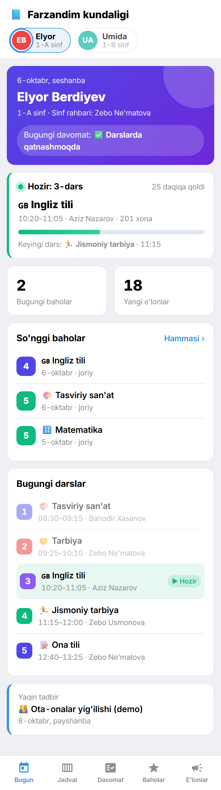 | 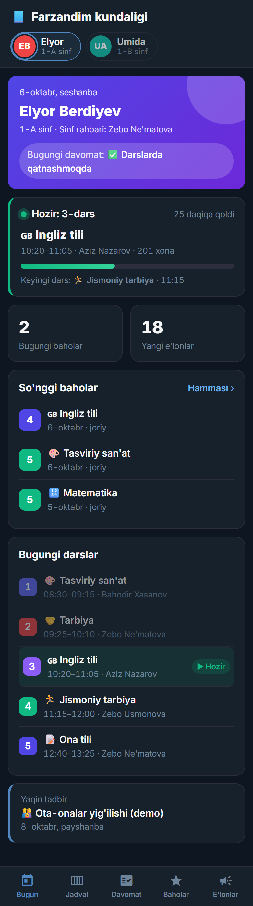 |

* yuqorida — farzandlar avatarlari (bir nechta farzand bo'lsa bosib almashtiriladi);
* **«Hozir: 3-dars»** kartasi — jonli progress bar, necha daqiqa qolgani, keyingi dars;
* bugungi davomat belgisi, so'nggi 3 baho («Hammasi ›» — Baholar bo'limiga);
* sahifani pastga tortsangiz — yangilanadi (pull-to-refresh), Telegramning pastki katta
  tugmasi ham **«🔄 Yangilash»**.

### 1:30 — Jadval
Hafta kunlari tablari, bugun ajratilgan, hozirgi dars yashil ramkada; har fan o'z rangi va emojisi bilan.
Ichki bo'limlarda Telegram sarlavhasida **‹ Orqaga** tugmasi chiqadi.

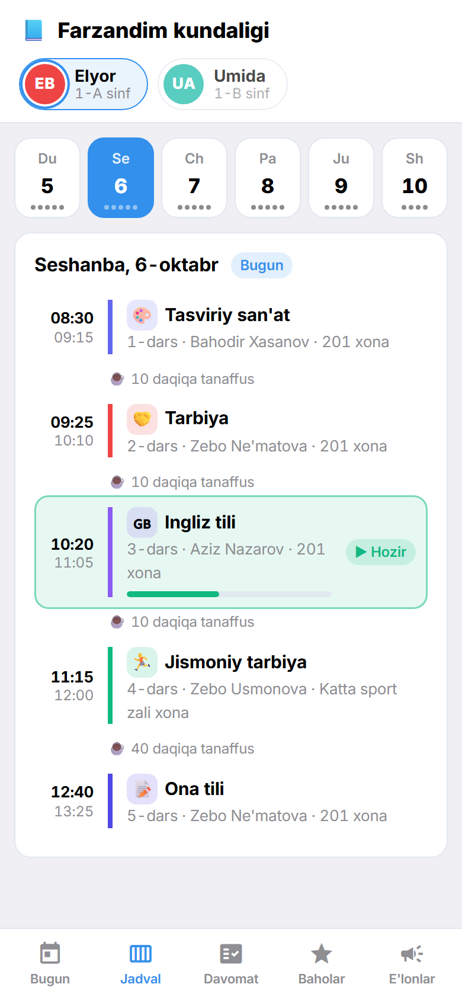

### 2:00 — Baholar
Umumiy o'rtacha, baholar soni, eng yaxshi fan; **30 kunlik dinamika** chizig'i;
**sinf o'rtachasi bilan solishtirish** — faqat sinfning o'rtacha bahosi, boshqa o'quvchilarning
ismi hech qayerda ko'rinmaydi. Fanni bossangiz — o'qituvchi va barcha baholari.

| | |
|---|---|
| 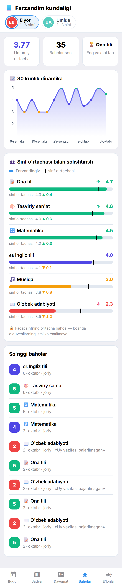 | 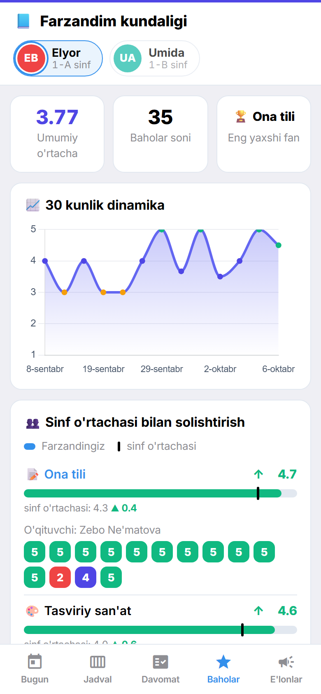 |

### 2:40 — Davomat va E'lonlar/Tadbirlar
Oylik kalendar (issiqlik xaritasi) va foiz; e'lonlar va yaqin 2 oydagi tadbirlar alohida tabda.

| | |
|---|---|
| 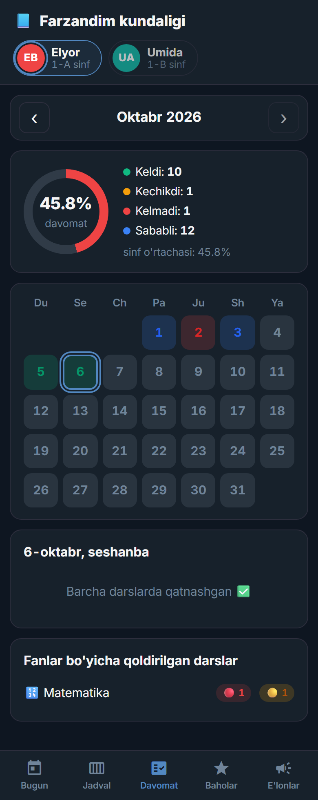 | 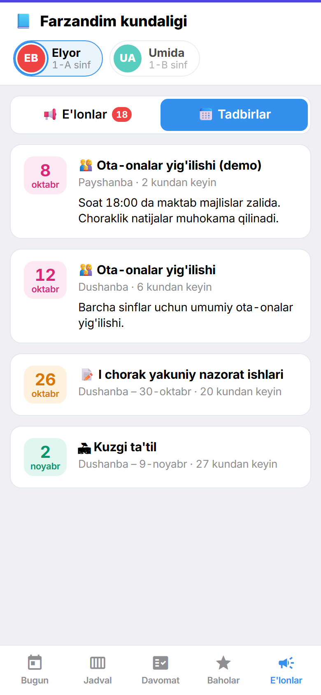 |

Yuklanayotganda — skeleton, internet bo'lmasa — xato holati va «Qayta urinish»:

| | |
|---|---|
| 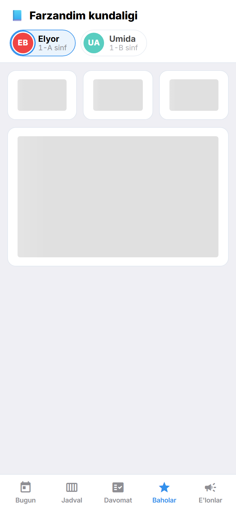 | 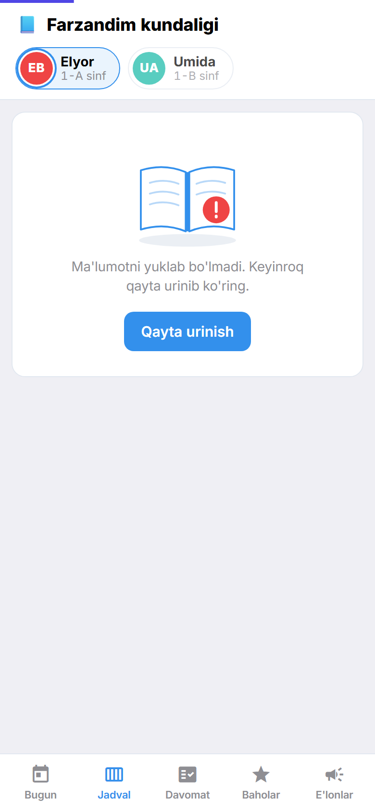 |

### 3:20 — Aqlli xabarlar
Admin (mock rejimda) `POST /api/bot/mock/run-jobs` — hamma rejali xabarlar darhol yuboriladi:

* **☀️ Ertalabki digest** (ish kunlari 07:30; yakshanba va bayramda yuborilmaydi):
  «Bugun Elyorning 5 ta darsi bor. 🕗 Birinchi dars 08:30 · …» + «📱 Ilovani ochish».
* **🌙 Ertangi jadval** + `🎒 Ertaga kerak: …` (ertaga muddati tugaydigan e'lonlardan).
* **📊 Haftalik hisobot** (shanba 18:00) — rasm-kartochka 1080×1350 va «📱 Batafsil» tugmasi:

| Hammasi yaxshi | E'tibor kerak |
|---|---|
| 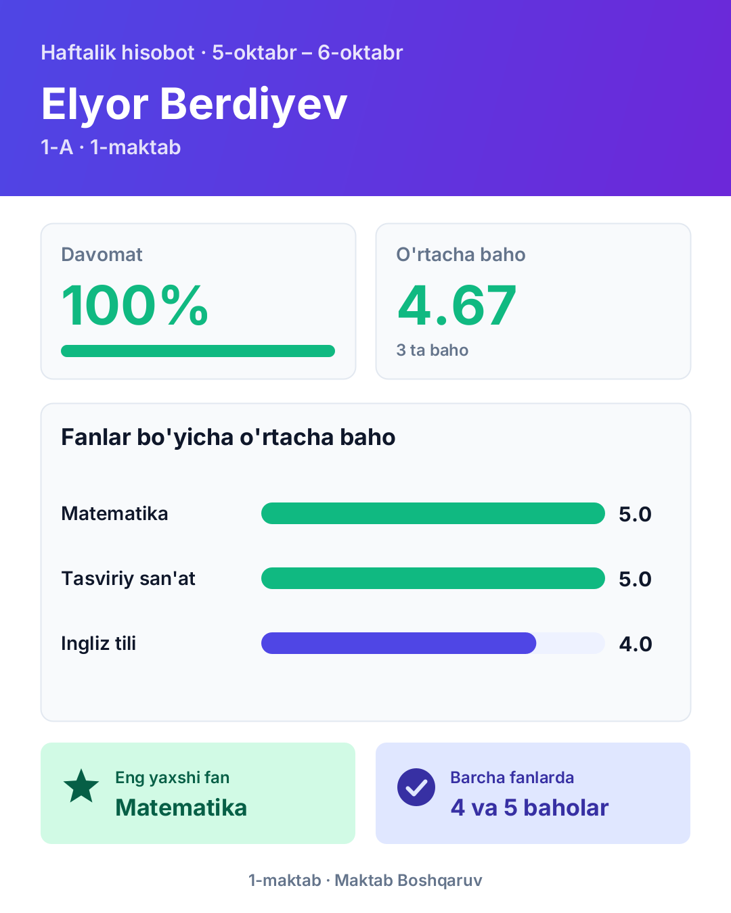 | 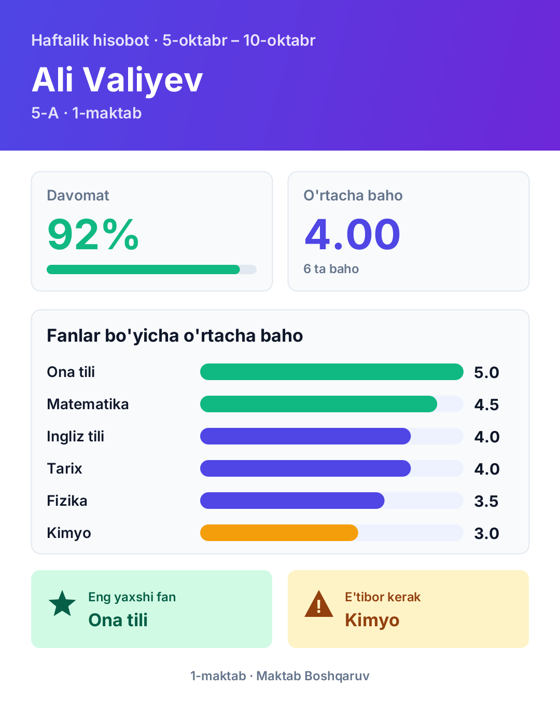 |

Real vaqt xabarlarida (kelmadi, baho, e'lon) — «📱 Batafsil» (Mini App ning kerakli bo'limi) va
«💬 Sinf rahbariga yozish». 2–3 baholar yumshoq ohangda yoziladi.

### 4:20 — Sozlamalar
Bot → ⚙️ Sozlamalar: har xabar turini (shu jumladan **ertalabki digest** va haftalik hisobot)
yoqish/o'chirish, til (O'zbekcha/Ўзбекча/Русский), farzandni tanlash, «Botdan uzish».
Tinch soatlarda (22:00–07:00) kelgan xabarlar tongda **bitta** «🌙 Tunda kelgan xabarlar» xabarida keladi.

### 5:00 — Tugadi
Savollar: «Boshqa ota-onalar mening farzandimni ko'ra oladimi?» — yo'q: har so'rov Telegram imzosi
(HMAC, 24 soatdan eski bo'lmagan) bilan tekshiriladi, boshqa farzand ma'lumoti so'ralsa — 403.
